# 第5篇：工具系统架构

## 引言

工具系统是 Claude Code 的"手和眼"，赋予了 AI 与真实世界交互的能力。如果说 AI 引擎是"大脑"，那么工具系统就是"四肢"，负责执行实际的文件操作、代码搜索、命令执行等任务。本文将深入解析 Claude Code 工具系统的完整架构。

### 为什么工具系统如此重要？

1. **赋能 AI**：让 AI 从"只能说"变成"既能说又能做"
2. **标准化交互**：统一的工具接口，降低集成复杂度
3. **安全可控**：通过权限管理和参数验证确保安全
4. **可扩展性**：插件化设计，支持无限扩展
5. **性能优化**：智能调度和并行执行提升效率

### 本文目标

- 理解工具系统的整体架构
- 掌握 Tool Schema 设计规范
- 学习工具注册和调用流程
- 了解权限管理和安全机制
- 实战开发一个自定义工具

---

## 一、工具系统整体架构

### 1.1 核心组件

```mermaid
graph TB
    subgraph "AI层"
        A[Claude AI]
    end

    subgraph "工具系统核心"
        B[工具调度器<br/>Tool Dispatcher]
        C[工具注册表<br/>Tool Registry]
        D[参数验证器<br/>Parameter Validator]
        E[权限管理器<br/>Permission Manager]
        F[执行引擎<br/>Execution Engine]
    end

    subgraph "内置工具层"
        G1[Read]
        G2[Write]
        G3[Edit]
        G4[Bash]
        G5[Glob]
        G6[Grep]
    end

    subgraph "扩展工具层"
        H1[MCP工具]
        H2[Browser工具]
        H3[自定义工具]
    end

    subgraph "系统资源层"
        I1[文件系统]
        I2[进程管理]
        I3[网络通信]
        I4[外部服务]
    end

    A -->|Tool Call| B
    B --> C
    B --> D
    B --> E
    B --> F

    C --> G1
    C --> G2
    C --> G3
    C --> G4
    C --> G5
    C --> G6

    C --> H1
    C --> H2
    C --> H3

    F --> G1 --> I1
    F --> G2 --> I1
    F --> G3 --> I1
    F --> G4 --> I2
    F --> G5 --> I1
    F --> G6 --> I1

    F --> H1 --> I3
    F --> H2 --> I4
    F --> H3 --> I3

    style B fill:#e1f5ff,stroke:#333,stroke-width:3px
    style C fill:#ffe1f5,stroke:#333,stroke-width:2px
    style A fill:#fff4e1,stroke:#333,stroke-width:2px
```



### 1.2 工具系统分层

| 层级 | 职责 | 核心组件 |
|-----|------|---------|
| **接口层** | 接收AI的工具调用请求 | Tool Dispatcher |
| **管理层** | 工具注册、验证、权限控制 | Registry、Validator、Permission Manager |
| **执行层** | 实际执行工具逻辑 | Execution Engine、Tool Executors |
| **资源层** | 访问系统资源 | File System、Process、Network |

### 1.3 工具分类

```mermaid
graph LR
    A[工具系统] --> B[按功能分类]
    A --> C[按来源分类]

    B --> B1[文件操作类<br/>Read/Write/Edit]
    B --> B2[代码搜索类<br/>Glob/Grep]
    B --> B3[系统执行类<br/>Bash/BashOutput]
    B --> B4[扩展功能类<br/>Browser/MCP]

    C --> C1[内置工具<br/>Built-in Tools]
    C --> C2[MCP工具<br/>MCP Tools]
    C --> C3[自定义工具<br/>Custom Tools]

    style A fill:#e1f5ff,stroke:#333,stroke-width:3px
```



---

## 二、Tool Schema 设计规范

### 2.1 JSON Schema 标准

Claude Code 采用 JSON Schema 定义工具接口，这是 Anthropic API 的标准格式。

```typescript
// 工具定义的完整类型
interface ToolDefinition {
  // 工具名称（唯一标识符）
  name: string;

  // 工具描述（AI用于理解工具用途）
  description: string;

  // 输入参数的JSON Schema
  input_schema: {
    type: 'object';
    properties: Record<string, PropertySchema>;
    required?: string[];
    additionalProperties?: boolean;
  };
}

// 属性定义
interface PropertySchema {
  type: 'string' | 'number' | 'boolean' | 'array' | 'object';
  description: string;
  enum?: any[];
  items?: PropertySchema;
  default?: any;
}
```

### 2.2 内置工具示例

#### Read 工具定义

```typescript
const ReadToolDefinition: ToolDefinition = {
  name: 'Read',
  description: `Reads a file from the local filesystem. You can access any file directly by using this tool.

Usage:
- The file_path parameter must be an absolute path, not a relative path
- By default, it reads up to 2000 lines starting from the beginning
- You can optionally specify a line offset and limit (especially handy for long files)
- Any lines longer than 2000 characters will be truncated
- Results are returned using cat -n format, with line numbers starting at 1`,

  input_schema: {
    type: 'object',
    properties: {
      file_path: {
        type: 'string',
        description: 'The absolute path to the file to read'
      },
      offset: {
        type: 'number',
        description: 'The line number to start reading from. Only provide if the file is too large to read at once'
      },
      limit: {
        type: 'number',
        description: 'The number of lines to read. Only provide if the file is too large to read at once'
      }
    },
    required: ['file_path']
  }
};
```

#### Bash 工具定义

```typescript
const BashToolDefinition: ToolDefinition = {
  name: 'Bash',
  description: `Executes a given bash command in a persistent shell session.

Usage notes:
- Always quote file paths that contain spaces with double quotes
- The command argument is required
- You can specify an optional timeout in milliseconds (up to 600000ms / 10 minutes)
- You can use run_in_background parameter to run commands in background
- Avoid using Bash with find, grep, cat commands - use dedicated tools instead`,

  input_schema: {
    type: 'object',
    properties: {
      command: {
        type: 'string',
        description: 'The command to execute'
      },
      description: {
        type: 'string',
        description: 'Clear, concise description of what this command does in 5-10 words'
      },
      timeout: {
        type: 'number',
        description: 'Optional timeout in milliseconds (max 600000)',
        default: 120000
      },
      run_in_background: {
        type: 'boolean',
        description: 'Set to true to run this command in the background',
        default: false
      }
    },
    required: ['command']
  }
};
```

#### Edit 工具定义

```typescript
const EditToolDefinition: ToolDefinition = {
  name: 'Edit',
  description: `Performs exact string replacements in files.

Usage:
- You must use Read tool at least once before editing
- Preserve exact indentation as it appears in the file
- The edit will FAIL if old_string is not unique in the file
- Use replace_all for replacing and renaming strings across the file`,

  input_schema: {
    type: 'object',
    properties: {
      file_path: {
        type: 'string',
        description: 'The absolute path to the file to modify'
      },
      old_string: {
        type: 'string',
        description: 'The text to replace'
      },
      new_string: {
        type: 'string',
        description: 'The text to replace it with (must be different from old_string)'
      },
      replace_all: {
        type: 'boolean',
        description: 'Replace all occurences of old_string (default false)',
        default: false
      }
    },
    required: ['file_path', 'old_string', 'new_string']
  }
};
```

### 2.3 Schema 设计最佳实践

**1. 描述清晰**

```typescript
// ❌ 不好的描述
{
  name: 'search',
  description: 'Search files',
  // ...
}

// ✅ 好的描述
{
  name: 'Grep',
  description: `A powerful search tool built on ripgrep.

Usage:
- ALWAYS use Grep for search tasks. NEVER invoke grep as a Bash command
- Supports full regex syntax (e.g., "log.*Error", "function\\s+\\w+")
- Filter files with glob parameter (e.g., "*.js", "**/*.tsx")
- Output modes: "content" shows matching lines, "files_with_matches" shows only file paths`,
  // ...
}
```

**2. 参数类型明确**

```typescript
// 完整的参数定义
properties: {
  file_path: {
    type: 'string',
    description: 'The absolute path to the file to read'
  },
  line_number: {
    type: 'number',
    description: 'The line number to start from (1-indexed)'
  },
  case_sensitive: {
    type: 'boolean',
    description: 'Whether the search is case sensitive',
    default: false
  },
  file_types: {
    type: 'array',
    description: 'File extensions to search (e.g., ["ts", "js"])',
    items: {
      type: 'string'
    }
  }
}
```

**3. 必需参数标注**

```typescript
{
  input_schema: {
    type: 'object',
    properties: {
      file_path: { type: 'string', description: '...' },
      content: { type: 'string', description: '...' },
      encoding: { type: 'string', description: '...', default: 'utf-8' }
    },
    // 明确标注必需参数
    required: ['file_path', 'content']
  }
}
```

---

## 三、工具注册和发现机制

### 3.1 工具注册表设计

```typescript
/**
 * 工具执行器接口
 */
interface ToolExecutor {
  /**
   * 执行工具
   * @param input 工具输入参数
   * @returns 工具执行结果
   */
  execute(input: Record<string, any>): Promise<ToolResult>;
}

/**
 * 工具执行结果
 */
interface ToolResult {
  success: boolean;
  content?: string;
  error?: string;
  metadata?: Record<string, any>;
}

/**
 * 工具注册表
 * 负责管理所有可用工具
 */
class ToolRegistry {
  // 工具定义映射表
  private definitions: Map<string, ToolDefinition> = new Map();

  // 工具执行器映射表
  private executors: Map<string, ToolExecutor> = new Map();

  /**
   * 注册工具
   * @param definition 工具定义
   * @param executor 工具执行器
   */
  register(definition: ToolDefinition, executor: ToolExecutor): void {
    // 验证工具定义
    this.validateDefinition(definition);

    // 检查名称冲突
    if (this.definitions.has(definition.name)) {
      throw new Error(`Tool ${definition.name} already registered`);
    }

    // 注册工具
    this.definitions.set(definition.name, definition);
    this.executors.set(definition.name, executor);

    console.log(`✅ Registered tool: ${definition.name}`);
  }

  /**
   * 获取所有工具定义（用于发送给AI）
   */
  getAllDefinitions(): ToolDefinition[] {
    return Array.from(this.definitions.values());
  }

  /**
   * 获取工具执行器
   */
  getExecutor(name: string): ToolExecutor | undefined {
    return this.executors.get(name);
  }

  /**
   * 检查工具是否存在
   */
  has(name: string): boolean {
    return this.definitions.has(name);
  }

  /**
   * 验证工具定义
   */
  private validateDefinition(definition: ToolDefinition): void {
    if (!definition.name) {
      throw new Error('Tool name is required');
    }

    if (!definition.description) {
      throw new Error(`Tool ${definition.name}: description is required`);
    }

    if (!definition.input_schema) {
      throw new Error(`Tool ${definition.name}: input_schema is required`);
    }

    // 验证 JSON Schema 格式
    if (definition.input_schema.type !== 'object') {
      throw new Error(`Tool ${definition.name}: input_schema.type must be "object"`);
    }
  }
}
```

### 3.2 内置工具注册

```typescript
/**
 * 初始化内置工具
 */
function registerBuiltInTools(registry: ToolRegistry): void {
  // 文件操作工具
  registry.register(ReadToolDefinition, new ReadToolExecutor());
  registry.register(WriteToolDefinition, new WriteToolExecutor());
  registry.register(EditToolDefinition, new EditToolExecutor());

  // 搜索工具
  registry.register(GlobToolDefinition, new GlobToolExecutor());
  registry.register(GrepToolDefinition, new GrepToolExecutor());

  // 系统工具
  registry.register(BashToolDefinition, new BashToolExecutor());
  registry.register(BashOutputToolDefinition, new BashOutputToolExecutor());
  registry.register(KillShellToolDefinition, new KillShellToolExecutor());

  console.log('✅ All built-in tools registered');
}
```

### 3.3 MCP 工具动态注册

```typescript
/**
 * MCP 工具加载器
 */
class MCPToolLoader {
  private registry: ToolRegistry;

  constructor(registry: ToolRegistry) {
    this.registry = registry;
  }

  /**
   * 从 MCP Server 加载工具
   */
  async loadFromMCP(mcpServerConfig: MCPServerConfig): Promise<void> {
    console.log(`Loading MCP Server: ${mcpServerConfig.name}...`);

    try {
      // 连接到 MCP Server
      const mcpServer = await this.connectToMCPServer(mcpServerConfig);

      // 获取 MCP Server 提供的工具列表
      const tools = await mcpServer.listTools();

      // 注册每个工具
      for (const tool of tools) {
        // 转换 MCP 工具定义为 Claude Code 格式
        const definition = this.convertMCPToolDefinition(tool);

        // 创建执行器（代理到 MCP Server）
        const executor = this.createMCPToolExecutor(mcpServer, tool.name);

        // 注册到工具注册表
        this.registry.register(definition, executor);
      }

      console.log(`✅ Loaded ${tools.length} tools from ${mcpServerConfig.name}`);
    } catch (error) {
      console.error(`❌ Failed to load MCP Server ${mcpServerConfig.name}:`, error);
    }
  }

  /**
   * 创建 MCP 工具执行器
   */
  private createMCPToolExecutor(
    mcpServer: MCPServer,
    toolName: string
  ): ToolExecutor {
    return {
      async execute(input: Record<string, any>): Promise<ToolResult> {
        try {
          // 调用 MCP Server 执行工具
          const result = await mcpServer.callTool(toolName, input);

          return {
            success: true,
            content: result.content
          };
        } catch (error) {
          return {
            success: false,
            error: error.message
          };
        }
      }
    };
  }

  /**
   * 转换 MCP 工具定义为 Claude Code 格式
   */
  private convertMCPToolDefinition(mcpTool: MCPToolInfo): ToolDefinition {
    return {
      name: `mcp__${mcpTool.serverName}__${mcpTool.name}`,
      description: mcpTool.description,
      input_schema: mcpTool.inputSchema
    };
  }

  /**
   * 连接到 MCP Server
   */
  private async connectToMCPServer(config: MCPServerConfig): Promise<MCPServer> {
    // 实现 MCP 协议连接逻辑
    // ...
    throw new Error('Not implemented');
  }
}
```

### 3.4 工具发现流程

```mermaid
sequenceDiagram
    participant Main as 主程序
    participant Registry as 工具注册表
    participant BuiltIn as 内置工具
    participant MCPLoader as MCP加载器
    participant MCPServer as MCP Server

    Main->>Registry: 创建注册表
    Main->>BuiltIn: 注册内置工具
    BuiltIn->>Registry: register(Read)
    BuiltIn->>Registry: register(Write)
    BuiltIn->>Registry: register(Edit)
    BuiltIn->>Registry: register(Bash)
    BuiltIn->>Registry: register(Glob)
    BuiltIn->>Registry: register(Grep)

    Main->>MCPLoader: 加载MCP工具
    MCPLoader->>MCPServer: 连接MCP Server
    MCPServer-->>MCPLoader: 连接成功
    MCPLoader->>MCPServer: listTools()
    MCPServer-->>MCPLoader: 工具列表

    loop 每个MCP工具
        MCPLoader->>Registry: register(mcp__tool)
    end

    Main->>Registry: getAllDefinitions()
    Registry-->>Main: 返回所有工具定义
```



---

## 四、参数验证和类型检查

### 4.1 参数验证器

```typescript
/**
 * 参数验证器
 * 负责验证工具调用参数是否符合 Schema 定义
 */
class ParameterValidator {
  /**
   * 验证参数
   * @param toolName 工具名称
   * @param params 参数对象
   * @param schema 参数的 JSON Schema
   * @returns 验证结果
   */
  validate(
    toolName: string,
    params: Record<string, any>,
    schema: ToolDefinition['input_schema']
  ): ValidationResult {
    const errors: string[] = [];

    // 1. 检查必需参数
    if (schema.required) {
      for (const requiredField of schema.required) {
        if (!(requiredField in params)) {
          errors.push(`Missing required parameter: ${requiredField}`);
        }
      }
    }

    // 2. 检查参数类型
    for (const [fieldName, value] of Object.entries(params)) {
      const fieldSchema = schema.properties[fieldName];

      if (!fieldSchema) {
        // 检查是否允许额外参数
        if (schema.additionalProperties === false) {
          errors.push(`Unknown parameter: ${fieldName}`);
        }
        continue;
      }

      // 类型检查
      const typeError = this.validateType(fieldName, value, fieldSchema);
      if (typeError) {
        errors.push(typeError);
      }
    }

    return {
      valid: errors.length === 0,
      errors
    };
  }

  /**
   * 验证参数类型
   */
  private validateType(
    fieldName: string,
    value: any,
    schema: PropertySchema
  ): string | null {
    const actualType = this.getType(value);

    if (schema.type === 'string' && actualType !== 'string') {
      return `Parameter ${fieldName} must be a string, got ${actualType}`;
    }

    if (schema.type === 'number' && actualType !== 'number') {
      return `Parameter ${fieldName} must be a number, got ${actualType}`;
    }

    if (schema.type === 'boolean' && actualType !== 'boolean') {
      return `Parameter ${fieldName} must be a boolean, got ${actualType}`;
    }

    if (schema.type === 'array') {
      if (!Array.isArray(value)) {
        return `Parameter ${fieldName} must be an array, got ${actualType}`;
      }

      // 验证数组元素
      if (schema.items) {
        for (let i = 0; i < value.length; i++) {
          const itemError = this.validateType(
            `${fieldName}[${i}]`,
            value[i],
            schema.items
          );
          if (itemError) {
            return itemError;
          }
        }
      }
    }

    if (schema.type === 'object') {
      if (actualType !== 'object') {
        return `Parameter ${fieldName} must be an object, got ${actualType}`;
      }
    }

    // 检查枚举值
    if (schema.enum && !schema.enum.includes(value)) {
      return `Parameter ${fieldName} must be one of: ${schema.enum.join(', ')}`;
    }

    return null;
  }

  /**
   * 获取值的类型
   */
  private getType(value: any): string {
    if (value === null) return 'null';
    if (value === undefined) return 'undefined';
    if (Array.isArray(value)) return 'array';
    return typeof value;
  }
}

/**
 * 验证结果
 */
interface ValidationResult {
  valid: boolean;
  errors: string[];
}
```

### 4.2 参数验证示例

```typescript
// 使用示例
const validator = new ParameterValidator();

// 验证 Read 工具参数
const readParams = {
  file_path: '/path/to/file.ts',
  offset: 10,
  limit: 100
};

const result = validator.validate('Read', readParams, ReadToolDefinition.input_schema);

if (!result.valid) {
  console.error('Parameter validation failed:');
  result.errors.forEach(error => console.error(`  - ${error}`));
}

// 错误示例：缺少必需参数
const invalidParams = {
  offset: 10
  // 缺少 file_path
};

const invalidResult = validator.validate('Read', invalidParams, ReadToolDefinition.input_schema);
// invalidResult.valid === false
// invalidResult.errors === ['Missing required parameter: file_path']
```

---

## 五、工具权限管理

### 5.1 权限管理架构

```mermaid
graph TB
    A[工具调用请求] --> B{权限检查}
    B -->|通过| C{参数验证}
    B -->|拒绝| X1[返回错误]

    C -->|通过| D{需要用户确认?}
    C -->|失败| X2[参数错误]

    D -->|是| E{破坏性操作?}
    D -->|否| F[直接执行]

    E -->|是| G[强制用户确认]
    E -->|否| H[可选确认]

    G --> I[等待用户输入]
    H --> I

    I -->|同意| F
    I -->|拒绝| X3[取消执行]

    F --> J[执行工具]
    J --> K[返回结果]

    style B fill:#ffe1e1,stroke:#333,stroke-width:2px
    style E fill:#fff4e1,stroke:#333,stroke-width:2px
    style J fill:#e1f5ff,stroke:#333,stroke-width:2px
```



### 5.2 权限管理器实现

```typescript
/**
 * 工具权限级别
 */
enum PermissionLevel {
  // 安全操作（只读）
  SAFE = 'safe',

  // 需要确认的操作（写入文件等）
  REQUIRES_CONFIRMATION = 'requires_confirmation',

  // 危险操作（删除、执行命令等）
  DANGEROUS = 'dangerous',

  // 禁止的操作
  FORBIDDEN = 'forbidden'
}

/**
 * 工具权限配置
 */
interface ToolPermission {
  toolName: string;
  level: PermissionLevel;
  // 白名单：允许的参数模式
  whitelist?: string[];
  // 黑名单：禁止的参数模式
  blacklist?: string[];
  // 是否需要用户确认
  requiresConfirmation?: boolean;
}

/**
 * 权限管理器
 */
class PermissionManager {
  private permissions: Map<string, ToolPermission> = new Map();

  constructor() {
    this.initializeDefaultPermissions();
  }

  /**
   * 初始化默认权限
   */
  private initializeDefaultPermissions(): void {
    // 只读工具 - 安全
    this.setPermission({
      toolName: 'Read',
      level: PermissionLevel.SAFE
    });

    this.setPermission({
      toolName: 'Glob',
      level: PermissionLevel.SAFE
    });

    this.setPermission({
      toolName: 'Grep',
      level: PermissionLevel.SAFE
    });

    // 写入工具 - 需要确认
    this.setPermission({
      toolName: 'Write',
      level: PermissionLevel.REQUIRES_CONFIRMATION,
      requiresConfirmation: true
    });

    this.setPermission({
      toolName: 'Edit',
      level: PermissionLevel.REQUIRES_CONFIRMATION,
      requiresConfirmation: true
    });

    // 命令执行 - 危险操作
    this.setPermission({
      toolName: 'Bash',
      level: PermissionLevel.DANGEROUS,
      requiresConfirmation: true,
      blacklist: [
        'rm -rf /',
        'mkfs',
        'dd if=/dev/zero',
        'fork bomb',
        ':(){:|:&};:',  // fork bomb
        'chmod -R 777 /',
        'sudo rm',
      ]
    });
  }

  /**
   * 设置工具权限
   */
  setPermission(permission: ToolPermission): void {
    this.permissions.set(permission.toolName, permission);
  }

  /**
   * 检查工具调用是否被允许
   */
  async checkPermission(
    toolName: string,
    params: Record<string, any>
  ): Promise<PermissionCheckResult> {
    const permission = this.permissions.get(toolName);

    if (!permission) {
      // 默认：未知工具需要确认
      return {
        allowed: false,
        reason: 'Unknown tool, permission denied',
        requiresConfirmation: true
      };
    }

    // 检查是否被禁止
    if (permission.level === PermissionLevel.FORBIDDEN) {
      return {
        allowed: false,
        reason: `Tool ${toolName} is forbidden`,
        requiresConfirmation: false
      };
    }

    // 检查黑名单
    if (permission.blacklist) {
      const blacklistViolation = this.checkBlacklist(params, permission.blacklist);
      if (blacklistViolation) {
        return {
          allowed: false,
          reason: `Blacklist violation: ${blacklistViolation}`,
          requiresConfirmation: false
        };
      }
    }

    // 检查白名单
    if (permission.whitelist && permission.whitelist.length > 0) {
      const whitelistPassed = this.checkWhitelist(params, permission.whitelist);
      if (!whitelistPassed) {
        return {
          allowed: false,
          reason: 'Not in whitelist',
          requiresConfirmation: true
        };
      }
    }

    // 安全操作直接允许
    if (permission.level === PermissionLevel.SAFE) {
      return {
        allowed: true,
        requiresConfirmation: false
      };
    }

    // 需要确认的操作
    if (permission.requiresConfirmation) {
      // 请求用户确认
      const userConfirmed = await this.requestUserConfirmation(toolName, params);

      return {
        allowed: userConfirmed,
        reason: userConfirmed ? undefined : 'User denied',
        requiresConfirmation: true
      };
    }

    // 默认允许
    return {
      allowed: true,
      requiresConfirmation: false
    };
  }

  /**
   * 检查黑名单
   */
  private checkBlacklist(
    params: Record<string, any>,
    blacklist: string[]
  ): string | null {
    const paramsStr = JSON.stringify(params);

    for (const pattern of blacklist) {
      if (paramsStr.includes(pattern)) {
        return pattern;
      }
    }

    return null;
  }

  /**
   * 检查白名单
   */
  private checkWhitelist(
    params: Record<string, any>,
    whitelist: string[]
  ): boolean {
    const paramsStr = JSON.stringify(params);

    for (const pattern of whitelist) {
      if (paramsStr.includes(pattern)) {
        return true;
      }
    }

    return false;
  }

  /**
   * 请求用户确认
   */
  private async requestUserConfirmation(
    toolName: string,
    params: Record<string, any>
  ): Promise<boolean> {
    console.log(`\n⚠️  Tool ${toolName} requires confirmation`);
    console.log(`Parameters:`, JSON.stringify(params, null, 2));
    console.log(`\nDo you want to proceed? (yes/no)`);

    // 读取用户输入
    const answer = await this.readUserInput();

    return answer.toLowerCase() === 'yes' || answer.toLowerCase() === 'y';
  }

  /**
   * 读取用户输入
   */
  private async readUserInput(): Promise<string> {
    return new Promise((resolve) => {
      const readline = require('readline');
      const rl = readline.createInterface({
        input: process.stdin,
        output: process.stdout
      });

      rl.question('> ', (answer: string) => {
        rl.close();
        resolve(answer.trim());
      });
    });
  }
}

/**
 * 权限检查结果
 */
interface PermissionCheckResult {
  allowed: boolean;
  reason?: string;
  requiresConfirmation: boolean;
}
```

---

## 六、工具调用流程

### 6.1 完整调用时序图

```mermaid
sequenceDiagram
    participant AI as Claude AI
    participant Dispatcher as 工具调度器
    participant Registry as 工具注册表
    participant Validator as 参数验证器
    participant Permission as 权限管理器
    participant Executor as 工具执行器
    participant User as 用户

    AI->>Dispatcher: Tool Call Request
    Note over AI,Dispatcher: tool_name: "Read"<br/>input: {file_path: "..."}

    Dispatcher->>Registry: 查找工具
    Registry-->>Dispatcher: 返回工具定义和执行器

    alt 工具不存在
        Dispatcher-->>AI: 错误：工具未找到
    end

    Dispatcher->>Validator: 验证参数
    Validator->>Validator: 检查必需参数
    Validator->>Validator: 检查类型
    Validator-->>Dispatcher: 验证结果

    alt 验证失败
        Dispatcher-->>AI: 错误：参数无效
    end

    Dispatcher->>Permission: 检查权限
    Permission->>Permission: 检查黑名单
    Permission->>Permission: 检查白名单

    alt 需要用户确认
        Permission->>User: 请求确认
        User-->>Permission: 确认/拒绝
    end

    Permission-->>Dispatcher: 权限检查结果

    alt 权限被拒绝
        Dispatcher-->>AI: 错误：权限被拒绝
    end

    Dispatcher->>Executor: 执行工具
    Executor->>Executor: 实际操作<br/>（读文件/执行命令等）

    alt 执行成功
        Executor-->>Dispatcher: 成功结果
        Dispatcher-->>AI: 返回结果
    else 执行失败
        Executor-->>Dispatcher: 错误信息
        Dispatcher-->>AI: 返回错误
    end
```



### 6.2 工具调度器实现

```typescript
/**
 * 工具调度器
 * 负责协调工具调用的整个流程
 */
class ToolDispatcher {
  private registry: ToolRegistry;
  private validator: ParameterValidator;
  private permissionManager: PermissionManager;

  constructor(
    registry: ToolRegistry,
    validator: ParameterValidator,
    permissionManager: PermissionManager
  ) {
    this.registry = registry;
    this.validator = validator;
    this.permissionManager = permissionManager;
  }

  /**
   * 执行工具调用
   * @param toolCall AI 的工具调用请求
   * @returns 工具执行结果
   */
  async execute(toolCall: ToolCall): Promise<ToolResult> {
    const { name, input } = toolCall;

    try {
      // 1. 查找工具
      const executor = this.registry.getExecutor(name);
      if (!executor) {
        return {
          success: false,
          error: `Tool not found: ${name}`
        };
      }

      const definition = this.registry.getAllDefinitions().find(d => d.name === name);
      if (!definition) {
        return {
          success: false,
          error: `Tool definition not found: ${name}`
        };
      }

      // 2. 验证参数
      const validationResult = this.validator.validate(
        name,
        input,
        definition.input_schema
      );

      if (!validationResult.valid) {
        return {
          success: false,
          error: `Parameter validation failed:\n${validationResult.errors.join('\n')}`
        };
      }

      // 3. 检查权限
      const permissionResult = await this.permissionManager.checkPermission(name, input);

      if (!permissionResult.allowed) {
        return {
          success: false,
          error: `Permission denied: ${permissionResult.reason || 'Unknown reason'}`
        };
      }

      // 4. 执行工具
      console.log(`🔧 Executing tool: ${name}`);
      const startTime = Date.now();

      const result = await executor.execute(input);

      const duration = Date.now() - startTime;
      console.log(`✅ Tool ${name} completed in ${duration}ms`);

      return result;

    } catch (error) {
      console.error(`❌ Tool ${name} failed:`, error);

      return {
        success: false,
        error: `Tool execution failed: ${error.message}`
      };
    }
  }

  /**
   * 批量执行工具调用
   * @param toolCalls 多个工具调用
   * @returns 所有工具的执行结果
   */
  async executeBatch(toolCalls: ToolCall[]): Promise<ToolResult[]> {
    // 并行执行所有工具调用
    return Promise.all(
      toolCalls.map(toolCall => this.execute(toolCall))
    );
  }
}

/**
 * 工具调用请求（来自AI）
 */
interface ToolCall {
  id: string;
  type: 'tool_use';
  name: string;
  input: Record<string, any>;
}
```

### 6.3 端到端示例

```typescript
// 完整的工具调用示例
async function exampleToolCallFlow() {
  // 1. 初始化系统
  const registry = new ToolRegistry();
  const validator = new ParameterValidator();
  const permissionManager = new PermissionManager();
  const dispatcher = new ToolDispatcher(registry, validator, permissionManager);

  // 2. 注册工具
  registerBuiltInTools(registry);

  // 3. AI 发起工具调用
  const toolCall: ToolCall = {
    id: 'tool_call_123',
    type: 'tool_use',
    name: 'Read',
    input: {
      file_path: '/Users/user/project/src/index.ts',
      offset: 0,
      limit: 50
    }
  };

  // 4. 执行工具
  const result = await dispatcher.execute(toolCall);

  // 5. 处理结果
  if (result.success) {
    console.log('文件内容：');
    console.log(result.content);
  } else {
    console.error('执行失败：', result.error);
  }
}
```

---

## 七、内置工具详解

### 7.1 Read 工具实现

```typescript
/**
 * Read 工具执行器
 * 读取文件内容，支持偏移和限制
 */
class ReadToolExecutor implements ToolExecutor {
  async execute(input: Record<string, any>): Promise<ToolResult> {
    const { file_path, offset = 0, limit } = input;

    try {
      // 检查文件是否存在
      if (!fs.existsSync(file_path)) {
        return {
          success: false,
          error: `File not found: ${file_path}`
        };
      }

      // 检查是否是文件（不是目录）
      const stat = fs.statSync(file_path);
      if (stat.isDirectory()) {
        return {
          success: false,
          error: `Path is a directory, not a file: ${file_path}`
        };
      }

      // 读取文件内容
      const content = fs.readFileSync(file_path, 'utf-8');
      const lines = content.split('\n');

      // 应用偏移和限制
      const selectedLines = limit
        ? lines.slice(offset, offset + limit)
        : lines.slice(offset);

      // 添加行号（cat -n 格式）
      const numberedLines = selectedLines.map((line, idx) => {
        const lineNumber = offset + idx + 1;
        // 截断过长的行
        const truncatedLine = line.length > 2000
          ? line.substring(0, 2000) + '... [truncated]'
          : line;
        return `${lineNumber}\t${truncatedLine}`;
      });

      return {
        success: true,
        content: numberedLines.join('\n'),
        metadata: {
          totalLines: lines.length,
          returnedLines: selectedLines.length,
          file_path
        }
      };

    } catch (error) {
      return {
        success: false,
        error: `Failed to read file: ${error.message}`
      };
    }
  }
}
```

### 7.2 Write 工具实现

```typescript
/**
 * Write 工具执行器
 * 写入文件，会覆盖现有内容
 */
class WriteToolExecutor implements ToolExecutor {
  async execute(input: Record<string, any>): Promise<ToolResult> {
    const { file_path, content } = input;

    try {
      // 检查是否已存在（如果存在需要先读取）
      if (fs.existsSync(file_path)) {
        // 验证是否在之前读取过该文件
        // 这是一个安全措施，防止意外覆盖
        const shouldProceed = await this.verifyFileWasRead(file_path);
        if (!shouldProceed) {
          return {
            success: false,
            error: `File exists but was not read first. Use Read tool before Write.`
          };
        }

        // 创建备份
        await this.createBackup(file_path);
      }

      // 确保目录存在
      const dir = path.dirname(file_path);
      if (!fs.existsSync(dir)) {
        fs.mkdirSync(dir, { recursive: true });
      }

      // 写入文件
      fs.writeFileSync(file_path, content, 'utf-8');

      return {
        success: true,
        content: `File written successfully: ${file_path}`,
        metadata: {
          file_path,
          bytes: Buffer.byteLength(content, 'utf-8')
        }
      };

    } catch (error) {
      return {
        success: false,
        error: `Failed to write file: ${error.message}`
      };
    }
  }

  /**
   * 验证文件是否被读取过
   */
  private async verifyFileWasRead(filePath: string): Promise<boolean> {
    // 在实际实现中，需要检查会话历史
    // 这里简化为总是返回 true
    return true;
  }

  /**
   * 创建文件备份
   */
  private async createBackup(filePath: string): Promise<void> {
    const backupPath = `${filePath}.backup`;
    fs.copyFileSync(filePath, backupPath);
    console.log(`📦 Created backup: ${backupPath}`);
  }
}
```

### 7.3 Edit 工具实现

```typescript
/**
 * Edit 工具执行器
 * 精确字符串替换
 */
class EditToolExecutor implements ToolExecutor {
  async execute(input: Record<string, any>): Promise<ToolResult> {
    const { file_path, old_string, new_string, replace_all = false } = input;

    try {
      // 读取文件内容
      if (!fs.existsSync(file_path)) {
        return {
          success: false,
          error: `File not found: ${file_path}`
        };
      }

      const content = fs.readFileSync(file_path, 'utf-8');

      // 检查 old_string 是否存在
      if (!content.includes(old_string)) {
        return {
          success: false,
          error: `String not found in file: "${old_string}"`
        };
      }

      // 检查唯一性（如果不是 replace_all）
      if (!replace_all) {
        const occurrences = (content.match(new RegExp(this.escapeRegex(old_string), 'g')) || []).length;
        if (occurrences > 1) {
          return {
            success: false,
            error: `String appears ${occurrences} times in file. Use replace_all=true or provide more context to make it unique.`
          };
        }
      }

      // 执行替换
      let newContent: string;
      if (replace_all) {
        newContent = content.split(old_string).join(new_string);
      } else {
        newContent = content.replace(old_string, new_string);
      }

      // 写入文件
      fs.writeFileSync(file_path, newContent, 'utf-8');

      return {
        success: true,
        content: `Successfully replaced string in ${file_path}`,
        metadata: {
          file_path,
          replacements: replace_all ? 'all' : 1
        }
      };

    } catch (error) {
      return {
        success: false,
        error: `Failed to edit file: ${error.message}`
      };
    }
  }

  /**
   * 转义正则表达式特殊字符
   */
  private escapeRegex(str: string): string {
    return str.replace(/[.*+?^${}()|[\]\\]/g, '\\$&');
  }
}
```

### 7.4 Bash 工具实现

```typescript
/**
 * Bash 工具执行器
 * 执行 shell 命令
 */
class BashToolExecutor implements ToolExecutor {
  private sessions: Map<string, ChildProcess> = new Map();

  async execute(input: Record<string, any>): Promise<ToolResult> {
    const {
      command,
      description,
      timeout = 120000,
      run_in_background = false
    } = input;

    try {
      console.log(`💻 Executing: ${description || command}`);

      if (run_in_background) {
        return await this.executeInBackground(command, timeout);
      } else {
        return await this.executeSync(command, timeout);
      }

    } catch (error) {
      return {
        success: false,
        error: `Command execution failed: ${error.message}`
      };
    }
  }

  /**
   * 同步执行命令
   */
  private async executeSync(command: string, timeout: number): Promise<ToolResult> {
    return new Promise((resolve) => {
      const child = spawn('/bin/bash', ['-c', command], {
        timeout,
        maxBuffer: 10 * 1024 * 1024 // 10MB
      });

      let stdout = '';
      let stderr = '';

      child.stdout?.on('data', (data) => {
        const chunk = data.toString();
        stdout += chunk;
        // 实时输出
        process.stdout.write(chunk);
      });

      child.stderr?.on('data', (data) => {
        const chunk = data.toString();
        stderr += chunk;
        process.stderr.write(chunk);
      });

      child.on('close', (code) => {
        if (code === 0) {
          resolve({
            success: true,
            content: stdout,
            metadata: {
              exitCode: code,
              stderr: stderr || undefined
            }
          });
        } else {
          resolve({
            success: false,
            error: `Command exited with code ${code}\n${stderr}`,
            metadata: {
              exitCode: code,
              stdout: stdout || undefined
            }
          });
        }
      });

      child.on('error', (error) => {
        resolve({
          success: false,
          error: `Failed to execute command: ${error.message}`
        });
      });
    });
  }

  /**
   * 后台执行命令
   */
  private async executeInBackground(command: string, timeout: number): Promise<ToolResult> {
    const sessionId = `bash_${Date.now()}`;

    const child = spawn('/bin/bash', ['-c', command], {
      timeout,
      detached: true,
      stdio: ['ignore', 'pipe', 'pipe']
    });

    // 保存会话
    this.sessions.set(sessionId, child);

    // 后台运行，不等待结果
    child.unref();

    return {
      success: true,
      content: `Command started in background (session: ${sessionId})`,
      metadata: {
        sessionId,
        pid: child.pid
      }
    };
  }
}
```

### 7.5 Glob 工具实现

```typescript
/**
 * Glob 工具执行器
 * 文件模式匹配
 */
class GlobToolExecutor implements ToolExecutor {
  async execute(input: Record<string, any>): Promise<ToolResult> {
    const { pattern, path: searchPath = process.cwd() } = input;

    try {
      // 使用 fast-glob 库
      const fg = require('fast-glob');

      const files = await fg(pattern, {
        cwd: searchPath,
        absolute: true,
        dot: false,
        ignore: ['node_modules/**', '.git/**', 'dist/**', 'build/**']
      });

      // 按修改时间排序
      const filesWithStats = await Promise.all(
        files.map(async (file: string) => {
          const stat = fs.statSync(file);
          return {
            path: file,
            mtime: stat.mtimeMs
          };
        })
      );

      filesWithStats.sort((a, b) => b.mtime - a.mtime);

      const sortedFiles = filesWithStats.map(f => f.path);

      return {
        success: true,
        content: sortedFiles.join('\n'),
        metadata: {
          count: sortedFiles.length,
          pattern
        }
      };

    } catch (error) {
      return {
        success: false,
        error: `Glob search failed: ${error.message}`
      };
    }
  }
}
```

### 7.6 Grep 工具实现

```typescript
/**
 * Grep 工具执行器
 * 内容搜索（基于 ripgrep）
 */
class GrepToolExecutor implements ToolExecutor {
  async execute(input: Record<string, any>): Promise<ToolResult> {
    const {
      pattern,
      path: searchPath = process.cwd(),
      glob,
      type,
      output_mode = 'files_with_matches',
      '-i': caseInsensitive = false,
      '-n': lineNumbers = false,
      '-A': after = 0,
      '-B': before = 0,
      '-C': context = 0,
      head_limit,
      multiline = false
    } = input;

    try {
      // 构造 ripgrep 命令
      const args: string[] = [pattern];

      // 搜索路径
      args.push(searchPath);

      // 输出模式
      if (output_mode === 'files_with_matches') {
        args.push('--files-with-matches');
      } else if (output_mode === 'count') {
        args.push('--count');
      }

      // 其他选项
      if (caseInsensitive) args.push('-i');
      if (lineNumbers && output_mode === 'content') args.push('-n');
      if (after && output_mode === 'content') args.push(`-A${after}`);
      if (before && output_mode === 'content') args.push(`-B${before}`);
      if (context && output_mode === 'content') args.push(`-C${context}`);
      if (multiline) args.push('-U', '--multiline-dotall');

      // 文件过滤
      if (glob) args.push('--glob', glob);
      if (type) args.push('--type', type);

      // 限制结果数量
      if (head_limit) args.push('--max-count', String(head_limit));

      // 执行 ripgrep
      const child = spawn('rg', args);

      let stdout = '';
      let stderr = '';

      child.stdout?.on('data', (data) => {
        stdout += data.toString();
      });

      child.stderr?.on('data', (data) => {
        stderr += data.toString();
      });

      const result = await new Promise<ToolResult>((resolve) => {
        child.on('close', (code) => {
          if (code === 0 || code === 1) {
            // code 1 表示没有匹配，这不是错误
            resolve({
              success: true,
              content: stdout || 'No matches found',
              metadata: {
                pattern,
                matches: stdout.split('\n').filter(l => l).length
              }
            });
          } else {
            resolve({
              success: false,
              error: `ripgrep failed with code ${code}\n${stderr}`
            });
          }
        });
      });

      return result;

    } catch (error) {
      return {
        success: false,
        error: `Grep search failed: ${error.message}`
      };
    }
  }
}
```

---

## 八、最佳实践

### 8.1 工具设计原则

**1. 单一职责**
```typescript
// ❌ 不好：一个工具做太多事情
{
  name: 'FileManager',
  description: 'Manage files: read, write, delete, move, etc.'
}

// ✅ 好：每个工具职责单一
{
  name: 'Read',
  description: 'Reads a file from the filesystem'
}
```

**2. 清晰的接口**
```typescript
// ✅ 好的工具定义
{
  name: 'SearchCode',
  description: 'Search for patterns in code using regular expressions',
  input_schema: {
    type: 'object',
    properties: {
      pattern: {
        type: 'string',
        description: 'Regular expression pattern to search for'
      },
      path: {
        type: 'string',
        description: 'Directory to search in (default: current directory)'
      },
      file_type: {
        type: 'string',
        description: 'File type filter (e.g., "ts", "js", "py")',
        enum: ['ts', 'js', 'py', 'java', 'go']
      }
    },
    required: ['pattern']
  }
}
```

**3. 详细的错误处理**
```typescript
async execute(input: Record<string, any>): Promise<ToolResult> {
  try {
    // 执行逻辑
  } catch (error) {
    // 提供有用的错误信息
    return {
      success: false,
      error: `Failed to execute tool: ${error.message}\n\nSuggestion: Check if the file exists and you have read permissions.`
    };
  }
}
```

### 8.2 性能优化建议

**1. 并行执行独立工具**
```typescript
// 当多个工具调用相互独立时，并行执行
async function optimizedExecution(toolCalls: ToolCall[]) {
  // 分析依赖关系
  const independent = toolCalls.filter(call => !hasDependencies(call));
  const dependent = toolCalls.filter(call => hasDependencies(call));

  // 并行执行独立工具
  const independentResults = await Promise.all(
    independent.map(call => dispatcher.execute(call))
  );

  // 顺序执行有依赖的工具
  const dependentResults = [];
  for (const call of dependent) {
    const result = await dispatcher.execute(call);
    dependentResults.push(result);
  }

  return [...independentResults, ...dependentResults];
}
```

**2. 结果缓存**
```typescript
class CachedToolExecutor implements ToolExecutor {
  private cache: Map<string, { result: ToolResult; timestamp: number }> = new Map();
  private ttl = 5 * 60 * 1000; // 5分钟

  async execute(input: Record<string, any>): Promise<ToolResult> {
    const cacheKey = this.getCacheKey(input);

    // 检查缓存
    const cached = this.cache.get(cacheKey);
    if (cached && Date.now() - cached.timestamp < this.ttl) {
      console.log('✅ Returning cached result');
      return cached.result;
    }

    // 执行工具
    const result = await this.actualExecute(input);

    // 缓存结果
    this.cache.set(cacheKey, {
      result,
      timestamp: Date.now()
    });

    return result;
  }

  private getCacheKey(input: Record<string, any>): string {
    return JSON.stringify(input);
  }
}
```

### 8.3 安全建议

**1. 输入验证**
```typescript
// 始终验证和清理输入
function sanitizeInput(input: string): string {
  // 移除危险字符
  return input.replace(/[;&|`$]/g, '');
}
```

**2. 路径验证**
```typescript
function validatePath(filePath: string, workspaceRoot: string): boolean {
  const resolved = path.resolve(filePath);

  // 确保在工作区内
  if (!resolved.startsWith(workspaceRoot)) {
    throw new Error('Access denied: path outside workspace');
  }

  // 检查路径遍历攻击
  if (filePath.includes('..')) {
    throw new Error('Invalid path: contains ".."');
  }

  return true;
}
```

---

## 九、常见问题 FAQ

### Q1: 如何添加自定义工具？

A: 有两种方式：

**方式1：直接注册到工具系统**
```typescript
// 定义工具
const myTool: ToolDefinition = {
  name: 'MyCustomTool',
  description: 'My custom tool description',
  input_schema: { /* ... */ }
};

// 实现执行器
class MyToolExecutor implements ToolExecutor {
  async execute(input: any): Promise<ToolResult> {
    // 实现逻辑
  }
}

// 注册
toolRegistry.register(myTool, new MyToolExecutor());
```

**方式2：开发 MCP Server（推荐）**

参考第9篇《MCP协议深入解析》和第18篇《MCP Server开发实战》。

### Q2: 工具调用失败如何处理？

A: Claude Code 会将错误返回给 AI，AI 会尝试：
1. 理解错误原因
2. 修正参数重试
3. 选择其他工具
4. 向用户请求帮助

### Q3: 可以限制工具的执行频率吗？

A: 可以实现一个速率限制器：

```typescript
class RateLimitedExecutor implements ToolExecutor {
  private lastExecutionTime = 0;
  private minInterval = 1000; // 最小间隔 1 秒

  async execute(input: any): Promise<ToolResult> {
    const now = Date.now();
    const elapsed = now - this.lastExecutionTime;

    if (elapsed < this.minInterval) {
      await new Promise(resolve =>
        setTimeout(resolve, this.minInterval - elapsed)
      );
    }

    this.lastExecutionTime = Date.now();
    return this.actualExecute(input);
  }
}
```

### Q4: 工具执行超时怎么办？

A: 设置合理的超时时间，并实现超时处理：

```typescript
async function executeWithTimeout(
  executor: ToolExecutor,
  input: any,
  timeout: number
): Promise<ToolResult> {
  return Promise.race([
    executor.execute(input),
    new Promise<ToolResult>((_, reject) =>
      setTimeout(() => reject(new Error('Tool execution timeout')), timeout)
    )
  ]);
}
```

### Q5: 如何调试工具调用？

A: 添加详细的日志：

```typescript
class LoggingExecutor implements ToolExecutor {
  constructor(private inner: ToolExecutor, private toolName: string) {}

  async execute(input: any): Promise<ToolResult> {
    console.log(`[${this.toolName}] Input:`, JSON.stringify(input, null, 2));

    const startTime = Date.now();
    const result = await this.inner.execute(input);
    const duration = Date.now() - startTime;

    console.log(`[${this.toolName}] Result:`, {
      success: result.success,
      duration: `${duration}ms`
    });

    if (!result.success) {
      console.error(`[${this.toolName}] Error:`, result.error);
    }

    return result;
  }
}
```

---

## 十、实战练习：创建一个自定义工具

### 练习目标

创建一个 `FileSearch` 工具，实现文件内容搜索和替换功能。

### 练习步骤

**1. 定义工具 Schema**

```typescript
const FileSearchToolDefinition: ToolDefinition = {
  name: 'FileSearch',
  description: `Search and optionally replace text in files.

Usage:
- Searches for a pattern across multiple files
- Supports regular expressions
- Can preview changes before replacing
- Returns list of matches with line numbers`,

  input_schema: {
    type: 'object',
    properties: {
      pattern: {
        type: 'string',
        description: 'Pattern to search for (supports regex)'
      },
      path: {
        type: 'string',
        description: 'Directory to search in'
      },
      file_glob: {
        type: 'string',
        description: 'File pattern (e.g., "*.ts")',
        default: '*'
      },
      replace_with: {
        type: 'string',
        description: 'Replacement text (optional, for search and replace)'
      },
      preview_only: {
        type: 'boolean',
        description: 'Only preview changes without applying them',
        default: true
      }
    },
    required: ['pattern', 'path']
  }
};
```

**2. 实现执行器**

```typescript
class FileSearchExecutor implements ToolExecutor {
  async execute(input: Record<string, any>): Promise<ToolResult> {
    const {
      pattern,
      path: searchPath,
      file_glob = '*',
      replace_with,
      preview_only = true
    } = input;

    try {
      // 1. 查找匹配的文件
      const fg = require('fast-glob');
      const files = await fg(file_glob, {
        cwd: searchPath,
        absolute: true
      });

      // 2. 搜索每个文件
      const matches: SearchMatch[] = [];
      const regex = new RegExp(pattern, 'g');

      for (const file of files) {
        const content = fs.readFileSync(file, 'utf-8');
        const lines = content.split('\n');

        lines.forEach((line, idx) => {
          if (regex.test(line)) {
            matches.push({
              file,
              lineNumber: idx + 1,
              line,
              match: pattern
            });
          }
          regex.lastIndex = 0; // 重置正则
        });
      }

      // 3. 如果是替换操作
      if (replace_with && !preview_only) {
        for (const match of matches) {
          const content = fs.readFileSync(match.file, 'utf-8');
          const newContent = content.replace(new RegExp(pattern, 'g'), replace_with);
          fs.writeFileSync(match.file, newContent, 'utf-8');
        }
      }

      // 4. 格式化输出
      const output = this.formatMatches(matches, replace_with, preview_only);

      return {
        success: true,
        content: output,
        metadata: {
          totalMatches: matches.length,
          filesSearched: files.length,
          replaced: !preview_only && !!replace_with
        }
      };

    } catch (error) {
      return {
        success: false,
        error: `File search failed: ${error.message}`
      };
    }
  }

  private formatMatches(
    matches: SearchMatch[],
    replaceWith?: string,
    previewOnly?: boolean
  ): string {
    if (matches.length === 0) {
      return 'No matches found';
    }

    let output = `Found ${matches.length} matches:\n\n`;

    for (const match of matches) {
      output += `${match.file}:${match.lineNumber}\n`;
      output += `  ${match.line}\n`;

      if (replaceWith) {
        const preview = match.line.replace(
          new RegExp(match.match, 'g'),
          replaceWith
        );
        output += `  → ${preview}\n`;
      }

      output += '\n';
    }

    if (replaceWith && previewOnly) {
      output += '\n⚠️  Preview only. Set preview_only=false to apply changes.';
    }

    return output;
  }
}

interface SearchMatch {
  file: string;
  lineNumber: number;
  line: string;
  match: string;
}
```

**3. 注册和测试**

```typescript
// 注册工具
toolRegistry.register(FileSearchToolDefinition, new FileSearchExecutor());

// 测试工具
const testCall: ToolCall = {
  id: 'test_1',
  type: 'tool_use',
  name: 'FileSearch',
  input: {
    pattern: 'TODO',
    path: '/Users/user/project/src',
    file_glob: '**/*.ts',
    preview_only: true
  }
};

const result = await dispatcher.execute(testCall);
console.log(result.content);
```

### 练习扩展

1. 添加正则表达式语法验证
2. 支持多行匹配
3. 添加排除模式（忽略某些文件）
4. 实现批量替换的撤销功能
5. 添加进度显示（大型搜索）

---

## 十一、总结

工具系统是 Claude Code 的核心能力之一，本文深入探讨了：

✅ **整体架构**：四层架构，职责清晰
✅ **Tool Schema**：标准化的工具定义规范
✅ **注册机制**：灵活的工具发现和管理
✅ **参数验证**：完善的类型检查和验证
✅ **权限管理**：多层次的安全机制
✅ **调用流程**：完整的工具执行流程
✅ **内置工具**：六大核心工具的实现细节
✅ **最佳实践**：设计原则和优化建议
✅ **实战练习**：自定义工具开发

### 关键要点

1. **标准化接口**：JSON Schema 确保工具定义清晰一致
2. **分层设计**：调度、验证、权限、执行各层职责明确
3. **安全优先**：多重安全机制防止危险操作
4. **可扩展性**：插件化设计支持无限扩展
5. **用户体验**：清晰的错误提示和确认机制

---

## 十二、下一篇预告

在下一篇文章中，我们将深入探讨 **[文件操作工具实现](./06-文件操作工具实现.md)**，包括：
- Read 工具的高级特性（分页、缓存、增量读取）
- Write 工具的备份和回滚机制
- Edit 工具的冲突检测和智能合并
- 文件监听和变更检测
- 安全沙箱机制设计

敬请期待！ 🚀

---

**如果觉得这篇文章对你有帮助，欢迎分享给更多的朋友！**
