# 召回(Recall)概念详解

::: tip 学习目标
- 🎯 理解召回的定义和重要性
- 📊 掌握召回率和精确率的区别
- 🔍 学习多种召回策略
- 🚀 优化 RAG 系统的召回效果
- 💡 实现高质量的检索系统
:::

## 一、召回的定义

### 1.1 什么是召回？

**召回（Recall）** 是指在检索系统中，**找回所有相关结果的能力**。

简单来说：
- 📚 **召回** = 在所有相关文档中，检索系统找到了多少
- 🎯 关注的是"**查全率**"，即不要遗漏相关内容

```mermaid
graph TB
    A[文档库<br/>10000篇文档] --> B{检索系统}
    B --> C[召回结果<br/>100篇]

    D[真正相关的文档<br/>150篇] --> E{召回率计算}
    C --> E

    E --> F[召回率 = 100 / 150 = 66.7%]

    style A fill:#E3F2FD
    style C fill:#FFE082
    style D fill:#C8E6C9
    style F fill:#81C784
```



### 1.2 形象理解

**生活中的例子：**

```
场景：在超市找"所有的苹果"

情况1：超市有100个苹果，你找到了80个
→ 召回率 = 80/100 = 80%

情况2：超市有100个苹果，你找到了95个
→ 召回率 = 95/100 = 95%（更好的召回）
```

**关键点：**
- ✅ 召回率高 = 找到了大部分相关内容
- ❌ 召回率低 = 遗漏了很多相关内容

---

## 二、召回 vs 精确率

### 2.1 两个核心指标

在信息检索中，召回和精确率是一对重要的评估指标：

```mermaid
graph LR
    A[检索评估] --> B[召回率 Recall<br/>查全率]
    A --> C[精确率 Precision<br/>查准率]

    B --> B1[找到了多少相关的？]
    C --> C1[找到的有多准确？]

    style A fill:#E3F2FD
    style B fill:#C8E6C9
    style C fill:#FFE082
```



### 2.2 定义对比

| 指标 | 定义 | 关注点 | 公式 | 英文 |
|------|------|--------|------|------|
| **召回率** | 找回了多少相关结果 | 查全率（不遗漏） | 检索到的相关文档 / 所有相关文档 | Recall |
| **精确率** | 找回的结果有多准确 | 查准率（不错误） | 检索到的相关文档 / 检索到的所有文档 | Precision |

### 2.3 图示说明

```
假设：
- 数据库有 100 本 Python 书籍（真正相关的）
- 还有 900 本其他书籍
- 你的检索系统返回了 80 本书

结果：
- 其中 70 本确实是 Python 书籍
- 另外 10 本是其他书籍

计算：
召回率 = 70 / 100 = 70%    （找到了70%的Python书）
精确率 = 70 / 80 = 87.5%   （返回的书中87.5%是对的）
```

**可视化：**

```
数据库总体：
┌─────────────────────────────────────┐
│ Python书籍(100本)  │  其他书籍(900本) │
│                    │                  │
│  [找到70本]        │   [误找10本]     │
│  [漏掉30本]        │                  │
└─────────────────────────────────────┘

召回率 = 70/(70+30) = 70%  ← 关注"没找到的30本"
精确率 = 70/(70+10) = 87.5% ← 关注"误找的10本"
```

### 2.4 实际案例

**场景：图书馆检索系统**

```python
"""
图书检索案例
"""
# 假设数据
total_relevant = 100      # 图书馆有100本Python书
retrieved = 80            # 系统返回了80本书
true_positives = 70       # 其中70本确实是Python书

# 计算指标
recall = true_positives / total_relevant
precision = true_positives / retrieved

print(f"召回率: {recall:.1%}")      # 70%
print(f"精确率: {precision:.1%}")   # 87.5%

# 分析
print("\n分析：")
print(f"- 遗漏了 {total_relevant - true_positives} 本相关书籍")
print(f"- 错误返回了 {retrieved - true_positives} 本无关书籍")
```

**输出：**
```
召回率: 70.0%
精确率: 87.5%

分析：
- 遗漏了 30 本相关书籍
- 错误返回了 10 本无关书籍
```

### 2.5 召回与精确率的权衡

```mermaid
graph TB
    A[检索系统调优] --> B{优化方向}

    B -->|宽松策略| C[提高召回率]
    C --> C1[返回更多结果]
    C1 --> C2[可能降低精确率]

    B -->|严格策略| D[提高精确率]
    D --> D1[更严格的过滤]
    D1 --> D2[可能降低召回率]

    B -->|平衡策略| E[F1 Score]
    E --> E1[召回和精确率的调和平均]

    style C fill:#C8E6C9
    style D fill:#FFE082
    style E fill:#81C784
```



**权衡示例：**

```python
"""
调整检索阈值的影响
"""
import numpy as np

# 模拟不同阈值下的召回率和精确率
thresholds = [0.5, 0.6, 0.7, 0.8, 0.9]
recalls = [0.95, 0.85, 0.75, 0.60, 0.40]
precisions = [0.60, 0.70, 0.80, 0.88, 0.95]

print("阈值  召回率  精确率  F1-Score")
print("-" * 40)

for t, r, p in zip(thresholds, recalls, precisions):
    f1 = 2 * (p * r) / (p + r)  # F1 Score
    print(f"{t:.1f}   {r:.2%}   {p:.2%}    {f1:.2%}")

print("\n观察：")
print("- 阈值降低 → 召回率↑，精确率↓")
print("- 阈值升高 → 召回率↓，精确率↑")
```

**输出：**
```
阈值  召回率  精确率  F1-Score
----------------------------------------
0.5   95.00%   60.00%    73.85%
0.6   85.00%   70.00%    76.74%
0.7   75.00%   80.00%    77.42%  ← 最佳平衡点
0.8   60.00%   88.00%    71.43%
0.9   40.00%   95.00%    56.34%

观察：
- 阈值降低 → 召回率↑，精确率↓
- 阈值升高 → 召回率↓，精确率↑
```

---

## 三、RAG 系统中的召回

### 3.1 召回在 RAG 中的位置

**RAG（Retrieval-Augmented Generation，检索增强生成）** 系统的核心流程：

```mermaid
sequenceDiagram
    participant U as 用户查询
    participant R as 召回模块
    participant V as 向量数据库
    participant Re as 重排序
    participant L as LLM生成

    U->>R: "LangChain的核心组件是什么？"
    Note over R: 第1步：召回阶段<br/>宽泛检索，高召回
    R->>V: 向量相似度搜索
    V->>R: 返回 Top-50 候选

    Note over Re: 第2步：重排序阶段<br/>精细排序，高精确率
    R->>Re: 50个候选文档
    Re->>Re: 重新计算相关性
    Re->>L: Top-5 精选文档

    Note over L: 第3步：生成阶段<br/>基于召回内容生成答案
    L->>L: 阅读文档 + 生成答案
    L->>U: 最终答案
```



### 3.2 召回阶段的任务

召回模块负责从大量文档中快速找到**可能相关**的候选集：

**核心任务：**

1. **向量化查询**
   ```python
   # 将用户问题转为向量
   query_embedding = embeddings.embed_query("什么是LangChain？")
   ```

2. **相似度搜索**
   ```python
   # 在向量数据库中搜索
   candidates = vectorstore.similarity_search(
       query,
       k=50  # 召回50个候选
   )
   ```

3. **返回候选集**
   ```python
   # 返回最相似的 Top-K 文档
   return candidates[:k]
   ```

### 3.3 RAG 召回示例

```python
"""
RAG 系统中的召回实现
"""
from langchain_openai import OpenAIEmbeddings, ChatOpenAI
from langchain_community.vectorstores import FAISS
from langchain.text_splitter import RecursiveCharacterTextSplitter
from langchain_community.document_loaders import TextLoader

class RAGWithRecall:
    """带召回可视化的RAG系统"""

    def __init__(self, documents):
        # 初始化
        self.embeddings = OpenAIEmbeddings()
        self.llm = ChatOpenAI(model="gpt-3.5-turbo")

        # 文档处理
        splitter = RecursiveCharacterTextSplitter(
            chunk_size=500,
            chunk_overlap=50
        )
        self.chunks = splitter.split_documents(documents)

        # 创建向量存储
        self.vectorstore = FAISS.from_documents(
            self.chunks,
            self.embeddings
        )

        print(f"✅ 已索引 {len(self.chunks)} 个文档块")

    def recall_documents(self, query: str, k: int = 10):
        """
        召回相关文档

        参数:
            query: 用户查询
            k: 召回数量

        返回:
            召回的文档列表
        """
        print(f"\n🔍 正在召回相关文档...")
        print(f"   查询: {query}")
        print(f"   召回数量: {k}")

        # 执行相似度搜索
        docs = self.vectorstore.similarity_search(query, k=k)

        print(f"✅ 成功召回 {len(docs)} 个文档")

        # 显示召回结果
        print("\n召回的文档片段:")
        for i, doc in enumerate(docs, 1):
            preview = doc.page_content[:100].replace('\n', ' ')
            print(f"  {i}. {preview}...")

        return docs

    def recall_with_scores(self, query: str, k: int = 10):
        """
        召回文档并返回相似度分数
        """
        docs_with_scores = self.vectorstore.similarity_search_with_score(
            query, k=k
        )

        print(f"\n召回结果（带相似度分数）:")
        for i, (doc, score) in enumerate(docs_with_scores, 1):
            preview = doc.page_content[:80].replace('\n', ' ')
            print(f"  {i}. 相似度: {score:.4f} | {preview}...")

        return docs_with_scores

    def analyze_recall_quality(self, query: str, ground_truth_ids: list):
        """
        分析召回质量

        参数:
            query: 查询
            ground_truth_ids: 真正相关的文档ID列表
        """
        # 召回文档
        recalled_docs = self.recall_documents(query, k=20)
        recalled_ids = [doc.metadata.get('id') for doc in recalled_docs]

        # 计算召回率
        recalled_relevant = len(set(recalled_ids) & set(ground_truth_ids))
        recall_rate = recalled_relevant / len(ground_truth_ids)

        # 计算精确率
        precision = recalled_relevant / len(recalled_docs)

        print(f"\n📊 召回质量分析:")
        print(f"   真正相关的文档: {len(ground_truth_ids)} 个")
        print(f"   召回的文档: {len(recalled_docs)} 个")
        print(f"   召回的相关文档: {recalled_relevant} 个")
        print(f"   召回率: {recall_rate:.1%}")
        print(f"   精确率: {precision:.1%}")

        return {
            'recall': recall_rate,
            'precision': precision
        }

# 使用示例
if __name__ == "__main__":
    # 加载文档
    loader = TextLoader("langchain_docs.txt", encoding="utf-8")
    documents = loader.load()

    # 创建RAG系统
    rag = RAGWithRecall(documents)

    # 测试召回
    query = "LangChain 的核心组件有哪些？"
    docs = rag.recall_documents(query, k=5)

    # 查看带分数的召回
    docs_with_scores = rag.recall_with_scores(query, k=5)
```

---

## 四、召回策略

### 4.1 密集检索（Dense Retrieval）

**密集检索**使用神经网络生成的稠密向量进行语义相似度搜索。

#### 4.1.1 原理

```mermaid
graph LR
    A[文本] --> B[Embedding模型]
    B --> C[稠密向量<br/>768维]

    D[查询] --> E[Embedding模型]
    E --> F[查询向量<br/>768维]

    C --> G[余弦相似度]
    F --> G
    G --> H[相似度分数]

    style A fill:#E3F2FD
    style D fill:#FFE082
    style H fill:#C8E6C9
```



#### 4.1.2 实现

```python
"""
密集检索实现
"""
from langchain_openai import OpenAIEmbeddings
from langchain_community.vectorstores import FAISS

class DenseRetrieval:
    """密集检索器"""

    def __init__(self, documents):
        self.embeddings = OpenAIEmbeddings()

        # 创建向量存储
        self.vectorstore = FAISS.from_documents(
            documents,
            self.embeddings
        )

    def search(self, query: str, k: int = 5):
        """
        语义搜索

        特点：
        - 理解语义，不仅仅是关键词匹配
        - 可以找到同义词、相关概念
        """
        # 相似度搜索
        results = self.vectorstore.similarity_search(query, k=k)

        return results

# 示例
retriever = DenseRetrieval(documents)

# 即使查询和文档用词不同，也能找到相关内容
results = retriever.search("AI框架有哪些？", k=3)
# 能找到包含"LangChain"、"机器学习工具"等内容
```

**优点：**
- ✅ 语义理解能力强
- ✅ 可以处理同义词、相关概念
- ✅ 不依赖精确的关键词匹配

**缺点：**
- ❌ 计算成本高（需要embedding）
- ❌ 对罕见词汇效果可能不好

### 4.2 稀疏检索（Sparse Retrieval）

**稀疏检索**基于传统的关键词匹配（如BM25算法）。

#### 4.2.1 BM25 原理

BM25 是一种经典的关键词检索算法，考虑：
- 词频（TF）：词在文档中出现的频率
- 逆文档频率（IDF）：词的稀有程度
- 文档长度归一化

#### 4.2.2 实现

```python
"""
稀疏检索实现（BM25）
"""
from langchain.retrievers import BM25Retriever
from langchain.schema import Document

class SparseRetrieval:
    """稀疏检索器（BM25）"""

    def __init__(self, documents):
        # 创建BM25检索器
        self.retriever = BM25Retriever.from_documents(documents)
        self.retriever.k = 5  # 返回Top-5

    def search(self, query: str):
        """
        关键词搜索

        特点：
        - 基于关键词精确匹配
        - 速度快，无需GPU
        - 对罕见词汇效果好
        """
        results = self.retriever.get_relevant_documents(query)
        return results

# 示例
documents = [
    Document(page_content="LangChain 是一个强大的AI框架"),
    Document(page_content="Python 是一种编程语言"),
    Document(page_content="OpenAI 提供 GPT 模型")
]

retriever = SparseRetrieval(documents)

# 精确匹配关键词
results = retriever.search("LangChain 框架")
# 会找到包含"LangChain"和"框架"的文档
```

**优点：**
- ✅ 速度快，不需要GPU
- ✅ 对精确关键词匹配效果好
- ✅ 对罕见词汇敏感

**缺点：**
- ❌ 不理解语义
- ❌ 无法处理同义词
- ❌ 对拼写错误敏感

### 4.3 混合检索（Hybrid Retrieval）

**混合检索**结合密集检索和稀疏检索的优点。

#### 4.3.1 架构

```mermaid
graph TB
    A[用户查询] --> B[密集检索]
    A --> C[稀疏检索]

    B --> D[语义相似文档<br/>Top-20]
    C --> E[关键词匹配文档<br/>Top-20]

    D --> F[融合排序]
    E --> F

    F --> G[最终结果<br/>Top-10]

    style A fill:#E3F2FD
    style F fill:#FFE082
    style G fill:#C8E6C9
```



#### 4.3.2 实现

```python
"""
混合检索实现
"""
from langchain.retrievers import EnsembleRetriever
from langchain_openai import OpenAIEmbeddings
from langchain_community.vectorstores import FAISS
from langchain.retrievers import BM25Retriever

class HybridRetrieval:
    """混合检索器"""

    def __init__(self, documents):
        # 1. 密集检索器（语义）
        embeddings = OpenAIEmbeddings()
        vectorstore = FAISS.from_documents(documents, embeddings)
        self.dense_retriever = vectorstore.as_retriever(
            search_kwargs={"k": 10}
        )

        # 2. 稀疏检索器（关键词）
        self.sparse_retriever = BM25Retriever.from_documents(documents)
        self.sparse_retriever.k = 10

        # 3. 集成检索器
        self.ensemble_retriever = EnsembleRetriever(
            retrievers=[self.dense_retriever, self.sparse_retriever],
            weights=[0.5, 0.5]  # 各占50%权重
        )

    def search(self, query: str, k: int = 5):
        """
        混合搜索

        优点：
        - 结合语义理解和关键词匹配
        - 更全面、更准确
        """
        results = self.ensemble_retriever.get_relevant_documents(query)
        return results[:k]

# 使用
hybrid = HybridRetrieval(documents)
results = hybrid.search("LangChain AI框架", k=5)

print("混合检索结果：")
for i, doc in enumerate(results, 1):
    print(f"{i}. {doc.page_content[:100]}...")
```

#### 4.3.3 权重调整

可以根据场景调整两种检索方式的权重：

```python
"""
动态权重调整
"""
# 场景1：更依赖语义理解
semantic_heavy = EnsembleRetriever(
    retrievers=[dense_retriever, sparse_retriever],
    weights=[0.7, 0.3]  # 语义70%，关键词30%
)

# 场景2：更依赖精确匹配
keyword_heavy = EnsembleRetriever(
    retrievers=[dense_retriever, sparse_retriever],
    weights=[0.3, 0.7]  # 语义30%，关键词70%
)

# 场景3：均衡
balanced = EnsembleRetriever(
    retrievers=[dense_retriever, sparse_retriever],
    weights=[0.5, 0.5]  # 各50%
)
```

### 4.4 三种策略对比

| 策略 | 原理 | 优点 | 缺点 | 适用场景 |
|------|------|------|------|---------|
| **密集检索** | 向量语义相似度 | 语义理解强 | 计算成本高 | 概念性查询、跨语言 |
| **稀疏检索** | 关键词BM25 | 速度快、精确匹配 | 无语义理解 | 专有名词、精确查询 |
| **混合检索** | 两者结合 | 兼顾语义和精确性 | 实现复杂 | 通用场景（推荐） |

---

## 五、召回优化技巧

### 5.1 增加召回数量（调整 k 值）

最简单的优化方法：召回更多候选文档。

```python
"""
调整召回数量
"""
# 默认召回
retriever_default = vectorstore.as_retriever(
    search_kwargs={"k": 4}  # 默认4个
)

# 增加召回
retriever_more = vectorstore.as_retriever(
    search_kwargs={"k": 20}  # 增加到20个
)

# 对比效果
query = "LangChain 的核心组件"

docs_default = retriever_default.get_relevant_documents(query)
docs_more = retriever_more.get_relevant_documents(query)

print(f"默认召回: {len(docs_default)} 个文档")
print(f"增加召回: {len(docs_more)} 个文档")

# 通常：召回数量 ↑ → 召回率 ↑，但精确率可能 ↓
```

**推荐策略：**

```python
"""
两阶段召回
"""
# 第1阶段：宽泛召回（高召回率）
candidates = vectorstore.similarity_search(query, k=50)

# 第2阶段：重排序（高精确率）
top_results = rerank(candidates, query, k=5)
```

### 5.2 重排序（Re-ranking）

召回大量候选后，用更精确的模型重新排序。

#### 5.2.1 基于 LLM 的重排序

```python
"""
使用 LLM 重排序
"""
from langchain.retrievers import ContextualCompressionRetriever
from langchain.retrievers.document_compressors import LLMChainExtractor
from langchain_openai import ChatOpenAI

class RerankerRetrieval:
    """带重排序的检索器"""

    def __init__(self, documents):
        embeddings = OpenAIEmbeddings()
        vectorstore = FAISS.from_documents(documents, embeddings)

        # 基础检索器（宽泛召回）
        base_retriever = vectorstore.as_retriever(
            search_kwargs={"k": 20}  # 召回20个候选
        )

        # LLM 重排序器
        llm = ChatOpenAI(model="gpt-3.5-turbo", temperature=0)
        compressor = LLMChainExtractor.from_llm(llm)

        # 压缩检索器（会重排序）
        self.retriever = ContextualCompressionRetriever(
            base_compressor=compressor,
            base_retriever=base_retriever
        )

    def search(self, query: str):
        """
        两阶段检索：
        1. 向量召回 20 个候选
        2. LLM 重排序，返回最相关的
        """
        results = self.retriever.get_relevant_documents(query)
        return results

# 使用
reranker = RerankerRetrieval(documents)
results = reranker.search("LangChain 的核心组件是什么？")

print(f"重排序后返回 {len(results)} 个文档")
```

#### 5.2.2 基于 Embedding 的重排序

```python
"""
使用 Embedding 相似度重排序
"""
from langchain.retrievers import ContextualCompressionRetriever
from langchain.retrievers.document_compressors import EmbeddingsFilter

class EmbeddingReranker:
    """基于 Embedding 的重排序"""

    def __init__(self, documents, similarity_threshold=0.7):
        embeddings = OpenAIEmbeddings()
        vectorstore = FAISS.from_documents(documents, embeddings)

        # 基础检索器
        base_retriever = vectorstore.as_retriever(
            search_kwargs={"k": 30}  # 召回30个
        )

        # Embedding 过滤器（重排序）
        embeddings_filter = EmbeddingsFilter(
            embeddings=embeddings,
            similarity_threshold=similarity_threshold  # 相似度阈值
        )

        # 组合
        self.retriever = ContextualCompressionRetriever(
            base_compressor=embeddings_filter,
            base_retriever=base_retriever
        )

    def search(self, query: str):
        """
        流程：
        1. 召回30个候选
        2. 计算更精确的相似度
        3. 过滤低于阈值的文档
        4. 返回高质量结果
        """
        return self.retriever.get_relevant_documents(query)

# 使用
reranker = EmbeddingReranker(documents, similarity_threshold=0.75)
results = reranker.search("什么是 RAG？")
```

### 5.3 多路召回

从不同来源召回，然后合并去重。

```python
"""
多路召回策略
"""
class MultiSourceRetrieval:
    """多路召回检索器"""

    def __init__(self, vector_store, bm25_retriever, database_retriever=None):
        self.vector_retriever = vector_store.as_retriever(search_kwargs={"k": 10})
        self.bm25_retriever = bm25_retriever
        self.database_retriever = database_retriever

    def search(self, query: str):
        """
        多路召回策略
        """
        all_docs = []

        # 路径1：向量检索
        print("路径1：向量语义检索...")
        vector_docs = self.vector_retriever.get_relevant_documents(query)
        all_docs.extend(vector_docs)
        print(f"  召回 {len(vector_docs)} 个文档")

        # 路径2：关键词检索
        print("路径2：关键词检索...")
        keyword_docs = self.bm25_retriever.get_relevant_documents(query)
        all_docs.extend(keyword_docs)
        print(f"  召回 {len(keyword_docs)} 个文档")

        # 路径3：数据库查询（可选）
        if self.database_retriever:
            print("路径3：数据库查询...")
            db_docs = self.database_retriever.get_relevant_documents(query)
            all_docs.extend(db_docs)
            print(f"  召回 {len(db_docs)} 个文档")

        # 去重（基于内容hash）
        unique_docs = self._deduplicate(all_docs)

        print(f"\n总计召回 {len(all_docs)} 个文档")
        print(f"去重后剩余 {len(unique_docs)} 个文档")

        return unique_docs

    def _deduplicate(self, documents):
        """去重"""
        seen = set()
        unique = []

        for doc in documents:
            # 使用内容hash去重
            content_hash = hash(doc.page_content)
            if content_hash not in seen:
                seen.add(content_hash)
                unique.append(doc)

        return unique

# 使用
multi_retriever = MultiSourceRetrieval(
    vector_store=vectorstore,
    bm25_retriever=bm25_retriever
)

results = multi_retriever.search("LangChain 教程")
```

**输出示例：**
```
路径1：向量语义检索...
  召回 10 个文档
路径2：关键词检索...
  召回 10 个文档
路径3：数据库查询...
  召回 5 个文档

总计召回 25 个文档
去重后剩余 18 个文档
```

### 5.4 查询扩展

扩展用户查询，提高召回效果。

```python
"""
查询扩展技术
"""
from langchain_openai import ChatOpenAI
from langchain.schema import HumanMessage

class QueryExpansion:
    """查询扩展"""

    def __init__(self, retriever):
        self.retriever = retriever
        self.llm = ChatOpenAI(model="gpt-3.5-turbo", temperature=0.7)

    def expand_query(self, query: str):
        """
        使用 LLM 生成查询变体
        """
        prompt = f"""原始查询: {query}

请生成3个意思相近但表述不同的查询变体：
1.
2.
3.
"""
        response = self.llm.invoke([HumanMessage(content=prompt)])

        # 解析变体（简化版）
        lines = response.content.strip().split('\n')
        variants = [line.split('. ', 1)[1] for line in lines if '. ' in line]

        return [query] + variants

    def search_with_expansion(self, query: str, k: int = 5):
        """
        使用查询扩展进行检索
        """
        # 生成查询变体
        queries = self.expand_query(query)
        print(f"原始查询: {query}")
        print(f"扩展查询: {queries[1:]}\n")

        # 对每个查询进行检索
        all_docs = []
        for q in queries:
            docs = self.retriever.get_relevant_documents(q)
            all_docs.extend(docs)

        # 去重并返回
        unique_docs = self._deduplicate(all_docs)
        return unique_docs[:k]

    def _deduplicate(self, documents):
        """去重"""
        seen = set()
        unique = []
        for doc in documents:
            if doc.page_content not in seen:
                seen.add(doc.page_content)
                unique.append(doc)
        return unique

# 使用
expander = QueryExpansion(retriever)
results = expander.search_with_expansion("LangChain怎么用？", k=5)
```

### 5.5 过滤和后处理

召回后进行质量过滤。

```python
"""
召回结果后处理
"""
class RecallPostProcessor:
    """召回后处理器"""

    def __init__(self, retriever):
        self.retriever = retriever

    def search_with_filters(
        self,
        query: str,
        min_length: int = 50,
        max_length: int = 2000,
        exclude_keywords: list = None
    ):
        """
        带过滤的检索

        参数:
            query: 查询
            min_length: 最小文档长度
            max_length: 最大文档长度
            exclude_keywords: 排除包含这些关键词的文档
        """
        # 召回
        docs = self.retriever.get_relevant_documents(query)

        # 过滤
        filtered = []
        for doc in docs:
            content = doc.page_content

            # 长度过滤
            if len(content) < min_length or len(content) > max_length:
                continue

            # 关键词过滤
            if exclude_keywords:
                if any(kw in content for kw in exclude_keywords):
                    continue

            filtered.append(doc)

        print(f"召回 {len(docs)} 个文档")
        print(f"过滤后剩余 {len(filtered)} 个文档")

        return filtered

# 使用
processor = RecallPostProcessor(retriever)

results = processor.search_with_filters(
    query="Python 教程",
    min_length=100,           # 至少100字符
    max_length=1000,          # 最多1000字符
    exclude_keywords=["广告", "推广"]  # 排除广告
)
```

---

## 六、召回评估

### 6.1 评估指标

```python
"""
召回评估系统
"""
from typing import List, Dict
import numpy as np

class RecallEvaluator:
    """召回评估器"""

    def __init__(self, retriever):
        self.retriever = retriever

    def evaluate(
        self,
        test_cases: List[Dict],
        k: int = 10
    ):
        """
        评估召回质量

        参数:
            test_cases: 测试案例列表，格式：
                [
                    {
                        'query': '查询',
                        'relevant_ids': [1, 3, 5, 7]  # 真正相关的文档ID
                    },
                    ...
                ]
            k: 召回数量

        返回:
            评估指标字典
        """
        recalls = []
        precisions = []
        f1_scores = []

        for case in test_cases:
            query = case['query']
            relevant_ids = set(case['relevant_ids'])

            # 召回文档
            docs = self.retriever.get_relevant_documents(query)
            retrieved_ids = set([doc.metadata.get('id') for doc in docs[:k]])

            # 计算指标
            true_positives = len(retrieved_ids & relevant_ids)

            recall = true_positives / len(relevant_ids) if relevant_ids else 0
            precision = true_positives / len(retrieved_ids) if retrieved_ids else 0
            f1 = 2 * (precision * recall) / (precision + recall) if (precision + recall) > 0 else 0

            recalls.append(recall)
            precisions.append(precision)
            f1_scores.append(f1)

        # 汇总结果
        results = {
            'recall': np.mean(recalls),
            'precision': np.mean(precisions),
            'f1_score': np.mean(f1_scores),
            'num_queries': len(test_cases)
        }

        return results

    def detailed_evaluation(self, test_cases: List[Dict], k: int = 10):
        """详细评估报告"""
        print("=" * 60)
        print("召回评估报告")
        print("=" * 60)

        results = self.evaluate(test_cases, k)

        print(f"\n测试查询数量: {results['num_queries']}")
        print(f"召回数量 (k): {k}")
        print(f"\n平均召回率: {results['recall']:.2%}")
        print(f"平均精确率: {results['precision']:.2%}")
        print(f"平均 F1 分数: {results['f1_score']:.2%}")

        # 逐个案例分析
        print(f"\n{'='*60}")
        print("逐案例分析:")
        print(f"{'='*60}")

        for i, case in enumerate(test_cases, 1):
            query = case['query']
            relevant_ids = set(case['relevant_ids'])

            docs = self.retriever.get_relevant_documents(query)
            retrieved_ids = set([doc.metadata.get('id') for doc in docs[:k]])

            tp = len(retrieved_ids & relevant_ids)
            recall = tp / len(relevant_ids)
            precision = tp / len(retrieved_ids) if retrieved_ids else 0

            print(f"\n查询 {i}: {query}")
            print(f"  相关文档: {len(relevant_ids)} 个")
            print(f"  召回文档: {len(retrieved_ids)} 个")
            print(f"  正确召回: {tp} 个")
            print(f"  召回率: {recall:.2%}")
            print(f"  精确率: {precision:.2%}")

        return results

# 使用示例
if __name__ == "__main__":
    # 准备测试数据
    test_cases = [
        {
            'query': 'LangChain 核心组件',
            'relevant_ids': [1, 5, 8, 12, 15]
        },
        {
            'query': 'RAG 系统实现',
            'relevant_ids': [3, 7, 9, 14]
        },
        {
            'query': 'Agents 工作原理',
            'relevant_ids': [2, 6, 10, 11, 13]
        }
    ]

    # 评估
    evaluator = RecallEvaluator(retriever)
    results = evaluator.detailed_evaluation(test_cases, k=10)
```

### 6.2 A/B 测试

对比不同召回策略的效果。

```python
"""
A/B 测试框架
"""
class RecallABTest:
    """召回策略 A/B 测试"""

    def __init__(self, retriever_a, retriever_b, name_a="策略A", name_b="策略B"):
        self.retriever_a = retriever_a
        self.retriever_b = retriever_b
        self.name_a = name_a
        self.name_b = name_b

    def compare(self, test_cases: List[Dict], k: int = 10):
        """
        对比两种策略
        """
        evaluator_a = RecallEvaluator(self.retriever_a)
        evaluator_b = RecallEvaluator(self.retriever_b)

        results_a = evaluator_a.evaluate(test_cases, k)
        results_b = evaluator_b.evaluate(test_cases, k)

        # 打印对比
        print("=" * 60)
        print("A/B 测试结果对比")
        print("=" * 60)

        print(f"\n{'指标':<15} {self.name_a:<20} {self.name_b:<20} 差异")
        print("-" * 60)

        metrics = ['recall', 'precision', 'f1_score']
        for metric in metrics:
            val_a = results_a[metric]
            val_b = results_b[metric]
            diff = val_b - val_a

            symbol = "🔺" if diff > 0 else "🔻" if diff < 0 else "="

            print(f"{metric:<15} {val_a:<20.2%} {val_b:<20.2%} {symbol} {abs(diff):.2%}")

        # 结论
        print("\n" + "=" * 60)
        if results_b['f1_score'] > results_a['f1_score']:
            winner = self.name_b
            improvement = (results_b['f1_score'] - results_a['f1_score']) / results_a['f1_score']
            print(f"🏆 胜者: {winner}")
            print(f"📈 F1提升: {improvement:.1%}")
        else:
            winner = self.name_a
            improvement = (results_a['f1_score'] - results_b['f1_score']) / results_b['f1_score']
            print(f"🏆 胜者: {winner}")
            print(f"📈 F1提升: {improvement:.1%}")

        return results_a, results_b

# 使用示例
# 策略A：纯向量检索
retriever_a = vectorstore.as_retriever(search_kwargs={"k": 10})

# 策略B：混合检索
retriever_b = EnsembleRetriever(
    retrievers=[dense_retriever, sparse_retriever],
    weights=[0.5, 0.5]
)

# A/B 测试
ab_test = RecallABTest(
    retriever_a,
    retriever_b,
    name_a="纯向量检索",
    name_b="混合检索"
)

results_a, results_b = ab_test.compare(test_cases, k=10)
```

---

## 七、实战案例

### 7.1 构建高质量召回系统

```python
"""
完整的高质量召回系统
"""
from langchain_openai import OpenAIEmbeddings, ChatOpenAI
from langchain_community.vectorstores import FAISS
from langchain.text_splitter import RecursiveCharacterTextSplitter
from langchain.retrievers import EnsembleRetriever, ContextualCompressionRetriever
from langchain.retrievers.document_compressors import EmbeddingsFilter
from langchain_community.document_loaders import DirectoryLoader, TextLoader
from typing import List, Dict
import time

class ProductionRecallSystem:
    """生产级召回系统"""

    def __init__(
        self,
        documents_path: str,
        chunk_size: int = 500,
        chunk_overlap: int = 50
    ):
        """
        初始化召回系统

        参数:
            documents_path: 文档目录路径
            chunk_size: 文档分块大小
            chunk_overlap: 分块重叠大小
        """
        print("🚀 初始化召回系统...")

        # 1. 加载文档
        print("  [1/5] 加载文档...")
        loader = DirectoryLoader(
            documents_path,
            glob="**/*.txt",
            loader_cls=TextLoader,
            loader_kwargs={'encoding': 'utf-8'}
        )
        documents = loader.load()
        print(f"    加载了 {len(documents)} 个文档")

        # 2. 文档分割
        print("  [2/5] 分割文档...")
        splitter = RecursiveCharacterTextSplitter(
            chunk_size=chunk_size,
            chunk_overlap=chunk_overlap
        )
        self.chunks = splitter.split_documents(documents)
        print(f"    分割成 {len(self.chunks)} 个块")

        # 3. 创建向量存储
        print("  [3/5] 创建向量索引...")
        self.embeddings = OpenAIEmbeddings()
        self.vectorstore = FAISS.from_documents(
            self.chunks,
            self.embeddings
        )
        print("    ✅ 向量索引创建完成")

        # 4. 创建多层检索器
        print("  [4/5] 配置检索策略...")
        self._setup_retrievers()
        print("    ✅ 检索器配置完成")

        # 5. 性能监控
        print("  [5/5] 启动监控...")
        self.stats = {
            'total_queries': 0,
            'total_time': 0,
            'recalls': []
        }
        print("✅ 系统初始化完成\n")

    def _setup_retrievers(self):
        """配置多层检索策略"""

        # 第1层：宽泛召回（高召回率）
        self.broad_retriever = self.vectorstore.as_retriever(
            search_kwargs={"k": 50}  # 召回50个候选
        )

        # 第2层：精确过滤（高精确率）
        embeddings_filter = EmbeddingsFilter(
            embeddings=self.embeddings,
            similarity_threshold=0.7
        )

        self.precise_retriever = ContextualCompressionRetriever(
            base_compressor=embeddings_filter,
            base_retriever=self.broad_retriever
        )

    def recall(
        self,
        query: str,
        k: int = 5,
        strategy: str = "precise"
    ) -> List:
        """
        召回文档

        参数:
            query: 查询
            k: 返回数量
            strategy: 召回策略
                - "broad": 宽泛召回（高召回率）
                - "precise": 精确召回（高精确率）

        返回:
            召回的文档列表
        """
        start_time = time.time()

        # 选择策略
        if strategy == "broad":
            docs = self.broad_retriever.get_relevant_documents(query)
        else:  # precise
            docs = self.precise_retriever.get_relevant_documents(query)

        # 限制返回数量
        results = docs[:k]

        # 记录统计
        elapsed = time.time() - start_time
        self.stats['total_queries'] += 1
        self.stats['total_time'] += elapsed

        return results

    def recall_with_details(
        self,
        query: str,
        k: int = 5
    ) -> Dict:
        """
        召回并返回详细信息
        """
        start_time = time.time()

        # 召回
        docs = self.precise_retriever.get_relevant_documents(query)
        results = docs[:k]

        # 计算相似度分数
        docs_with_scores = self.vectorstore.similarity_search_with_score(
            query, k=k
        )

        elapsed = time.time() - start_time

        return {
            'query': query,
            'documents': results,
            'scores': [score for _, score in docs_with_scores],
            'count': len(results),
            'elapsed_time': elapsed
        }

    def get_stats(self) -> Dict:
        """获取性能统计"""
        avg_time = (
            self.stats['total_time'] / self.stats['total_queries']
            if self.stats['total_queries'] > 0 else 0
        )

        return {
            'total_queries': self.stats['total_queries'],
            'total_time': self.stats['total_time'],
            'average_time': avg_time
        }

    def print_stats(self):
        """打印统计信息"""
        stats = self.get_stats()

        print("=" * 60)
        print("召回系统性能统计")
        print("=" * 60)
        print(f"总查询数: {stats['total_queries']}")
        print(f"总耗时: {stats['total_time']:.2f}秒")
        print(f"平均耗时: {stats['average_time']:.3f}秒/查询")
        print("=" * 60)

# 使用示例
if __name__ == "__main__":
    # 初始化系统
    recall_system = ProductionRecallSystem(
        documents_path="./docs",
        chunk_size=500,
        chunk_overlap=50
    )

    # 测试召回
    queries = [
        "LangChain 的核心组件有哪些？",
        "如何实现 RAG 系统？",
        "Agents 的工作原理是什么？"
    ]

    for query in queries:
        print(f"\n查询: {query}")
        print("-" * 60)

        # 召回
        result = recall_system.recall_with_details(query, k=3)

        print(f"召回数量: {result['count']}")
        print(f"耗时: {result['elapsed_time']:.3f}秒")
        print("\n召回结果:")

        for i, (doc, score) in enumerate(zip(result['documents'], result['scores']), 1):
            preview = doc.page_content[:100].replace('\n', ' ')
            print(f"  {i}. [相似度: {score:.4f}] {preview}...")

    # 打印统计
    print("\n")
    recall_system.print_stats()
```

---

## 八、最佳实践总结

### 8.1 召回策略选择

```mermaid
graph TD
    A[选择召回策略] --> B{场景分析}

    B -->|通用场景| C[混合检索]
    B -->|概念查询| D[密集检索]
    B -->|精确匹配| E[稀疏检索]

    C --> F[宽泛召回 + 重排序]
    D --> G[纯向量相似度]
    E --> H[BM25关键词]

    style C fill:#81C784
    style D fill:#FFE082
    style E fill:#FFB74D
```



### 8.2 参数推荐

| 参数 | 推荐值 | 说明 |
|------|--------|------|
| **召回数量 k** | 第1阶段: 20-50<br/>第2阶段: 5-10 | 先宽后精 |
| **chunk_size** | 500-1000 | 根据文档类型调整 |
| **chunk_overlap** | 50-200 | 10%-20% 的 chunk_size |
| **相似度阈值** | 0.7-0.8 | 过滤低质量结果 |
| **混合权重** | dense: 0.5<br/>sparse: 0.5 | 均衡策略 |

### 8.3 优化检查清单

✅ **召回优化**
- [ ] 使用混合检索策略
- [ ] 实施两阶段召回（宽泛+精确）
- [ ] 添加查询扩展
- [ ] 多路召回合并

✅ **质量控制**
- [ ] 设置相似度阈值
- [ ] 文档长度过滤
- [ ] 关键词黑名单
- [ ] 重排序优化

✅ **性能优化**
- [ ] 向量索引优化（HNSW）
- [ ] 缓存热门查询
- [ ] 异步召回
- [ ] 批量处理

✅ **监控评估**
- [ ] 召回率监控
- [ ] 精确率监控
- [ ] 响应时间监控
- [ ] A/B 测试对比

---

## 九、常见问题 FAQ

### Q1: 召回率和精确率哪个更重要？

**答：** 取决于应用场景。

- **搜索引擎**：召回率更重要
  - 用户期望看到所有相关结果
  - 可以通过排序提升前排质量

- **问答系统**：精确率更重要
  - 错误答案会降低信任度
  - 宁可说"不知道"，不要给错误信息

- **推荐系统**：需要平衡
  - 既要覆盖用户兴趣，又要保证推荐质量

### Q2: 如何提高召回率？

**方法：**
1. 增加召回数量（k值）
2. 降低相似度阈值
3. 使用查询扩展
4. 多路召回合并
5. 优化文档分割策略

### Q3: 召回太慢怎么办？

**优化方案：**
1. 使用更快的向量数据库（如 FAISS + HNSW）
2. 减小 embedding 维度
3. 缓存热门查询
4. 异步召回
5. 预召回 + 缓存

### Q4: 如何评估召回效果？

**评估方法：**
1. 准备测试集（查询 + 相关文档ID）
2. 计算召回率、精确率、F1
3. 进行 A/B 测试
4. 用户反馈收集

### Q5: 混合检索的权重如何调整？

**调整策略：**
```python
# 根据查询类型动态调整
if is_concept_query(query):
    weights = [0.7, 0.3]  # 语义为主
elif is_keyword_query(query):
    weights = [0.3, 0.7]  # 关键词为主
else:
    weights = [0.5, 0.5]  # 均衡
```

---

## 十、学习资源

### 官方文档
- [LangChain Retrievers 文档](https://python.langchain.com/docs/modules/data_connection/retrievers/)
- [向量存储文档](https://python.langchain.com/docs/modules/data_connection/vectorstores/)

### 推荐阅读
- [Dense Passage Retrieval 论文](https://arxiv.org/abs/2004.04906)
- [BM25 算法详解](https://en.wikipedia.org/wiki/Okapi_BM25)
- [RAG 系统最佳实践](https://blog.langchain.dev/retrieval/)

### 相关技术
- FAISS: 向量相似度搜索库
- Chroma: 开源向量数据库
- Pinecone: 云端向量数据库

---

## 总结

**召回的本质：**
- 📚 找到所有可能相关的信息（高召回率）
- 🎯 用重排序提升结果质量（高精确率）
- ⚖️ 在召回和精确之间找到平衡点

**关键要点：**
1. 召回是 RAG 系统的基础，决定了答案的上限
2. 推荐使用两阶段策略：宽泛召回 + 精确重排
3. 混合检索通常优于单一策略
4. 需要根据场景调整参数和策略
5. 持续监控和优化召回效果

**下一步学习：**
- 深入学习向量数据库优化
- 研究高级重排序技术
- 探索多模态召回（文本+图片）
- 实践大规模检索系统

---

**祝学习顺利！** 🎯

如有问题，欢迎在社区讨论！
