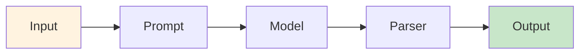

# 第1周：环境搭建与核心概念

::: tip 本周学习目标
- 🔧 完成 Python 和 LangChain 开发环境搭建
- 🧠 理解 LangChain 核心架构和设计思想
- 💻 运行第一个 LangChain 程序
- 📚 掌握基础调试技巧和常见问题解决方法
:::

## 一、环境搭建

### 1.1 什么是开发环境？

**开发环境**是指运行和开发 LangChain 应用所需的软件和工具集合。一个完善的开发环境包括：

- **Python 解释器**：执行 Python 代码的核心引擎
- **包管理工具**：管理第三方库（如 pip、conda）
- **虚拟环境**：隔离不同项目的依赖
- **代码编辑器/IDE**：编写和调试代码的工具
- **API密钥**：访问 LLM 服务的凭证

### 1.2 系统要求

| 项目 | 最低要求 | 推荐配置 |
|------|---------|---------|
| **操作系统** | Windows 10/macOS 10.14/Ubuntu 18.04 | Windows 11/macOS 13+/Ubuntu 22.04 |
| **Python 版本** | Python 3.8 | Python 3.10+ |
| **内存** | 4GB RAM | 8GB+ RAM |
| **磁盘空间** | 2GB 可用空间 | 5GB+ 可用空间 |
| **网络** | 稳定的互联网连接 | - |

### 1.3 详细安装步骤

#### 步骤1：安装 Python

**Windows 用户：**

```bash
# 1. 访问 Python 官网下载 Python 3.10+
# https://www.python.org/downloads/

# 2. 安装时务必勾选 "Add Python to PATH"

# 3. 验证安装
python --version  # 应输出：Python 3.10.x
pip --version     # 应输出：pip 23.x.x
```

**macOS 用户：**

```bash
# 方法1：使用 Homebrew（推荐）
brew install python@3.10

# 方法2：使用 pyenv（适合需要管理多个 Python 版本）
brew install pyenv
pyenv install 3.10.11
pyenv global 3.10.11

# 验证安装
python3 --version
pip3 --version
```

**Linux 用户：**

```bash
# Ubuntu/Debian
sudo apt update
sudo apt install python3.10 python3.10-venv python3-pip

# CentOS/RHEL
sudo yum install python310 python310-pip

# 验证安装
python3.10 --version
pip3 --version
```

#### 步骤2：创建虚拟环境

```bash
# 1. 创建项目目录
mkdir langchain-learning
cd langchain-learning

# 2. 创建虚拟环境
# Windows
python -m venv venv

# macOS/Linux
python3 -m venv venv

# 3. 激活虚拟环境
# Windows
venv\Scripts\activate

# macOS/Linux
source venv/bin/activate

# 激活成功后，命令行前面会显示 (venv)
```

::: warning 重要提示
**为什么需要虚拟环境？**

1. **依赖隔离**：不同项目使用不同版本的库，避免冲突
2. **环境清洁**：不污染系统的全局 Python 环境
3. **便于迁移**：通过 requirements.txt 轻松复制环境

**最佳实践**：每个项目都应该使用独立的虚拟环境！
:::

#### 步骤3：安装 LangChain

```bash
# 1. 升级 pip（推荐）
pip install --upgrade pip

# 2. 安装 LangChain 核心库
pip install langchain==0.1.0

# 3. 安装 LangChain Community 扩展（包含常用集成）
pip install langchain-community==0.0.10

# 4. 安装 OpenAI 集成
pip install langchain-openai==0.0.2

# 5. 安装其他常用依赖
pip install python-dotenv==1.0.0  # 环境变量管理
pip install tiktoken==0.5.2       # Token 计数工具

# 6. 验证安装
pip list | grep langchain
```

**一键安装命令**（推荐）：

```bash
# 创建 requirements.txt 文件
cat > requirements.txt << EOF
langchain==0.1.0
langchain-community==0.0.10
langchain-openai==0.0.2
python-dotenv==1.0.0
tiktoken==0.5.2
EOF

# 安装所有依赖
pip install -r requirements.txt
```

#### 步骤4：配置 API 密钥

```bash
# 1. 在项目根目录创建 .env 文件
touch .env

# 2. 编辑 .env 文件，添加 API 密钥
# 使用文本编辑器打开 .env，添加以下内容：
```

```.env
# OpenAI API 密钥（从 https://platform.openai.com/api-keys 获取）
OPENAI_API_KEY=sk-your-api-key-here

# 可选：设置 API 代理（国内用户可能需要）
# OPENAI_API_BASE=https://your-proxy-url.com/v1

# 可选：其他 LLM 服务的密钥
# ANTHROPIC_API_KEY=your-anthropic-key
# GOOGLE_API_KEY=your-google-key
```

::: danger 安全警告
**API 密钥安全最佳实践：**

1. ❌ **绝不要**将 `.env` 文件提交到 Git 仓库
2. ✅ 将 `.env` 添加到 `.gitignore`
3. ✅ 使用环境变量或密钥管理工具
4. ✅ 定期轮换 API 密钥
5. ✅ 为不同环境使用不同的密钥（开发/测试/生产）

```bash
# 创建 .gitignore 文件
echo ".env" >> .gitignore
echo "venv/" >> .gitignore
echo "__pycache__/" >> .gitignore
```
:::

#### 步骤5：验证环境

创建测试脚本 `test_setup.py`：

```python
"""
环境验证脚本
功能：检查所有依赖是否正确安装
"""
import sys

def check_python_version():
    """检查 Python 版本"""
    version = sys.version_info
    print(f"✅ Python 版本: {version.major}.{version.minor}.{version.micro}")
    if version.major == 3 and version.minor >= 8:
        print("   版本符合要求 (>= 3.8)")
        return True
    else:
        print("   ❌ 版本过低，请升级到 Python 3.8+")
        return False

def check_packages():
    """检查必要的包是否已安装"""
    required_packages = {
        "langchain": "LangChain 核心库",
        "langchain_community": "LangChain 社区扩展",
        "langchain_openai": "OpenAI 集成",
        "dotenv": "环境变量管理",
        "tiktoken": "Token 计数工具"
    }

    all_ok = True
    for package, description in required_packages.items():
        try:
            __import__(package)
            print(f"✅ {package:20s} - {description}")
        except ImportError:
            print(f"❌ {package:20s} - 未安装，请运行: pip install {package}")
            all_ok = False

    return all_ok

def check_env_file():
    """检查 .env 文件是否存在"""
    import os
    if os.path.exists(".env"):
        print("✅ .env 文件存在")
        return True
    else:
        print("❌ .env 文件不存在，请创建并添加 API 密钥")
        return False

def main():
    print("=" * 60)
    print("LangChain 环境检查")
    print("=" * 60)

    results = [
        check_python_version(),
        check_packages(),
        check_env_file()
    ]

    print("=" * 60)
    if all(results):
        print("🎉 所有检查通过！环境配置完成！")
    else:
        print("⚠️  部分检查未通过，请根据上述提示修复问题")
    print("=" * 60)

if __name__ == "__main__":
    main()
```

运行验证：

```bash
python test_setup.py
```

**预期输出：**

```
============================================================
LangChain 环境检查
============================================================
✅ Python 版本: 3.10.11
   版本符合要求 (>= 3.8)
✅ langchain          - LangChain 核心库
✅ langchain_community - LangChain 社区扩展
✅ langchain_openai   - OpenAI 集成
✅ dotenv             - 环境变量管理
✅ tiktoken           - Token 计数工具
✅ .env 文件存在
============================================================
🎉 所有检查通过！环境配置完成！
============================================================
```

### 1.4 常见安装问题与解决方案

<details>
<summary><b>问题1：pip install 速度慢或超时</b></summary>

**解决方案**：使用国内镜像源

```bash
# 临时使用镜像源
pip install langchain -i https://pypi.tuna.tsinghua.edu.cn/simple

# 永久配置镜像源
pip config set global.index-url https://pypi.tuna.tsinghua.edu.cn/simple
```
</details>

<details>
<summary><b>问题2：ModuleNotFoundError: No module named 'langchain'</b></summary>

**原因**：虚拟环境未激活或在错误的环境中安装

**解决方案**：
```bash
# 1. 确认虚拟环境已激活（命令行前应有 (venv) 标识）
# 2. 重新安装
pip install langchain

# 3. 验证安装位置
pip show langchain
```
</details>

<details>
<summary><b>问题3：Permission denied 错误</b></summary>

**原因**：尝试安装到系统 Python 目录

**解决方案**：
```bash
# 不要使用 sudo pip install
# 应该：
# 1. 使用虚拟环境（推荐）
# 2. 或使用用户安装
pip install --user langchain
```
</details>

<details>
<summary><b>问题4：SSL Certificate Error</b></summary>

**原因**：网络或证书问题

**解决方案**：
```bash
# 方法1：升级 pip 和 certifi
pip install --upgrade pip certifi

# 方法2：临时禁用 SSL 验证（不推荐）
pip install --trusted-host pypi.org --trusted-host files.pythonhosted.org langchain
```
</details>

---

## 二、LangChain 核心概念

### 2.1 什么是 LangChain？

**LangChain** 是一个用于开发由语言模型驱动的应用程序的框架。它提供了标准化的接口和工具链，让开发者能够轻松构建复杂的 AI 应用。

#### 核心价值

```mermaid
graph LR
    A[原始 LLM API] -->|复杂| B[手动管理]
    B --> C[重复代码]
    C --> D[难以维护]

    E[LangChain] -->|简化| F[标准化接口]
    F --> G[可复用组件]
    G --> H[易于扩展]

    style E fill:#4CAF50
    style H fill:#4CAF50
    style A fill:#FF9800
    style D fill:#FF9800
```



**LangChain 解决的核心问题：**

1. **统一接口**：不同 LLM 提供商（OpenAI、Anthropic、Google）有不同的 API，LangChain 提供统一抽象
2. **组件化开发**：将 Prompts、Models、Memory、Tools 等模块化，提高代码复用性
3. **流程编排**：通过 Chains 和 Agents 管理复杂的调用流程
4. **生态集成**：内置与数百个工具和服务的集成（向量数据库、文档加载器、搜索引擎等）

### 2.2 核心架构

LangChain 采用分层架构设计：

```mermaid
graph TB
    A[应用层<br/>Your Application] --> B[编排层<br/>Chains & Agents]
    B --> C[组件层<br/>Components]
    C --> D1[Models<br/>模型]
    C --> D2[Prompts<br/>提示词]
    C --> D3[Memory<br/>记忆]
    C --> D4[Tools<br/>工具]
    C --> D5[Documents<br/>文档]
    D1 --> E[集成层<br/>Integrations]
    D2 --> E
    D3 --> E
    D4 --> E
    D5 --> E
    E --> F1[OpenAI]
    E --> F2[Anthropic]
    E --> F3[Vector DBs]
    E --> F4[APIs]

    style A fill:#E3F2FD
    style B fill:#BBDEFB
    style C fill:#90CAF9
    style E fill:#64B5F6
    style F1 fill:#42A5F5
    style F2 fill:#42A5F5
    style F3 fill:#42A5F5
    style F4 fill:#42A5F5
```



#### 2.2.1 组件层详解

| 组件 | 作用 | 示例 |
|------|------|------|
| **Models** | 与 LLM 交互的接口 | ChatOpenAI, Anthropic |
| **Prompts** | 管理和优化输入文本 | PromptTemplate, ChatPromptTemplate |
| **Memory** | 存储对话历史和上下文 | ConversationBufferMemory |
| **Tools** | 扩展 LLM 能力的外部工具 | 搜索、计算器、数据库查询 |
| **Documents** | 文档加载、分割、处理 | TextLoader, RecursiveCharacterTextSplitter |
| **Embeddings** | 文本向量化 | OpenAIEmbeddings |
| **Vector Stores** | 存储和检索向量 | Chroma, Pinecone, FAISS |

#### 2.2.2 编排层详解

**Chains（链）**：按顺序连接多个组件



**Agents（智能体）**：根据输入动态决定使用哪些工具

```mermaid
graph TD
    A[User Query] --> B{Agent}
    B -->|决策1| C[Search Tool]
    B -->|决策2| D[Calculator Tool]
    B -->|决策3| E[Database Tool]
    C --> F[综合结果]
    D --> F
    E --> F
    F --> G[Final Answer]

    style B fill:#FFE082
    style G fill:#81C784
```



### 2.3 六大核心模块

#### 模块1：Models（模型）

```python
from langchain_openai import ChatOpenAI

# 创建模型实例
llm = ChatOpenAI(
    model="gpt-3.5-turbo",      # 模型名称
    temperature=0.7,             # 创造性（0-1，越高越随机）
    max_tokens=1000,             # 最大输出 token 数
    timeout=30,                  # 请求超时时间
    max_retries=2                # 失败重试次数
)
```

**关键参数说明：**
- `temperature`：控制输出的随机性
  - `0.0`：确定性输出，适合事实性问答
  - `0.7`：平衡创造性和准确性，适合大多数场景
  - `1.0`：高创造性，适合创意写作

#### 模块2：Prompts（提示词模板）

```python
from langchain.prompts import PromptTemplate

# 创建提示词模板
template = """你是一个专业的{role}。
用户问题：{question}
请用{language}语言回答。"""

prompt = PromptTemplate(
    input_variables=["role", "question", "language"],  # 变量列表
    template=template                                   # 模板字符串
)

# 使用模板
formatted = prompt.format(
    role="Python 教师",
    question="什么是装饰器？",
    language="简体中文"
)
```

#### 模块3：Memory（记忆系统）

```python
from langchain.memory import ConversationBufferMemory

# 创建记忆实例
memory = ConversationBufferMemory(
    return_messages=True,        # 返回消息对象而非字符串
    memory_key="chat_history"    # 在 Chain 中的键名
)

# 保存对话
memory.save_context(
    {"input": "你好！"},
    {"output": "你好！有什么可以帮助你的吗？"}
)

# 加载对话历史
history = memory.load_memory_variables({})
```

#### 模块4：Tools（工具集成）

```python
from langchain.tools import Tool

# 定义自定义工具
def search_knowledge_base(query: str) -> str:
    """在知识库中搜索答案"""
    # 实际搜索逻辑
    return f"搜索结果：{query}"

# 注册工具
search_tool = Tool(
    name="KnowledgeBaseSearch",          # 工具名称
    func=search_knowledge_base,          # 工具函数
    description="在内部知识库中搜索相关信息"  # 工具描述（给 Agent 看）
)
```

#### 模块5：Documents（文档处理）

```python
from langchain.document_loaders import TextLoader
from langchain.text_splitter import RecursiveCharacterTextSplitter

# 加载文档
loader = TextLoader("document.txt", encoding="utf-8")
documents = loader.load()

# 分割文档
splitter = RecursiveCharacterTextSplitter(
    chunk_size=1000,         # 每块最大字符数
    chunk_overlap=200,       # 块之间重叠字符数
    separators=["\n\n", "\n", "。", " ", ""]  # 分割优先级
)
chunks = splitter.split_documents(documents)
```

#### 模块6：Chains（流程链）

```python
from langchain.chains import LLMChain

# 创建简单链
chain = LLMChain(
    llm=llm,            # 语言模型
    prompt=prompt,      # 提示词模板
    memory=memory       # 记忆系统（可选）
)

# 执行链
result = chain.run(
    role="数据科学家",
    question="如何优化模型性能？",
    language="中文"
)
```

### 2.4 数据流向图

完整的 LangChain 应用数据流：

```mermaid
sequenceDiagram
    participant U as User
    participant A as Application
    participant P as Prompt Template
    participant M as Model (LLM)
    participant T as Tools
    participant Me as Memory
    participant O as Output Parser

    U->>A: 输入问题
    A->>P: 格式化输入
    P->>Me: 加载历史对话
    Me-->>P: 返回上下文
    P->>M: 发送完整 Prompt
    M->>M: 生成回答
    M->>T: 需要调用工具？
    T-->>M: 返回工具结果
    M->>O: 原始输出
    O->>Me: 保存新对话
    O->>U: 格式化输出
```



---

## 三、第一个 LangChain 程序

### 3.1 Hello World 示例

创建 `hello_langchain.py`：

```python
"""
第一个 LangChain 程序：Hello World
功能：使用 OpenAI 模型进行简单对话
"""
import os
from dotenv import load_dotenv
from langchain_openai import ChatOpenAI
from langchain.schema import HumanMessage, SystemMessage

# ========== 步骤1：加载环境变量 ==========
load_dotenv()  # 从 .env 文件加载 API 密钥

# 验证 API 密钥是否存在
if not os.getenv("OPENAI_API_KEY"):
    raise ValueError("❌ 未找到 OPENAI_API_KEY，请检查 .env 文件")

print("✅ API 密钥加载成功")

# ========== 步骤2：初始化模型 ==========
llm = ChatOpenAI(
    model="gpt-3.5-turbo",  # 使用 GPT-3.5 模型
    temperature=0.7         # 设置创造性为 0.7
)

print("✅ 模型初始化成功")

# ========== 步骤3：构建消息列表 ==========
messages = [
    # SystemMessage：设定 AI 的角色和行为
    SystemMessage(content="你是一个友好的 AI 助手，用简洁的语言回答问题。"),

    # HumanMessage：用户的输入
    HumanMessage(content="用一句话解释什么是 LangChain？")
]

# ========== 步骤4：调用模型并获取回答 ==========
print("\n正在调用 OpenAI API...")
response = llm.invoke(messages)

# ========== 步骤5：输出结果 ==========
print("\n" + "=" * 60)
print("AI 回答：")
print(response.content)
print("=" * 60)

# 打印元数据
print(f"\n模型：{response.response_metadata.get('model_name', 'N/A')}")
print(f"Token 使用：{response.response_metadata.get('token_usage', {})}")
```

**运行程序：**

```bash
python hello_langchain.py
```

**预期输出：**

```
✅ API 密钥加载成功
✅ 模型初始化成功

正在调用 OpenAI API...

============================================================
AI 回答：
LangChain 是一个开源框架，帮助开发者构建基于大语言模型的应用程序，提供了模块化的组件和工具链。
============================================================

模型：gpt-3.5-turbo-0125
Token 使用：{'prompt_tokens': 45, 'completion_tokens': 28, 'total_tokens': 73}
```

### 3.2 代码详解

#### 3.2.1 消息类型

LangChain 定义了三种主要消息类型：

```python
from langchain.schema import SystemMessage, HumanMessage, AIMessage

# 1. SystemMessage：系统消息，设定 AI 角色
system_msg = SystemMessage(content="你是一个专业的翻译助手")

# 2. HumanMessage：用户消息
human_msg = HumanMessage(content="将 'Hello' 翻译成中文")

# 3. AIMessage：AI 回复消息（用于多轮对话）
ai_msg = AIMessage(content="'Hello' 的中文翻译是 '你好'")

# 多轮对话示例
messages = [
    SystemMessage(content="你是一个数学老师"),
    HumanMessage(content="1+1等于几？"),
    AIMessage(content="1+1等于2"),
    HumanMessage(content="那 2+2 呢？")  # 继续对话
]
```

#### 3.2.2 错误处理

完善的错误处理示例：

```python
"""
完善的 LangChain 程序（含错误处理）
"""
import os
from dotenv import load_dotenv
from langchain_openai import ChatOpenAI
from langchain.schema import HumanMessage
import time

load_dotenv()

def create_llm_with_retry(max_retries=3, retry_delay=2):
    """创建带重试机制的 LLM 实例"""
    for attempt in range(max_retries):
        try:
            llm = ChatOpenAI(
                model="gpt-3.5-turbo",
                temperature=0.7,
                timeout=30  # 30 秒超时
            )
            # 测试连接
            llm.invoke([HumanMessage(content="test")])
            print(f"✅ 模型连接成功（尝试 {attempt + 1}/{max_retries}）")
            return llm
        except Exception as e:
            print(f"❌ 连接失败（尝试 {attempt + 1}/{max_retries}）: {str(e)}")
            if attempt < max_retries - 1:
                print(f"⏳ {retry_delay} 秒后重试...")
                time.sleep(retry_delay)
            else:
                raise Exception("无法连接到 OpenAI API，请检查网络和 API 密钥")

def main():
    try:
        # 1. 验证环境变量
        if not os.getenv("OPENAI_API_KEY"):
            raise ValueError("OPENAI_API_KEY 未设置，请检查 .env 文件")

        # 2. 创建 LLM 实例
        llm = create_llm_with_retry()

        # 3. 发送请求
        messages = [HumanMessage(content="用一句话解释 Python 装饰器")]
        response = llm.invoke(messages)

        # 4. 输出结果
        print(f"\n✅ AI 回答：\n{response.content}")

    except ValueError as e:
        print(f"❌ 配置错误：{e}")
    except Exception as e:
        print(f"❌ 程序错误：{e}")
        import traceback
        traceback.print_exc()

if __name__ == "__main__":
    main()
```

### 3.3 交互式问答程序

创建 `interactive_chat.py`：

```python
"""
交互式聊天程序
功能：与 AI 进行多轮对话，支持退出命令
"""
import os
from dotenv import load_dotenv
from langchain_openai import ChatOpenAI
from langchain.schema import SystemMessage, HumanMessage, AIMessage

load_dotenv()

def main():
    # 初始化模型
    llm = ChatOpenAI(model="gpt-3.5-turbo", temperature=0.7)

    # 对话历史（包含系统消息）
    messages = [
        SystemMessage(content="你是一个友好的 AI 助手，提供有帮助的回答。")
    ]

    print("=" * 60)
    print("LangChain 交互式聊天（输入 'exit' 或 'quit' 退出）")
    print("=" * 60)

    while True:
        # 获取用户输入
        user_input = input("\n你: ").strip()

        # 检查退出命令
        if user_input.lower() in ['exit', 'quit', '退出']:
            print("\n再见！👋")
            break

        # 跳过空输入
        if not user_input:
            continue

        # 添加用户消息
        messages.append(HumanMessage(content=user_input))

        try:
            # 调用 LLM
            print("\nAI 正在思考...")
            response = llm.invoke(messages)

            # 添加 AI 回复到历史
            messages.append(AIMessage(content=response.content))

            # 打印回复
            print(f"\nAI: {response.content}")

        except Exception as e:
            print(f"\n❌ 错误：{e}")
            # 移除失败的用户消息
            messages.pop()

if __name__ == "__main__":
    main()
```

**运行效果：**

```
============================================================
LangChain 交互式聊天（输入 'exit' 或 'quit' 退出）
============================================================

你: 什么是 Python？

AI 正在思考...

AI: Python 是一种高级编程语言，以简洁易读著称，广泛用于 Web 开发、数据分析、人工智能等领域。

你: 它有哪些优点？

AI 正在思考...

AI: Python 的主要优点包括：
1. 语法简洁易学
2. 丰富的第三方库
3. 强大的社区支持
4. 跨平台兼容
5. 适用于多种应用场景

你: exit

再见！👋
```

---

## 四、调试技巧与最佳实践

### 4.1 日志记录

启用 LangChain 详细日志：

```python
"""
启用详细日志记录
"""
import os
os.environ["LANGCHAIN_VERBOSE"] = "true"  # 启用详细输出

from langchain_openai import ChatOpenAI
from langchain.schema import HumanMessage

llm = ChatOpenAI(model="gpt-3.5-turbo")
response = llm.invoke([HumanMessage(content="Hello")])

# 会输出详细的调用信息：
# > Entering new LLMChain chain...
# > Prompt after formatting: ...
# > Finished chain.
```

### 4.2 Token 计数与成本估算

```python
"""
Token 使用统计和成本计算
"""
from langchain_openai import ChatOpenAI
from langchain.schema import HumanMessage
from langchain.callbacks import get_openai_callback

llm = ChatOpenAI(model="gpt-3.5-turbo")

# 使用 callback 追踪 Token 使用
with get_openai_callback() as cb:
    response = llm.invoke([HumanMessage(content="解释量子计算")])

    print("=" * 60)
    print("Token 使用统计：")
    print(f"  输入 Token: {cb.prompt_tokens}")
    print(f"  输出 Token: {cb.completion_tokens}")
    print(f"  总计 Token: {cb.total_tokens}")
    print(f"  预估成本: ${cb.total_cost:.6f} USD")
    print("=" * 60)
```

**输出示例：**

```
============================================================
Token 使用统计：
  输入 Token: 12
  输出 Token: 85
  总计 Token: 97
  预估成本: $0.000194 USD
============================================================
```

### 4.3 常见错误与解决方案

#### 错误1：RateLimitError

```python
"""
处理速率限制错误
"""
from langchain_openai import ChatOpenAI
from openai import RateLimitError
import time

llm = ChatOpenAI(model="gpt-3.5-turbo")

def call_with_retry(messages, max_retries=3, base_delay=1):
    """指数退避重试"""
    for attempt in range(max_retries):
        try:
            return llm.invoke(messages)
        except RateLimitError as e:
            if attempt == max_retries - 1:
                raise e
            delay = base_delay * (2 ** attempt)  # 指数退避：1s, 2s, 4s
            print(f"⚠️ 速率限制，{delay}秒后重试...")
            time.sleep(delay)
```

#### 错误2：Context Length Exceeded

```python
"""
处理上下文长度超限
"""
def truncate_messages(messages, max_tokens=4096):
    """截断消息以适应上下文窗口"""
    import tiktoken

    encoding = tiktoken.encoding_for_model("gpt-3.5-turbo")
    current_tokens = sum(len(encoding.encode(msg.content)) for msg in messages)

    if current_tokens <= max_tokens:
        return messages

    # 保留系统消息和最新的几条消息
    system_msgs = [msg for msg in messages if isinstance(msg, SystemMessage)]
    other_msgs = [msg for msg in messages if not isinstance(msg, SystemMessage)]

    # 从最新消息开始保留
    truncated = system_msgs.copy()
    for msg in reversed(other_msgs):
        msg_tokens = len(encoding.encode(msg.content))
        if current_tokens - msg_tokens < max_tokens:
            truncated.insert(1, msg)
            current_tokens -= msg_tokens
        else:
            break

    return truncated
```

### 4.4 性能优化技巧

#### 技巧1：批量处理

```python
"""
批量调用提高效率
"""
from langchain_openai import ChatOpenAI
from langchain.schema import HumanMessage

llm = ChatOpenAI(model="gpt-3.5-turbo")

# 单次调用（慢）
questions = ["什么是 Python?", "什么是 Java?", "什么是 JavaScript?"]
for q in questions:
    response = llm.invoke([HumanMessage(content=q)])

# 批量调用（快）
messages_batch = [[HumanMessage(content=q)] for q in questions]
responses = llm.batch(messages_batch)  # 并行调用
```

#### 技巧2：使用缓存

```python
"""
启用响应缓存
"""
from langchain.cache import InMemoryCache
from langchain.globals import set_llm_cache
from langchain_openai import ChatOpenAI

# 启用缓存
set_llm_cache(InMemoryCache())

llm = ChatOpenAI(model="gpt-3.5-turbo")

# 第一次调用（慢）
response1 = llm.invoke([HumanMessage(content="什么是 LangChain?")])

# 相同问题的第二次调用（快，直接从缓存返回）
response2 = llm.invoke([HumanMessage(content="什么是 LangChain?")])
```

---

## 五、本周练习题

### 练习1：基础调用（难度：⭐）

**任务**：创建一个程序，让 AI 扮演不同角色回答同一个问题。

**要求**：
1. 使用 `SystemMessage` 设定 3 个不同角色（如：教师、诗人、程序员）
2. 让每个角色回答："什么是爱？"
3. 比较不同角色的回答差异

<details>
<summary><b>查看参考答案</b></summary>

```python
from langchain_openai import ChatOpenAI
from langchain.schema import SystemMessage, HumanMessage
from dotenv import load_dotenv

load_dotenv()
llm = ChatOpenAI(model="gpt-3.5-turbo", temperature=0.8)

roles = {
    "教师": "你是一个富有耐心的教师，善于用简单的语言解释复杂概念。",
    "诗人": "你是一个浪漫的诗人，用诗意的语言表达情感。",
    "程序员": "你是一个理性的程序员，习惯用逻辑和算法思维看待问题。"
}

question = "什么是爱？"

for role_name, role_description in roles.items():
    messages = [
        SystemMessage(content=role_description),
        HumanMessage(content=question)
    ]
    response = llm.invoke(messages)
    print(f"\n{'=' * 60}")
    print(f"{role_name}的回答：")
    print(response.content)
```
</details>

### 练习2：对话历史（难度：⭐⭐）

**任务**：实现一个简单的多轮对话系统，能够记住之前的对话内容。

**要求**：
1. 用户可以连续提问
2. AI 能够引用之前的对话内容
3. 支持查看完整对话历史

<details>
<summary><b>查看参考答案</b></summary>

```python
from langchain_openai import ChatOpenAI
from langchain.schema import SystemMessage, HumanMessage, AIMessage
from dotenv import load_dotenv

load_dotenv()
llm = ChatOpenAI(model="gpt-3.5-turbo")

messages = [SystemMessage(content="你是一个有记忆力的AI助手。")]

def chat(user_input):
    messages.append(HumanMessage(content=user_input))
    response = llm.invoke(messages)
    messages.append(AIMessage(content=response.content))
    return response.content

def show_history():
    print("\n--- 对话历史 ---")
    for i, msg in enumerate(messages[1:], 1):  # 跳过系统消息
        role = "你" if isinstance(msg, HumanMessage) else "AI"
        print(f"{i}. {role}: {msg.content}")

# 测试
print(chat("我叫小明"))
print(chat("我刚才说我叫什么？"))
show_history()
```
</details>

### 练习3：错误处理（难度：⭐⭐⭐）

**任务**：增强交互式聊天程序，添加完善的错误处理和日志记录。

**要求**：
1. 处理网络错误、API 错误、超时错误
2. 添加日志记录到文件
3. 统计 Token 使用和成本
4. 支持导出对话历史

<details>
<summary><b>查看参考答案</b></summary>

```python
import os
import logging
from datetime import datetime
from dotenv import load_dotenv
from langchain_openai import ChatOpenAI
from langchain.schema import SystemMessage, HumanMessage, AIMessage
from langchain.callbacks import get_openai_callback

# 配置日志
logging.basicConfig(
    filename=f'chat_log_{datetime.now().strftime("%Y%m%d_%H%M%S")}.log',
    level=logging.INFO,
    format='%(asctime)s - %(levelname)s - %(message)s'
)

load_dotenv()

class ChatBot:
    def __init__(self):
        self.llm = ChatOpenAI(model="gpt-3.5-turbo", temperature=0.7)
        self.messages = [SystemMessage(content="你是一个友好的AI助手。")]
        self.total_cost = 0.0
        self.total_tokens = 0
        logging.info("ChatBot 初始化成功")

    def chat(self, user_input):
        try:
            self.messages.append(HumanMessage(content=user_input))
            logging.info(f"用户输入：{user_input}")

            with get_openai_callback() as cb:
                response = self.llm.invoke(self.messages)
                self.messages.append(AIMessage(content=response.content))

                self.total_cost += cb.total_cost
                self.total_tokens += cb.total_tokens

                logging.info(f"AI回复：{response.content}")
                logging.info(f"Token使用：{cb.total_tokens}, 成本：${cb.total_cost:.6f}")

            return response.content

        except Exception as e:
            logging.error(f"调用失败：{str(e)}")
            self.messages.pop()  # 移除失败的消息
            return f"抱歉，发生错误：{str(e)}"

    def export_history(self, filename="chat_history.txt"):
        with open(filename, 'w', encoding='utf-8') as f:
            f.write(f"对话导出时间：{datetime.now()}\n")
            f.write(f"总Token使用：{self.total_tokens}\n")
            f.write(f"总成本：${self.total_cost:.6f}\n")
            f.write("=" * 60 + "\n\n")

            for msg in self.messages[1:]:
                role = "用户" if isinstance(msg, HumanMessage) else "AI"
                f.write(f"{role}：{msg.content}\n\n")

        print(f"✅ 对话历史已导出到 {filename}")
        logging.info(f"对话历史导出到 {filename}")

def main():
    bot = ChatBot()
    print("聊天开始（输入 'exit' 退出，'export' 导出历史）")

    while True:
        user_input = input("\n你: ").strip()

        if user_input.lower() == 'exit':
            print(f"\n总Token使用：{bot.total_tokens}")
            print(f"总成本：${bot.total_cost:.6f}")
            break

        if user_input.lower() == 'export':
            bot.export_history()
            continue

        if not user_input:
            continue

        response = bot.chat(user_input)
        print(f"\nAI: {response}")

if __name__ == "__main__":
    main()
```
</details>

---

## 六、本周总结

### 6.1 知识点清单

- [x] Python 虚拟环境的创建和使用
- [x] LangChain 和相关依赖的安装
- [x] API 密钥的配置和管理
- [x] LangChain 核心架构理解
- [x] 六大核心模块（Models、Prompts、Memory、Tools、Documents、Chains）
- [x] 消息类型（SystemMessage、HumanMessage、AIMessage）
- [x] 基本的 LLM 调用
- [x] 错误处理和日志记录
- [x] Token 计数和成本估算

### 6.2 常见问题（FAQ）

<details>
<summary><b>Q1：为什么要使用虚拟环境？</b></summary>

**A**：虚拟环境提供依赖隔离，避免不同项目之间的包版本冲突。例如：
- 项目 A 需要 langchain 0.1.0
- 项目 B 需要 langchain 0.2.0
- 使用虚拟环境，两个项目可以共存

最佳实践：每个项目都应该有独立的虚拟环境。
</details>

<details>
<summary><b>Q2：temperature 参数如何选择？</b></summary>

**A**：根据应用场景选择：

| Temperature | 适用场景 | 示例 |
|-------------|---------|------|
| 0.0 - 0.3 | 事实性任务 | 翻译、数据提取、客服问答 |
| 0.4 - 0.7 | 平衡任务 | 通用对话、总结、解释 |
| 0.8 - 1.0 | 创意任务 | 创意写作、头脑风暴 |
| > 1.0 | 极高随机性 | 艺术创作（不推荐） |
</details>

<details>
<summary><b>Q3：如何降低 API 调用成本？</b></summary>

**A**：5 个实用技巧：

1. **使用缓存**：相同问题不重复调用
2. **选择合适模型**：简单任务用 gpt-3.5-turbo
3. **优化 Prompt**：减少不必要的上下文
4. **批量调用**：使用 `batch()` 方法
5. **设置 max_tokens**：限制输出长度

```python
# 示例：启用缓存
from langchain.cache import InMemoryCache
from langchain.globals import set_llm_cache
set_llm_cache(InMemoryCache())
```
</details>

<details>
<summary><b>Q4：如何处理中文编码问题？</b></summary>

**A**：确保所有文件操作使用 UTF-8 编码：

```python
# 读取文件
with open("file.txt", "r", encoding="utf-8") as f:
    content = f.read()

# 写入文件
with open("output.txt", "w", encoding="utf-8") as f:
    f.write("中文内容")

# 在 Windows 上还需要设置环境变量
import os
os.environ["PYTHONIOENCODING"] = "utf-8"
```
</details>

### 6.3 下周预习

**第2周主题：Messages 和 Prompts 深入**

预习内容：
1. 了解 Prompt Engineering 基本概念
2. 阅读 [LangChain Prompts 文档](https://python.langchain.com/docs/modules/model_io/prompts/)
3. 思考：如何设计一个好的 Prompt？

**预习问题**：
- Few-shot Learning 是什么？
- Chain of Thought（思维链）有什么作用？
- 如何让 AI 输出结构化数据（如 JSON）？

---

## 七、学习资源

### 官方文档
- [LangChain 官方文档](https://python.langchain.com/)
- [LangChain GitHub](https://github.com/langchain-ai/langchain)
- [OpenAI API 文档](https://platform.openai.com/docs/)

### 推荐阅读
- [Prompt Engineering Guide](https://www.promptingguide.ai/)
- [LangChain Cookbook](https://github.com/langchain-ai/langchain/tree/master/cookbook)

### 社区资源
- [LangChain Discord 社区](https://discord.gg/langchain)
- [LangChain 中文社区](https://github.com/lijiext/langchain-zh)

---

::: tip 学习建议
1. **动手实践**：完成所有练习题，并尝试修改代码
2. **记录笔记**：记录遇到的问题和解决方案
3. **加入社区**：在社区提问和分享经验
4. **每日练习**：每天至少写 30 分钟代码
:::

**下周继续加油！🚀**
