# 第2周：Messages 和 Prompts 深入

::: tip 本周学习目标
- 📝 掌握 Prompt Engineering 核心技巧
- 🔧 熟练使用 PromptTemplate 和 ChatPromptTemplate
- 🎯 学习 Few-shot Learning 和 Chain of Thought
- 🚀 能够设计高质量的提示词
- 📊 实现结构化输出（JSON、Pydantic）
:::

## 一、Prompt Engineering 基础

### 1.1 什么是 Prompt Engineering？

**Prompt Engineering**（提示词工程）是设计和优化输入文本以获得更好 AI 输出的技术和艺术。

#### 为什么重要？

```mermaid
graph LR
    A[普通 Prompt] -->|模糊| B[质量差的输出]
    C[优化的 Prompt] -->|精确| D[高质量输出]

    style A fill:#FFCDD2
    style B fill:#EF5350
    style C fill:#C8E6C9
    style D fill:#66BB6A
```



**对比示例：**

| 对比项 | 普通 Prompt | 优化后的 Prompt |
|--------|------------|----------------|
| **输入** | "介绍 Python" | "作为编程教师，用 3 段话向零基础学生介绍 Python，包括：1)什么是 Python 2)主要用途 3)学习建议" |
| **输出质量** | 笼统、无重点 | 结构清晰、针对性强 |
| **可控性** | 低 | 高 |

### 1.2 Prompt 设计的六大原则

#### 原则1：清晰明确（Clarity）

```python
from langchain_openai import ChatOpenAI
from langchain.schema import HumanMessage

llm = ChatOpenAI(model="gpt-3.5-turbo", temperature=0.3)

# ❌ 不好的 Prompt（模糊）
bad_prompt = "讲讲机器学习"

# ✅ 好的 Prompt（清晰）
good_prompt = """请用通俗易懂的语言解释机器学习，要求：
1. 定义机器学习（1句话）
2. 举一个日常生活中的例子
3. 说明它与传统编程的区别"""

response = llm.invoke([HumanMessage(content=good_prompt)])
print(response.content)
```

#### 原则2：提供上下文（Context）

```python
# ❌ 缺乏上下文
bad_prompt = "这个方案可行吗？"

# ✅ 提供完整上下文
good_prompt = """背景：我们公司是一家 50 人的电商初创企业
目标：提高用户留存率
方案：引入会员积分系统，用户消费可获得积分，积分可兑换优惠券

请从技术可行性、成本、预期效果三个维度评估这个方案。"""
```

#### 原则3：指定格式（Format）

```python
# ❌ 不指定格式
bad_prompt = "列出学习 Python 的步骤"

# ✅ 指定输出格式
good_prompt = """列出学习 Python 的步骤，使用以下格式：

步骤编号 | 步骤名称 | 时间投入 | 学习资源
--------|---------|---------|----------
1       | ...     | ...     | ..."""
```

#### 原则4：设定角色（Role）

```python
from langchain.schema import SystemMessage, HumanMessage

# ✅ 使用 SystemMessage 设定角色
messages = [
    SystemMessage(content="""你是一个资深的 Python 导师，拥有 10 年教学经验。
你的教学特点是：
- 善于用类比和例子解释复杂概念
- 注重实践，提供可运行的代码示例
- 鼓励学生思考和提问"""),

    HumanMessage(content="什么是 Python 装饰器？")
]

response = llm.invoke(messages)
print(response.content)
```

#### 原则5：分步引导（Step-by-step）

```python
# ✅ 分步骤引导 AI 思考
prompt = """请帮我分析这段代码的性能问题，按以下步骤：

代码：
```python
result = []
for i in range(10000):
    result.append(i ** 2)
步骤1：识别代码的主要操作
步骤2：分析时间复杂度
步骤3：指出潜在的性能瓶颈
步骤4：提供优化建议（附代码）"""
```

#### 原则6：提供示例（Examples）

```python
# ✅ Few-shot Learning：提供示例引导输出格式
prompt = """将以下句子改写为更正式的表达方式。

示例1:
输入：这个方法挺好用的
输出：该方法具有较高的实用性

示例2:
输入：代码跑不起来
输出：代码无法正常执行

现在请改写：
输入：这bug太难搞了"""
```

### 1.3 Prompt 设计模式

#### 模式1：角色扮演（Role Playing）

```python
"""
角色扮演模式：让 AI 扮演特定专家
适用场景：需要特定领域知识或特定风格的回答
"""
from langchain_openai import ChatOpenAI
from langchain.schema import SystemMessage, HumanMessage

llm = ChatOpenAI(model="gpt-3.5-turbo")

# 角色定义
roles = {
    "架构师": """你是一位资深软件架构师，擅长：
- 系统设计和技术选型
- 分析性能瓶颈
- 权衡技术方案的利弊""",

    "代码审查员": """你是一位严格的代码审查员，关注：
- 代码可读性和维护性
- 潜在的 bug 和安全问题
- 最佳实践和设计模式"""
}

# 使用架构师角色
messages = [
    SystemMessage(content=roles["架构师"]),
    HumanMessage(content="如何设计一个高并发的秒杀系统？")
]

response = llm.invoke(messages)
print(response.content)
```

#### 模式2：任务分解（Task Decomposition）

```python
"""
任务分解模式：将复杂任务拆分为多个子任务
适用场景：需要处理复杂问题或多步骤任务
"""
prompt = """请帮我设计一个在线教育平台，分以下阶段进行：

阶段1 - 需求分析：
- 核心功能列表
- 用户角色（学生、教师、管理员）

阶段2 - 技术选型：
- 前端框架推荐
- 后端框架推荐
- 数据库选择

阶段3 - 系统架构：
- 绘制系统架构图（文字描述）
- 说明各模块职责

请一步步完成每个阶段。"""
```

#### 模式3：对比分析（Comparison）

```python
"""
对比分析模式：让 AI 比较多个方案
适用场景：技术选型、方案评估
"""
prompt = """请对比 MySQL 和 PostgreSQL，使用表格形式：

对比维度 | MySQL | PostgreSQL | 建议场景
--------|-------|------------|----------
性能    | ...   | ...        | ...
扩展性  | ...   | ...        | ...
功能完整性 | ... | ...        | ...
社区支持 | ...  | ...        | ...
学习曲线 | ...  | ...        | ...

最后给出选型建议。"""
```

#### 模式4：错误诊断（Debugging）

```python
"""
错误诊断模式：帮助分析和修复问题
适用场景：调试代码、排查错误
"""
prompt = """我的代码出现了错误，请帮我诊断和修复。

代码：
```python
def calculate_average(numbers):
    return sum(numbers) / len(numbers)

result = calculate_average([])
print(result)

错误信息：
ZeroDivisionError: division by zero

请按以下格式回答：
1. **错误原因**：...
2. **修复方案**：...（附修复后的代码）
3. **预防措施**：...（如何避免类似错误）"""
```

## 二、LangChain Prompt Templates

### 2.1 PromptTemplate 基础

#### 2.1.1 什么是 PromptTemplate？

**PromptTemplate** 是 LangChain 提供的模板系统，用于创建可复用、可参数化的提示词。

**核心优势：**
- ✅ **可复用**：一次定义，多次使用
- ✅ **参数化**：动态填充变量
- ✅ **可维护**：集中管理提示词
- ✅ **可测试**：方便进行 A/B 测试

#### 2.1.2 基本用法

```python
"""
PromptTemplate 基础示例
"""
from langchain.prompts import PromptTemplate

# 方法1：使用 from_template（推荐）
template = "你是一个{role}，请用{language}回答：{question}"

prompt = PromptTemplate.from_template(template)

# 格式化输出
formatted = prompt.format(
    role="Python 专家",
    language="简体中文",
    question="什么是列表推导式？"
)

print(formatted)
# 输出：你是一个Python 专家，请用简体中文回答：什么是列表推导式？
```

```python
# 方法2：显式指定变量（更严格）
prompt = PromptTemplate(
    input_variables=["role", "language", "question"],  # 明确变量列表
    template="你是一个{role}，请用{language}回答：{question}"
)

# 如果缺少变量，会报错
try:
    prompt.format(role="专家")  # 缺少 language 和 question
except KeyError as e:
    print(f"错误：缺少变量 {e}")
```

#### 2.1.3 高级特性

**特性1：部分变量（Partial Variables）**

```python
"""
部分变量：预先填充部分变量
适用场景：某些变量固定不变，如日期、系统信息
"""
from datetime import datetime

# 定义模板
template = """当前日期：{date}
用户问题：{question}
请提供详细回答。"""

prompt = PromptTemplate(
    input_variables=["question"],
    template=template,
    partial_variables={
        "date": lambda: datetime.now().strftime("%Y-%m-%d")  # 动态获取日期
    }
)

# 使用时只需提供 question
formatted = prompt.format(question="今天是几号？")
print(formatted)
# 输出：
# 当前日期：2025-01-22
# 用户问题：今天是几号？
# 请提供详细回答。
```

**特性2：模板验证**

```python
"""
模板验证：确保模板安全和有效
"""
from langchain.prompts import PromptTemplate

# ✅ 验证变量名是否合法
try:
    prompt = PromptTemplate(
        input_variables=["user-name"],  # 变量名包含 '-'，不合法
        template="Hello {user-name}"
    )
except ValueError as e:
    print(f"验证错误：{e}")

# ✅ 正确写法
prompt = PromptTemplate(
    input_variables=["user_name"],  # 使用下划线
    template="Hello {user_name}"
)
```

**特性3：模板组合**

```python
"""
模板组合：将多个模板组合成复杂提示词
"""
from langchain.prompts import PromptTemplate

# 定义子模板
system_template = PromptTemplate.from_template(
    "你是一个{role}，你的任务是{task}。"
)

context_template = PromptTemplate.from_template(
    "背景信息：{context}"
)

question_template = PromptTemplate.from_template(
    "用户问题：{question}"
)

# 组合模板
combined_prompt = (
    system_template.format(role="数据分析师", task="分析数据并给出建议") + "\n\n" +
    context_template.format(context="公司Q1销售额下降15%") + "\n\n" +
    question_template.format(question="如何提高销售额？")
)

print(combined_prompt)
```

### 2.2 ChatPromptTemplate

#### 2.2.1 聊天模型专用模板

**ChatPromptTemplate** 是为聊天模型（如 ChatGPT）设计的模板，支持多角色消息。

```python
"""
ChatPromptTemplate 基础用法
"""
from langchain.prompts import ChatPromptTemplate
from langchain_openai import ChatOpenAI

# 创建聊天模板
chat_prompt = ChatPromptTemplate.from_messages([
    ("system", "你是一个{role}，擅长{skill}。"),
    ("human", "{user_input}")
])

# 格式化
messages = chat_prompt.format_messages(
    role="Python 导师",
    skill="用简单例子解释复杂概念",
    user_input="什么是闭包？"
)

# 调用模型
llm = ChatOpenAI(model="gpt-3.5-turbo")
response = llm.invoke(messages)
print(response.content)
```

#### 2.2.2 消息模板类型

LangChain 支持多种消息模板：

```python
from langchain.prompts import (
    ChatPromptTemplate,
    SystemMessagePromptTemplate,
    HumanMessagePromptTemplate,
    AIMessagePromptTemplate
)

# 方法1：使用元组（简洁）
template1 = ChatPromptTemplate.from_messages([
    ("system", "你是{role}"),
    ("human", "{input}"),
    ("ai", "我理解你的问题是关于{topic}"),
    ("human", "{followup}")
])

# 方法2：使用消息模板类（灵活）
template2 = ChatPromptTemplate.from_messages([
    SystemMessagePromptTemplate.from_template("你是{role}"),
    HumanMessagePromptTemplate.from_template("{input}"),
    AIMessagePromptTemplate.from_template("我理解你的问题是关于{topic}"),
    HumanMessagePromptTemplate.from_template("{followup}")
])

# 两种方法效果相同
```

#### 2.2.3 实战案例：智能客服

```python
"""
实战案例：构建智能客服系统
功能：根据用户问题类型，使用不同的回复模板
"""
from langchain.prompts import ChatPromptTemplate
from langchain_openai import ChatOpenAI
from enum import Enum

class QuestionType(Enum):
    """问题类型枚举"""
    TECHNICAL = "technical"  # 技术问题
    SALES = "sales"          # 销售咨询
    COMPLAINT = "complaint"  # 投诉建议

# 定义不同类型的模板
templates = {
    QuestionType.TECHNICAL: ChatPromptTemplate.from_messages([
        ("system", """你是一个技术支持专家，具备以下特质：
- 耐心细致，逐步引导用户解决问题
- 提供具体的操作步骤
- 必要时要求用户提供更多信息"""),
        ("human", "用户问题：{question}\n产品：{product}")
    ]),

    QuestionType.SALES: ChatPromptTemplate.from_messages([
        ("system", """你是一个专业的销售顾问，工作方式：
- 了解客户需求
- 推荐合适的产品或方案
- 强调产品优势和价值"""),
        ("human", "客户咨询：{question}\n预算范围：{budget}")
    ]),

    QuestionType.COMPLAINT: ChatPromptTemplate.from_messages([
        ("system", """你是客户关系专家，处理原则：
- 首先表达歉意和理解
- 承诺会认真对待问题
- 提供解决方案或后续跟进计划"""),
        ("human", "客户反馈：{question}\n订单号：{order_id}")
    ])
}

def handle_customer_query(
    question: str,
    question_type: QuestionType,
    **kwargs
):
    """处理客户查询"""
    llm = ChatOpenAI(model="gpt-3.5-turbo", temperature=0.7)

    # 选择模板
    template = templates[question_type]

    # 格式化消息
    messages = template.format_messages(question=question, **kwargs)

    # 调用模型
    response = llm.invoke(messages)
    return response.content

# 测试不同场景
print("=== 技术支持场景 ===")
tech_response = handle_customer_query(
    question="软件无法启动，显示 Error 404",
    question_type=QuestionType.TECHNICAL,
    product="数据分析软件 v2.0"
)
print(tech_response)

print("\n=== 销售咨询场景 ===")
sales_response = handle_customer_query(
    question="我需要一个适合小团队的项目管理工具",
    question_type=QuestionType.SALES,
    budget="每月500元以内"
)
print(sales_response)

print("\n=== 投诉处理场景 ===")
complaint_response = handle_customer_query(
    question="订单延迟了3天才发货，非常不满意",
    question_type=QuestionType.COMPLAINT,
    order_id="ORD20250122001"
)
print(complaint_response)
```

### 2.3 Few-shot Prompt Templates

#### 2.3.1 什么是 Few-shot Learning？

**Few-shot Learning**（少样本学习）是通过提供少量示例来引导 AI 理解任务模式的技术。

```mermaid
graph LR
    A[Few-shot Learning] --> B[提供示例]
    B --> C[AI 学习模式]
    C --> D[应用到新输入]

    style A fill:#E1F5FE
    style D fill:#81C784
```



**应用场景：**
- 格式化输出（JSON、表格）
- 特定风格的文本生成
- 分类任务
- 信息提取

#### 2.3.2 FewShotPromptTemplate 使用

```python
"""
Few-shot 模板示例：情感分类
"""
from langchain.prompts import FewShotPromptTemplate, PromptTemplate

# 1. 定义示例
examples = [
    {
        "input": "这部电影太精彩了，强烈推荐！",
        "output": "正面"
    },
    {
        "input": "浪费时间，完全不值得看。",
        "output": "负面"
    },
    {
        "input": "还可以，不算特别好也不算差。",
        "output": "中性"
    }
]

# 2. 定义示例格式模板
example_prompt = PromptTemplate(
    input_variables=["input", "output"],
    template="输入：{input}\n输出：{output}"
)

# 3. 创建 Few-shot 模板
few_shot_prompt = FewShotPromptTemplate(
    examples=examples,                  # 示例列表
    example_prompt=example_prompt,      # 示例格式
    prefix="请对以下文本进行情感分类（正面/负面/中性）：\n",  # 前缀
    suffix="\n输入：{input}\n输出：",    # 后缀
    input_variables=["input"]           # 输入变量
)

# 4. 使用模板
formatted = few_shot_prompt.format(input="这家餐厅的服务很好，但菜品一般。")
print(formatted)

# 5. 调用 LLM
from langchain_openai import ChatOpenAI
from langchain.schema import HumanMessage

llm = ChatOpenAI(model="gpt-3.5-turbo", temperature=0)
response = llm.invoke([HumanMessage(content=formatted)])
print(f"\nAI 分类结果：{response.content}")
```

**输出示例：**

```
请对以下文本进行情感分类（正面/负面/中性）：

输入：这部电影太精彩了，强烈推荐！
输出：正面

输入：浪费时间，完全不值得看。
输出：负面

输入：还可以，不算特别好也不算差。
输出：中性

输入：这家餐厅的服务很好，但菜品一般。
输出：

AI 分类结果：中性
```

#### 2.3.3 动态选择示例

```python
"""
动态示例选择：根据输入相似度选择最相关的示例
适用场景：示例库很大，但只想展示最相关的几个
"""
from langchain.prompts.example_selector import SemanticSimilarityExampleSelector
from langchain_openai import OpenAIEmbeddings
from langchain.vectorstores import Chroma

# 1. 准备大量示例
examples = [
    {"input": "Python 如何读取文件？", "output": "使用 open() 函数"},
    {"input": "Python 如何写入文件？", "output": "使用 open() 函数配合 write() 方法"},
    {"input": "如何在 Python 中创建列表？", "output": "使用方括号 [] 或 list()"},
    {"input": "Python 字典如何添加元素？", "output": "使用 dict[key] = value"},
    {"input": "如何遍历 Python 列表？", "output": "使用 for 循环"},
    # ... 更多示例
]

# 2. 创建语义相似度选择器
example_selector = SemanticSimilarityExampleSelector.from_examples(
    examples,                           # 示例列表
    OpenAIEmbeddings(),                # 嵌入模型
    Chroma,                            # 向量存储
    k=2                                # 选择最相关的 2 个示例
)

# 3. 创建 Few-shot 模板
few_shot_prompt = FewShotPromptTemplate(
    example_selector=example_selector,  # 使用选择器而非固定示例
    example_prompt=PromptTemplate(
        input_variables=["input", "output"],
        template="Q: {input}\nA: {output}"
    ),
    prefix="请回答 Python 编程问题：",
    suffix="\nQ: {input}\nA:",
    input_variables=["input"]
)

# 4. 测试：相似问题会选择相关示例
formatted = few_shot_prompt.format(input="Python 怎么读取 CSV 文件？")
print(formatted)
# 会自动选择与"读取文件"相关的示例
```

---

## 三、Chain of Thought（思维链）

### 3.1 什么是思维链？

**Chain of Thought (CoT)** 是一种引导 AI 逐步思考和推理的技术，而非直接给出答案。

#### 对比效果

```python
"""
对比标准提示词 vs 思维链提示词
"""
from langchain_openai import ChatOpenAI
from langchain.schema import HumanMessage

llm = ChatOpenAI(model="gpt-3.5-turbo", temperature=0)

# ❌ 标准提示词（可能出错）
standard_prompt = "如果一个苹果5元,买17个苹果,付了100元,应该找回多少钱？"

# ✅ 思维链提示词
cot_prompt = """如果一个苹果5元,买17个苹果,付了100元,应该找回多少钱？

请按以下步骤思考：
1. 计算总价
2. 计算找零
3. 给出最终答案"""

print("=== 标准提示词结果 ===")
response1 = llm.invoke([HumanMessage(content=standard_prompt)])
print(response1.content)

print("\n=== 思维链结果 ===")
response2 = llm.invoke([HumanMessage(content=cot_prompt)])
print(response2.content)
```

### 3.2 思维链模式

#### 模式1：显式步骤引导

```python
"""
显式步骤引导：明确列出思考步骤
适用场景：数学计算、逻辑推理、问题分析
"""
cot_template = """问题：{question}

请按以下步骤分析：
步骤1：理解问题 - 识别已知信息和未知信息
步骤2：制定策略 - 确定解决方案
步骤3：执行计算 - 逐步计算
步骤4：验证答案 - 检查结果合理性

最终答案：[在这里给出答案]"""

# 示例
from langchain.prompts import PromptTemplate
from langchain_openai import ChatOpenAI

prompt = PromptTemplate.from_template(cot_template)
llm = ChatOpenAI(model="gpt-3.5-turbo", temperature=0)

question = "一个水池有两个进水管和一个出水管。甲管每小时进水12吨，乙管每小时进水8吨，丙管每小时出水10吨。如果三管同时开放，6小时后水池有多少吨水？"

formatted = prompt.format(question=question)
response = llm.invoke([HumanMessage(content=formatted)])
print(response.content)
```

#### 模式2：Few-shot CoT

```python
"""
Few-shot CoT：通过示例展示思维过程
适用场景：复杂推理任务
"""
from langchain.prompts import FewShotPromptTemplate, PromptTemplate

# 定义带思维过程的示例
cot_examples = [
    {
        "question": "小明有15个苹果，吃掉3个，又买了8个，现在有几个？",
        "reasoning": """让我们一步步思考：
1. 开始有：15个苹果
2. 吃掉后剩：15 - 3 = 12个
3. 再买8个后：12 + 8 = 20个""",
        "answer": "20个"
    },
    {
        "question": "如果3个人用6小时做完一项工作，5个人需要多少小时？",
        "reasoning": """让我们一步步思考：
1. 工作总量 = 3人 × 6小时 = 18人·小时
2. 5个人完成同样工作：18人·小时 ÷ 5人 = 3.6小时""",
        "answer": "3.6小时"
    }
]

# 创建模板
example_prompt = PromptTemplate(
    input_variables=["question", "reasoning", "answer"],
    template="""问题：{question}
思考过程：{reasoning}
答案：{answer}"""
)

few_shot_cot = FewShotPromptTemplate(
    examples=cot_examples,
    example_prompt=example_prompt,
    prefix="请像示例一样，展示完整的思考过程：\n",
    suffix="\n问题：{question}\n思考过程：",
    input_variables=["question"]
)

# 使用
formatted = few_shot_cot.format(
    question="8个工人10天完成一项工程,如果要6天完成,需要多少工人？"
)
print(formatted)
```

### 3.3 Self-Consistency（自我一致性）

**Self-Consistency** 是 CoT 的增强版本：生成多个推理路径，选择最一致的答案。

```python
"""
Self-Consistency 实现
原理：多次采样，投票选择最频繁的答案
"""
from langchain_openai import ChatOpenAI
from langchain.schema import HumanMessage
from collections import Counter

def self_consistency_reasoning(question: str, num_samples: int = 5):
    """
    使用自我一致性方法求解问题

    参数:
        question: 问题
        num_samples: 采样次数

    返回:
        最一致的答案
    """
    llm = ChatOpenAI(model="gpt-3.5-turbo", temperature=0.7)  # 使用较高温度增加多样性

    cot_prompt = f"""{question}

请逐步思考并给出答案。最后用"答案:"明确标注最终结果。"""

    # 生成多个推理路径
    answers = []
    reasonings = []

    for i in range(num_samples):
        response = llm.invoke([HumanMessage(content=cot_prompt)])
        content = response.content

        # 提取答案（假设格式为 "答案: XXX"）
        if "答案:" in content or "答案：" in content:
            answer_part = content.split("答案")[-1].strip(": ：")
            answers.append(answer_part)
            reasonings.append(content)

    # 投票选择最一致的答案
    if answers:
        most_common_answer = Counter(answers).most_common(1)[0][0]

        print(f"=== 生成了 {len(answers)} 个推理路径 ===")
        for i, (ans, reasoning) in enumerate(zip(answers, reasonings), 1):
            print(f"\n路径 {i} 答案：{ans}")

        print(f"\n=== 最终答案（出现 {Counter(answers)[most_common_answer]} 次）===")
        print(most_common_answer)

        return most_common_answer
    else:
        return "无法提取答案"

# 测试
question = "一个数除以5余3,除以7余4,这个数最小是多少？"
self_consistency_reasoning(question, num_samples=3)
```

---

## 四、结构化输出

### 4.1 为什么需要结构化输出？

AI 默认输出是自然语言文本，但程序需要结构化数据（JSON、XML）来处理。

#### 应用场景
- 🔍 **信息提取**：从文本中提取实体、关系
- 📊 **数据生成**：生成测试数据、配置文件
- 🤖 **API 集成**：将 AI 输出传递给其他系统

### 4.2 输出 JSON 格式

#### 方法1：Prompt 引导

```python
"""
方法1：通过 Prompt 引导输出 JSON
优点：简单直接
缺点：格式不稳定，需要解析和验证
"""
from langchain_openai import ChatOpenAI
from langchain.schema import HumanMessage
import json

llm = ChatOpenAI(model="gpt-3.5-turbo", temperature=0)

prompt = """请从以下文本中提取信息，输出 JSON 格式：

文本：张三是一名软件工程师，今年28岁，擅长Python和Java，工作于北京的某科技公司。

要求输出格式：
{
  "name": "姓名",
  "age": 年龄(数字),
  "skills": ["技能1", "技能2"],
  "location": "工作地点"
}

只输出 JSON，不要其他内容。"""

response = llm.invoke([HumanMessage(content=prompt)])
print("原始输出：")
print(response.content)

# 解析 JSON
try:
    data = json.loads(response.content)
    print("\n解析后的数据：")
    print(f"姓名：{data['name']}")
    print(f"年龄：{data['age']}")
    print(f"技能：{', '.join(data['skills'])}")
except json.JSONDecodeError:
    print("JSON 解析失败")
```

#### 方法2：使用 OutputParser

```python
"""
方法2：使用 LangChain 的 OutputParser
优点：自动解析和验证，更稳定
"""
from langchain.output_parsers import PydanticOutputParser
from langchain.prompts import PromptTemplate
from pydantic import BaseModel, Field
from typing import List

# 1. 定义数据模型
class PersonInfo(BaseModel):
    """人员信息模型"""
    name: str = Field(description="姓名")
    age: int = Field(description="年龄")
    skills: List[str] = Field(description="技能列表")
    location: str = Field(description="工作地点")

# 2. 创建解析器
parser = PydanticOutputParser(pydantic_object=PersonInfo)

# 3. 创建带格式说明的 Prompt
prompt = PromptTemplate(
    template="""请从以下文本中提取信息：

{text}

{format_instructions}""",
    input_variables=["text"],
    partial_variables={"format_instructions": parser.get_format_instructions()}
)

# 4. 使用
from langchain_openai import ChatOpenAI

llm = ChatOpenAI(model="gpt-3.5-turbo", temperature=0)

# 格式化 prompt
formatted = prompt.format(
    text="李四是一名数据科学家，35岁，精通Python、R和SQL，在上海工作。"
)

print("发送的 Prompt：")
print(formatted)
print("\n" + "=" * 60)

# 调用 LLM
response = llm.invoke([HumanMessage(content=formatted)])

# 解析输出
person = parser.parse(response.content)

print("解析后的结构化数据：")
print(f"姓名：{person.name}")
print(f"年龄：{person.age}")
print(f"技能：{person.skills}")
print(f"地点：{person.location}")

# 可以直接访问属性，享受类型检查
print(f"\n{person.name}的年龄是{person.age}岁")  # 类型安全
```

### 4.3 复杂结构化输出

```python
"""
复杂嵌套结构的输出
场景：从职位描述中提取结构化信息
"""
from langchain.output_parsers import PydanticOutputParser
from pydantic import BaseModel, Field
from typing import List, Optional

# 定义嵌套的数据模型
class JobRequirement(BaseModel):
    """职位要求"""
    education: str = Field(description="学历要求")
    experience: str = Field(description="经验要求")
    skills: List[str] = Field(description="技能要求")

class JobInfo(BaseModel):
    """职位信息"""
    title: str = Field(description="职位名称")
    company: str = Field(description="公司名称")
    location: str = Field(description="工作地点")
    salary_range: Optional[str] = Field(description="薪资范围", default=None)
    requirements: JobRequirement = Field(description="任职要求")
    responsibilities: List[str] = Field(description="工作职责")

# 创建解析器和提示词
parser = PydanticOutputParser(pydantic_object=JobInfo)

prompt_template = """请从以下招聘信息中提取结构化数据：

{job_description}

{format_instructions}"""

from langchain.prompts import PromptTemplate
from langchain_openai import ChatOpenAI
from langchain.schema import HumanMessage

prompt = PromptTemplate(
    template=prompt_template,
    input_variables=["job_description"],
    partial_variables={"format_instructions": parser.get_format_instructions()}
)

# 测试数据
job_desc = """
高级Python工程师 - TechCorp科技有限公司

地点：深圳
薪资：25K-40K

职位要求：
- 本科及以上学历，计算机相关专业
- 5年以上Python开发经验
- 精通Django、FastAPI等Web框架
- 熟悉MySQL、Redis、MongoDB
- 有微服务架构经验

工作职责：
1. 负责后端API开发和维护
2. 优化系统性能，解决技术难题
3. 参与架构设计和技术选型
4. 指导初级工程师
"""

# 执行
llm = ChatOpenAI(model="gpt-3.5-turbo", temperature=0)
formatted = prompt.format(job_description=job_desc)
response = llm.invoke([HumanMessage(content=formatted)])

# 解析
job_info = parser.parse(response.content)

# 打印结构化数据
print("=" * 60)
print(f"职位：{job_info.title}")
print(f"公司：{job_info.company}")
print(f"地点：{job_info.location}")
print(f"薪资：{job_info.salary_range}")
print(f"\n任职要求：")
print(f"  学历：{job_info.requirements.education}")
print(f"  经验：{job_info.requirements.experience}")
print(f"  技能：{', '.join(job_info.requirements.skills)}")
print(f"\n工作职责：")
for i, resp in enumerate(job_info.responsibilities, 1):
    print(f"  {i}. {resp}")
print("=" * 60)
```

### 4.4 实战：构建信息抽取系统

```python
"""
实战项目：新闻信息抽取系统
功能：从新闻文本中提取关键信息
"""
from langchain.output_parsers import PydanticOutputParser
from langchain.prompts import PromptTemplate
from langchain_openai import ChatOpenAI
from pydantic import BaseModel, Field
from typing import List
from datetime import datetime

# 1. 定义新闻数据模型
class NewsArticle(BaseModel):
    """新闻文章数据模型"""
    title: str = Field(description="新闻标题")
    category: str = Field(description="新闻类别（科技/财经/娱乐/体育/其他）")
    keywords: List[str] = Field(description="关键词列表，3-5个")
    summary: str = Field(description="新闻摘要，100字以内")
    entities: dict = Field(description="实体信息，包含人物、地点、组织等")
    sentiment: str = Field(description="情感倾向（正面/负面/中性）")

# 2. 创建解析器
parser = PydanticOutputParser(pydantic_object=NewsArticle)

# 3. 创建提示词模板
prompt = PromptTemplate(
    template="""你是一个专业的新闻分析系统。请从以下新闻文本中提取结构化信息：

新闻内容：
{news_text}

{format_instructions}

注意：
1. 提取的信息要准确
2. 摘要要简明扼要
3. 关键词要具有代表性""",
    input_variables=["news_text"],
    partial_variables={"format_instructions": parser.get_format_instructions()}
)

# 4. 构建新闻分析器类
class NewsAnalyzer:
    """新闻分析器"""

    def __init__(self):
        self.llm = ChatOpenAI(model="gpt-3.5-turbo", temperature=0)
        self.parser = parser
        self.prompt = prompt

    def analyze(self, news_text: str) -> NewsArticle:
        """
        分析新闻文本

        参数:
            news_text: 新闻原文

        返回:
            结构化的新闻数据
        """
        from langchain.schema import HumanMessage

        # 格式化提示词
        formatted = self.prompt.format(news_text=news_text)

        # 调用 LLM
        response = self.llm.invoke([HumanMessage(content=formatted)])

        # 解析输出
        article = self.parser.parse(response.content)

        return article

    def batch_analyze(self, news_list: List[str]) -> List[NewsArticle]:
        """批量分析"""
        return [self.analyze(news) for news in news_list]

# 5. 测试
analyzer = NewsAnalyzer()

test_news = """
OpenAI 发布 GPT-5 模型，性能大幅提升

旧金山，2025年1月22日 - 人工智能研究公司 OpenAI 今天宣布推出其最新的大语言模型 GPT-5。
根据 OpenAI CEO Sam Altman 的介绍，GPT-5 在推理能力、准确性和安全性方面都有显著提升。

新模型在多项基准测试中超越了前代产品，特别是在数学推理和代码生成任务上表现出色。
OpenAI 表示，GPT-5 将首先向企业用户开放，随后逐步向个人开发者提供访问权限。

业界专家认为，这一发布将进一步推动 AI 技术在各行业的应用，但同时也引发了关于 AI 伦理和安全的讨论。
"""

result = analyzer.analyze(test_news)

# 打印结果
print("=" * 60)
print(f"标题：{result.title}")
print(f"类别：{result.category}")
print(f"关键词：{', '.join(result.keywords)}")
print(f"\n摘要：")
print(result.summary)
print(f"\n实体信息：")
for entity_type, entities in result.entities.items():
    print(f"  {entity_type}：{entities}")
print(f"\n情感倾向：{result.sentiment}")
print("=" * 60)
```

---

## 五、本周练习题

### 练习1：设计多角色对话（难度：⭐⭐）

**任务**：创建一个"辩论系统"，让两个 AI 角色就同一话题进行辩论。

**要求**：
1. 使用 ChatPromptTemplate 定义正方和反方角色
2. 实现至少 3 轮辩论
3. 每轮辩论记录双方观点

<details>
<summary>查看参考答案</summary>

```python
from langchain.prompts import ChatPromptTemplate
from langchain_openai import ChatOpenAI

# 定义双方角色
pro_template = ChatPromptTemplate.from_messages([
    ("system", "你是正方辩手，观点：{topic_pro}。请用有力的论据支持你的观点。"),
    ("human", "{context}")
])

con_template = ChatPromptTemplate.from_messages([
    ("system", "你是反方辩手，观点：{topic_con}。请用有力的论据反驳对方。"),
    ("human", "{context}")
])

llm = ChatOpenAI(model="gpt-3.5-turbo", temperature=0.7)

# 辩论主题
topic = "远程办公是否应该成为主流工作模式"

# 3 轮辩论
debate_history = []

for round_num in range(1, 4):
    print(f"\n{'='*60}\n第 {round_num} 轮辩论\n{'='*60}")

    # 正方发言
    context = f"这是第{round_num}轮辩论。" + ("\n".join(debate_history[-2:]) if debate_history else "")
    pro_msg = pro_template.format_messages(
        topic_pro="远程办公应该成为主流",
        context=context
    )
    pro_response = llm.invoke(pro_msg)
    print(f"\n正方：{pro_response.content}")
    debate_history.append(f"正方第{round_num}轮：{pro_response.content}")

    # 反方发言
    con_msg = con_template.format_messages(
        topic_con="远程办公不应该成为主流",
        context=context + f"\n正方刚才说：{pro_response.content}"
    )
    con_response = llm.invoke(con_msg)
    print(f"\n反方：{con_response.content}")
    debate_history.append(f"反方第{round_num}轮：{con_response.content}")
```
</details>

### 练习2：Few-shot 文本分类器（难度：⭐⭐）

**任务**：构建一个编程语言识别器，根据代码片段判断编程语言。

**要求**：
1. 使用 FewShotPromptTemplate
2. 提供至少 5 个不同语言的示例
3. 测试准确率

<details>
<summary>查看参考答案</summary>

```python
from langchain.prompts import FewShotPromptTemplate, PromptTemplate

examples = [
    {"code": "print('Hello')", "language": "Python"},
    {"code": "System.out.println(\"Hello\");", "language": "Java"},
    {"code": "console.log('Hello');", "language": "JavaScript"},
    {"code": "fmt.Println(\"Hello\")", "language": "Go"},
    {"code": "echo 'Hello';", "language": "PHP"},
]

example_prompt = PromptTemplate(
    input_variables=["code", "language"],
    template="代码：{code}\n语言：{language}"
)

few_shot_prompt = FewShotPromptTemplate(
    examples=examples,
    example_prompt=example_prompt,
    prefix="请识别以下代码的编程语言：\n",
    suffix="\n代码：{code}\n语言：",
    input_variables=["code"]
)

from langchain_openai import ChatOpenAI
from langchain.schema import HumanMessage

llm = ChatOpenAI(model="gpt-3.5-turbo", temperature=0)

# 测试
test_cases = [
    "def add(a, b): return a + b",
    "function add(a, b) { return a + b; }",
    "public int add(int a, int b) { return a + b; }"
]

for code in test_cases:
    formatted = few_shot_prompt.format(code=code)
    response = llm.invoke([HumanMessage(content=formatted)])
    print(f"代码：{code}\n识别为：{response.content}\n")
```
</details>

### 练习3：构建简历解析器（难度：⭐⭐⭐）

**任务**：从简历文本中提取结构化信息。

**要求**：
1. 使用 Pydantic 定义简历数据模型
2. 包含：基本信息、教育经历、工作经历、技能
3. 处理至少 3 份不同格式的简历

<details>
<summary>查看参考答案</summary>

```python
from pydantic import BaseModel, Field
from typing import List, Optional
from langchain.output_parsers import PydanticOutputParser
from langchain.prompts import PromptTemplate
from langchain_openai import ChatOpenAI
from langchain.schema import HumanMessage

class Education(BaseModel):
    school: str
    degree: str
    major: str
    year: str

class WorkExperience(BaseModel):
    company: str
    position: str
    duration: str
    responsibilities: List[str]

class Resume(BaseModel):
    name: str
    email: str
    phone: str
    education: List[Education]
    work_experience: List[WorkExperience]
    skills: List[str]

parser = PydanticOutputParser(pydantic_object=Resume)

prompt = PromptTemplate(
    template="""请从以下简历中提取信息：

{resume_text}

{format_instructions}""",
    input_variables=["resume_text"],
    partial_variables={"format_instructions": parser.get_format_instructions()}
)

llm = ChatOpenAI(model="gpt-3.5-turbo", temperature=0)

resume_text = """
张伟
Email: zhangwei@example.com | 电话：138-0000-0000

教育背景：
- 清华大学，计算机科学硕士，2018-2020
- 北京大学，软件工程学士，2014-2018

工作经历：
字节跳动 | 高级后端工程师 | 2020.7-至今
- 负责推荐系统后端开发
- 优化系统性能，QPS 提升 50%
- 带领 3 人小组完成微服务拆分

技能：Python, Go, Redis, Kafka, MySQL
"""

formatted = prompt.format(resume_text=resume_text)
response = llm.invoke([HumanMessage(content=formatted)])
resume = parser.parse(response.content)

print(f"姓名：{resume.name}")
print(f"联系方式：{resume.email} / {resume.phone}")
print("\n教育经历：")
for edu in resume.education:
    print(f"  {edu.school} - {edu.degree} - {edu.major} ({edu.year})")
print("\n工作经历：")
for work in resume.work_experience:
    print(f"  {work.company} - {work.position} ({work.duration})")
    for resp in work.responsibilities:
        print(f"    - {resp}")
print(f"\n技能：{', '.join(resume.skills)}")
```
</details>

---

## 六、本周总结

### 6.1 知识点清单

- [x] Prompt Engineering 六大原则
- [x] PromptTemplate 基础和高级用法
- [x] ChatPromptTemplate 多角色对话
- [x] Few-shot Learning 原理和应用
- [x] Chain of Thought 思维链技术
- [x] 结构化输出（JSON、Pydantic）
- [x] PydanticOutputParser 使用
- [x] 复杂嵌套数据模型定义

### 6.2 最佳实践总结

| 场景 | 推荐做法 | 避免做法 |
|------|---------|---------|
| **通用对话** | 使用 ChatPromptTemplate + 清晰的角色定义 | 混用多种消息格式 |
| **格式化输出** | Few-shot + 明确示例 | 仅用自然语言描述 |
| **复杂推理** | Chain of Thought | 直接询问答案 |
| **信息提取** | Pydantic + OutputParser | 手动解析字符串 |
| **可复用提示词** | 使用模板和变量 | 硬编码提示词 |

### 6.3 常见错误与解决

**错误1：温度设置不当**
```python
# ❌ 数学计算用高温度
llm = ChatOpenAI(temperature=0.9)  # 结果不稳定

# ✅ 事实性任务用低温度
llm = ChatOpenAI(temperature=0)
```

**错误2：Prompt 过于复杂**
```python
# ❌ 一个 Prompt 做太多事
prompt = "分析这段代码，找出bug，优化性能，写单元测试，生成文档"

# ✅ 分解为多个步骤
prompts = [
    "分析这段代码，列出潜在的 bug",
    "提供性能优化建议",
    "为关键函数编写单元测试",
    "生成 API 文档"
]
```

### 6.4 下周预习

**第3周主题：Models 深入**

预习内容：
1. 不同 LLM 提供商的对比（OpenAI、Anthropic、开源模型）
2. 模型参数详解（max_tokens、top_p、presence_penalty）
3. 流式输出（Streaming）

**思考问题**：
- 什么时候应该使用流式输出？
- 如何选择合适的模型？
- 如何优化 Token 使用？

---

::: tip 学习建议
1. **多做实验**：尝试不同的 temperature 和 Prompt 风格
2. **对比效果**：同一任务用不同 Prompt，比较输出质量
3. **建立模板库**：收集优秀的 Prompt 模板
4. **关注细节**：小改动可能带来大的效果差异
:::

**继续加油！下周见！🚀**
