# 第3周：Models 详解

::: tip 本周学习目标
- 🤖 理解不同类型的语言模型（LLM vs Chat Model）
- 🔧 掌握模型参数调优技巧
- 🚀 学会使用流式输出（Streaming）
- 💰 优化 Token 使用和成本控制
- 🌐 对接多个 LLM 提供商
:::

## 一、语言模型基础

### 1.1 LLM vs Chat Models

LangChain 中有两种主要的模型类型：

```mermaid
graph TB
    A[语言模型] --> B[LLM<br/>文本补全模型]
    A --> C[Chat Model<br/>对话模型]

    B --> B1[输入: 字符串]
    B --> B2[输出: 字符串]
    B --> B3[示例: GPT-3 text-davinci-003]

    C --> C1[输入: 消息列表]
    C --> C2[输出: 消息对象]
    C --> C3[示例: GPT-3.5-turbo, GPT-4]

    style A fill:#E3F2FD
    style B fill:#BBDEFB
    style C fill:#90CAF9
```



#### 1.1.1 LLM（文本补全模型）

```python
"""
LLM 模型示例
特点：简单的文本补全，输入字符串，输出字符串
适用场景：简单的文本生成任务
"""
from langchain_openai import OpenAI

# 初始化 LLM
llm = OpenAI(
    model="gpt-3.5-turbo-instruct",  # 文本补全模型
    temperature=0.7,
    max_tokens=100
)

# 直接传入字符串
prompt = "请用一句话解释什么是机器学习："
response = llm.invoke(prompt)

print(f"输入类型：{type(prompt)}")  # <class 'str'>
print(f"输出类型：{type(response)}")  # <class 'str'>
print(f"回答：{response}")
```

#### 1.1.2 Chat Model（对话模型）

```python
"""
Chat Model 示例
特点：专为对话设计，支持角色（system/user/assistant）
适用场景：需要上下文的对话、多轮交互
"""
from langchain_openai import ChatOpenAI
from langchain.schema import SystemMessage, HumanMessage, AIMessage

# 初始化 Chat Model
chat = ChatOpenAI(
    model="gpt-3.5-turbo",
    temperature=0.7
)

# 使用消息列表
messages = [
    SystemMessage(content="你是一个Python专家"),
    HumanMessage(content="什么是装饰器？"),
    AIMessage(content="装饰器是一种修改函数行为的语法糖"),
    HumanMessage(content="能举个例子吗？")
]

response = chat.invoke(messages)

print(f"输入类型：{type(messages)}")  # <class 'list'>
print(f"输出类型：{type(response)}")  # <class 'AIMessage'>
print(f"回答：{response.content}")
```

#### 1.1.3 如何选择？

| 对比项 | LLM | Chat Model |
|--------|-----|-----------|
| **输入格式** | 纯文本字符串 | 消息列表（支持角色） |
| **输出格式** | 纯文本字符串 | 消息对象 |
| **上下文管理** | 需要手动拼接 | 内置支持多轮对话 |
| **适用场景** | 简单文本生成 | 对话、客服、助手 |
| **成本** | 较低（老模型） | 略高（新模型） |
| **推荐程度** | ⭐⭐ | ⭐⭐⭐⭐⭐ |

**推荐：优先使用 Chat Model**，它是主流趋势，功能更强大。

### 1.2 支持的模型提供商

LangChain 支持多个 LLM 提供商：

```mermaid
graph LR
    A[LangChain] --> B[OpenAI]
    A --> C[Anthropic]
    A --> D[Google]
    A --> E[开源模型]

    B --> B1[GPT-3.5/GPT-4]
    C --> C1[Claude 3]
    D --> D1[Gemini]
    E --> E1[Llama 2/Mistral]

    style A fill:#4CAF50
    style B fill:#00BCD4
    style C fill:#FF9800
    style D fill:#F44336
    style E fill:#9C27B0
```



#### 1.2.1 OpenAI 集成

```python
"""
OpenAI 模型集成
"""
from langchain_openai import ChatOpenAI

# GPT-3.5 Turbo（推荐，性价比高）
gpt35 = ChatOpenAI(
    model="gpt-3.5-turbo",
    api_key="your-api-key",          # 可选，默认从环境变量读取
    base_url="https://api.openai.com/v1",  # 可选，自定义 API 端点
    temperature=0.7,
    max_tokens=1000
)

# GPT-4（性能最强，成本较高）
gpt4 = ChatOpenAI(
    model="gpt-4",
    temperature=0.5
)

# GPT-4 Turbo（更快、更便宜）
gpt4_turbo = ChatOpenAI(
    model="gpt-4-turbo-preview",
    temperature=0.7
)
```

#### 1.2.2 Anthropic Claude 集成

```python
"""
Anthropic Claude 集成
特点：长上下文（100K tokens）、更安全
"""
from langchain_anthropic import ChatAnthropic

claude = ChatAnthropic(
    model="claude-3-opus-20240229",  # Claude 3 Opus
    anthropic_api_key="your-api-key",
    temperature=0.7,
    max_tokens=1024
)

# Claude 模型系列
models = {
    "claude-3-opus-20240229": "最强性能",
    "claude-3-sonnet-20240229": "平衡性能和成本",
    "claude-3-haiku-20240307": "最快最便宜"
}
```

#### 1.2.3 开源模型集成（Ollama）

```python
"""
使用本地开源模型（Ollama）
优点：免费、隐私、无需网络
前提：需要本地安装 Ollama
"""
from langchain_community.llms import Ollama

# 使用 Llama 2
llama = Ollama(
    model="llama2",      # 模型名称
    base_url="http://localhost:11434"  # Ollama 服务地址
)

response = llama.invoke("解释什么是 Docker")
print(response)

# 其他可用模型：mistral, codellama, phi, etc.
```

#### 1.2.4 多提供商统一接口

```python
"""
使用工厂模式支持多个提供商
优点：轻松切换模型，便于 A/B 测试
"""
from typing import Literal
from langchain_openai import ChatOpenAI
from langchain_anthropic import ChatAnthropic
from langchain_community.llms import Ollama

def create_model(
    provider: Literal["openai", "anthropic", "ollama"],
    model_name: str = None,
    **kwargs
):
    """
    模型工厂函数

    参数:
        provider: 提供商名称
        model_name: 模型名称
        **kwargs: 其他参数
    """
    if provider == "openai":
        return ChatOpenAI(model=model_name or "gpt-3.5-turbo", **kwargs)
    elif provider == "anthropic":
        return ChatAnthropic(model=model_name or "claude-3-sonnet-20240229", **kwargs)
    elif provider == "ollama":
        return Ollama(model=model_name or "llama2", **kwargs)
    else:
        raise ValueError(f"不支持的提供商: {provider}")

# 使用示例
model = create_model("openai", temperature=0.7)
# 轻松切换到其他提供商
# model = create_model("anthropic", temperature=0.7)
```

---

## 二、模型参数详解

### 2.1 核心参数

#### 参数1：temperature（创造性）

**定义**：控制输出的随机性和创造性。

```python
"""
Temperature 参数实验
"""
from langchain_openai import ChatOpenAI
from langchain.schema import HumanMessage

prompt = "用一句话描述春天"

# 低温度（确定性）
low_temp = ChatOpenAI(model="gpt-3.5-turbo", temperature=0.0)
print("Temperature = 0.0 (确定性)：")
for i in range(3):
    response = low_temp.invoke([HumanMessage(content=prompt)])
    print(f"  第{i+1}次：{response.content}")

# 中等温度（平衡）
mid_temp = ChatOpenAI(model="gpt-3.5-turbo", temperature=0.7)
print("\nTemperature = 0.7 (平衡)：")
for i in range(3):
    response = mid_temp.invoke([HumanMessage(content=prompt)])
    print(f"  第{i+1}次：{response.content}")

# 高温度（创造性）
high_temp = ChatOpenAI(model="gpt-3.5-turbo", temperature=1.5)
print("\nTemperature = 1.5 (创造性)：")
for i in range(3):
    response = high_temp.invoke([HumanMessage(content=prompt)])
    print(f"  第{i+1}次：{response.content}")
```

**Temperature 选择指南：**

| Temperature | 特点 | 适用场景 | 示例 |
|-------------|------|---------|------|
| **0.0 - 0.2** | 高度一致性 | 事实性问答、翻译、数据提取 | 客服问答、代码生成 |
| **0.3 - 0.6** | 较为稳定 | 教学、解释、总结 | 技术文档、新闻摘要 |
| **0.7 - 0.9** | 平衡创造性 | 通用对话、内容生成 | 聊天机器人、文章写作 |
| **1.0 - 2.0** | 高度创造性 | 创意写作、头脑风暴 | 诗歌创作、广告文案 |

#### 参数2：max_tokens（输出长度）

```python
"""
max_tokens 参数控制
"""
from langchain_openai import ChatOpenAI
from langchain.schema import HumanMessage

prompt = "详细介绍 Python 的历史和特点"

# 短回答
short_model = ChatOpenAI(model="gpt-3.5-turbo", max_tokens=50)
response = short_model.invoke([HumanMessage(content=prompt)])
print(f"max_tokens=50:\n{response.content}\n")

# 中等回答
medium_model = ChatOpenAI(model="gpt-3.5-turbo", max_tokens=200)
response = medium_model.invoke([HumanMessage(content=prompt)])
print(f"max_tokens=200:\n{response.content}\n")

# 长回答
long_model = ChatOpenAI(model="gpt-3.5-turbo", max_tokens=500)
response = long_model.invoke([HumanMessage(content=prompt)])
print(f"max_tokens=500:\n{response.content}\n")
```

::: warning 重要提示
- `max_tokens` 包括输入和输出的总 Token 数
- GPT-3.5-turbo 上限：4096 tokens
- GPT-4 上限：8192 tokens（部分模型支持 32K/128K）
- 超出限制会报错：`Context length exceeded`
:::

#### 参数3：top_p（核采样）

```python
"""
top_p (nucleus sampling) 参数
功能：只考虑概率总和达到 p 的 token
与 temperature 作用类似，但机制不同
"""
from langchain_openai import ChatOpenAI

# top_p = 0.1：只考虑概率最高的 10% token（保守）
conservative = ChatOpenAI(model="gpt-3.5-turbo", top_p=0.1, temperature=1)

# top_p = 0.9：考虑概率总和 90% 的 token（平衡）
balanced = ChatOpenAI(model="gpt-3.5-turbo", top_p=0.9, temperature=1)

# top_p = 1.0：考虑所有 token（创造性）
creative = ChatOpenAI(model="gpt-3.5-turbo", top_p=1.0, temperature=1)
```

**Temperature vs Top_p：**

```mermaid
graph TB
    A[控制随机性] --> B[Temperature]
    A --> C[Top_p]

    B --> B1["改变概率分布<br/>（平滑或锐化）"]
    C --> C1["截断概率尾部<br/>（只保留高概率token）"]

    B2[推荐：通用场景] --> B
    C2[推荐：需要稳定性] --> C

    style A fill:#E3F2FD
    style B fill:#81C784
    style C fill:#FFB74D
```



::: tip 最佳实践
通常只需调整 **temperature** 或 **top_p** 之一，不要同时调整。
- 大多数场景：只调 temperature
- 需要稳定性：使用 top_p=0.1 + temperature=1
:::

#### 参数4：presence_penalty & frequency_penalty

```python
"""
惩罚参数：避免重复内容
"""
from langchain_openai import ChatOpenAI
from langchain.schema import HumanMessage

prompt = "列举 10 种编程语言的特点"

# 无惩罚（可能重复）
no_penalty = ChatOpenAI(
    model="gpt-3.5-turbo",
    presence_penalty=0,    # 不惩罚出现过的 token
    frequency_penalty=0    # 不惩罚高频 token
)

# 添加惩罚（减少重复）
with_penalty = ChatOpenAI(
    model="gpt-3.5-turbo",
    presence_penalty=0.6,  # 惩罚已出现的 token（-2.0 到 2.0）
    frequency_penalty=0.6  # 惩罚高频 token（-2.0 到 2.0）
)

print("无惩罚输出：")
print(no_penalty.invoke([HumanMessage(content=prompt)]).content)

print("\n有惩罚输出（更多样化）：")
print(with_penalty.invoke([HumanMessage(content=prompt)]).content)
```

**Penalty 参数对比：**

| 参数 | 作用 | 适用场景 |
|------|------|---------|
| **presence_penalty** | 降低已出现词汇的概率 | 避免话题重复 |
| **frequency_penalty** | 根据出现频率降低概率 | 避免短语重复 |

**推荐值：**
- 一般对话：`0.0`（无惩罚）
- 创意写作：`0.5 - 1.0`
- 避免重复：`0.6 - 0.8`

### 2.2 高级参数

#### 参数5：timeout & request_timeout

```python
"""
超时控制：避免长时间等待
"""
from langchain_openai import ChatOpenAI
from langchain.schema import HumanMessage
import time

# 设置超时
model = ChatOpenAI(
    model="gpt-3.5-turbo",
    timeout=10,           # 总超时（秒）
    request_timeout=5     # 单次请求超时（秒）
)

try:
    start = time.time()
    response = model.invoke([HumanMessage(content="详细介绍量子计算")])
    elapsed = time.time() - start
    print(f"请求成功，耗时：{elapsed:.2f}秒")
except Exception as e:
    print(f"请求超时：{e}")
```

#### 参数6：max_retries

```python
"""
自动重试：提高稳定性
"""
from langchain_openai import ChatOpenAI

model = ChatOpenAI(
    model="gpt-3.5-turbo",
    max_retries=3,  # 失败后自动重试 3 次
    timeout=30
)

# 即使网络不稳定，也会自动重试
response = model.invoke([HumanMessage(content="Hello")])
```

#### 参数7：streaming（流式输出）

将在下一节详细介绍。

### 2.3 参数组合最佳实践

```python
"""
不同场景的推荐参数配置
"""
from langchain_openai import ChatOpenAI

# 配置1：客服机器人（稳定、快速）
customer_service = ChatOpenAI(
    model="gpt-3.5-turbo",
    temperature=0.3,         # 低温度，稳定回答
    max_tokens=300,          # 限制长度，快速响应
    presence_penalty=0.2,    # 轻微避免重复
    timeout=10
)

# 配置2：内容创作（创造性、多样性）
content_creator = ChatOpenAI(
    model="gpt-4",
    temperature=0.8,         # 高温度，创造性强
    max_tokens=2000,         # 允许长文本
    frequency_penalty=0.7,   # 避免重复短语
    presence_penalty=0.5
)

# 配置3：代码生成（准确性优先）
code_generator = ChatOpenAI(
    model="gpt-4",
    temperature=0.0,         # 零温度，确定性输出
    max_tokens=1500,
    top_p=0.1               # 只选最可能的 token
)

# 配置4：数据分析（平衡性能和成本）
data_analyst = ChatOpenAI(
    model="gpt-3.5-turbo",
    temperature=0.5,
    max_tokens=1000,
    request_timeout=30
)
```

---

## 三、流式输出（Streaming）

### 3.1 什么是流式输出？

**流式输出**是指 AI 逐字逐句生成内容，而非等待全部内容生成完毕后一次性返回。

```mermaid
sequenceDiagram
    participant C as Client
    participant M as Model

    Note over C,M: 传统方式（阻塞）
    C->>M: 发送请求
    M->>M: 生成完整回答
    M-->>C: 返回完整结果
    Note over C: 用户等待时间长

    Note over C,M: 流式输出（非阻塞）
    C->>M: 发送请求
    M-->>C: 逐块返回
    M-->>C: 逐块返回
    M-->>C: 逐块返回
    Note over C: 用户立即看到内容
```



**优势：**
- ✅ **更好的用户体验**：立即看到输出，减少等待感
- ✅ **适合长文本**：生成文章、报告等
- ✅ **实时反馈**：可以提前判断输出质量

### 3.2 实现流式输出

#### 方法1：使用 stream() 方法

```python
"""
基础流式输出
"""
from langchain_openai import ChatOpenAI
from langchain.schema import HumanMessage

llm = ChatOpenAI(model="gpt-3.5-turbo", streaming=True)

prompt = "请详细介绍 Python 语言的历史和发展"

# 流式输出
print("AI 回答：", end="", flush=True)
for chunk in llm.stream([HumanMessage(content=prompt)]):
    print(chunk.content, end="", flush=True)
print()  # 换行
```

#### 方法2：使用 Callbacks

```python
"""
使用 Streaming Callback Handler
更灵活，可以自定义处理逻辑
"""
from langchain.callbacks.streaming_stdout import StreamingStdOutCallbackHandler
from langchain_openai import ChatOpenAI
from langchain.schema import HumanMessage

# 创建带回调的模型
llm = ChatOpenAI(
    model="gpt-3.5-turbo",
    streaming=True,
    callbacks=[StreamingStdOutCallbackHandler()]  # 自动打印到标准输出
)

prompt = "写一首关于春天的诗"
response = llm.invoke([HumanMessage(content=prompt)])
# 内容会实时打印，无需手动处理
```

#### 方法3：自定义 Callback

```python
"""
自定义 Streaming Callback
可以实现更复杂的逻辑，如：
- 实时保存到文件
- 发送到 WebSocket
- 实时统计 Token
"""
from langchain.callbacks.base import BaseCallbackHandler
from langchain_openai import ChatOpenAI
from langchain.schema import HumanMessage
from typing import Any, Dict

class CustomStreamHandler(BaseCallbackHandler):
    """自定义流式处理器"""

    def __init__(self):
        self.tokens = []
        self.token_count = 0

    def on_llm_new_token(self, token: str, **kwargs: Any) -> None:
        """每生成一个新 token 时调用"""
        self.tokens.append(token)
        self.token_count += 1

        # 实时打印（可以改为其他操作）
        print(f"[Token {self.token_count}] {token}", end="", flush=True)

    def on_llm_end(self, response, **kwargs: Any) -> None:
        """生成结束时调用"""
        print(f"\n\n总共生成 {self.token_count} 个 token")

# 使用自定义处理器
handler = CustomStreamHandler()
llm = ChatOpenAI(
    model="gpt-3.5-turbo",
    streaming=True,
    callbacks=[handler]
)

response = llm.invoke([HumanMessage(content="解释什么是区块链")])
print(f"\n完整内容：\n{''.join(handler.tokens)}")
```

### 3.3 实战：构建实时聊天界面

```python
"""
实战项目：带进度显示的流式聊天
功能：
1. 实时显示 AI 回答
2. 显示生成进度
3. 统计 Token 使用
"""
import sys
import time
from langchain.callbacks.base import BaseCallbackHandler
from langchain_openai import ChatOpenAI
from langchain.schema import SystemMessage, HumanMessage

class ProgressStreamHandler(BaseCallbackHandler):
    """带进度显示的流式处理器"""

    def __init__(self):
        self.tokens = []
        self.start_time = None

    def on_llm_start(self, serialized: Dict, prompts, **kwargs) -> None:
        """开始生成时调用"""
        self.start_time = time.time()
        print("\n🤖 AI 正在思考...\n")

    def on_llm_new_token(self, token: str, **kwargs) -> None:
        """新 token 生成"""
        self.tokens.append(token)
        sys.stdout.write(token)
        sys.stdout.flush()

    def on_llm_end(self, response, **kwargs) -> None:
        """生成结束"""
        elapsed = time.time() - self.start_time
        token_count = len(self.tokens)
        speed = token_count / elapsed if elapsed > 0 else 0

        print(f"\n\n{'='*60}")
        print(f"✅ 生成完成")
        print(f"📊 统计信息：")
        print(f"   - Token 数量：{token_count}")
        print(f"   - 耗时：{elapsed:.2f}秒")
        print(f"   - 速度：{speed:.1f} tokens/秒")
        print(f"{'='*60}\n")

def main():
    """主函数"""
    handler = ProgressStreamHandler()
    llm = ChatOpenAI(
        model="gpt-3.5-turbo",
        temperature=0.7,
        streaming=True,
        callbacks=[handler]
    )

    # 对话历史
    messages = [
        SystemMessage(content="你是一个友好的 AI 助手")
    ]

    print("=" * 60)
    print("实时流式聊天系统")
    print("输入 'exit' 退出")
    print("=" * 60)

    while True:
        # 获取用户输入
        user_input = input("\n你: ").strip()

        if user_input.lower() == 'exit':
            print("再见！👋")
            break

        if not user_input:
            continue

        # 添加用户消息
        messages.append(HumanMessage(content=user_input))

        # 重置 handler
        handler.tokens = []

        # 流式生成回答
        print("\nAI: ", end="")
        response = llm.invoke(messages)

        # 添加 AI 回复到历史
        messages.append(response)

if __name__ == "__main__":
    main()
```

### 3.4 流式输出的注意事项

::: warning 性能考虑
1. **网络开销**：流式输出会增加网络请求次数
2. **延迟**：每个 token 都有网络往返时间
3. **适用场景**：主要用于用户界面，后台处理不推荐
:::

**何时使用流式输出？**

| 场景 | 是否使用 | 原因 |
|------|---------|------|
| Web 聊天界面 | ✅ 推荐 | 提升用户体验 |
| 命令行交互 | ✅ 推荐 | 实时反馈 |
| 长文本生成 | ✅ 推荐 | 减少等待感 |
| 批量处理 | ❌ 不推荐 | 增加开销 |
| API 调用 | ❌ 不推荐 | 复杂度高 |
| 数据分析 | ❌ 不推荐 | 不需要实时性 |

---

## 四、Token 优化与成本控制

### 4.1 理解 Token

**Token** 是 LLM 处理文本的基本单位，通常：
- 1 个英文单词 ≈ 1-2 tokens
- 1 个中文字符 ≈ 2-3 tokens
- 标点符号通常是 1 token

```python
"""
Token 计数工具
"""
import tiktoken

def count_tokens(text: str, model: str = "gpt-3.5-turbo") -> int:
    """计算文本的 Token 数量"""
    encoding = tiktoken.encoding_for_model(model)
    return len(encoding.encode(text))

# 测试
texts = [
    "Hello, world!",
    "你好，世界！",
    "def hello(): print('Hello')"
]

for text in texts:
    token_count = count_tokens(text)
    print(f"文本：{text}")
    print(f"Token 数：{token_count}")
    print(f"字符数：{len(text)}")
    print(f"比例：{token_count / len(text):.2f} tokens/字符\n")
```

### 4.2 成本计算

不同模型的价格（2025年1月）：

| 模型 | 输入价格 | 输出价格 | 适用场景 |
|------|---------|---------|---------|
| GPT-3.5-turbo | $0.0015/1K | $0.002/1K | 通用任务 |
| GPT-4 | $0.03/1K | $0.06/1K | 复杂推理 |
| GPT-4-turbo | $0.01/1K | $0.03/1K | 平衡性能 |
| Claude-3-haiku | $0.00025/1K | $0.00125/1K | 高性价比 |
| Claude-3-sonnet | $0.003/1K | $0.015/1K | 平衡选择 |

```python
"""
成本计算器
"""
from langchain_openai import ChatOpenAI
from langchain.callbacks import get_openai_callback
from langchain.schema import HumanMessage

def estimate_cost(prompt: str, model_name: str = "gpt-3.5-turbo"):
    """
    估算单次请求成本

    参数:
        prompt: 输入文本
        model_name: 模型名称

    返回:
        成本信息字典
    """
    llm = ChatOpenAI(model=model_name)

    with get_openai_callback() as cb:
        response = llm.invoke([HumanMessage(content=prompt)])

        return {
            "prompt_tokens": cb.prompt_tokens,
            "completion_tokens": cb.completion_tokens,
            "total_tokens": cb.total_tokens,
            "total_cost": cb.total_cost,
            "response": response.content
        }

# 测试
prompt = "详细介绍 Python 的特点和应用场景"
result = estimate_cost(prompt)

print(f"输入 Token：{result['prompt_tokens']}")
print(f"输出 Token：{result['completion_tokens']}")
print(f"总计 Token：{result['total_tokens']}")
print(f"成本：${result['total_cost']:.6f}")
```

### 4.3 Token 优化技巧

#### 技巧1：精简 Prompt

```python
"""
优化前后对比
"""
# ❌ 冗长的 Prompt
verbose_prompt = """
你好，我是一个用户。我现在有一个问题想要咨询你。
我想知道，在 Python 编程语言中，有哪些常用的数据结构？
请你详细地、完整地、尽可能清晰地为我解释一下。
谢谢你的帮助！
"""

# ✅ 精简的 Prompt
concise_prompt = "列举 Python 的常用数据结构并简要说明"

# Token 对比
import tiktoken
encoding = tiktoken.encoding_for_model("gpt-3.5-turbo")

verbose_tokens = len(encoding.encode(verbose_prompt))
concise_tokens = len(encoding.encode(concise_prompt))

print(f"冗长 Prompt：{verbose_tokens} tokens")
print(f"精简 Prompt：{concise_tokens} tokens")
print(f"节省：{verbose_tokens - concise_tokens} tokens ({(1 - concise_tokens/verbose_tokens)*100:.1f}%)")
```

#### 技巧2：使用摘要（Summary）

```python
"""
长对话摘要：避免上下文过长
"""
from langchain_openai import ChatOpenAI
from langchain.schema import HumanMessage, AIMessage, SystemMessage

llm = ChatOpenAI(model="gpt-3.5-turbo")

# 模拟长对话历史
long_conversation = [
    HumanMessage(content="介绍一下 Python"),
    AIMessage(content="Python 是一种高级编程语言...（假设很长）"),
    HumanMessage(content="它有哪些特点？"),
    AIMessage(content="Python 的特点包括...（假设很长）"),
    # ... 更多对话
]

# 当对话过长时，生成摘要
if len(long_conversation) > 10:
    summary_prompt = """请简要总结以下对话的核心内容：

对话历史：
{conversation}

摘要（100字以内）："""

    # 生成摘要
    summary = llm.invoke([HumanMessage(content=summary_prompt)])

    # 用摘要替换旧对话
    new_conversation = [
        SystemMessage(content=f"之前的对话摘要：{summary.content}")
    ]
```

#### 技巧3：选择合适的模型

```python
"""
任务复杂度与模型选择
"""
from langchain_openai import ChatOpenAI

class SmartModelSelector:
    """智能模型选择器"""

    def __init__(self):
        self.gpt35 = ChatOpenAI(model="gpt-3.5-turbo")
        self.gpt4 = ChatOpenAI(model="gpt-4")

    def select_model(self, task: str, complexity: str = "simple"):
        """
        根据任务复杂度选择模型

        参数:
            task: 任务描述
            complexity: simple/medium/complex
        """
        if complexity == "simple":
            print("使用 GPT-3.5（成本低）")
            return self.gpt35
        elif complexity == "complex":
            print("使用 GPT-4（性能强）")
            return self.gpt4
        else:
            # 可以用 GPT-3.5 先判断任务复杂度
            judge_prompt = f"以下任务是简单还是复杂？只回答'简单'或'复杂'：{task}"
            response = self.gpt35.invoke([HumanMessage(content=judge_prompt)])
            is_complex = "复杂" in response.content

            if is_complex:
                print("自动判断：复杂任务，使用 GPT-4")
                return self.gpt4
            else:
                print("自动判断：简单任务，使用 GPT-3.5")
                return self.gpt35

# 使用示例
selector = SmartModelSelector()

# 简单任务
simple_task = "将 'Hello' 翻译成中文"
model = selector.select_model(simple_task, "simple")

# 复杂任务
complex_task = "设计一个分布式系统架构"
model = selector.select_model(complex_task, "complex")
```

#### 技巧4：批量处理

```python
"""
批量调用：减少网络开销
"""
from langchain_openai import ChatOpenAI
from langchain.schema import HumanMessage
import time

llm = ChatOpenAI(model="gpt-3.5-turbo")

questions = [
    "1+1等于几？",
    "Python之父是谁？",
    "LangChain是什么？"
]

# ❌ 逐个调用（慢）
start = time.time()
for q in questions:
    response = llm.invoke([HumanMessage(content=q)])
sequential_time = time.time() - start

# ✅ 批量调用（快）
start = time.time()
messages_batch = [[HumanMessage(content=q)] for q in questions]
responses = llm.batch(messages_batch)
batch_time = time.time() - start

print(f"逐个调用耗时：{sequential_time:.2f}秒")
print(f"批量调用耗时：{batch_time:.2f}秒")
print(f"提速：{(sequential_time / batch_time):.1f}x")
```

#### 技巧5：缓存

```python
"""
使用缓存避免重复调用
"""
from langchain.cache import InMemoryCache, SQLiteCache
from langchain.globals import set_llm_cache
from langchain_openai import ChatOpenAI
from langchain.schema import HumanMessage
import time

llm = ChatOpenAI(model="gpt-3.5-turbo")

# 方法1：内存缓存（快，但重启丢失）
set_llm_cache(InMemoryCache())

# 方法2：SQLite 缓存（持久化）
# set_llm_cache(SQLiteCache(database_path=".langchain.db"))

prompt = "解释什么是 Docker"

# 第一次调用（慢，需要请求 API）
start = time.time()
response1 = llm.invoke([HumanMessage(content=prompt)])
first_time = time.time() - start

# 第二次调用（快，从缓存读取）
start = time.time()
response2 = llm.invoke([HumanMessage(content=prompt)])
second_time = time.time() - start

print(f"第一次调用：{first_time:.2f}秒")
print(f"第二次调用（缓存）：{second_time:.2f}秒")
print(f"提速：{(first_time / second_time):.1f}x")
print(f"两次结果相同：{response1.content == response2.content}")
```

---

## 五、本周练习题

### 练习1：参数实验（难度：⭐⭐）

**任务**：对比不同 temperature 和 top_p 组合的输出效果。

**要求**：
1. 使用同一个 Prompt
2. 测试至少 6 种参数组合
3. 分析输出的差异

<details>
<summary>查看参考答案</summary>

```python
from langchain_openai import ChatOpenAI
from langchain.schema import HumanMessage

prompt = "写一首四行小诗，主题是秋天"

configs = [
    {"temperature": 0.0, "top_p": 1.0, "name": "确定性"},
    {"temperature": 0.5, "top_p": 1.0, "name": "低创造性"},
    {"temperature": 1.0, "top_p": 1.0, "name": "高创造性"},
    {"temperature": 1.0, "top_p": 0.1, "name": "稳定随机"},
    {"temperature": 1.0, "top_p": 0.5, "name": "中等随机"},
    {"temperature": 1.5, "top_p": 1.0, "name": "极高创造性"},
]

for config in configs:
    llm = ChatOpenAI(
        model="gpt-3.5-turbo",
        temperature=config["temperature"],
        top_p=config["top_p"]
    )

    print(f"\n{'='*60}")
    print(f"{config['name']} (temp={config['temperature']}, top_p={config['top_p']})")
    print('='*60)

    for i in range(2):  # 每个配置生成2次
        response = llm.invoke([HumanMessage(content=prompt)])
        print(f"\n第{i+1}次：\n{response.content}")
```
</details>

### 练习2：成本优化（难度：⭐⭐）

**任务**：实现一个智能问答系统，根据问题复杂度自动选择模型，最小化成本。

**要求**：
1. 简单问题用 GPT-3.5
2. 复杂问题用 GPT-4
3. 统计总成本

<details>
<summary>查看参考答案</summary>

```python
from langchain_openai import ChatOpenAI
from langchain.schema import HumanMessage
from langchain.callbacks import get_openai_callback

class CostOptimizedQA:
    def __init__(self):
        self.gpt35 = ChatOpenAI(model="gpt-3.5-turbo", temperature=0)
        self.gpt4 = ChatOpenAI(model="gpt-4", temperature=0)
        self.total_cost = 0

    def judge_complexity(self, question: str) -> str:
        """判断问题复杂度"""
        judge_prompt = f"""判断以下问题是"简单"还是"复杂"？
简单：事实查询、基础知识
复杂：需要推理、创造性、多步骤

问题：{question}
只回答"简单"或"复杂"："""

        with get_openai_callback() as cb:
            response = self.gpt35.invoke([HumanMessage(content=judge_prompt)])
            self.total_cost += cb.total_cost

        return response.content.strip()

    def answer(self, question: str):
        """回答问题"""
        complexity = self.judge_complexity(question)

        if "复杂" in complexity:
            model = self.gpt4
            model_name = "GPT-4"
        else:
            model = self.gpt35
            model_name = "GPT-3.5"

        print(f"[使用 {model_name}]")

        with get_openai_callback() as cb:
            response = model.invoke([HumanMessage(content=question)])
            self.total_cost += cb.total_cost

        return response.content

# 测试
qa = CostOptimizedQA()

questions = [
    "Python 之父是谁？",
    "设计一个高并发的电商系统架构",
    "1+1等于几？"
]

for q in questions:
    print(f"\n问题：{q}")
    answer = qa.answer(q)
    print(f"回答：{answer}\n")

print(f"\n总成本：${qa.total_cost:.6f}")
```
</details>

### 练习3：流式聊天机器人（难度：⭐⭐⭐）

**任务**：构建一个带流式输出的多轮对话机器人。

**要求**：
1. 支持流式显示 AI 回答
2. 记录对话历史
3. 显示 Token 使用统计
4. 支持导出对话

<details>
<summary>查看提示</summary>

参考本周 3.3 节的"实战：构建实时聊天界面"，并添加：
- 对话历史管理
- Token 统计
- 导出功能
</details>

---

## 六、本周总结

### 6.1 知识点清单

- [x] LLM vs Chat Model 区别
- [x] 多个 LLM 提供商集成
- [x] 核心参数：temperature, max_tokens, top_p
- [x] 高级参数：presence_penalty, frequency_penalty
- [x] 流式输出实现方法
- [x] Token 计数和成本估算
- [x] 成本优化技巧

### 6.2 参数速查表

| 参数 | 范围 | 默认值 | 作用 |
|------|------|--------|------|
| temperature | 0-2 | 0.7 | 控制随机性 |
| max_tokens | 1-模型上限 | 无限制 | 限制输出长度 |
| top_p | 0-1 | 1.0 | 核采样 |
| presence_penalty | -2 to 2 | 0 | 避免话题重复 |
| frequency_penalty | -2 to 2 | 0 | 避免短语重复 |
| timeout | 秒 | 无限制 | 请求超时 |
| max_retries | 整数 | 2 | 失败重试次数 |

### 6.3 下周预习

**第4周主题：Chains 基础**

预习内容：
1. 什么是 Chain？
2. LLMChain、SequentialChain 的区别
3. LCEL (LangChain Expression Language)

**思考问题**：
- 如何将多个 LLM 调用串联起来？
- 如何实现复杂的业务流程？

---

::: tip 学习建议
1. **动手实验**：尝试不同参数组合，观察效果
2. **成本意识**：始终关注 Token 使用和成本
3. **性能优化**：合理使用缓存和批量处理
4. **用户体验**：在需要的场景使用流式输出
:::

**本周辛苦了！下周继续！🚀**
