# 第5周：Documents 文档处理

::: tip 本周学习目标
- 📄 掌握文档加载（DocumentLoader）
- ✂️ 理解文档分割（TextSplitter）策略
- 🔍 学习文档检索基础
- 🎯 处理多种文档格式（PDF、Word、Markdown）
- 💡 构建文档问答系统
:::

## 一、文档处理基础

### 1.1 为什么需要文档处理？

在构建 RAG（检索增强生成）系统时，文档处理是关键步骤：

```mermaid
graph LR
    A[原始文档] --> B[加载<br/>DocumentLoader]
    B --> C[分割<br/>TextSplitter]
    C --> D[向量化<br/>Embeddings]
    D --> E[存储<br/>Vector Store]
    E --> F[检索+生成<br/>RAG]

    style A fill:#FFE0B2
    style F fill:#C8E6C9
```



**核心问题：**
1. **上下文窗口限制**：LLM 无法处理超长文档
2. **检索效率**：需要快速找到相关内容
3. **格式多样性**：PDF、Word、HTML 等格式不同

### 1.2 Document 对象

LangChain 的 **Document** 是文档的标准表示：

```python
"""
Document 对象结构
"""
from langchain.schema import Document

# 创建 Document
doc = Document(
    page_content="这是文档的实际内容",  # 必需：文本内容
    metadata={                          # 可选：元数据
        "source": "example.pdf",
        "page": 1,
        "author": "张三"
    }
)

print(f"内容：{doc.page_content}")
print(f"元数据：{doc.metadata}")
```

---

## 二、文档加载（DocumentLoader）

### 2.1 文本文件加载

#### 2.1.1 TextLoader

```python
"""
加载纯文本文件
"""
from langchain.document_loaders import TextLoader

# 加载单个文本文件
loader = TextLoader("document.txt", encoding="utf-8")
documents = loader.load()

print(f"加载了 {len(documents)} 个文档")
print(f"第一个文档：\n{documents[0].page_content[:200]}...")
print(f"元数据：{documents[0].metadata}")
```

#### 2.1.2 DirectoryLoader（批量加载）

```python
"""
批量加载目录中的文件
"""
from langchain.document_loaders import DirectoryLoader, TextLoader

# 加载目录中所有 .txt 文件
loader = DirectoryLoader(
    path="./documents/",
    glob="**/*.txt",          # 匹配模式
    loader_cls=TextLoader,    # 使用的加载器
    loader_kwargs={"encoding": "utf-8"}
)

documents = loader.load()
print(f"加载了 {len(documents)} 个文档")

# 查看每个文档的来源
for doc in documents:
    print(f"来源：{doc.metadata['source']}")
```

### 2.2 PDF 文件加载

```python
"""
加载 PDF 文件
"""
# 安装：pip install pypdf
from langchain.document_loaders import PyPDFLoader

# 方法1：PyPDFLoader（每页一个 Document）
loader = PyPDFLoader("example.pdf")
pages = loader.load()

print(f"PDF 共 {len(pages)} 页")
for i, page in enumerate(pages):
    print(f"第 {i+1} 页：{page.page_content[:100]}...")
    print(f"元数据：{page.metadata}")
```

```python
"""
更高级的 PDF 加载器
"""
# 安装：pip install pdfplumber
from langchain.document_loaders import PDFPlumberLoader

# PDFPlumber：更好的表格支持
loader = PDFPlumberLoader("example.pdf")
documents = loader.load()
```

### 2.3 Word 文档加载

```python
"""
加载 Word 文档
"""
# 安装：pip install python-docx
from langchain.document_loaders import Docx2txtLoader

loader = Docx2txtLoader("example.docx")
documents = loader.load()

print(f"内容：\n{documents[0].page_content}")
```

### 2.4 Markdown 和 HTML

```python
"""
加载 Markdown 文件
"""
from langchain.document_loaders import UnstructuredMarkdownLoader

loader = UnstructuredMarkdownLoader("README.md")
documents = loader.load()
```

```python
"""
加载网页
"""
from langchain.document_loaders import WebBaseLoader

# 从 URL 加载
loader = WebBaseLoader("https://example.com")
documents = loader.load()

print(f"网页标题：{documents[0].metadata.get('title', 'N/A')}")
print(f"内容：{documents[0].page_content[:200]}...")
```

### 2.5 自定义加载器

```python
"""
自定义文档加载器
场景：加载自定义格式的文件
"""
from langchain.document_loaders.base import BaseLoader
from langchain.schema import Document
from typing import List
import json

class JSONLoader(BaseLoader):
    """JSON 文件加载器"""

    def __init__(self, file_path: str, content_key: str = "content"):
        self.file_path = file_path
        self.content_key = content_key

    def load(self) -> List[Document]:
        """加载 JSON 文件"""
        with open(self.file_path, 'r', encoding='utf-8') as f:
            data = json.load(f)

        documents = []

        if isinstance(data, list):
            # JSON 数组
            for i, item in enumerate(data):
                content = item.get(self.content_key, "")
                metadata = {k: v for k, v in item.items() if k != self.content_key}
                metadata["source"] = self.file_path
                metadata["index"] = i

                documents.append(Document(
                    page_content=content,
                    metadata=metadata
                ))
        else:
            # JSON 对象
            content = data.get(self.content_key, "")
            metadata = {k: v for k, v in data.items() if k != self.content_key}
            metadata["source"] = self.file_path

            documents.append(Document(
                page_content=content,
                metadata=metadata
            ))

        return documents

# 使用示例
loader = JSONLoader("data.json", content_key="text")
documents = loader.load()
```

---

## 三、文档分割（TextSplitter）

### 3.1 为什么要分割文档？

**问题：**
- LLM 上下文窗口有限（GPT-3.5: 4K, GPT-4: 8K/32K）
- 长文档无法一次处理
- 检索需要精确匹配相关片段

**解决方案：**
将长文档分割成更小的块（chunks）

```mermaid
graph LR
    A[长文档<br/>10000 字] --> B[分割器]
    B --> C[Chunk 1<br/>500 字]
    B --> D[Chunk 2<br/>500 字]
    B --> E[Chunk 3<br/>500 字]
    B --> F[...]

    style A fill:#FFE0B2
    style C fill:#C8E6C9
    style D fill:#C8E6C9
    style E fill:#C8E6C9
    style F fill:#C8E6C9
```



### 3.2 CharacterTextSplitter

最基础的分割器，按字符数分割：

```python
"""
CharacterTextSplitter 示例
"""
from langchain.text_splitter import CharacterTextSplitter

text = """LangChain 是一个用于开发由语言模型驱动的应用程序的框架。
它提供了标准化的接口和工具链，让开发者能够轻松构建复杂的 AI 应用。

LangChain 的核心组件包括：
1. Models：与 LLM 交互的接口
2. Prompts：管理和优化输入文本
3. Memory：存储对话历史和上下文
4. Chains：组合多个组件的流程
5. Agents：根据输入动态决定行动的智能体
"""

# 创建分割器
splitter = CharacterTextSplitter(
    separator="\n\n",         # 分割符（优先按此分割）
    chunk_size=100,           # 每块最大字符数
    chunk_overlap=20,         # 块之间重叠字符数
    length_function=len       # 计算长度的函数
)

chunks = splitter.split_text(text)

print(f"分割成 {len(chunks)} 块：")
for i, chunk in enumerate(chunks, 1):
    print(f"\n块 {i} ({len(chunk)} 字符):")
    print(chunk)
    print("-" * 60)
```

**关键参数：**
- `chunk_size`：每块的目标大小
- `chunk_overlap`：重叠部分，避免切断语义

```python
# 可视化重叠
"""
原文：ABCDEFGHIJ
chunk_size=5, chunk_overlap=2

块1: ABCDE
块2:    DEFGH  （与块1重叠 DE）
块3:       GHIJ  （与块2重叠 GH）
"""
```

### 3.3 RecursiveCharacterTextSplitter（推荐）

递归地按多个分隔符尝试分割，保持语义完整性：

```python
"""
RecursiveCharacterTextSplitter 示例
推荐使用，智能保持段落和句子完整
"""
from langchain.text_splitter import RecursiveCharacterTextSplitter

text = """# LangChain 入门指南

## 什么是 LangChain？

LangChain 是一个强大的框架。它帮助开发者构建 AI 应用。

## 核心概念

LangChain 包含以下组件：
- Models
- Prompts
- Memory

每个组件都有特定作用。"""

splitter = RecursiveCharacterTextSplitter(
    chunk_size=100,
    chunk_overlap=20,
    separators=["\n\n", "\n", "。", " ", ""]  # 分割优先级
)

chunks = splitter.split_text(text)

for i, chunk in enumerate(chunks, 1):
    print(f"块 {i}:\n{chunk}\n{'='*60}")
```

**分割策略：**
1. 先尝试按 `\n\n`（段落）分割
2. 如果块仍然太大，按 `\n`（行）分割
3. 再大就按 `。`（句子）分割
4. 最后按空格或字符分割

### 3.4 TokenTextSplitter

按 Token 数量分割（更精确）：

```python
"""
TokenTextSplitter 示例
适用于需要精确控制 Token 数的场景
"""
from langchain.text_splitter import TokenTextSplitter

text = "这是一段很长的文本..." * 100

splitter = TokenTextSplitter(
    chunk_size=100,      # 最大 100 tokens
    chunk_overlap=10     # 重叠 10 tokens
)

chunks = splitter.split_text(text)
print(f"分割成 {len(chunks)} 块")

# 验证 token 数
import tiktoken
encoding = tiktoken.encoding_for_model("gpt-3.5-turbo")

for i, chunk in enumerate(chunks[:3], 1):
    token_count = len(encoding.encode(chunk))
    print(f"块 {i}: {token_count} tokens")
```

### 3.5 Markdown 和代码分割器

```python
"""
MarkdownTextSplitter：保持 Markdown 结构
"""
from langchain.text_splitter import MarkdownTextSplitter

markdown_text = """# 标题1

## 小标题1.1
内容1

## 小标题1.2
内容2

# 标题2
内容3"""

splitter = MarkdownTextSplitter(chunk_size=100, chunk_overlap=0)
chunks = splitter.split_text(markdown_text)

for chunk in chunks:
    print(f"块:\n{chunk}\n{'='*60}")
```

```python
"""
代码分割器：按语言智能分割
"""
from langchain.text_splitter import (
    Language,
    RecursiveCharacterTextSplitter
)

# Python 代码分割
python_splitter = RecursiveCharacterTextSplitter.from_language(
    language=Language.PYTHON,
    chunk_size=50,
    chunk_overlap=0
)

code = """
def hello():
    print("Hello")

def world():
    print("World")

class MyClass:
    def __init__(self):
        self.value = 0
"""

chunks = python_splitter.split_text(code)
for i, chunk in enumerate(chunks, 1):
    print(f"代码块 {i}:\n{chunk}\n{'='*60}")
```

### 3.6 分割策略对比

| 分割器 | 优点 | 缺点 | 适用场景 |
|--------|------|------|---------|
| **CharacterTextSplitter** | 简单直接 | 可能切断语义 | 简单文本 |
| **RecursiveCharacterTextSplitter** | 保持语义完整 | 稍慢 | 大多数场景（推荐） |
| **TokenTextSplitter** | 精确控制 Token | 需要编码器 | 严格 Token 限制 |
| **MarkdownTextSplitter** | 保持结构 | 仅限 Markdown | Markdown 文档 |
| **Language-specific** | 代码语义完整 | 仅限代码 | 代码文档 |

---

## 四、实战项目

### 4.1 项目：文档问答系统

```python
"""
项目：构建简单的文档问答系统
流程：加载文档 -> 分割 -> 回答问题
"""
from langchain.document_loaders import TextLoader
from langchain.text_splitter import RecursiveCharacterTextSplitter
from langchain_openai import ChatOpenAI
from langchain.prompts import ChatPromptTemplate
from typing import List

class SimpleDocQA:
    """简单文档问答系统（无向量检索）"""

    def __init__(self, file_path: str):
        self.file_path = file_path
        self.chunks = []
        self.llm = ChatOpenAI(model="gpt-3.5-turbo", temperature=0.3)

        # 加载和分割文档
        self._load_and_split()

    def _load_and_split(self):
        """加载并分割文档"""
        # 1. 加载
        loader = TextLoader(self.file_path, encoding="utf-8")
        documents = loader.load()

        # 2. 分割
        splitter = RecursiveCharacterTextSplitter(
            chunk_size=500,
            chunk_overlap=50
        )
        self.chunks = splitter.split_documents(documents)

        print(f"文档已分割成 {len(self.chunks)} 块")

    def _simple_search(self, query: str, top_k: int = 3) -> List[str]:
        """
        简单的关键词搜索（无向量化）
        实际应用中应使用向量检索
        """
        # 计算每个块与查询的相关性（简单的关键词匹配）
        scored_chunks = []

        for chunk in self.chunks:
            score = sum(1 for word in query.split() if word in chunk.page_content)
            scored_chunks.append((score, chunk.page_content))

        # 排序并返回 top_k
        scored_chunks.sort(reverse=True, key=lambda x: x[0])
        return [chunk for score, chunk in scored_chunks[:top_k] if score > 0]

    def ask(self, question: str) -> str:
        """
        回答问题

        参数:
            question: 用户问题

        返回:
            AI 的回答
        """
        # 1. 检索相关文档块
        relevant_chunks = self._simple_search(question, top_k=3)

        if not relevant_chunks:
            return "抱歉，我在文档中找不到相关信息。"

        # 2. 构建提示词
        context = "\n\n---\n\n".join(relevant_chunks)

        prompt = ChatPromptTemplate.from_template("""根据以下文档内容回答问题。
如果文档中没有相关信息，请说"文档中没有提到"。

文档内容：
{context}

问题：{question}

回答：""")

        # 3. 调用 LLM
        chain = prompt | self.llm
        response = chain.invoke({
            "context": context,
            "question": question
        })

        return response.content

# 使用示例
if __name__ == "__main__":
    # 创建测试文档
    test_content = """
    LangChain 是一个用于开发由语言模型驱动的应用程序的框架。

    核心组件包括：
    1. Models：与 LLM 交互的接口，支持 OpenAI、Anthropic 等提供商。
    2. Prompts：提示词模板系统，支持变量和 Few-shot Learning。
    3. Memory：对话历史管理，包括 ConversationBufferMemory 等。
    4. Chains：组合多个组件，实现复杂工作流。
    5. Agents：智能决策系统，可以使用工具完成任务。

    LangChain 支持多种文档格式，包括 PDF、Word、Markdown 等。

    文档分割策略包括：
    - CharacterTextSplitter：按字符分割
    - RecursiveCharacterTextSplitter：递归分割，推荐使用
    - TokenTextSplitter：按 Token 分割

    推荐的分割参数：chunk_size=500-1000，chunk_overlap=50-200。
    """

    with open("langchain_intro.txt", "w", encoding="utf-8") as f:
        f.write(test_content)

    # 创建问答系统
    qa_system = SimpleDocQA("langchain_intro.txt")

    # 提问
    questions = [
        "LangChain 有哪些核心组件？",
        "推荐使用哪种文档分割器？",
        "chunk_size 应该设置多少？",
        "LangChain 支持 Java 吗？"  # 文档中没有的信息
    ]

    for q in questions:
        print(f"\n问题：{q}")
        answer = qa_system.ask(q)
        print(f"回答：{answer}")
        print("-" * 60)
```

### 4.2 项目：智能文档总结器

```python
"""
项目：智能文档总结器
功能：
1. 加载长文档
2. 分块处理
3. 生成每块摘要
4. 合并成最终摘要
"""
from langchain.document_loaders import TextLoader
from langchain.text_splitter import RecursiveCharacterTextSplitter
from langchain_openai import ChatOpenAI
from langchain.prompts import ChatPromptTemplate
from langchain.chains import MapReduceDocumentsChain, ReduceDocumentsChain
from langchain.chains.llm import LLMChain
from langchain.chains.combine_documents.stuff import StuffDocumentsChain

class DocumentSummarizer:
    """文档总结器"""

    def __init__(self):
        self.llm = ChatOpenAI(model="gpt-3.5-turbo", temperature=0.3)

    def summarize(self, file_path: str, max_summary_length: int = 200) -> dict:
        """
        总结文档

        参数:
            file_path: 文档路径
            max_summary_length: 最终摘要最大长度

        返回:
            包含分块摘要和最终摘要的字典
        """
        # 1. 加载文档
        loader = TextLoader(file_path, encoding="utf-8")
        docs = loader.load()

        # 2. 分割
        splitter = RecursiveCharacterTextSplitter(
            chunk_size=1000,
            chunk_overlap=100
        )
        chunks = splitter.split_documents(docs)

        print(f"文档分割成 {len(chunks)} 块")

        # 3. 总结每个块（Map 阶段）
        chunk_summaries = []

        for i, chunk in enumerate(chunks, 1):
            print(f"正在总结第 {i}/{len(chunks)} 块...")

            prompt = ChatPromptTemplate.from_template(
                "用1-2句话总结以下内容：\n\n{text}"
            )

            chain = prompt | self.llm
            summary = chain.invoke({"text": chunk.page_content})

            chunk_summaries.append(summary.content)

        # 4. 合并摘要（Reduce 阶段）
        print("正在生成最终摘要...")

        combined_text = "\n".join(chunk_summaries)

        final_prompt = ChatPromptTemplate.from_template(
            f"""以下是文档的分段摘要。请将它们整合成一个连贯的摘要（{max_summary_length}字以内）：

{{summaries}}

最终摘要："""
        )

        final_chain = final_prompt | self.llm
        final_summary = final_chain.invoke({"summaries": combined_text})

        return {
            "chunk_summaries": chunk_summaries,
            "final_summary": final_summary.content,
            "num_chunks": len(chunks)
        }

# 使用示例
if __name__ == "__main__":
    # 创建测试文档
    long_document = """
    人工智能（AI）正在深刻改变我们的世界。从自动驾驶汽车到智能助手，AI 技术已经渗透到生活的各个方面。

    在医疗领域，AI 帮助医生更准确地诊断疾病。机器学习算法可以分析医疗影像，识别肿瘤和其他异常。
    这不仅提高了诊断准确率，还缩短了诊断时间。

    教育领域也在经历 AI 革命。智能教学系统可以根据学生的学习进度提供个性化内容。
    这种自适应学习方式提高了教学效率。

    然而，AI 也带来了挑战。隐私问题、就业影响、算法偏见等都需要认真对待。
    我们需要在推动技术发展的同时，确保 AI 的负责任使用。

    未来，AI 将继续发展。量子计算、神经网络的突破可能带来新的可能性。
    我们应该以开放但谨慎的态度拥抱这个 AI 时代。
    """ * 3  # 重复3次使文档更长

    with open("ai_article.txt", "w", encoding="utf-8") as f:
        f.write(long_document)

    # 总结文档
    summarizer = DocumentSummarizer()
    result = summarizer.summarize("ai_article.txt", max_summary_length=150)

    print("\n" + "=" * 60)
    print("分块摘要：")
    for i, summary in enumerate(result["chunk_summaries"], 1):
        print(f"{i}. {summary}")

    print("\n" + "=" * 60)
    print("最终摘要：")
    print(result["final_summary"])
    print("=" * 60)
```

---

## 五、本周练习题

### 练习1：多格式文档加载器（难度：⭐⭐）

**任务**：创建一个统一的文档加载器，自动识别文件类型（txt、pdf、docx）并加载。

<details>
<summary>查看提示</summary>

根据文件扩展名选择不同的 Loader。
</details>

### 练习2：智能分割参数选择（难度：⭐⭐）

**任务**：根据文档长度和类型，自动选择最优的 `chunk_size` 和 `chunk_overlap`。

<details>
<summary>查看提示</summary>

- 短文档（<1000字）：chunk_size=200
- 中等文档（1000-5000字）：chunk_size=500
- 长文档（>5000字）：chunk_size=1000
</details>

### 练习3：文档对比系统（难度：⭐⭐⭐）

**任务**：构建一个系统，比较两个文档的异同。

**要求**：
1. 加载两个文档
2. 提取关键信息
3. 对比差异
4. 生成对比报告

---

## 六、本周总结

### 6.1 知识点清单

- [x] Document 对象结构
- [x] 多种文档加载器（Text、PDF、Word、Markdown）
- [x] 文档分割策略
- [x] RecursiveCharacterTextSplitter（推荐）
- [x] 分割参数选择（chunk_size、chunk_overlap）
- [x] 文档问答和总结项目

### 6.2 最佳实践

**分割参数推荐：**

| 场景 | chunk_size | chunk_overlap | 说明 |
|------|-----------|--------------|------|
| 精确问答 | 300-500 | 50-100 | 小块，精确匹配 |
| 通用检索 | 500-1000 | 100-200 | 平衡大小 |
| 长文本生成 | 1000-2000 | 200-300 | 大块，保持上下文 |

### 6.3 下周预习

**第6周主题：Memory 记忆系统**

预习内容：
1. 对话历史管理
2. ConversationBufferMemory
3. 向量记忆（VectorStoreMemory）

**思考问题**：
- 如何存储和检索对话历史？
- 如何避免上下文过长？

---

::: tip 学习建议
1. **多实验分割参数**：不同文档类型需要不同参数
2. **关注语义完整性**：优先使用 RecursiveCharacterTextSplitter
3. **测试真实文档**：用实际项目中的文档测试
4. **监控 Token 使用**：分割后注意 Token 数量
:::

**本周完成！准备进入记忆系统！🚀**
