# 第6周：Memory 记忆系统

::: tip 本周学习目标
- 🧠 理解 Memory 的概念和重要性
- 💾 掌握多种 Memory 类型
- 🔄 学会对话历史管理
- 🎯 实现长期记忆和短期记忆
- 💡 构建有记忆的聊天机器人
:::

## 一、Memory 基础概念

### 1.1 什么是 Memory？

**Memory（记忆）** 是 LangChain 中用于存储和管理对话历史、上下文信息的组件。

#### 为什么需要 Memory？

LLM 本身是**无状态**的，每次调用都是独立的：

```mermaid
graph LR
    subgraph 无记忆
    A1[用户: 我叫小明] --> B1[AI: 你好!]
    A2[用户: 我叫什么?] --> B2[AI: 我不知道]
    end

    subgraph 有记忆
    C1[用户: 我叫小明] --> D1[AI: 你好小明!]
    C2[用户: 我叫什么?] --> D2[AI: 你叫小明]
    D1 -.记忆.-> D2
    end

    style A2 fill:#FFCDD2
    style B2 fill:#FFCDD2
    style C2 fill:#C8E6C9
    style D2 fill:#C8E6C9
```

**对比：无 Memory vs 有 Memory**

```python
"""
对比示例：无记忆 vs 有记忆
"""
from langchain_openai import ChatOpenAI
from langchain.schema import HumanMessage, SystemMessage
from langchain.memory import ConversationBufferMemory
from langchain.chains import ConversationChain

llm = ChatOpenAI(model="gpt-3.5-turbo", temperature=0.7)

print("=" * 60)
print("场景1：无记忆（每次调用独立）")
print("=" * 60)

# 第一次对话
response1 = llm.invoke([
    SystemMessage(content="你是一个助手"),
    HumanMessage(content="我叫小明，今年25岁")
])
print(f"用户: 我叫小明，今年25岁")
print(f"AI: {response1.content}\n")

# 第二次对话（AI 不记得之前的内容）
response2 = llm.invoke([
    SystemMessage(content="你是一个助手"),
    HumanMessage(content="我叫什么名字？")
])
print(f"用户: 我叫什么名字？")
print(f"AI: {response2.content}")
print("❌ AI 无法回答，因为没有记忆\n")

print("=" * 60)
print("场景2：有记忆（使用 ConversationChain）")
print("=" * 60)

# 创建带记忆的对话链
conversation = ConversationChain(
    llm=llm,
    memory=ConversationBufferMemory(),
    verbose=True  # 显示内部处理过程
)

# 第一次对话
response1 = conversation.predict(input="我叫小明，今年25岁")
print(f"用户: 我叫小明，今年25岁")
print(f"AI: {response1}\n")

# 第二次对话（AI 能记住之前的内容）
response2 = conversation.predict(input="我叫什么名字？")
print(f"用户: 我叫什么名字？")
print(f"AI: {response2}")
print("✅ AI 正确回答，因为有记忆")
```

### 1.2 Memory 的核心功能

```mermaid
graph TB
    A[Memory 核心功能] --> B[存储 Save]
    A --> C[加载 Load]
    A --> D[清除 Clear]
    A --> E[搜索 Search]

    B --> B1[保存对话历史]
    C --> C1[加载历史供 LLM 使用]
    D --> D1[清空记忆重新开始]
    E --> E1[检索相关历史]

    style A fill:#E3F2FD
    style B fill:#C8E6C9
    style C fill:#FFE082
    style D fill:#FFCDD2
    style E fill:#CE93D8
```



#### Memory 的生命周期

```python
"""
Memory 的完整生命周期
"""
from langchain.memory import ConversationBufferMemory

# 1. 创建记忆
memory = ConversationBufferMemory()

# 2. 保存对话（Save）
memory.save_context(
    inputs={"input": "你好，我是用户"},
    outputs={"output": "你好！有什么可以帮助你的吗？"}
)

memory.save_context(
    inputs={"input": "今天天气怎么样？"},
    outputs={"output": "抱歉，我无法获取实时天气信息"}
)

# 3. 加载记忆（Load）
history = memory.load_memory_variables({})
print("对话历史：")
print(history['history'])

# 4. 清除记忆（Clear）
memory.clear()
print("\n清除后的历史：")
print(memory.load_memory_variables({})['history'])
```

---

## 二、基础 Memory 类型

### 2.1 ConversationBufferMemory

**ConversationBufferMemory** 是最简单的记忆类型，完整保存所有对话历史。

#### 2.1.1 基本用法

```python
"""
ConversationBufferMemory 基础示例
特点：完整保存所有对话
"""
from langchain.memory import ConversationBufferMemory

# 创建记忆实例
memory = ConversationBufferMemory()

# 模拟多轮对话
conversations = [
    ("你好", "你好！有什么可以帮你的吗？"),
    ("我想学习 Python", "很好！Python 是一门优秀的语言"),
    ("从哪里开始？", "建议从基础语法开始，然后逐步深入"),
]

# 保存对话
for user_input, ai_output in conversations:
    memory.save_context(
        inputs={"input": user_input},
        outputs={"output": ai_output}
    )

# 查看完整历史
history = memory.load_memory_variables({})
print("完整对话历史：")
print(history['history'])
print(f"\n总字符数：{len(history['history'])}")
```

#### 2.1.2 返回消息对象

```python
"""
返回消息对象格式（用于 Chat Models）
"""
from langchain.memory import ConversationBufferMemory

memory = ConversationBufferMemory(
    return_messages=True  # 返回消息对象而非字符串
)

memory.save_context(
    {"input": "介绍一下你自己"},
    {"output": "我是 AI 助手，可以回答各种问题"}
)

history = memory.load_memory_variables({})
print("消息格式的历史：")
for msg in history['history']:
    print(f"{msg.__class__.__name__}: {msg.content}")
```

#### 2.1.3 自定义键名

```python
"""
自定义输入输出键名
"""
from langchain.memory import ConversationBufferMemory

memory = ConversationBufferMemory(
    input_key="question",      # 自定义输入键
    output_key="answer",       # 自定义输出键
    memory_key="chat_history"  # 自定义记忆键
)

memory.save_context(
    {"question": "什么是 AI？"},
    {"answer": "AI 是人工智能的缩写"}
)

history = memory.load_memory_variables({})
print(f"历史（键名: {list(history.keys())}）:")
print(history['chat_history'])
```

#### 2.1.4 与 Chain 集成

```python
"""
ConversationBufferMemory 与 Chain 集成
"""
from langchain_openai import ChatOpenAI
from langchain.chains import ConversationChain
from langchain.memory import ConversationBufferMemory

llm = ChatOpenAI(model="gpt-3.5-turbo", temperature=0.7)

# 创建带记忆的对话链
conversation = ConversationChain(
    llm=llm,
    memory=ConversationBufferMemory(),
    verbose=True  # 显示完整的 prompt
)

# 多轮对话
print("=== 对话开始 ===\n")

response1 = conversation.predict(input="我是一名 Python 开发者")
print(f"回答1: {response1}\n")

response2 = conversation.predict(input="我的职业是什么？")
print(f"回答2: {response2}\n")

response3 = conversation.predict(input="给我推荐一本书")
print(f"回答3: {response3}")
```

::: warning ConversationBufferMemory 的问题
**优点：**
- 简单直观
- 完整保留所有信息

**缺点：**
- 随着对话增长，Token 消耗增加
- 可能超出上下文窗口限制
- 成本不断上升

**适用场景：**
- 短对话（<10 轮）
- 调试和测试
- 不关心成本的场景
:::

### 2.2 ConversationBufferWindowMemory

**ConversationBufferWindowMemory** 只保留最近 K 轮对话，避免上下文过长。

```python
"""
ConversationBufferWindowMemory 示例
特点：只保留最近 K 轮对话
"""
from langchain.memory import ConversationBufferWindowMemory

# 只保留最近 2 轮对话
memory = ConversationBufferWindowMemory(k=2)

# 模拟 5 轮对话
conversations = [
    ("第1轮：你好", "你好！"),
    ("第2轮：我叫小明", "很高兴认识你，小明"),
    ("第3轮：我今年25岁", "知道了"),
    ("第4轮：我是程序员", "程序员是个好职业"),
    ("第5轮：我叫什么？", "..."),
]

for user_input, ai_output in conversations[:-1]:
    memory.save_context(
        {"input": user_input},
        {"output": ai_output}
    )

# 查看记忆（只有最近2轮）
history = memory.load_memory_variables({})
print("记忆中的对话（最近2轮）：")
print(history['history'])
print("\n❌ 第1、2、3轮的信息已被丢弃")
```

**可视化窗口移动：**

```
对话序列：[1] [2] [3] [4] [5] [6]
窗口大小 k=2

初始：[1] [2]
添加3：    [2] [3]  （1被丢弃）
添加4：        [3] [4]  （2被丢弃）
添加5：            [4] [5]
添加6：                [5] [6]
```

#### 完整示例：窗口记忆聊天

```python
"""
使用窗口记忆的聊天机器人
"""
from langchain_openai import ChatOpenAI
from langchain.chains import ConversationChain
from langchain.memory import ConversationBufferWindowMemory

llm = ChatOpenAI(model="gpt-3.5-turbo")

# 创建窗口记忆（只保留最近3轮）
conversation = ConversationChain(
    llm=llm,
    memory=ConversationBufferWindowMemory(k=3),
    verbose=False
)

# 模拟长对话
dialogues = [
    "我叫张三",
    "我是程序员",
    "我在北京工作",
    "我喜欢Python",
    "我的名字是什么？",  # 超出窗口，可能答不上来
]

for i, user_input in enumerate(dialogues, 1):
    print(f"\n第{i}轮 - 用户: {user_input}")
    response = conversation.predict(input=user_input)
    print(f"AI: {response}")

print("\n" + "=" * 60)
print("最后的记忆内容（最近3轮）：")
print(conversation.memory.load_memory_variables({})['history'])
```

::: tip ConversationBufferWindowMemory 的特点
**优点：**
- 固定 Token 消耗
- 不会超出上下文限制
- 成本可控

**缺点：**
- 早期信息会丢失
- 可能无法回答关于早期对话的问题

**适用场景：**
- 长时间对话
- 成本敏感的应用
- 只关心最近上下文的场景
:::

### 2.3 ConversationSummaryMemory

**ConversationSummaryMemory** 使用 LLM 总结对话历史，压缩信息。

```python
"""
ConversationSummaryMemory 示例
特点：自动总结对话，压缩历史
"""
from langchain_openai import ChatOpenAI
from langchain.memory import ConversationSummaryMemory

llm = ChatOpenAI(model="gpt-3.5-turbo", temperature=0)

# 创建总结记忆
memory = ConversationSummaryMemory(
    llm=llm,
    return_messages=False
)

# 添加对话
conversations = [
    ("我叫李四，是一名数据科学家", "很高兴认识你，李四"),
    ("我有5年的机器学习经验", "经验丰富！"),
    ("我擅长Python和R语言", "这两门语言很适合数据科学"),
    ("我目前在研究深度学习", "深度学习是很有前景的领域"),
]

for user_input, ai_output in conversations:
    memory.save_context(
        {"input": user_input},
        {"output": ai_output}
    )

# 查看总结后的记忆
history = memory.load_memory_variables({})
print("总结后的对话历史：")
print(history['history'])
print(f"\n原始字符数（约）：{sum(len(u) + len(a) for u, a in conversations)}")
print(f"总结后字符数：{len(history['history'])}")
```

**总结示例：**

```
原始对话（200+ 字符）：
用户：我叫李四，是一名数据科学家
AI：很高兴认识你，李四
用户：我有5年的机器学习经验
AI：经验丰富！
...

总结后（约100字符）：
李四是一位有5年经验的数据科学家，擅长Python和R语言，
目前专注于深度学习研究。
```

#### ConversationSummaryMemory 原理

```mermaid
sequenceDiagram
    participant U as 用户
    participant M as Memory
    participant L as LLM

    U->>M: 新对话
    M->>M: 添加到缓存
    M->>L: 请求总结历史
    L->>M: 返回总结
    M->>M: 更新总结
    Note over M: 保存总结而非原始对话
```



#### 自定义总结提示词

```python
"""
自定义总结提示词
"""
from langchain_openai import ChatOpenAI
from langchain.memory import ConversationSummaryMemory
from langchain.prompts import PromptTemplate

llm = ChatOpenAI(model="gpt-3.5-turbo", temperature=0)

# 自定义总结提示词
summary_prompt = PromptTemplate(
    input_variables=["summary", "new_lines"],
    template="""已有摘要：
{summary}

新对话：
{new_lines}

请更新摘要，保留关键信息（人物、事件、数字等）："""
)

memory = ConversationSummaryMemory(
    llm=llm,
    prompt=summary_prompt
)

# 测试
memory.save_context(
    {"input": "我们公司Q1营收1000万"},
    {"output": "不错的成绩"}
)

memory.save_context(
    {"input": "Q2目标是1500万"},
    {"output": "增长50%，有挑战但可行"}
)

print("总结：")
print(memory.load_memory_variables({})['history'])
```

::: tip ConversationSummaryMemory 的特点
**优点：**
- 保留关键信息
- Token 消耗可控
- 支持长时间对话

**缺点：**
- 需要额外的 LLM 调用（成本增加）
- 总结可能丢失细节
- 稍慢（需要总结时间）

**适用场景：**
- 需要保留早期关键信息
- 长时间客服对话
- 信息密集型对话
:::

### 2.4 ConversationSummaryBufferMemory

**ConversationSummaryBufferMemory** 结合了窗口和总结的优点：
- 保留最近的原始对话
- 总结更早的对话

```python
"""
ConversationSummaryBufferMemory 示例
特点：混合策略（总结 + 原始）
"""
from langchain_openai import ChatOpenAI
from langchain.memory import ConversationSummaryBufferMemory

llm = ChatOpenAI(model="gpt-3.5-turbo", temperature=0)

# 创建混合记忆
memory = ConversationSummaryBufferMemory(
    llm=llm,
    max_token_limit=100,  # 最大 token 数
    return_messages=False
)

# 添加多轮对话
conversations = [
    ("第1轮：我在北京", "好的"),
    ("第2轮：我是工程师", "知道了"),
    ("第3轮：我喜欢编程", "很好"),
    ("第4轮：我用Python", "Python很流行"),
    ("第5轮：我在学AI", "AI很有前途"),
]

for user_input, ai_output in conversations:
    memory.save_context(
        {"input": user_input},
        {"output": ai_output}
    )
    print(f"\n添加: {user_input}")
    print("当前记忆：")
    print(memory.load_memory_variables({})['history'])
    print("-" * 60)
```

**混合记忆结构：**

```
[总结部分] + [最近原始对话]

示例：
总结：用户是北京的工程师，喜欢编程。
原始：
用户：我用Python
AI：Python很流行
用户：我在学AI
AI：AI很有前途
```

#### 完整对话示例

```python
"""
使用混合记忆的完整对话系统
"""
from langchain_openai import ChatOpenAI
from langchain.chains import ConversationChain
from langchain.memory import ConversationSummaryBufferMemory

llm = ChatOpenAI(model="gpt-3.5-turbo")

conversation = ConversationChain(
    llm=llm,
    memory=ConversationSummaryBufferMemory(
        llm=llm,
        max_token_limit=150
    ),
    verbose=True
)

# 长对话测试
dialogues = [
    "我叫王五，来自上海",
    "我是一名产品经理",
    "我在一家科技公司工作",
    "我负责AI产品线",
    "我的团队有10个人",
    "我的名字和职位是什么？",  # 测试早期信息
]

for i, user_input in enumerate(dialogues, 1):
    print(f"\n{'='*60}")
    print(f"第{i}轮对话")
    print('='*60)
    response = conversation.predict(input=user_input)
    print(f"用户: {user_input}")
    print(f"AI: {response}")
```

---

## 三、高级 Memory 类型

### 3.1 ConversationEntityMemory

**ConversationEntityMemory** 专门提取和存储对话中的实体信息（人物、地点、组织等）。

```python
"""
ConversationEntityMemory 示例
特点：提取并记住实体信息
"""
from langchain_openai import ChatOpenAI
from langchain.memory import ConversationEntityMemory
from langchain.chains import ConversationChain

llm = ChatOpenAI(model="gpt-3.5-turbo")

# 创建实体记忆
memory = ConversationEntityMemory(llm=llm)

conversation = ConversationChain(
    llm=llm,
    memory=memory,
    verbose=True
)

# 对话中包含多个实体
dialogues = [
    "我叫张伟，在阿里巴巴工作",
    "我的同事李娜在字节跳动",
    "我们都在杭州",
    "告诉我关于张伟的信息",
    "李娜在哪个公司？",
]

for dialogue in dialogues:
    print(f"\n用户: {dialogue}")
    response = conversation.predict(input=dialogue)
    print(f"AI: {response}")

# 查看提取的实体
print("\n" + "=" * 60)
print("提取的实体：")
print(memory.entity_store.store)
```

**实体记忆存储结构：**

```python
{
    "张伟": "在阿里巴巴工作",
    "李娜": "是张伟的同事，在字节跳动工作",
    "阿里巴巴": "张伟的公司",
    "字节跳动": "李娜的公司",
    "杭州": "张伟和李娜工作的城市"
}
```

### 3.2 VectorStoreRetrieverMemory

**VectorStoreRetrieverMemory** 使用向量检索来查找相关的历史对话。

```python
"""
VectorStoreRetrieverMemory 示例
特点：基于语义相似度检索历史
"""
# 安装：pip install chromadb
from langchain_openai import ChatOpenAI, OpenAIEmbeddings
from langchain.memory import VectorStoreRetrieverMemory
from langchain.vectorstores import Chroma

# 创建向量存储
embeddings = OpenAIEmbeddings()
vectorstore = Chroma(embedding_function=embeddings)

# 创建检索记忆
retriever = vectorstore.as_retriever(search_kwargs=dict(k=2))
memory = VectorStoreRetrieverMemory(retriever=retriever)

# 添加历史对话
memory.save_context(
    {"input": "我喜欢足球"},
    {"output": "足球是一项很棒的运动"}
)

memory.save_context(
    {"input": "我养了一只猫"},
    {"output": "猫是很可爱的宠物"}
)

memory.save_context(
    {"input": "我在学Python"},
    {"output": "Python是很好的编程语言"}
)

# 基于语义相似度检索
# 提问：关于运动的问题
relevant_history = memory.load_memory_variables(
    {"input": "你知道我喜欢什么运动吗？"}
)

print("相关历史（基于语义相似度）：")
print(relevant_history['history'])
```

**向量记忆原理：**

```mermaid
graph TB
    A[新对话] --> B[向量化<br/>Embedding]
    B --> C[存储到<br/>Vector Store]

    D[查询] --> E[向量化查询]
    E --> F[相似度检索<br/>Top K]
    F --> G[返回相关历史]

    style A fill:#E3F2FD
    style D fill:#FFE082
    style G fill:#C8E6C9
```



---

## 四、自定义 Memory

### 4.1 继承 BaseChatMemory

```python
"""
自定义 Memory：关键词记忆
功能：只记住包含特定关键词的对话
"""
from langchain.memory.chat_memory import BaseChatMemory
from langchain.schema import BaseMessage, HumanMessage, AIMessage
from typing import List, Dict, Any

class KeywordMemory(BaseChatMemory):
    """
    关键词记忆：只保存包含关键词的对话
    """

    keywords: List[str] = []  # 关键词列表
    chat_memory: List[BaseMessage] = []

    def __init__(self, keywords: List[str], **kwargs):
        super().__init__(**kwargs)
        self.keywords = keywords
        self.chat_memory = []

    def save_context(self, inputs: Dict[str, Any], outputs: Dict[str, Any]) -> None:
        """保存上下文（只保存包含关键词的）"""
        user_input = inputs.get("input", "")
        ai_output = outputs.get("output", "")

        # 检查是否包含关键词
        contains_keyword = any(kw in user_input or kw in ai_output for kw in self.keywords)

        if contains_keyword:
            self.chat_memory.append(HumanMessage(content=user_input))
            self.chat_memory.append(AIMessage(content=ai_output))
            print(f"✅ 已保存（包含关键词）: {user_input[:30]}...")
        else:
            print(f"❌ 跳过（无关键词）: {user_input[:30]}...")

    def load_memory_variables(self, inputs: Dict[str, Any]) -> Dict[str, Any]:
        """加载记忆"""
        if self.return_messages:
            return {"history": self.chat_memory}
        else:
            # 转换为字符串格式
            history_str = "\n".join([
                f"{'Human' if isinstance(msg, HumanMessage) else 'AI'}: {msg.content}"
                for msg in self.chat_memory
            ])
            return {"history": history_str}

    def clear(self) -> None:
        """清除记忆"""
        self.chat_memory = []

# 使用自定义记忆
custom_memory = KeywordMemory(keywords=["Python", "编程", "代码"])

# 测试
test_conversations = [
    ("今天天气不错", "是的，阳光明媚"),
    ("我在学Python编程", "Python是很好的语言"),  # 包含关键词
    ("你喜欢看电影吗", "我喜欢科幻电影"),
    ("能帮我写段代码吗", "当然可以"),  # 包含关键词
]

for user_input, ai_output in test_conversations:
    custom_memory.save_context(
        {"input": user_input},
        {"output": ai_output}
    )

print("\n最终记忆：")
print(custom_memory.load_memory_variables({})['history'])
```

### 4.2 实战：智能摘要记忆

```python
"""
自定义：智能摘要记忆
功能：
1. 最近3轮保留原文
2. 更早的对话自动总结
3. 支持手动标记重要信息
"""
from langchain.memory.chat_memory import BaseChatMemory
from langchain.schema import HumanMessage, AIMessage, BaseMessage
from langchain_openai import ChatOpenAI
from typing import List, Dict, Any

class SmartSummaryMemory(BaseChatMemory):
    """智能摘要记忆"""

    llm: ChatOpenAI
    recent_k: int = 3  # 保留最近 K 轮原文
    summary: str = ""  # 早期对话的总结
    recent_messages: List[BaseMessage] = []
    important_messages: List[str] = []  # 手动标记的重要信息

    def __init__(self, llm, recent_k: int = 3, **kwargs):
        super().__init__(**kwargs)
        self.llm = llm
        self.recent_k = recent_k
        self.recent_messages = []
        self.important_messages = []

    def save_context(
        self,
        inputs: Dict[str, Any],
        outputs: Dict[str, Any],
        is_important: bool = False
    ) -> None:
        """
        保存上下文

        参数:
            is_important: 是否标记为重要信息
        """
        user_input = inputs.get("input", "")
        ai_output = outputs.get("output", "")

        # 如果标记为重要，单独保存
        if is_important:
            self.important_messages.append(f"用户: {user_input}\nAI: {ai_output}")

        # 添加到最近消息
        self.recent_messages.append(HumanMessage(content=user_input))
        self.recent_messages.append(AIMessage(content=ai_output))

        # 如果超过窗口大小，总结旧对话
        if len(self.recent_messages) > self.recent_k * 2:
            self._summarize_old_messages()

    def _summarize_old_messages(self):
        """总结旧消息"""
        # 取出最旧的2条消息（1轮对话）
        old_messages = self.recent_messages[:2]
        self.recent_messages = self.recent_messages[2:]

        # 构建总结提示
        old_conversation = "\n".join([
            f"{'用户' if isinstance(msg, HumanMessage) else 'AI'}: {msg.content}"
            for msg in old_messages
        ])

        prompt = f"""已有摘要：
{self.summary}

新对话：
{old_conversation}

请更新摘要（保留关键信息）："""

        from langchain.schema import HumanMessage as HM
        new_summary = self.llm.invoke([HM(content=prompt)])
        self.summary = new_summary.content

    def load_memory_variables(self, inputs: Dict[str, Any]) -> Dict[str, Any]:
        """加载记忆"""
        # 构建完整记忆
        memory_parts = []

        # 1. 总结部分
        if self.summary:
            memory_parts.append(f"[早期对话摘要]\n{self.summary}")

        # 2. 重要信息
        if self.important_messages:
            memory_parts.append(f"\n[重要信息]\n" + "\n".join(self.important_messages))

        # 3. 最近对话
        if self.recent_messages:
            recent_str = "\n".join([
                f"{'用户' if isinstance(msg, HumanMessage) else 'AI'}: {msg.content}"
                for msg in self.recent_messages
            ])
            memory_parts.append(f"\n[最近对话]\n{recent_str}")

        return {"history": "\n".join(memory_parts)}

    def mark_important(self, message: str):
        """手动标记重要信息"""
        self.important_messages.append(message)

    def clear(self):
        """清除记忆"""
        self.summary = ""
        self.recent_messages = []
        self.important_messages = []

# 使用示例
if __name__ == "__main__":
    llm = ChatOpenAI(model="gpt-3.5-turbo", temperature=0)
    memory = SmartSummaryMemory(llm=llm, recent_k=2)

    # 模拟多轮对话
    conversations = [
        ("我叫张三", "你好张三", False),
        ("我在北京工作", "知道了", True),  # 标记为重要
        ("我是程序员", "很好的职业", False),
        ("我喜欢Python", "Python很流行", False),
        ("我在学AI", "AI很有前途", False),
        ("我的名字和工作地点是什么？", "...", False),
    ]

    for user_input, ai_output, is_important in conversations:
        memory.save_context(
            {"input": user_input},
            {"output": ai_output},
            is_important=is_important
        )
        print(f"\n添加: {user_input}")

    # 查看最终记忆
    print("\n" + "=" * 60)
    print("最终记忆结构：")
    print(memory.load_memory_variables({})['history'])
```

---

## 五、实战项目

### 5.1 项目：智能客服系统

```python
"""
项目：带记忆的智能客服系统
功能：
1. 记住用户信息
2. 上下文连贯对话
3. 提取关键信息
4. 生成对话摘要
"""
from langchain_openai import ChatOpenAI
from langchain.chains import ConversationChain
from langchain.memory import ConversationSummaryBufferMemory
from langchain.prompts import PromptTemplate
from datatime import datetime
from typing import Optional

class CustomerServiceBot:
    """智能客服机器人"""

    def __init__(self):
        self.llm = ChatOpenAI(model="gpt-3.5-turbo", temperature=0.7)

        # 自定义系统提示词
        self.prompt = PromptTemplate(
            input_variables=["history", "input"],
            template="""你是一个专业的客服人员，特点：
- 友好、耐心、专业
- 主动询问和记录用户信息（姓名、联系方式、问题）
- 提供有帮助的解决方案

{history}

当前时间：{current_time}
用户：{input}
客服："""
        )

        # 创建记忆（混合策略）
        self.memory = ConversationSummaryBufferMemory(
            llm=self.llm,
            max_token_limit=200
        )

        # 创建对话链
        self.conversation = ConversationChain(
            llm=self.llm,
            memory=self.memory,
            prompt=self.prompt,
            verbose=False
        )

        # 用户信息存储
        self.user_info = {}
        self.conversation_started = datetime.now()

    def chat(self, user_input: str) -> str:
        """
        与用户对话

        参数:
            user_input: 用户输入

        返回:
            客服回复
        """
        # 添加当前时间到 prompt
        response = self.conversation.predict(
            input=user_input,
            current_time=datetime.now().strftime("%Y-%m-%d %H:%M")
        )

        # 尝试提取用户信息（简单关键词匹配）
        self._extract_user_info(user_input)

        return response

    def _extract_user_info(self, text: str):
        """提取用户信息（简化版）"""
        # 提取电话号码
        import re
        phone_pattern = r'1[3-9]\d{9}'
        phones = re.findall(phone_pattern, text)
        if phones:
            self.user_info['phone'] = phones[0]

        # 提取姓名（简单规则）
        if "我叫" in text or "我是" in text:
            parts = text.split("我叫" if "我叫" in text else "我是")
            if len(parts) > 1:
                name = parts[1].split()[0].strip("，。、")
                if len(name) <= 4:
                    self.user_info['name'] = name

    def get_conversation_summary(self) -> str:
        """获取对话摘要"""
        duration = (datetime.now() - self.conversation_started).seconds
        minutes = duration // 60

        summary = f"""
对话摘要报告
{'='*60}
对话时长：{minutes} 分钟
用户信息：{self.user_info if self.user_info else '未收集'}

对话历史：
{self.memory.load_memory_variables({})['history']}
{'='*60}
"""
        return summary

    def reset(self):
        """重置对话"""
        self.memory.clear()
        self.user_info = {}
        self.conversation_started = datetime.now()

# 使用示例
if __name__ == "__main__":
    bot = CustomerServiceBot()

    print("=" * 60)
    print("智能客服系统启动（输入 'quit' 退出，'summary' 查看摘要）")
    print("=" * 60)

    # 模拟对话（也可以改为真实交互）
    test_dialogues = [
        "你好，我想咨询一下你们的产品",
        "我叫李明，想了解价格",
        "我的电话是13812345678",
        "你们有什么优惠活动吗？",
        "好的，我再考虑一下",
    ]

    for user_input in test_dialogues:
        print(f"\n用户: {user_input}")
        response = bot.chat(user_input)
        print(f"客服: {response}")

    # 查看摘要
    print("\n" + bot.get_conversation_summary())
```

### 5.2 项目：个性化学习助手

```python
"""
项目：个性化学习助手
功能：
1. 记住学生的学习进度
2. 根据历史调整教学内容
3. 追踪学习目标
"""
from langchain_openai import ChatOpenAI
from langchain.memory import ConversationEntityMemory
from langchain.chains import ConversationChain
from typing import Dict, List

class LearningAssistant:
    """个性化学习助手"""

    def __init__(self, student_name: str):
        self.student_name = student_name
        self.llm = ChatOpenAI(model="gpt-3.5-turbo", temperature=0.7)

        # 使用实体记忆（记住学习主题、进度等）
        self.memory = ConversationEntityMemory(llm=self.llm)

        self.conversation = ConversationChain(
            llm=self.llm,
            memory=self.memory,
            verbose=True
        )

        # 学习进度追踪
        self.learning_progress: Dict[str, str] = {}
        self.completed_topics: List[str] = []

    def teach(self, student_input: str) -> str:
        """
        教学对话

        参数:
            student_input: 学生输入

        返回:
            助手回复
        """
        # 添加系统上下文
        contextualized_input = f"""学生 {self.student_name} 说: {student_input}

请作为一名耐心的导师回复，根据之前的对话调整教学内容。"""

        response = self.conversation.predict(input=contextualized_input)

        # 检测是否完成某个主题
        if "完成" in student_input or "学会" in student_input:
            self._extract_completed_topic(student_input)

        return response

    def _extract_completed_topic(self, text: str):
        """提取已完成的主题"""
        # 简化的主题提取
        topics = ["Python", "Java", "数据结构", "算法", "机器学习"]
        for topic in topics:
            if topic in text and topic not in self.completed_topics:
                self.completed_topics.append(topic)
                print(f"✅ 已完成主题: {topic}")

    def get_progress_report(self) -> str:
        """生成学习报告"""
        # 使用 LLM 生成报告
        report_prompt = f"""根据以下信息生成学习报告：

学生：{self.student_name}
已完成主题：{', '.join(self.completed_topics) if self.completed_topics else '无'}

对话历史：
{self.memory.load_memory_variables({})['history']}

请生成包含以下内容的报告：
1. 学习进度总结
2. 掌握的知识点
3. 下一步学习建议
"""

        from langchain.schema import HumanMessage
        report = self.llm.invoke([HumanMessage(content=report_prompt)])
        return report.content

# 使用示例
if __name__ == "__main__":
    assistant = LearningAssistant(student_name="小王")

    # 模拟学习对话
    dialogues = [
        "我想学习Python编程",
        "我已经了解变量和数据类型了",
        "能教我循环吗？",
        "我学会了for循环",
        "下一步应该学什么？",
    ]

    for dialogue in dialogues:
        print(f"\n学生: {dialogue}")
        response = assistant.teach(dialogue)
        print(f"助手: {response}")

    # 生成学习报告
    print("\n" + "=" * 60)
    print("学习报告")
    print("=" * 60)
    print(assistant.get_progress_report())
```

---

## 六、本周练习题

### 练习1：Memory 对比（难度：⭐⭐）

**任务**：对比不同 Memory 类型在长对话中的表现。

**要求**：
1. 使用相同的对话测试 BufferMemory、WindowMemory、SummaryMemory
2. 比较 Token 消耗
3. 分析各自优缺点

<details>
<summary>查看提示</summary>

```python
# 创建测试函数
def test_memory(memory_type, conversations):
    # 统计 token 使用
    # 测试记忆效果
    pass
```
</details>

### 练习2：自定义 Memory（难度：⭐⭐⭐）

**任务**：实现一个"优先级记忆"系统。

**要求**：
1. 用户可以标记重要对话（高优先级）
2. 内存有限时，优先保留高优先级对话
3. 支持按优先级检索

<details>
<summary>查看提示</summary>

继承 `BaseChatMemory`，添加优先级字段。
</details>

### 练习3：实战项目（难度：⭐⭐⭐）

**任务**：构建"个人日记助手"。

**要求**：
1. 记住用户的日常活动
2. 提取关键事件（工作、生活、情感）
3. 生成每周总结报告

---

## 七、本周总结

### 7.1 知识点清单

- [x] Memory 的概念和重要性
- [x] ConversationBufferMemory（完整保存）
- [x] ConversationBufferWindowMemory（窗口保存）
- [x] ConversationSummaryMemory（总结保存）
- [x] ConversationSummaryBufferMemory（混合）
- [x] ConversationEntityMemory（实体提取）
- [x] VectorStoreRetrieverMemory（向量检索）
- [x] 自定义 Memory 实现

### 7.2 Memory 选择指南

```mermaid
graph TD
    A[选择 Memory] --> B{对话长度?}
    B -->|短对话<10轮| C[BufferMemory]
    B -->|中等对话| D{是否需要早期信息?}
    B -->|长对话>50轮| E[向量记忆]

    D -->|不需要| F[WindowMemory]
    D -->|需要| G{Token预算?}

    G -->|充足| H[SummaryMemory]
    G -->|有限| I[SummaryBufferMemory]

    style C fill:#C8E6C9
    style F fill:#FFE082
    style H fill:#81C784
    style I fill:#AED581
    style E fill:#CE93D8
```



### 7.3 最佳实践

| 场景 | 推荐 Memory | 理由 |
|------|-----------|------|
| 客服聊天 | SummaryBufferMemory | 平衡成本和效果 |
| 代码助手 | WindowMemory | 只需最近上下文 |
| 教育辅导 | EntityMemory | 追踪知识点 |
| 长期陪伴 | VectorMemory | 语义检索历史 |

### 7.4 下周预习

**第7周主题：Tools 工具集成**

预习内容：
1. 什么是 Tool？
2. 如何集成外部 API？
3. 自定义工具开发

**思考问题**：
- AI 如何调用外部工具？
- 如何确保工具调用的安全性？

---

::: tip 学习建议
1. **根据场景选择**：没有最好的 Memory，只有最合适的
2. **监控成本**：总结类 Memory 会增加 LLM 调用
3. **测试长对话**：用实际场景测试 Memory 效果
4. **组合使用**：可以同时使用多种 Memory 策略
:::

**本周完成！下周学习工具集成！🚀**
