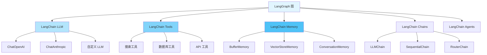

# LangGraph 与 LangChain 集成

## 一、集成架构



## 二、集成 LLM

### 2.1 基础 LLM 集成

```python
from langchain_openai import ChatOpenAI
from langchain_core.messages import HumanMessage, AIMessage, SystemMessage
from typing import TypedDict, Annotated
import operator
from langgraph.graph import StateGraph, END

class ChatState(TypedDict):
    messages: Annotated[list, operator.add]
    llm_response: str

def create_llm_graph():
    """集成 LangChain LLM 的图"""
    # 初始化 LLM
    llm = ChatOpenAI(model="gpt-4", temperature=0.7)

    def chat_node(state: ChatState) -> dict:
        """使用 LangChain LLM 的节点"""
        # 调用 LLM
        response = llm.invoke(state["messages"])

        return {
            "messages": [AIMessage(content=response.content)],
            "llm_response": response.content
        }

    graph = StateGraph(ChatState)
    graph.add_node("chat", chat_node)
    graph.set_entry_point("chat")
    graph.add_edge("chat", END)

    return graph.compile()

# 使用示例
def test_llm_integration():
    """测试 LLM 集成"""
    app = create_llm_graph()

    result = app.invoke({
        "messages": [
            SystemMessage(content="你是一个有帮助的助手"),
            HumanMessage(content="什么是 LangGraph?")
        ],
        "llm_response": ""
    })

    print(f"LLM 回复: {result['llm_response']}")
```

### 2.2 多 LLM 协作

```python
from langchain_openai import ChatOpenAI
from langchain_anthropic import ChatAnthropic
from typing import TypedDict

class MultiLLMState(TypedDict):
    query: str
    gpt_response: str
    claude_response: str
    final_answer: str

def create_multi_llm_graph():
    """多个 LLM 协作的图"""
    gpt = ChatOpenAI(model="gpt-4")
    claude = ChatAnthropic(model="claude-3-sonnet-20240229")

    def gpt_node(state: MultiLLMState) -> dict:
        """GPT 节点"""
        response = gpt.invoke(state["query"])
        return {"gpt_response": response.content}

    def claude_node(state: MultiLLMState) -> dict:
        """Claude 节点"""
        response = claude.invoke(state["query"])
        return {"claude_response": response.content}

    def synthesize_node(state: MultiLLMState) -> dict:
        """综合两个 LLM 的回答"""
        synthesis_prompt = f"""
        对于问题: {state['query']}

        GPT-4 的回答: {state['gpt_response']}
        Claude 的回答: {state['claude_response']}

        请综合这两个回答,给出最佳答案。
        """

        final_response = gpt.invoke(synthesis_prompt)
        return {"final_answer": final_response.content}

    graph = StateGraph(MultiLLMState)
    graph.add_node("gpt", gpt_node)
    graph.add_node("claude", claude_node)
    graph.add_node("synthesize", synthesize_node)

    # GPT 和 Claude 并行执行
    graph.set_entry_point("gpt")
    graph.set_entry_point("claude")

    graph.add_edge("gpt", "synthesize")
    graph.add_edge("claude", "synthesize")
    graph.add_edge("synthesize", END)

    return graph.compile()
```

## 三、集成 Tools

### 3.1 基础工具集成

```python
from langchain_community.tools import DuckDuckGoSearchRun
from langchain_community.utilities import WikipediaAPIWrapper
from langchain_core.tools import tool
from typing import TypedDict

class ToolState(TypedDict):
    query: str
    search_results: str
    wiki_results: str
    final_answer: str

@tool
def custom_calculator(expression: str) -> str:
    """计算数学表达式"""
    try:
        result = eval(expression)
        return f"计算结果: {result}"
    except Exception as e:
        return f"计算错误: {str(e)}"

def create_tool_graph():
    """集成工具的图"""
    # LangChain 工具
    search = DuckDuckGoSearchRun()
    wikipedia = WikipediaAPIWrapper()

    def search_node(state: ToolState) -> dict:
        """搜索节点"""
        results = search.run(state["query"])
        return {"search_results": results}

    def wiki_node(state: ToolState) -> dict:
        """维基百科节点"""
        results = wikipedia.run(state["query"])
        return {"wiki_results": results}

    def synthesize_node(state: ToolState) -> dict:
        """综合工具结果"""
        answer = f"""
        基于搜索结果和维基百科:

        搜索: {state['search_results'][:200]}...
        维基: {state['wiki_results'][:200]}...

        综合答案: [这里应该用 LLM 生成综合答案]
        """
        return {"final_answer": answer}

    graph = StateGraph(ToolState)
    graph.add_node("search", search_node)
    graph.add_node("wiki", wiki_node)
    graph.add_node("synthesize", synthesize_node)

    # 并行执行工具
    graph.set_entry_point("search")
    graph.set_entry_point("wiki")

    graph.add_edge("search", "synthesize")
    graph.add_edge("wiki", "synthesize")
    graph.add_edge("synthesize", END)

    return graph.compile()
```

### 3.2 动态工具调用

```python
from langchain_core.tools import BaseTool
from typing import TypedDict, List

class ToolCallState(TypedDict):
    query: str
    available_tools: List[str]
    selected_tool: str
    tool_result: str

# 定义多个工具
@tool
def weather_tool(location: str) -> str:
    """获取天气信息"""
    return f"{location} 的天气: 晴天 25°C"

@tool
def news_tool(topic: str) -> str:
    """获取新闻"""
    return f"关于 {topic} 的新闻: ..."

@tool
def stock_tool(symbol: str) -> str:
    """获取股票信息"""
    return f"{symbol} 股票价格: $100"

def create_dynamic_tool_graph():
    """动态工具调用图"""
    llm = ChatOpenAI(model="gpt-4")

    # 工具映射
    tools = {
        "weather": weather_tool,
        "news": news_tool,
        "stock": stock_tool
    }

    def select_tool(state: ToolCallState) -> dict:
        """LLM 选择合适的工具"""
        prompt = f"""
        对于查询: {state['query']}
        可用工具: {', '.join(state['available_tools'])}

        选择最合适的工具名称（只返回工具名）。
        """

        response = llm.invoke(prompt)
        return {"selected_tool": response.content.strip()}

    def execute_tool(state: ToolCallState) -> dict:
        """执行选定的工具"""
        tool = tools.get(state["selected_tool"])

        if tool:
            # 从查询中提取参数（简化示例）
            result = tool.invoke(state["query"])
        else:
            result = "未找到合适的工具"

        return {"tool_result": result}

    graph = StateGraph(ToolCallState)
    graph.add_node("select", select_tool)
    graph.add_node("execute", execute_tool)

    graph.set_entry_point("select")
    graph.add_edge("select", "execute")
    graph.add_edge("execute", END)

    return graph.compile()
```

## 四、集成 Memory

### 4.1 对话记忆

```python
from langchain.memory import ConversationBufferMemory
from langchain_core.messages import HumanMessage, AIMessage
from typing import TypedDict, Annotated
import operator

class MemoryState(TypedDict):
    messages: Annotated[list, operator.add]
    memory_summary: str

def create_memory_graph():
    """集成记忆的图"""
    llm = ChatOpenAI(model="gpt-4")
    memory = ConversationBufferMemory(return_messages=True)

    def chat_with_memory(state: MemoryState) -> dict:
        """带记忆的聊天"""
        # 从状态获取消息
        current_messages = state["messages"]

        # 保存到记忆
        if len(current_messages) > 0:
            last_message = current_messages[-1]
            if isinstance(last_message, HumanMessage):
                memory.chat_memory.add_user_message(last_message.content)

        # 获取记忆上下文
        memory_context = memory.load_memory_variables({})
        history = memory_context.get("history", [])

        # 调用 LLM（包含历史）
        all_messages = history + current_messages
        response = llm.invoke(all_messages)

        # 保存 AI 回复到记忆
        memory.chat_memory.add_ai_message(response.content)

        return {
            "messages": [AIMessage(content=response.content)],
            "memory_summary": f"对话轮次: {len(memory.chat_memory.messages)}"
        }

    graph = StateGraph(MemoryState)
    graph.add_node("chat", chat_with_memory)
    graph.set_entry_point("chat")
    graph.add_edge("chat", END)

    return graph.compile()

# 测试多轮对话
def test_memory():
    """测试记忆功能"""
    app = create_memory_graph()

    # 第一轮
    result1 = app.invoke({
        "messages": [HumanMessage(content="我叫张三")],
        "memory_summary": ""
    })
    print(f"回复1: {result1['messages'][-1].content}")

    # 第二轮（LLM 应该记得名字）
    result2 = app.invoke({
        "messages": [HumanMessage(content="我叫什么名字?")],
        "memory_summary": ""
    })
    print(f"回复2: {result2['messages'][-1].content}")
```

### 4.2 向量记忆

```python
from langchain_community.vectorstores import FAISS
from langchain_openai import OpenAIEmbeddings
from langchain.memory import VectorStoreRetrieverMemory
from typing import TypedDict

class VectorMemoryState(TypedDict):
    query: str
    relevant_history: str
    response: str

def create_vector_memory_graph():
    """使用向量记忆的图"""
    # 创建向量存储
    embeddings = OpenAIEmbeddings()
    vectorstore = FAISS.from_texts(
        ["初始化向量存储"],
        embedding=embeddings
    )

    # 创建记忆
    retriever = vectorstore.as_retriever(search_kwargs={"k": 3})
    memory = VectorStoreRetrieverMemory(retriever=retriever)

    llm = ChatOpenAI(model="gpt-4")

    def query_with_vector_memory(state: VectorMemoryState) -> dict:
        """带向量记忆的查询"""
        # 检索相关历史
        relevant = memory.load_memory_variables(
            {"query": state["query"]}
        )

        # 构建提示
        prompt = f"""
        相关历史记录:
        {relevant.get('history', '无')}

        当前问题: {state['query']}

        请回答问题。
        """

        response = llm.invoke(prompt)

        # 保存到记忆
        memory.save_context(
            {"input": state["query"]},
            {"output": response.content}
        )

        return {
            "relevant_history": str(relevant),
            "response": response.content
        }

    graph = StateGraph(VectorMemoryState)
    graph.add_node("query", query_with_vector_memory)
    graph.set_entry_point("query")
    graph.add_edge("query", END)

    return graph.compile()
```

## 五、集成 Chains

### 5.1 LLMChain 集成

```python
from langchain.chains import LLMChain
from langchain.prompts import PromptTemplate
from typing import TypedDict

class ChainState(TypedDict):
    topic: str
    outline: str
    content: str

def create_chain_graph():
    """集成 LangChain Chain 的图"""
    llm = ChatOpenAI(model="gpt-4")

    # 创建 Chain
    outline_prompt = PromptTemplate(
        input_variables=["topic"],
        template="为主题 '{topic}' 创建一个文章大纲。"
    )
    outline_chain = LLMChain(llm=llm, prompt=outline_prompt)

    content_prompt = PromptTemplate(
        input_variables=["topic", "outline"],
        template="""
        主题: {topic}
        大纲: {outline}

        根据以上大纲,写一篇详细的文章。
        """
    )
    content_chain = LLMChain(llm=llm, prompt=content_prompt)

    def outline_node(state: ChainState) -> dict:
        """生成大纲"""
        outline = outline_chain.run(topic=state["topic"])
        return {"outline": outline}

    def content_node(state: ChainState) -> dict:
        """生成内容"""
        content = content_chain.run(
            topic=state["topic"],
            outline=state["outline"]
        )
        return {"content": content}

    graph = StateGraph(ChainState)
    graph.add_node("outline", outline_node)
    graph.add_node("content", content_node)

    graph.set_entry_point("outline")
    graph.add_edge("outline", "content")
    graph.add_edge("content", END)

    return graph.compile()
```

### 5.2 SequentialChain 集成

```python
from langchain.chains import SequentialChain
from typing import TypedDict

class SequentialState(TypedDict):
    input: str
    output: str

def create_sequential_chain_graph():
    """集成 SequentialChain"""
    llm = ChatOpenAI(model="gpt-4")

    # 第一个 chain
    chain1 = LLMChain(
        llm=llm,
        prompt=PromptTemplate(
            input_variables=["text"],
            template="总结以下文本: {text}"
        ),
        output_key="summary"
    )

    # 第二个 chain
    chain2 = LLMChain(
        llm=llm,
        prompt=PromptTemplate(
            input_variables=["summary"],
            template="将以下摘要翻译成英文: {summary}"
        ),
        output_key="translation"
    )

    # 组合成 SequentialChain
    sequential_chain = SequentialChain(
        chains=[chain1, chain2],
        input_variables=["text"],
        output_variables=["translation"]
    )

    def process_node(state: SequentialState) -> dict:
        """使用 Sequential Chain 处理"""
        result = sequential_chain({"text": state["input"]})
        return {"output": result["translation"]}

    graph = StateGraph(SequentialState)
    graph.add_node("process", process_node)
    graph.set_entry_point("process")
    graph.add_edge("process", END)

    return graph.compile()
```

## 六、集成 Agents

### 6.1 ReAct Agent 集成

```python
from langchain.agents import create_react_agent, AgentExecutor
from langchain.prompts import PromptTemplate
from langchain.tools import Tool
from typing import TypedDict

class AgentState(TypedDict):
    task: str
    agent_output: str

def create_agent_graph():
    """集成 LangChain Agent"""
    llm = ChatOpenAI(model="gpt-4", temperature=0)

    # 定义工具
    tools = [
        Tool(
            name="Calculator",
            func=lambda x: str(eval(x)),
            description="用于数学计算"
        ),
        Tool(
            name="Search",
            func=lambda x: f"搜索结果: {x}",
            description="用于搜索信息"
        )
    ]

    # 创建 agent
    prompt = PromptTemplate.from_template("""
    回答以下问题,你可以使用这些工具:

    {tools}

    使用以下格式:

    Question: 需要回答的问题
    Thought: 思考该做什么
    Action: 要采取的行动,应该是 [{tool_names}] 中的一个
    Action Input: 行动的输入
    Observation: 行动的结果
    ... (这个 Thought/Action/Action Input/Observation 可以重复 N 次)
    Thought: 我现在知道最终答案了
    Final Answer: 原始问题的最终答案

    开始!

    Question: {input}
    Thought: {agent_scratchpad}
    """)

    agent = create_react_agent(llm, tools, prompt)
    agent_executor = AgentExecutor(
        agent=agent,
        tools=tools,
        verbose=True,
        max_iterations=3
    )

    def agent_node(state: AgentState) -> dict:
        """Agent 节点"""
        result = agent_executor.invoke({"input": state["task"]})
        return {"agent_output": result["output"]}

    graph = StateGraph(AgentState)
    graph.add_node("agent", agent_node)
    graph.set_entry_point("agent")
    graph.add_edge("agent", END)

    return graph.compile()

# 测试 Agent
def test_agent():
    """测试 Agent 集成"""
    app = create_agent_graph()

    result = app.invoke({
        "task": "计算 25 * 4 然后搜索这个数字的含义",
        "agent_output": ""
    })

    print(f"Agent 输出: {result['agent_output']}")
```

## 七、完整集成示例

### RAG 系统

```python
from langchain_community.document_loaders import TextLoader
from langchain.text_splitter import RecursiveCharacterTextSplitter
from langchain_community.vectorstores import FAISS
from langchain_openai import OpenAIEmbeddings
from typing import TypedDict, Annotated
import operator

class RAGState(TypedDict):
    query: str
    documents: Annotated[list, operator.add]
    context: str
    answer: str

def create_rag_graph():
    """完整的 RAG 系统"""
    # 初始化组件
    embeddings = OpenAIEmbeddings()
    llm = ChatOpenAI(model="gpt-4")

    # 假设已经有向量存储
    # vectorstore = FAISS.load_local("./vectorstore")

    def retrieve_node(state: RAGState) -> dict:
        """检索文档"""
        # vectorstore.similarity_search(state["query"], k=3)
        # 模拟检索
        docs = [
            {"content": "文档1内容", "score": 0.9},
            {"content": "文档2内容", "score": 0.8},
        ]
        return {"documents": docs}

    def rerank_node(state: RAGState) -> dict:
        """重排序文档"""
        # 使用 LLM 重排序
        sorted_docs = sorted(
            state["documents"],
            key=lambda x: x["score"],
            reverse=True
        )
        return {"documents": sorted_docs[:3]}

    def generate_node(state: RAGState) -> dict:
        """生成答案"""
        # 构建上下文
        context = "\n\n".join([
            doc["content"] for doc in state["documents"]
        ])

        prompt = f"""
        基于以下上下文回答问题:

        上下文:
        {context}

        问题: {state["query"]}

        答案:
        """

        response = llm.invoke(prompt)
        return {
            "context": context,
            "answer": response.content
        }

    graph = StateGraph(RAGState)
    graph.add_node("retrieve", retrieve_node)
    graph.add_node("rerank", rerank_node)
    graph.add_node("generate", generate_node)

    graph.set_entry_point("retrieve")
    graph.add_edge("retrieve", "rerank")
    graph.add_edge("rerank", "generate")
    graph.add_edge("generate", END)

    return graph.compile()
```

## 八、最佳实践

### 8.1 集成清单

- ✅ 选择合适的 LangChain 组件
- ✅ 正确处理状态传递
- ✅ 注意异常处理
- ✅ 合理使用缓存
- ✅ 监控 API 调用
- ✅ 控制成本

### 8.2 常见问题

**Q: 如何处理 LangChain 和 LangGraph 的状态差异?**
A: 在节点中进行状态转换,明确输入输出格式。

**Q: 如何优化 LLM 调用成本?**
A: 使用缓存、批处理、选择合适的模型。

**Q: 如何调试集成问题?**
A: 启用 verbose 模式、添加日志、使用 LangSmith。

---

**下一步:** 学习 [12.多智能体系统](./12.多智能体系统.md) 构建协作系统！
