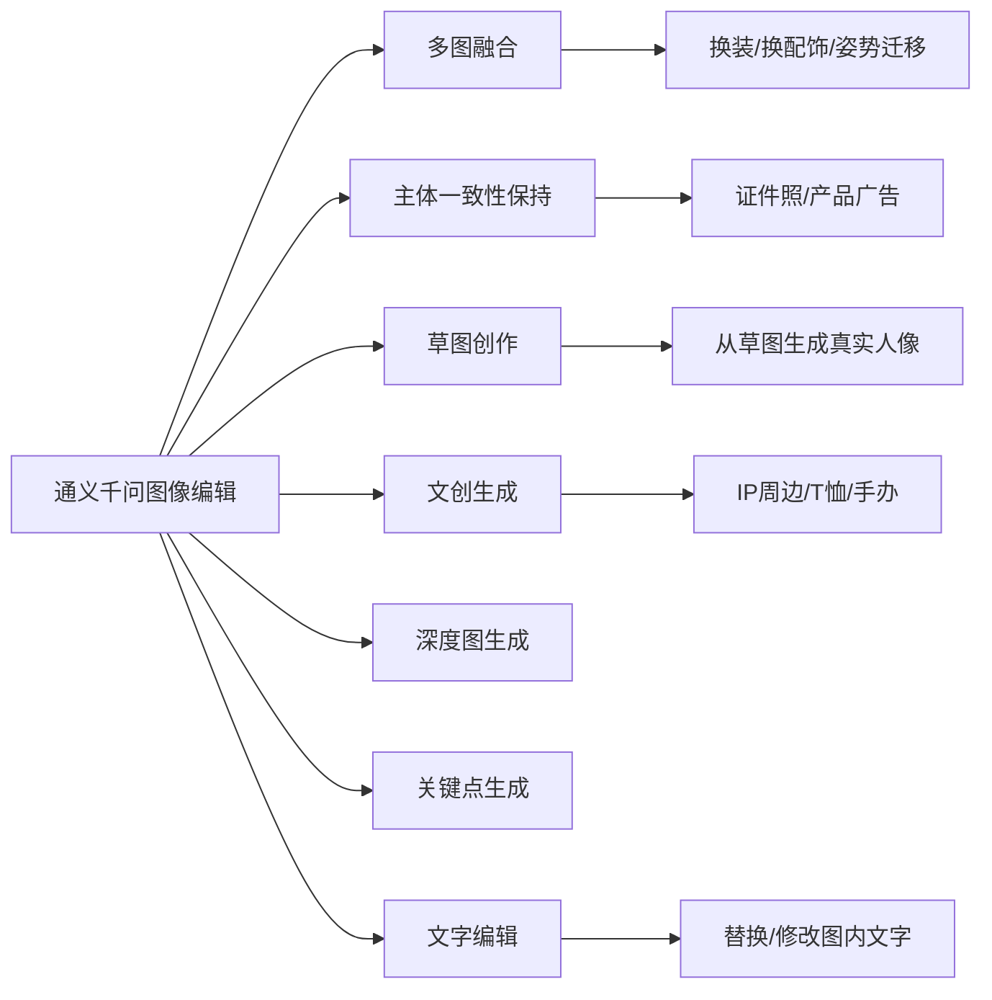

# 通义千问图像编辑模型 (Qwen-Image-Edit)

## 一、模型概述

**通义千问-图像编辑模型（Qwen-Image-Edit-Plus）** 是阿里云百炼平台提供的AI图像编辑模型，具备以下核心能力：

- 多图输入和多图输出
- 精确修改图内文字
- 增删或移动物体
- 改变主体动作
- 迁移图片风格
- 增强画面细节

## 二、模型版本

| 模型名称 | 特点 |
|---------|------|
| `qwen-image-edit-plus` | 推荐，支持输出1-6张图片 |
| `qwen-image-edit-plus-2025-12-15` | 角色一致性、工业设计和几何推理能力更强 |
| `qwen-image-edit-plus-2025-10-30` | 与plus版能力相同 |
| `qwen-image-edit` | 仅支持输出1张图片 |

## 三、使用前准备

1. **获取API Key** 并配置到环境变量
2. **安装SDK**：支持 Python 和 Java

```bash
# Python SDK 安装
pip install dashscope

# 配置环境变量
export DASHSCOPE_API_KEY="your-api-key"
```

## 四、输入要求

| 项目 | 要求 |
|------|------|
| 图片数量 | 1-3张 |
| 图片格式 | JPG、JPEG、PNG、BMP、TIFF、WEBP、GIF |
| 建议分辨率 | 384-3072像素 |
| 文件大小 | 单张不超过10MB |
| 传入方式 | 公网URL 或 Base64编码 |

## 五、主要参数

| 参数 | 说明 |
|------|------|
| `n` | 输出图像数量（plus系列支持1-6张） |
| `negative_prompt` | 反向提示词，描述不希望出现的内容 |
| `watermark` | 是否添加水印，默认false |
| `seed` | 随机数种子，范围[0, 2147483647] |
| `size` | 输出分辨率，格式"宽*高"，仅n=1时可用 |
| `prompt_extend` | 是否开启提示词智能改写，默认开启 |

## 六、应用场景



### 场景详解

1. **多图融合**：将多张图片的元素融合到一张图中，如将人物、服装、姿势分别来自不同图片
2. **主体一致性保持**：保持人物或产品主体不变，更换背景、服装、场景等
3. **草图创作**：根据手绘草图生成真实风格的图像
4. **文创生成**：将IP形象应用到T恤、手办、包装等产品上
5. **深度图生成**：根据深度图生成符合空间结构的图像
6. **关键点生成**：根据人体姿态关键点生成对应姿势的人物图像
7. **文字编辑**：修改、替换图片中的文字内容或字体样式

## 示例代码

### cURL 示例

```bash
curl -X POST "https://dashscope.aliyuncs.com/api/v1/services/aigc/multimodal-generation/generation" \
  -H "Authorization: Bearer $DASHSCOPE_API_KEY" \
  -H "Content-Type: application/json" \
  -d '{
    "model": "qwen-image-edit-plus",
    "input": {
      "messages": [
        {
          "role": "user",
          "content": [
            {"image": "https://example.com/image1.png"},
            {"text": "将图片中的背景替换为海边"}
          ]
        }
      ]
    },
    "parameters": {
      "n": 1,
      "watermark": false
    }
  }'
```

## 八、输入格式说明

### messages 结构

`messages` 是一个数组，必须仅包含一个对象，该对象包含 `role` 和 `content` 属性：

- `role`：必须设置为 `user`
- `content`：需要同时包含 `image`（1-3张图像）和 `text`（一条编辑指令）

```json
{
  "messages": [
    {
      "role": "user",
      "content": [
        { "image": "图1的公网URL或Base64数据" },
        { "image": "图2的公网URL或Base64数据" },
        { "image": "图3的公网URL或Base64数据" },
        { "text": "您的编辑指令，例如：'图1中的女生穿着图2中的黑色裙子按图3的姿势坐下'" }
      ]
    }
  ]
}
```

### 图像输入顺序

多图输入时，按照数组顺序定义图像顺序，编辑指令需要与 `content` 中的图像顺序对应（如"图1"、"图2"），否则编辑效果会不符合预期。

### 图像传入方式

1. **公网URL**：提供一个公网可访问的图像地址，支持 HTTP 或 HTTPS 协议
   - 示例：`https://example.com/img.png`

2. **Base64编码**：将图像文件转换为 Base64 编码字符串
   - 格式：`data:{mime_type};base64,{base64_data}`
   - 示例：`data:image/jpeg;base64,GDU7MtCZz...`

## 九、注意事项

::: warning 重要提示
- 生成的图像URL链接**有效期为24小时**，需及时下载保存
- 多图输入时，编辑指令需与图像顺序对应（如"图1"、"图2"）
- `size` 参数仅在输出数量 n=1 时可用，否则会报错
- GIF动图仅处理其第一帧
:::

## 十、相关链接

- [阿里云百炼平台](https://bailian.console.aliyun.com/)
- [获取API Key](https://help.aliyun.com/zh/model-studio/get-api-key)
- [安装DashScope SDK](https://help.aliyun.com/zh/model-studio/install-sdk)
- [通义千问-图像编辑API文档](https://help.aliyun.com/zh/model-studio/qwen-image-edit-api)
- [模型列表](https://help.aliyun.com/zh/model-studio/models)
