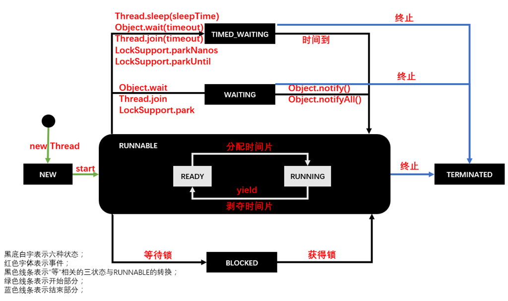

在操作系统中，一个应用程序包含了一个或多个进程，而单个进程中包含了多个线程，线程是 CPU 调度和分派的基本单位。在 Java 中，多线程可以充分利用 CPU 的多核资源，提高程序的运行效率。

线程自己基本上不拥有系统资源，只拥有一点在运行中必不可少的资源，如程序计数器、一组寄存器和栈等。但它可与同属一个进程的其他线程共享进程所拥有的全部资源。

多线程程序的并发性高，因为线程的划分尺度小于进程。进程在执行过程中拥有独立的内存单元，而多个线程共享内存，从而极大地提高了程序的运行效率。

例如，在一个 Java 多线程程序中，可以同时执行多个任务，如文件读写、网络通信和数据处理等。这样可以充分利用 CPU 的多核资源，提高程序的响应速度和吞吐量。

## 优势

### 提高程序响应速度

在许多应用场景中，多线程可以显著提高程序的响应速度。例如，在图形用户界面（GUI）应用程序中，一个线程可以负责处理用户输入和界面更新，而另一个线程可以在后台执行耗时的计算任务。这样，即使计算任务正在进行，用户界面也能保持响应，不会出现卡顿或冻结的情况。

### 优化资源利用

Java 线程可以将处理器时间让给其他任务，从而提高资源利用率。例如，在一个服务器应用程序中，可以使用多个线程来同时处理多个客户端请求。当一个线程在等待 I/O 操作完成时，其他线程可以继续执行，充分利用处理器的空闲时间。

### 随时停止任务

Java 线程提供了方便的机制来控制任务的执行状态，可以随时停止正在运行的任务。例如，可以通过设置一个标志变量来通知线程停止执行。当线程在执行任务时，定期检查这个标志变量，如果标志变量被设置为停止状态，线程就可以安全地停止执行。

另外，Java 还提供了中断机制，可以通过调用线程的interrupt方法来请求线程停止执行。线程可以在适当的时候响应中断请求，并进行清理工作。这种机制在需要及时停止任务的场景中非常有用，例如在用户取消操作或系统出现错误时。

### 设置优先级优化性能

Java 线程可以设置优先级，以优化性能。线程的优先级决定了它在竞争处理器时间时的相对重要性。高优先级的线程更有可能被调度执行，而低优先级的线程则可能被延迟执行。

例如，在一个实时系统中，可以将处理关键任务的线程设置为高优先级，以确保它们能够及时执行。而对于一些不太重要的任务，可以设置为低优先级，以避免它们占用过多的处理器时间。

需要注意的是， **线程的优先级只是一种提示，不能保证高优先级的线程一定会先于低优先级的线程执行**。实际的执行顺序还受到操作系统的调度策略和其他因素的影响。

在实际应用中，可以根据任务的重要性和紧急程度来设置线程的优先级。例如，在一个视频播放应用程序中，可以将视频解码线程设置为高优先级，以确保视频能够流畅播放。而对于一些后台任务，如日志记录或统计分析，可以设置为低优先级，以避免它们影响用户体验。

## 缺点

### 共享资源导致程序变慢

当多个线程同时访问共享资源时，可能会导致竞争和等待，从而使程序的运行速度变慢。例如，多个线程同时对一个共享的数据库连接进行读写操作时，可能会因为锁的竞争而导致等待时间增加。这种独占性的资源，如打印机等，在多线程环境下可能会成为性能瓶颈。

### 增加管理开销

对线程进行管理确实要求额外的 CPU 开销，带来上下文切换的负担。线程的创建、销毁和切换都需要消耗一定的系统资源。当线程数量较多时，这种开销会变得更加明显。例如，在一个拥有大量线程的服务器应用中，线程的上下文切换可能会占用大量的 CPU 时间，从而降低系统的整体性能。

### 可能出现死锁

长时间等待资源竞争可能会导致死锁等多线程症状。当两个或多个线程相互等待对方释放资源时，就会发生死锁。例如，线程 A 持有资源 X，等待资源 Y，而线程 B 持有资源 Y，等待资源 X，这时就会发生死锁。死锁会导致程序无法继续执行，严重影响系统的稳定性和可靠性。为了避免死锁，需要仔细设计线程之间的资源访问顺序和同步机制。

### 对公有变量读写易出错

多个线程对公有变量的同时读或写可能导致数据错误。当多个线程需要对公有变量进行写操作时，后一个线程往往会修改掉前一个线程存放的数据，从而使前一个线程的参数被修改。另外，当公用变量的读写操作是非原子性时，在不同的机器上，中断时间的不确定性，会导致数据在一个线程内的操作产生错误，从而产生莫名其妙的错误，而这种错误是程序员无法预知的。为了解决这个问题，可以使用同步机制，如synchronized关键字或ReentrantLock等，来确保对公有变量的安全访问。

## 线程状态




### NEW状态

尚未启动的线程处于此状态。当新建一个线程对象时，此时线程是属于这个状态的。

### RUNNABLE状态

在 Java 虚拟机中执行的线程处于此状态。表示该线程准备就绪，可以分配 CPU 运行。但具体什么时候运行，取决于操作系统的调度。

JVM 中的RUNNABLE状态和 CPU 中的状态并不一样。因为现代 CPU 一般使用时间分片方式进行线程的调度，所以每个线程在 CPU 中执行的时间会很短，真正 CPU 中的线程状态会经常在ready、running、waiting中切换。

### BLOCKED状态

被阻塞等待监视器锁定的线程处于此状态。当线程进入一个被synchronized修饰的方法或者代码块时，如果当前已经有其他线程进入了，那么该线程就会进入BLOCKED状态，直到其他线程释放锁。

### WAITING状态

正在等待另一个线程执行特定动作的线程处于此状态。当线程调用Object.wait()、Thread.join()、LockSupport.park()等方法时，会进入等待状态。

一个线程调用wait()方法后，需要别的线程调用notify()方法将其唤醒；一个线程调用Thread.join()方法后需等待特定线程终止。

### TIMED_WAITING状态

正在等待另一个线程执行动作达到指定等待时间的线程处于此状态。当调用Thread.sleep(time)、Object.wait(time)、Thread.join(time)、LockSupport.parkNanos(time)、LockSupport.parkUntil(time)等方法时，会进入这个状态。

### TERMINATED状态

已退出的线程处于此状态。当线程抛出异常或者执行结束进入此状态。

可以通过getState()方法查看线程的状态。

## Thread 的创建方式

### 继承 Thread 类

通过继承Thread类来创建线程是一种较为直观的方式。在子类中重写run方法，在这个方法中定义线程要执行的任务。

```java
public class LogFileCleanupThread extends Thread {

    @Override
    public void run() {
        //日志文件清理逻辑
    }
}
```

这种方式的优点在于可以直接在run方法内通过this获取当前线程对象，方便进行一些操作。同时，可以在子类中添加成员变量来接收外部参数，灵活性较高。然而，它也存在一些缺点。由于 Java 不支持多继承，一旦继承了Thread类，就不能再继承其他类，这在某些情况下会限制代码的扩展性。另外，任务结束后不能返回结果，这在一些需要获取线程执行结果的场景下不太方便。

### 实现 Runnable 接口

实现Runnable接口也是创建线程的一种常见方式。首先定义一个实现Runnable接口的类，并重写run方法来定义线程的任务。

```java
public class BusinessLogCleanupThread implements Runnable{

    @Override
    public void run() {
        //数据库日志清理操作
    }
}
```

这种方式的优点是多个线程可以共享同一个target对象，非常适合多个线程处理同一份资源的情况。如果需要访问当前线程，必须使用Thread.currentThread()方法。缺点是任务没有返回值，并且不支持直接向线程传递参数，只能使用主线程里面被声明为final的变量。

### 实现 Callable 接口

Callable接口允许任务有返回值，并且可以抛出异常。

```java
public class BankStatementThread implements Callable<String> {

    @Override
    public String call() throws Exception {
        //银行对账单拉取逻辑
        return "";
    }
}

public class BankStatementThreadTest {

    public static void main(String[] args) throws ExecutionException, InterruptedException {
        BankStatementThread bankStatementThread = new BankStatementThread();
        FutureTask futureTask = new FutureTask(bankStatementThread);
        Thread thread = new Thread(futureTask);
        thread.setName("银行对账单处理线程");
        thread.start();
        System.out.println(futureTask.get());
    }
}
```

这种方式虽然可以获取任务的返回结果，但创建过程相对复杂。首先需要创建Callable接口的实现类，然后用FutureTask包装这个实现类，再将FutureTask对象作为参数传递给Thread的构造方法。而且，这种方式也不支持直接向线程传递参数。

### 使用 lambda 表达式

Lambda 表达式是一种简洁的创建线程方式，可以替代Runnable接口。

```java
public class LambdaThread {

    public static void main(String[] args) {
        Thread thread = new Thread(() -> {
            System.out.println("lambda thread");
        });
        thread.start();
    }
}
```

Lambda 表达式的好处在于可以简化代码，避免了创建匿名内部类的繁琐过程。它利用函数式接口，将原先需要实现Runnable接口重写run方法的部分，简化为更加简洁的形式。这使得代码更加易读和易于维护。

## 常用方法

### start() 方法

start()方法的作用就是将线程由创建状态变为就绪状态。当线程创建成功时，线程处于创建状态，只有调用start()方法后，线程才会进入就绪状态，等待被 CPU 调度执行。

**一个线程只能调用start()方法一次，多次启动一个线程是非法的**。特别是当线程已经结束执行后，不能再重新启动。

### run()方法

run()方法是一个普通方法，当线程调用了start()方法后，一旦线程被 CPU 调度，处于运行状态，那么线程才会去调用这个run()方法。

run()方法可以多次调用，但如果直接调用run()的话，会在当前线程中执行run()，而并不会启动新的线程。

### sleep()方法

Thread.sleep(long millis)是Thread类的一个静态方法，使当前线程休眠，进入阻塞状态（暂停执行）。如果线程在睡眠状态被中断，将会抛出InterruptedException中断异常。

主要方法有sleep(long millis)，线程睡眠millis毫秒；sleep(long millis, int nanos)，线程睡眠millis毫秒 + nanos纳秒。

注意在哪个线程里面调用sleep()方法就阻塞哪个线程。

```java
public class SleepDemo {
    public static void main(String[] args) throws InterruptedException {
        Process process = new Process();
        Thread thread = new Thread(process);
        thread.setName("线程Process");
        thread.start();
        for (int i = 0; i < 10; i++) {
            System.out.println(Thread.currentThread().getName() + "-->" + i);
            // 阻塞 main 线程，休眠一秒钟
            Thread.sleep(1000);
        }
    }
}
class Process implements Runnable {
    @Override
    public void run() {
        for (int i = 0; i < 10; i++) {
            System.out.println(Thread.currentThread().getName() + "-->" + i);
            // 休眠一秒钟
            try {
                Thread.sleep(1000);
            } catch (InterruptedException e) {
                e.printStackTrace();
            }
        }
    }
}
```

### wait()方法

调用wait()方法后，线程会进入等待状态，释放持有的锁，直到其他线程调用notify()或notifyAll()方法唤醒它。

wait()方法必须在同步代码块或同步方法中调用，并且调用者必须是同步代码块或同步方法中的同步监视器，否则会抛出异常。

wait()方法与notify()和notifyAll()方法都是定义在java.lang.Object类中。

### interrupt() 方法

interrupt() 方法用于中断线程。当一个线程被中断时，它的中断状态会被设置为 true。这个方法不会立即停止线程，而是提供一个合作机制，让线程能够响应中断。

被中断的线程可以通过检查 `isInterrupted()` 方法或者调用 `interrupted()` 方法来检测中断状态。如果线程正在执行阻塞操作（如 `Thread.sleep()`、`Object.wait()`、`BlockingQueue.put()` 等），当线程的中断状态为 `true` 时，这些操作会抛出 `InterruptedException`，从而允许线程响应中断。

`isInterrupted()` 方法不会改变中断状态，而 `interrupted()` 方法在检查中断状态后会清除它。这意味着，如果多次调用 `interrupted()`，只有第一次会返回 `true`，后续调用都会返回 `false`。

通常，当一个线程检测到中断后，它会执行一些清理工作，然后通过调用 `Thread.stop()` 方法（已废弃，不推荐使用）或者设置一个标志位来结束执行。更安全的做法是让线程检查中断状态，并在适当的时候退出运行。

对于非用户线程（如垃圾回收线程或JVM内部线程），调用 `interrupt()` 方法可能没有任何效果，因为这些线程可能不响应中断。

### join() 方法

`join()` 方法用于等待线程终止。当一个线程A调用另一个线程B的 `join()` 方法时，线程A会阻塞直到线程B完成执行。这个方法可以用来协调线程的执行顺序，确保在主线程继续执行之前，某个特定的线程已经完成其任务。

调用 `join()` 方法的线程（我们称之为调用者线程）将会阻塞，直到被调用 `join()` 方法的线程（目标线程）执行完毕。

`join()` 方法有两个版本，一个不接受参数，另一个接受一个表示超时时间的参数（以毫秒为单位）。带有超时参数的版本允许调用者线程在指定的时间内等待目标线程终止，如果超时时间到达而目标线程尚未终止，调用者线程将解除阻塞并继续执行。目标线程必须执行完毕，调用者线程才能从 `join()` 方法返回并继续执行。

如果目标线程在执行过程中抛出了未捕获的异常，并且这个异常导致了线程的终止，那么调用者线程在调用 `join()` 方法时会抛出 `InterruptedException`。

如果线程A调用了线程B的 `join()` 方法，而线程B又调用了线程A的 `join()` 方法，这将导致死锁，因为两个线程都在等待对方先完成执行。

如果目标线程已经终止，调用 `join()` 方法将不会阻塞调用者线程，因为目标线程已经完成执行。