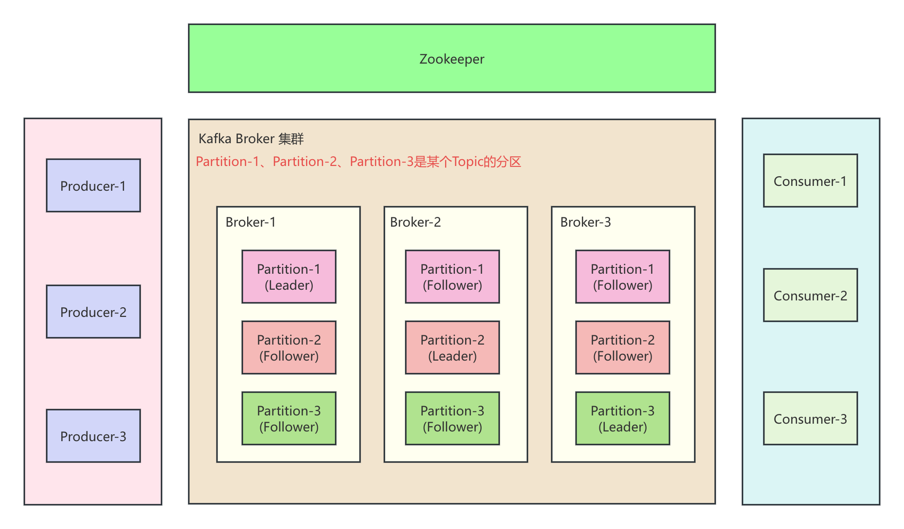

# Kafka整体介绍

## 1. 什么是Kafka
Kafka是一个分布式的流处理平台，最初由LinkedIn公司开发，后来成为Apache基金会的顶级开源项目之一。它具有高吞吐量、可持久化、可水平扩展、支持流数据处理等特性。

## 2. 核心概念

### 2.1 Producer（生产者）

生产者负责发布消息到 Kafka 主题。

- 消息生产者，负责发布消息到Kafka集群
- 支持同步和异步两种发送方式
- 选择将消息发送到特定的分区
- 可以实现自定义分区策略
- 设置不同的确认机制

### 2.2 Consumer（消费者）

消费者从 Kafka 主题订阅和消费消息：

- 消息消费者，从Kafka集群拉取消息并进行消费
- 使用Consumer Group机制实现消费者的水平扩展
- 支持自动提交和手动提交offset
- 提供多种消费策略
  
Consumer Group（消费者组）
- 多个Consumer组成的集合
- 共同消费一个或多个Topic
- 实现负载均衡和故障容错
- 每个Consumer Group中的Consumer互斥消费
- 每个Partition只能被一个Consumer Group中的一个Consumer消费

### 2.3 Topic（主题）
- 消息的逻辑分类
- 一个Topic可以有多个Partition（分区）
- 每个Partition都是一个有序的消息队列
- 支持多种复制策略
- 提供消息持久化

### 2.4 Broker（代理服务器）

- Kafka集群中的服务器节点
- 负责消息的存储和转发
- 通过ZooKeeper进行集群管理

### 2.5 Partition（分区）
- Topic物理上的分组
- 实现负载均衡和水平扩展
- 每个Partition在物理上对应一个文件夹
- 提供并行处理能力
- 保证分区内消息顺序
### 2.6 Replication（副本）
- 每个Partition的多个副本
- 实现数据冗余和容错
- 主从复制模式
- 主副本负责读写，从副本负责数据同步
### 2.7 Offset（偏移量）
- 记录消费者消费到的消息位置
- 用于消费者的恢复和继续消费
- 支持手动提交和自动提交
- 支持指定时间戳进行消费

## 3. 架构设计

### 3.1 整体架构
- 多个Producer和Consumer
- 多个Broker组成的集群
- 使用ZooKeeper进行元数据管理和集群协调

### 3.2 高可用设计
- Partition的多副本机制
- Leader和Follower的角色分配
- ISR（In-Sync Replicas）机制

### 3.3 存储机制
- 顺序写磁盘，实现高吞吐量
- 零拷贝技术，提升传输效率
- 分段存储，方便清理过期数据

## 4. 主要特性

### 4.1 高吞吐量
- 顺序读写磁盘
- 零拷贝技术
- 批量处理机制

### 4.2 可靠性保证
- 多副本机制
- ACK机制
- 幂等性和事务支持

### 4.3 扩展性
- 水平扩展能力
- 动态增减节点
- 自动负载均衡

## 5. 应用场景

### 5.1 日志收集
- 统一的日志收集平台
- 实时日志分析
- 日志存储和转发

### 5.2 消息系统
- 解耦生产者和消费者
- 削峰填谷
- 异步通信

### 5.3 流处理
- 实时数据处理
- 流式计算
- 实时监控和报警

### 5.4 事件溯源
- 状态机制
- 事件驱动架构
- 数据审计

## 6. 性能优化

### 6.1 生产者优化
- 批量发送
- 压缩机制
- 合理的分区策略

### 6.2 消费者优化
- 批量消费
- 合理的分区分配
- 并行度设置

### 6.3 Broker优化
- 合理的硬件配置
- JVM参数调优
- 操作系统参数优化

