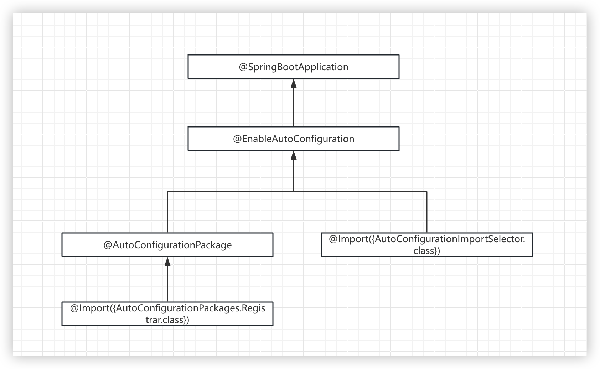

## 其他相关文章

[淘宝一面：自动装配的实现原理](https://www.cnblogs.com/javaguide/p/springboot-auto-config.html)

## 自动装配案例

### Starter 命名规范

官方的 Starter 遵循 `spring-boot-starter-*` 的命名模式，如 `spring-boot-starter-data-jpa` 。第三方的 Starter 通常以自己的项目名称开始，例如，名为 thirdpartyproject 的第三方入门项目通常被命名为 `thirdpartyproject-spring-boot-starter`。

### 创建 Starter 工程

使用 `maven-archetype-quickstart` 架手架创建一个 Maven 工程，artifactId 设置为 `zombie-spring-boot-starter`。

在 `pom.xml` 文件中引入依赖的 jar 包：

```xml
<dependencies>
    <dependency>
        <groupId>org.springframework.boot</groupId>
        <artifactId>spring-boot-autoconfigure</artifactId>
        <version>2.1.7.RELEASE</version>
    </dependency>

    <dependency>
        <groupId>org.springframework.boot</groupId>
        <artifactId>spring-boot-configuration-processor</artifactId>
        <version>2.1.7.RELEASE</version>
    </dependency>

    <dependency>
        <groupId>org.projectlombok</groupId>
        <artifactId>lombok</artifactId>
        <version>1.18.8</version>
    </dependency>
</dependencies>
```

设置以 jar 包的方式打包：

```xml
<packaging>jar</packaging>
```

### 定义服务类

定义一个服务类 `ZombieService` :

```java
public class ZombieService {

    public Zombie setZombie(String name, Integer age) {
        Zombie zombie = new Zombie();
        zombie.setName(name);
        zombie.setAge(age);
        return zombie;
    }
}
```

### 定义配置类

定义一个自动配置类，一般是以 `*AutoConfiguration` 的形式命名的。

```java
@Configuration
@ConditionalOnClass(ZombieService.class)
public class ZombieAutoConfiguration {

    @Bean
    @ConditionalOnMissingBean(ZombieService.class)
    public ZombieService zombieService() {
        return new ZombieService();
    }
}
```

常用的 Conditional 注解：

- @ConditionalOnClass：当类路径classpath下有指定的类的情况下进行自动配置
- @ConditionalOnMissingClass：当类路径下没有指定的类的条件下
- @ConditionalOnBean：当容器(Spring Context)中有指定的Bean的条件下
- @ConditionalOnMissingBean：当容器(Spring Context)中没有指定Bean的情况下进行自动配置
- @ConditionalOnProperty：当指定的属性有特定的值时
- @ConditionalOnWebApplication：根据应用是否是Web应用来决定是否应用配置
- @ConditionalOnExpression：根据 SpEL 表达式的结果来决定是否装配

这些条件注解确保自动配置类只在满足特定条件时才被加载。

### 配置 spring.factories

在 `resources/META-INF/spring.factories` 下配置自动配置类。如果没有该文件的话，需要手动创建。

```properties
org.springframework.boot.autoconfigure.EnableAutoConfiguration=com.qinghuazs.zombie.auto.ZombieAutoConfiguration
```

在 SpringBoot 3.x 版本中，去掉了 spring.factories 的支持，需要在 `src/main/resources/META-INF/spring/org.springframework.boot.autoconfigure.AutoConfiguration.imports` 文件中定义自动配置类。

```java
com.qinghuazs.zombie.auto.ZombieAutoConfiguration
```

### 打包发布

在发布之前需要在 `pom.xml` 文件中配置仓库信息

```java
<distributionManagement>
    <repository>
        <id>qinghuazs-release</id>
        <name>qinghuazs-release</name>
        <url>http://af.qinghuazs.com.cn:80/artifactory/maven-qinghuazs-release</url>
    </repository>
    <snapshotRepository>
        <id>qinghuazs-snapshot</id>
        <name>qinghuazs-snapshot</name>
        <url>http://af.qinghuazs.com.cn:80/artifactory/maven-qinghuazs-snapshot</url>
    </snapshotRepository>
</distributionManagement>
```

进行发布

```bash
mvn clean install 

mvn deploy
```

### 测试

新建测试项目，并在 `pom.xml` 中引入自定义的 Starter：

```xml
<dependency>
    <groupId>com.qinghuazs</groupId>
    <artifactId>zombie-spring-boot-starter</artifactId>
    <version>0.0.1-SNAPSHOT</version>
</dependency>
```

自建 Controller 类，并引入 Starter 中的类：

```java
@RestController
public class TestController {

    @Autowired
    private ZombieService zombieService;

    @GetMapping("/test")
    public String test() {
        return zombieService.setZombie("qinghuazs", 11).toString();
    }
}
```

使用 Postman 测试，输出结果如下：

```she
Zombie(name=qinghuazs, age=11)
```

## 自动装配原理



### @EnableAutoConfiguration注解

开启自动装配。`@EnableAutoConfiguration`会导入`AutoConfigurationImportSelector`类，该类负责处理自动配置的逻辑。

### @Import注解

在自动配置类中，`@Import`注解可以用来导入其他配置类或组件，这样可以将自动配置的逻辑分散到多个类中。

### @AutoConfigurationPackage 注解

`@AutoConfigurationPackage` 确保应用程序扫描的包中包含所有自动配置类。

### SpringFactoriesLoader

`SpringFactoriesLoader` 负责从classpath中读取`spring.factories`文件，并加载指定的自动配置类。

### @Configuration

允许在上下文中注册额外的 bean 或导入其他配置类。

自动装配的类需要在 @Configuration 注解修饰的类中进行定义。

### @Conditional注解

- @ConditionalOnClass：当类路径classpath下有指定的类的情况下进行自动配置
- @ConditionalOnMissingClass：当类路径下没有指定的类的条件下
- @ConditionalOnBean：当容器(Spring Context)中有指定的Bean的条件下
- @ConditionalOnMissingBean：当容器(Spring Context)中没有指定Bean的情况下进行自动配置
- @ConditionalOnProperty：当指定的属性有特定的值时
- @ConditionalOnWebApplication：根据应用是否是Web应用来决定是否应用配置
- @ConditionalOnExpression：根据 SpEL 表达式的结果来决定是否装配

这些条件注解确保自动配置类只在满足特定条件时才被加载。

### @AutoConfigureAfter和@AutoConfigureBefore注解

用于控制自动配置类的加载顺序。`@AutoConfigureAfter`指定某个自动配置类应该在另一个指定的自动配置类之后加载，而`@AutoConfigureBefore`则指定在之前加载。

### @AutoConfigureOrder注解

用于指定自动配置类的优先级。数值越小，优先级越高。

### AutoConfigurationImportSelector

AutoConfigurationImportSelector 是实际的自动装配实现类。

#### selectImports

先判断是否开启了自动装配，如果未开启自动装配，则直接返回空数组。如果开启了自动装配，则通过 `getAutoConfigurationEntry（）` 方法获取需要配置的 Bean 全限定名数组。

```java
public String[] selectImports(AnnotationMetadata annotationMetadata) {
    //判断是否开启了自动装配
    if (!this.isEnabled(annotationMetadata)) {
        return NO_IMPORTS;
    } 
    //获取需要被引入的自动装配信息
    AutoConfigurationEntry autoConfigurationEntry = this.getAutoConfigurationEntry(annotationMetadata);
    return StringUtils.toStringArray(autoConfigurationEntry.getConfigurations());
}

protected boolean isEnabled(AnnotationMetadata metadata) {
    return this.getClass() == AutoConfigurationImportSelector.class ? (Boolean)this.getEnvironment().getProperty("spring.boot.enableautoconfiguration", Boolean.class, true) : true;
}

protected AutoConfigurationEntry getAutoConfigurationEntry(AnnotationMetadata annotationMetadata) {
    if (!this.isEnabled(annotationMetadata)) {
        return EMPTY_ENTRY;
    } 
    //获取@EnableAutoConfiguration注解的属性，如exclude、excludeName等
    AnnotationAttributes attributes = this.getAttributes(annotationMetadata);
    //从spring.factories文件中获取配置类的全限定名数组
    List<String> configurations = this.getCandidateConfigurations(annotationMetadata, attributes);
    //去重
    configurations = this.removeDuplicates(configurations);
    //获取直接中排除掉的类 exclude或excludeName配置的
    Set<String> exclusions = this.getExclusions(annotationMetadata, attributes);
    //检查被排除类是否可以实例化，是否被自动配置所使用，否则抛出异常
    this.checkExcludedClasses(configurations, exclusions);
    //去除被排除的类
    configurations.removeAll(exclusions);
    //使用spring.factories配置文件中配置的过滤器对自动配置类进行过滤
    configurations = this.getConfigurationClassFilter().filter(configurations);
    //触发自动配置导入事件
    this.fireAutoConfigurationImportEvents(configurations, exclusions);
    return new AutoConfigurationEntry(configurations, exclusions);
}
```

`AutoConfigurationImportSelector` 允许自定义扩展，通过实现 `DeferredImportSelector` 接口，可以更方便地扩展和定制自动配置逻辑。

