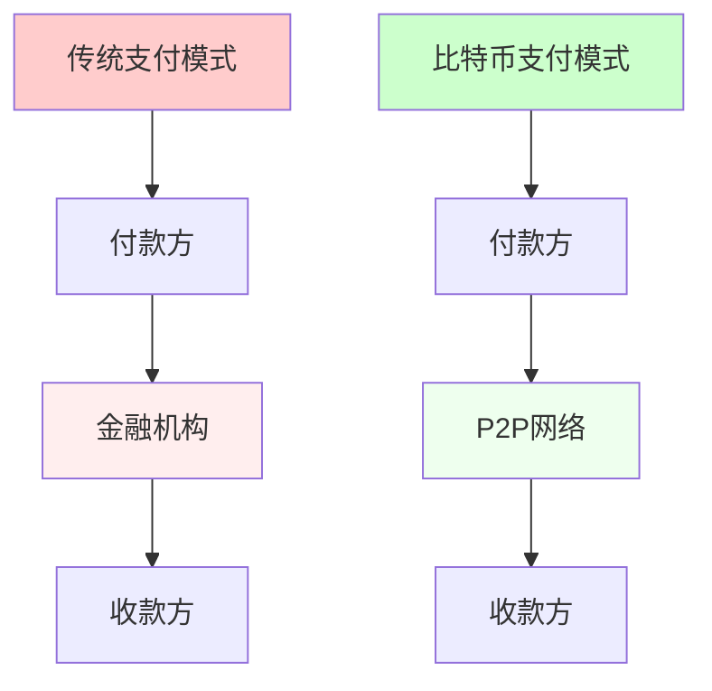

# 比特币白皮书深度解读

## 前言

2008年10月31日，一个化名为中本聪（Satoshi Nakamoto）的人或团体，在密码学邮件列表中发布了一篇题为《比特币：一种点对点的电子现金系统》的论文。这篇仅有9页的白皮书，开启了区块链技术和数字货币的新时代。

## 一、白皮书核心内容解读

### 1.1 摘要解读

**原文核心观点：**
> "A purely peer-to-peer version of electronic cash would allow online payments to be sent directly from one party to another without going through a financial institution."

**深度解析：**

白皮书开篇即提出了比特币的根本目标：创建一个无需金融机构参与的点对点支付系统。



**关键创新点：**
1. **去中介化**：移除可信第三方
2. **时间戳服务器**：证明交易顺序
3. **工作量证明**：解决双花问题
4. **最长链原则**：达成共识

### 1.2 交易（Transactions）

**白皮书设计：**

```python
# 比特币交易的数字签名链
class Transaction:
    def __init__(self):
        self.inputs = []   # 引用之前的交易输出
        self.outputs = []  # 新的输出
        
    def create_transaction(self, prev_tx_hash, prev_owner_pubkey, new_owner_pubkey, amount):
        """创建交易：将币从前一个所有者转给新所有者"""
        # 1. 引用之前的交易
        input_ref = {
            'prev_tx': prev_tx_hash,
            'prev_output_index': 0
        }
        
        # 2. 创建新输出
        output = {
            'value': amount,
            'pubkey': new_owner_pubkey
        }
        
        # 3. 前一个所有者签名
        message = self.hash_transaction_data(input_ref, output)
        signature = self.sign_with_private_key(message, prev_owner_private_key)
        
        # 4. 构建完整交易
        self.inputs.append({
            'reference': input_ref,
            'signature': signature,
            'pubkey': prev_owner_pubkey
        })
        self.outputs.append(output)
        
        return self.calculate_hash()
```

**核心思想：**
- 电子币是一串数字签名链
- 每次转账都需要前一个所有者的签名
- 收款人可以验证签名链的有效性

### 1.3 时间戳服务器（Timestamp Server）

**白皮书方案：**

```python
import hashlib
import time

class TimestampServer:
    """时间戳服务器：证明数据在某个时间点存在"""
    
    def __init__(self):
        self.timestamp_chain = []
    
    def create_timestamp(self, data_items):
        """为一组数据创建时间戳"""
        timestamp_block = {
            'timestamp': time.time(),
            'items': data_items,
            'prev_hash': self.get_last_hash()
        }
        
        # 计算包含前一个哈希的新哈希
        block_hash = self.calculate_hash(timestamp_block)
        
        # 广播发布哈希
        self.publish_hash(block_hash)
        
        self.timestamp_chain.append({
            'block': timestamp_block,
            'hash': block_hash
        })
        
        return block_hash
    
    def calculate_hash(self, block):
        """计算区块哈希"""
        block_string = json.dumps(block, sort_keys=True)
        return hashlib.sha256(block_string.encode()).hexdigest()
    
    def publish_hash(self, hash_value):
        """公开发布哈希值"""
        # 在白皮书中，这相当于在报纸或Usenet上发布
        print(f"Published Hash: {hash_value}")
```

**重要性：**
- 证明某个时间点数据的存在性
- 形成不可篡改的时间序列
- 为工作量证明奠定基础

### 1.4 工作量证明（Proof-of-Work）

**白皮书实现：**

```python
class ProofOfWork:
    """工作量证明机制"""
    
    def __init__(self, difficulty=4):
        self.difficulty = difficulty  # 前导零的数量
        self.target = '0' * difficulty
    
    def mine_block(self, block_data):
        """挖矿：找到满足难度要求的nonce"""
        nonce = 0
        start_time = time.time()
        
        while True:
            # 构造待哈希的数据
            data_to_hash = f"{block_data}{nonce}"
            hash_result = hashlib.sha256(data_to_hash.encode()).hexdigest()
            
            # 检查是否满足难度要求
            if hash_result.startswith(self.target):
                end_time = time.time()
                print(f"成功挖矿！")
                print(f"Nonce: {nonce}")
                print(f"Hash: {hash_result}")
                print(f"耗时: {end_time - start_time:.2f}秒")
                print(f"尝试次数: {nonce}")
                
                return {
                    'nonce': nonce,
                    'hash': hash_result,
                    'time_spent': end_time - start_time
                }
            
            nonce += 1
    
    def verify_proof(self, block_data, nonce, block_hash):
        """验证工作量证明"""
        data_to_hash = f"{block_data}{nonce}"
        calculated_hash = hashlib.sha256(data_to_hash.encode()).hexdigest()
        
        return (calculated_hash == block_hash and 
                calculated_hash.startswith(self.target))
```

**设计精妙之处：**
1. **不对称性**：挖矿困难，验证简单
2. **可调节性**：通过难度调整控制出块时间
3. **公平性**：算力越大，获得奖励概率越高

### 1.5 网络（Network）

**白皮书描述的网络运行步骤：**

```python
class BitcoinNetwork:
    """比特币P2P网络"""
    
    def __init__(self):
        self.nodes = set()
        self.pending_transactions = []
        self.blockchain = []
    
    def run_network(self):
        """网络运行的6个步骤"""
        
        # 步骤1：新交易向所有节点广播
        def broadcast_transaction(self, transaction):
            for node in self.nodes:
                node.receive_transaction(transaction)
        
        # 步骤2：每个节点将新交易收集到区块中
        def collect_transactions(self, node):
            block = {
                'transactions': node.pending_transactions[:100],  # 限制区块大小
                'prev_hash': self.get_last_block_hash(),
                'timestamp': time.time()
            }
            return block
        
        # 步骤3：每个节点努力为区块找到工作量证明
        def find_proof_of_work(self, block):
            pow = ProofOfWork(difficulty=4)
            result = pow.mine_block(json.dumps(block))
            block['nonce'] = result['nonce']
            block['hash'] = result['hash']
            return block
        
        # 步骤4：找到工作量证明后向所有节点广播
        def broadcast_block(self, block):
            for node in self.nodes:
                node.receive_block(block)
        
        # 步骤5：节点验证并接受区块
        def accept_block(self, node, block):
            # 验证所有交易
            if not self.verify_transactions(block['transactions']):
                return False
            
            # 验证工作量证明
            if not self.verify_pow(block):
                return False
            
            # 验证前一个区块哈希
            if block['prev_hash'] != node.get_last_block_hash():
                return False
            
            # 接受区块
            node.blockchain.append(block)
            # 从待处理交易中移除已确认交易
            node.remove_confirmed_transactions(block['transactions'])
            
            return True
        
        # 步骤6：节点开始下一个区块的工作
        def start_next_block(self, node):
            # 使用新区块的哈希作为前一个哈希
            node.current_block = {
                'prev_hash': node.blockchain[-1]['hash'],
                'transactions': []
            }
```

### 1.6 激励机制（Incentive）

**白皮书设计的经济模型：**

```python
class IncentiveSystem:
    """比特币激励系统"""
    
    def __init__(self):
        self.initial_reward = 50  # 初始区块奖励
        self.halving_interval = 210000  # 减半周期
        self.max_supply = 21000000  # 最大供应量
        
    def calculate_block_reward(self, block_height):
        """计算区块奖励"""
        halvings = block_height // self.halving_interval
        
        if halvings >= 64:  # 约到2140年
            return 0
        
        reward = self.initial_reward / (2 ** halvings)
        return reward
    
    def calculate_total_supply(self, block_height):
        """计算当前总供应量"""
        total = 0
        current_reward = self.initial_reward
        
        for halving in range(64):
            blocks_in_period = min(self.halving_interval, 
                                  max(0, block_height - halving * self.halving_interval))
            total += current_reward * blocks_in_period
            current_reward /= 2
            
            if block_height < (halving + 1) * self.halving_interval:
                break
        
        return total
    
    def create_coinbase_transaction(self, miner_address, block_height):
        """创建币基交易（区块奖励）"""
        reward = self.calculate_block_reward(block_height)
        fees = self.collect_transaction_fees()
        
        coinbase_tx = {
            'inputs': [{
                'coinbase': f"Block #{block_height}"
            }],
            'outputs': [{
                'value': reward + fees,
                'address': miner_address
            }]
        }
        
        return coinbase_tx
```

**激励设计的精妙之处：**
1. **发行机制**：通过挖矿发行新币
2. **通缩设计**：总量有限，逐步减半
3. **安全激励**：诚实挖矿比攻击更有利可图

### 1.7 回收磁盘空间（Reclaiming Disk Space）

**Merkle树剪枝方案：**

```python
class DiskSpaceOptimization:
    """磁盘空间优化"""
    
    def create_merkle_tree_with_pruning(self, transactions):
        """创建支持剪枝的Merkle树"""
        
        class MerkleNode:
            def __init__(self, left=None, right=None, hash_value=None):
                self.left = left
                self.right = right
                self.hash = hash_value
                self.is_pruned = False
        
        def build_tree(tx_hashes):
            if len(tx_hashes) == 1:
                return MerkleNode(hash_value=tx_hashes[0])
            
            # 构建树
            nodes = []
            for i in range(0, len(tx_hashes), 2):
                if i + 1 < len(tx_hashes):
                    left_hash = tx_hashes[i]
                    right_hash = tx_hashes[i + 1]
                else:
                    left_hash = right_hash = tx_hashes[i]
                
                parent_hash = hashlib.sha256(
                    (left_hash + right_hash).encode()
                ).hexdigest()
                
                node = MerkleNode(
                    left=MerkleNode(hash_value=left_hash),
                    right=MerkleNode(hash_value=right_hash),
                    hash_value=parent_hash
                )
                nodes.append(node)
            
            return build_tree([n.hash for n in nodes])
        
        # 构建Merkle树
        tx_hashes = [self.hash_transaction(tx) for tx in transactions]
        root = build_tree(tx_hashes)
        
        return root
    
    def prune_spent_transactions(self, merkle_root, spent_txs):
        """剪枝已花费的交易"""
        
        def prune_node(node, tx_hash):
            if node.is_pruned:
                return
            
            if node.left is None:  # 叶子节点
                if node.hash == tx_hash:
                    node.is_pruned = True
                    # 只保留哈希，删除交易数据
                    node.transaction_data = None
            else:
                prune_node(node.left, tx_hash)
                prune_node(node.right, tx_hash)
        
        for tx_hash in spent_txs:
            prune_node(merkle_root, tx_hash)
    
    def calculate_storage_savings(self):
        """计算存储节省"""
        # 不剪枝：80字节 * 平均600笔交易/区块
        full_size = 80 * 600  # 48KB
        
        # 剪枝后：区块头 + Merkle分支
        pruned_size = 80 + 32 * 10  # ~400字节
        
        savings_ratio = (full_size - pruned_size) / full_size * 100
        print(f"存储节省: {savings_ratio:.1f}%")
```

### 1.8 简化支付验证（SPV）

**SPV实现：**

```python
class SimplifiedPaymentVerification:
    """简化支付验证（轻节点）"""
    
    def __init__(self):
        self.block_headers = []  # 只存储区块头
        
    def verify_transaction(self, tx_hash, merkle_proof, block_header):
        """验证交易是否被包含在区块中"""
        
        def verify_merkle_proof(tx_hash, proof_path, root_hash):
            """验证Merkle证明"""
            current_hash = tx_hash
            
            for sibling_hash, is_left in proof_path:
                if is_left:
                    combined = sibling_hash + current_hash
                else:
                    combined = current_hash + sibling_hash
                
                current_hash = hashlib.sha256(combined.encode()).hexdigest()
            
            return current_hash == root_hash
        
        # 1. 验证区块头的工作量证明
        if not self.verify_block_header(block_header):
            return False
        
        # 2. 验证Merkle路径
        if not verify_merkle_proof(tx_hash, merkle_proof, 
                                  block_header['merkle_root']):
            return False
        
        # 3. 检查确认数（区块深度）
        confirmations = self.get_confirmations(block_header)
        if confirmations < 6:  # 一般要求6个确认
            print(f"警告：只有{confirmations}个确认")
        
        return True
    
    def get_transaction_proof(self, tx_hash, block):
        """获取交易的Merkle证明"""
        # 构建从交易到根的路径
        proof_path = []
        # ... 构建Merkle路径的逻辑
        return proof_path
```

## 二、中本聪的设计理念

### 2.1 信任最小化（Trust Minimization）

**核心理念：不依赖任何中心化的可信第三方**

```python
class TrustMinimization:
    """信任最小化设计"""
    
    def __init__(self):
        self.trust_requirements = {
            '传统银行': ['银行诚信', '政府监管', '法律保护'],
            '比特币': ['数学', '密码学', '经济激励']
        }
    
    def compare_trust_models(self):
        """对比信任模型"""
        
        # 传统模型：基于机构的信任
        traditional = {
            'trust_source': '中心化机构',
            'failure_points': ['机构破产', '内部欺诈', '政府干预'],
            'recovery': '法律诉讼',
            'accessibility': '需要许可'
        }
        
        # 比特币模型：基于密码学的信任
        bitcoin = {
            'trust_source': '密码学证明',
            'failure_points': ['51%攻击'],  # 极难实现
            'recovery': '分叉',
            'accessibility': '无需许可'
        }
        
        return traditional, bitcoin
```

### 2.2 去中心化哲学

**设计原则：**

```python
class DecentralizationPhilosophy:
    """去中心化设计哲学"""
    
    def __init__(self):
        self.principles = [
            "没有单点故障",
            "没有审查能力",
            "没有准入门槛",
            "没有特权节点"
        ]
    
    def implement_decentralization(self):
        """实现去中心化的关键要素"""
        
        elements = {
            '共识机制': {
                'method': 'Proof of Work',
                'property': '算力投票，一CPU一票',
                'benefit': '防止Sybil攻击'
            },
            '网络架构': {
                'method': 'P2P网络',
                'property': '所有节点平等',
                'benefit': '抗审查，高可用'
            },
            '数据存储': {
                'method': '分布式账本',
                'property': '每个节点都有完整副本',
                'benefit': '透明可审计'
            },
            '治理模式': {
                'method': '分叉机制',
                'property': '用户用脚投票',
                'benefit': '民主化升级'
            }
        }
        
        return elements
```

### 2.3 激励相容设计

**博弈论思想：**

```python
class IncentiveCompatibility:
    """激励相容性设计"""
    
    def analyze_game_theory(self):
        """分析博弈论设计"""
        
        # 矿工的选择
        miner_strategies = {
            '诚实挖矿': {
                'cost': '电力 + 硬件',
                'reward': '区块奖励 + 手续费',
                'risk': '低',
                'long_term': '网络健康，币值稳定'
            },
            '恶意攻击': {
                'cost': '51%算力成本',
                'reward': '双花获利',
                'risk': '极高',
                'long_term': '网络崩溃，币值归零'
            }
        }
        
        # 纳什均衡：诚实是最优策略
        nash_equilibrium = self.calculate_nash_equilibrium(miner_strategies)
        
        return nash_equilibrium
    
    def security_budget(self, btc_price, block_reward, tx_fees):
        """计算安全预算"""
        # 网络安全 = 攻击成本 > 攻击收益
        daily_rewards = (block_reward + tx_fees) * 144  # 每天144个区块
        security_value = daily_rewards * btc_price
        
        attack_cost = security_value * 0.51  # 51%攻击成本
        
        return {
            'daily_security_budget': security_value,
            'attack_cost_51_percent': attack_cost,
            'security_factor': attack_cost / security_value
        }
```

### 2.4 简洁优雅的设计

**奥卡姆剃刀原则：**

```python
class ElegantDesign:
    """简洁优雅的设计"""
    
    def design_principles(self):
        """设计原则展示"""
        
        principles = {
            'UTXO模型': {
                'simplicity': '状态无关，并行验证',
                'vs_account': '避免了账户模型的复杂性'
            },
            '固定供应量': {
                'simplicity': '2100万硬编码',
                'vs_dynamic': '避免了货币政策的争议'
            },
            '10分钟区块': {
                'simplicity': '固定时间窗口',
                'trade_off': '安全性与效率的平衡'
            },
            'Script语言': {
                'simplicity': '非图灵完备',
                'benefit': '可预测，安全'
            }
        }
        
        return principles
```

## 三、比特币要解决的问题

### 3.1 双重支付问题（Double Spending）

**问题本质与解决方案：**

```python
class DoubleSpendingSolution:
    """双重支付问题解决方案"""
    
    def __init__(self):
        self.blockchain = []
        self.pending_transactions = []
    
    def demonstrate_double_spending_attack(self):
        """演示双花攻击"""
        
        # 攻击者尝试双花
        attacker_balance = 10
        
        # 交易1：支付给商家
        tx1 = {
            'from': 'attacker',
            'to': 'merchant',
            'amount': 10,
            'timestamp': time.time()
        }
        
        # 交易2：支付给自己的另一个地址
        tx2 = {
            'from': 'attacker',
            'to': 'attacker_alt',
            'amount': 10,
            'timestamp': time.time() + 1
        }
        
        # 在中心化系统中，需要可信第三方判断
        # 在比特币中，通过工作量证明解决
        return self.prevent_double_spending(tx1, tx2)
    
    def prevent_double_spending(self, tx1, tx2):
        """比特币如何防止双花"""
        
        # 1. 时间戳证明顺序
        if tx1['timestamp'] < tx2['timestamp']:
            first_tx = tx1
            double_spend_tx = tx2
        else:
            first_tx = tx2
            double_spend_tx = tx1
        
        # 2. 工作量证明确认
        block_with_tx1 = self.mine_block_with_transaction(first_tx)
        
        # 3. 最长链原则
        # 一旦tx1被确认在最长链中，tx2将被拒绝
        is_tx2_valid = self.validate_against_blockchain(double_spend_tx)
        
        return {
            'accepted': first_tx,
            'rejected': double_spend_tx if not is_tx2_valid else None,
            'mechanism': '工作量证明 + 最长链原则'
        }
```

### 3.2 拜占庭将军问题

**分布式共识：**

```python
class ByzantineGeneralsProblem:
    """拜占庭将军问题"""
    
    def __init__(self, num_generals=10, num_traitors=3):
        self.num_generals = num_generals
        self.num_traitors = num_traitors
    
    def traditional_solution(self):
        """传统解决方案的局限"""
        # 需要知道参与者身份
        # 需要2/3以上诚实节点
        # 通信复杂度O(n²)
        
        limitations = {
            'identity_requirement': True,
            'honest_majority': '> 2/3',
            'communication_complexity': 'O(n²)',
            'scalability': 'Poor'
        }
        
        return limitations
    
    def nakamoto_consensus(self):
        """中本聪共识解决方案"""
        
        class NakamotoSolution:
            def __init__(self):
                self.difficulty = 4
            
            def reach_consensus(self, proposals):
                """通过PoW达成共识"""
                winning_proposal = None
                min_hash = 'f' * 64  # 最大哈希值
                
                for proposal in proposals:
                    # 每个将军尝试为自己的提案找PoW
                    nonce = 0
                    while True:
                        data = f"{proposal}{nonce}"
                        hash_val = hashlib.sha256(data.encode()).hexdigest()
                        
                        if hash_val < min_hash and hash_val.startswith('0' * self.difficulty):
                            min_hash = hash_val
                            winning_proposal = proposal
                            break
                        
                        nonce += 1
                        if nonce > 100000:  # 限制尝试次数
                            break
                
                return winning_proposal
        
        solution = NakamotoSolution()
        
        advantages = {
            'identity_requirement': False,  # 无需身份
            'honest_majority': '> 50% hashpower',  # 只需50%算力
            'communication_complexity': 'O(n)',  # 线性复杂度
            'scalability': 'Good',
            'sybil_resistance': True  # 抗女巫攻击
        }
        
        return advantages
```

### 3.3 可信第三方问题

**消除中介：**

```python
class TrustedThirdPartyElimination:
    """消除可信第三方"""
    
    def compare_payment_systems(self):
        """对比支付系统"""
        
        # 传统支付系统
        traditional_payment = {
            'participants': ['Payer', 'Bank', 'Payee'],
            'trust_points': [
                'Bank won\'t steal funds',
                'Bank won\'t freeze account',
                'Bank maintains accurate records',
                'Bank is solvent'
            ],
            'failure_scenarios': [
                '2008 Financial Crisis',
                'Cyprus Banking Crisis 2013',
                'Greek Capital Controls 2015'
            ],
            'costs': {
                'transaction_fee': '2-3%',
                'international_wire': '$25-50',
                'chargeback_risk': 'High'
            }
        }
        
        # 比特币支付系统
        bitcoin_payment = {
            'participants': ['Payer', 'Bitcoin Network', 'Payee'],
            'trust_points': [
                'Mathematics (SHA-256)',
                'Cryptography (ECDSA)',
                'Game Theory (Incentives)',
                'Open Source Code'
            ],
            'failure_scenarios': [
                '51% Attack (Never successful on Bitcoin)',
                'Cryptographic Break (Theoretical)',
                'Quantum Computing (Future risk)'
            ],
            'costs': {
                'transaction_fee': '< 1%',
                'international_transfer': 'Same as domestic',
                'chargeback_risk': 'None'
            }
        }
        
        return traditional_payment, bitcoin_payment
```

### 3.4 货币发行垄断问题

**去中心化发行：**

```python
class DecentralizedIssuance:
    """去中心化货币发行"""
    
    def __init__(self):
        self.fiat_system = self.FiatMonetarySystem()
        self.bitcoin_system = self.BitcoinMonetarySystem()
    
    class FiatMonetarySystem:
        """法币系统"""
        def __init__(self):
            self.control = 'Central Bank'
            self.supply = 'Unlimited'
            self.transparency = 'Opaque'
        
        def print_money(self, amount):
            # 中央银行可以随意印钱
            return f"Created ${amount:,} out of thin air"
        
        def inflation_impact(self, money_supply_increase):
            # 通胀影响
            inflation_rate = money_supply_increase * 0.8  # 简化模型
            purchasing_power_loss = 1 / (1 + inflation_rate)
            return purchasing_power_loss
    
    class BitcoinMonetarySystem:
        """比特币系统"""
        def __init__(self):
            self.control = 'Protocol Rules'
            self.supply = 21_000_000
            self.transparency = 'Complete'
        
        def mine_bitcoin(self, block_height):
            # 只能通过挖矿获得新币
            halvings = block_height // 210000
            reward = 50 / (2 ** halvings) if halvings < 64 else 0
            return reward
        
        def calculate_stock_to_flow(self, year):
            # 存量/流量比
            total_supply = self.get_supply_at_year(year)
            annual_production = self.get_annual_production(year)
            
            if annual_production > 0:
                s2f = total_supply / annual_production
                return s2f
            return float('inf')  # 2140年后
```

## 四、去中心化的意义

### 4.1 金融主权与自由

**个人金融主权：**

```python
class FinancialSovereignty:
    """金融主权"""
    
    def __init__(self):
        self.traditional_control = self.TraditionalFinance()
        self.bitcoin_sovereignty = self.BitcoinSovereignty()
    
    class TraditionalFinance:
        def account_control(self):
            return {
                'account_opening': 'Requires permission',
                'transaction_approval': 'Bank discretion',
                'account_freezing': 'Government/Bank can freeze',
                'asset_confiscation': 'Possible',
                'privacy': 'None',
                'cross_border': 'Restricted'
            }
    
    class BitcoinSovereignty:
        def wallet_control(self):
            return {
                'wallet_creation': 'Permissionless',
                'transaction_approval': 'Self-sovereign',
                'wallet_freezing': 'Impossible',
                'asset_confiscation': 'Requires private key',
                'privacy': 'Pseudonymous',
                'cross_border': 'Borderless'
            }
    
    def demonstrate_sovereignty(self):
        """演示主权控制"""
        
        # 传统：银行可以冻结账户
        traditional_scenario = """
        政府命令 -> 银行执行 -> 账户冻结
        用户资金无法使用
        """
        
        # 比特币：只有私钥持有者能控制
        bitcoin_scenario = """
        政府命令 -> ??? -> 无法执行
        只要保管好私钥，无人能动用你的比特币
        'Not your keys, not your coins'
        """
        
        return traditional_scenario, bitcoin_scenario
```

### 4.2 抗审查性

**审查抵抗机制：**

```python
class CensorshipResistance:
    """抗审查性"""
    
    def __init__(self):
        self.p2p_network = self.P2PBroadcast()
        self.mining_competition = self.OpenMining()
    
    class P2PBroadcast:
        """P2P广播机制"""
        def broadcast_transaction(self, tx):
            # 交易可以从任何节点广播
            # 只要有一个节点接受，就能传播到全网
            propagation_paths = [
                'Node A -> Node B -> Miner',
                'Node A -> Node C -> Node D -> Miner',
                'Node A -> Tor -> Node E -> Miner'
            ]
            
            # 即使部分路径被阻断，仍可通过其他路径
            return "Transaction reaches miners through multiple paths"
    
    class OpenMining:
        """开放挖矿"""
        def include_transaction(self, tx, censorship_attempt=False):
            if censorship_attempt:
                # 即使某些矿工审查，其他矿工仍可包含
                result = """
                矿工A（30%算力）: 审查交易❌
                矿工B（20%算力）: 审查交易❌
                矿工C（10%算力）: 包含交易✓
                矿工D（15%算力）: 包含交易✓
                矿工E（25%算力）: 包含交易✓
                
                结果：交易仍有50%概率被打包
                """
            else:
                result = "交易正常被打包"
            
            return result
    
    def real_world_examples(self):
        """真实世界案例"""
        examples = [
            {
                'case': 'WikiLeaks 2010',
                'problem': 'PayPal, Visa, Mastercard封锁捐款',
                'solution': '通过比特币接收捐款继续运营'
            },
            {
                'case': 'Canadian Truckers 2022',
                'problem': '银行账户被冻结',
                'solution': '比特币捐款无法被阻止'
            },
            {
                'case': 'Nigerian Protests 2020',
                'problem': '银行账户被政府关闭',
                'solution': '通过比特币筹集和分发资金'
            }
        ]
        return examples
```

### 4.3 金融包容性

**无银行账户者的金融服务：**

```python
class FinancialInclusion:
    """金融包容性"""
    
    def __init__(self):
        self.unbanked_population = 1.7e9  # 17亿无银行账户人口
        
    def traditional_banking_barriers(self):
        """传统银行的障碍"""
        barriers = {
            'documentation': ['身份证明', '地址证明', '收入证明'],
            'minimum_balance': '$500-1000',
            'physical_access': '需要前往银行网点',
            'credit_history': '需要信用记录',
            'discrimination': '可能因各种原因被拒'
        }
        return barriers
    
    def bitcoin_accessibility(self):
        """比特币的可访问性"""
        requirements = {
            'documentation': [],  # 无需任何文件
            'minimum_balance': '1 satoshi (0.00000001 BTC)',
            'physical_access': '只需互联网连接',
            'credit_history': '不需要',
            'discrimination': '协议对所有人一视同仁'
        }
        
        # 实际例子
        use_cases = [
            '非洲农民通过手机接收国际汇款',
            '委内瑞拉民众对抗恶性通胀',
            '阿富汗女性在塔利班统治下保存财富',
            '移民工人低成本汇款回家'
        ]
        
        return requirements, use_cases
    
    def calculate_remittance_savings(self, amount=200):
        """计算汇款节省"""
        # 传统汇款
        traditional = {
            'fee_percentage': 0.07,  # 7%平均费率
            'fee_fixed': 5,
            'time': '3-5 days',
            'total_cost': amount * 0.07 + 5
        }
        
        # 比特币汇款
        bitcoin = {
            'fee_percentage': 0.001,  # 0.1%网络费
            'fee_fixed': 0,
            'time': '10-60 minutes',
            'total_cost': amount * 0.001
        }
        
        savings = traditional['total_cost'] - bitcoin['total_cost']
        return f"节省 ${savings:.2f} ({savings/amount*100:.1f}%)"
```

### 4.4 技术创新的意义

**区块链技术的革命性影响：**

```python
class TechnologicalInnovation:
    """技术创新意义"""
    
    def __init__(self):
        self.innovations = self.catalog_innovations()
    
    def catalog_innovations(self):
        """编目创新"""
        return {
            '分布式共识': {
                'breakthrough': '无需可信第三方的共识',
                'applications': ['分布式数据库', '供应链', 'IoT']
            },
            '智能合约': {
                'breakthrough': '可编程的货币',
                'applications': ['DeFi', 'NFT', 'DAO']
            },
            '密码学经济': {
                'breakthrough': '经济激励保证安全',
                'applications': ['代币经济', '质押机制', '预测市场']
            },
            '零知识证明': {
                'breakthrough': '隐私保护计算',
                'applications': ['隐私币', '身份验证', '合规']
            }
        }
    
    def impact_on_other_fields(self):
        """对其他领域的影响"""
        impacts = {
            '计算机科学': [
                '分布式系统新范式',
                'BFT共识算法改进',
                '密码学应用创新'
            ],
            '经济学': [
                '加密经济学新学科',
                '代币经济模型',
                '去中心化金融理论'
            ],
            '法律': [
                '智能合约法律地位',
                '数字资产产权',
                'DAO治理结构'
            ],
            '社会': [
                '去中心化组织形式',
                '全球化协作',
                '信任机制革新'
            ]
        }
        return impacts
```

### 4.5 货币进化的里程碑

**比特币在货币史上的地位：**

```python
class MonetaryEvolution:
    """货币进化"""
    
    def __init__(self):
        self.timeline = self.create_timeline()
    
    def create_timeline(self):
        """创建货币进化时间线"""
        evolution = [
            {
                'era': '物物交换',
                'years': '~10000 BCE',
                'limitation': '双重巧合需求',
                'innovation': None
            },
            {
                'era': '商品货币',
                'years': '~3000 BCE',
                'limitation': '不便携、不可分',
                'innovation': '价值存储'
            },
            {
                'era': '金属货币',
                'years': '~600 BCE',
                'limitation': '重量、纯度验证',
                'innovation': '标准化、可分割'
            },
            {
                'era': '纸币',
                'years': '~1000 CE',
                'limitation': '需要发行方信任',
                'innovation': '便携性'
            },
            {
                'era': '法定货币',
                'years': '1971',
                'limitation': '无限通胀、中心化控制',
                'innovation': '弹性供应'
            },
            {
                'era': '比特币',
                'years': '2009',
                'limitation': '扩展性、能源消耗',
                'innovation': '去中心化、可编程、绝对稀缺'
            }
        ]
        return evolution
    
    def bitcoin_monetary_properties(self):
        """比特币的货币属性"""
        properties = {
            '稀缺性': {
                'score': 10,
                'detail': '2100万上限，绝对稀缺'
            },
            '可分割性': {
                'score': 10,
                'detail': '可分割到1亿分之一（1聪）'
            },
            '可携带性': {
                'score': 10,
                'detail': '数字形式，全球即时传输'
            },
            '耐用性': {
                'score': 10,
                'detail': '数字形式，不会损耗'
            },
            '可验证性': {
                'score': 10,
                'detail': '密码学保证，即时验证'
            },
            '可替代性': {
                'score': 7,
                'detail': '基本可替代，但有交易历史'
            },
            '抗审查性': {
                'score': 10,
                'detail': '去中心化网络，无法审查'
            },
            '可编程性': {
                'score': 10,
                'detail': '智能合约，可编程货币'
            }
        }
        
        total_score = sum(p['score'] for p in properties.values())
        return properties, total_score
```

## 五、白皮书的历史影响

### 5.1 开创性贡献

```python
class HistoricalImpact:
    """历史影响"""
    
    def __init__(self):
        self.publication_date = "2008-10-31"
        self.genesis_block = "2009-01-03"
        
    def key_contributions(self):
        """关键贡献"""
        contributions = {
            '理论突破': [
                '首个实用的去中心化数字货币',
                '解决了拜占庭将军问题的新方法',
                '创造了密码学经济学'
            ],
            '技术创新': [
                '区块链数据结构',
                '中本聪共识（PoW + 最长链）',
                'UTXO模型'
            ],
            '经济设计': [
                '固定供应量的通缩模型',
                '挖矿激励机制',
                '难度调整算法'
            ],
            '社会影响': [
                '启发了整个加密货币行业',
                '推动了DeFi革命',
                '改变了人们对货币的认知'
            ]
        }
        return contributions
    
    def timeline_of_influence(self):
        """影响时间线"""
        timeline = [
            ('2009', '比特币网络启动'),
            ('2010', '首次真实交易（披萨）'),
            ('2011', '其他加密货币出现（莱特币）'),
            ('2013', '以太坊白皮书发布'),
            ('2017', 'ICO热潮'),
            ('2020', 'DeFi爆发'),
            ('2021', '萨尔瓦多采用为法币'),
            ('2024', '比特币ETF获批')
        ]
        return timeline
```

## 六、白皮书的局限与演进

### 6.1 技术局限性

```python
class WhitepaperLimitations:
    """白皮书的局限性"""
    
    def identified_limitations(self):
        """已识别的局限"""
        limitations = {
            '扩展性': {
                'problem': '~7 TPS限制',
                'solutions': ['闪电网络', 'Liquid侧链', 'Taproot']
            },
            '隐私性': {
                'problem': '交易公开可追踪',
                'solutions': ['CoinJoin', 'Taproot', 'PayJoin']
            },
            '能源消耗': {
                'problem': 'PoW能源密集',
                'solutions': ['可再生能源', '废能利用', '效率提升']
            },
            '治理机制': {
                'problem': '升级困难',
                'solutions': ['BIP流程', '软分叉', '社区共识']
            }
        }
        return limitations
    
    def subsequent_innovations(self):
        """后续创新"""
        innovations = {
            '2012': 'P2SH (BIP16) - 多重签名',
            '2014': 'HD钱包 (BIP32/44)',
            '2017': 'SegWit - 隔离见证',
            '2021': 'Taproot - 隐私和效率提升',
            'Future': 'Covenants, SIGHASH_ANYPREVOUT'
        }
        return innovations
```

## 七、学习白皮书的方法

### 7.1 阅读指南

```python
class WhitepaperStudyGuide:
    """白皮书学习指南"""
    
    def reading_order(self):
        """推荐阅读顺序"""
        order = [
            {
                'section': 'Introduction',
                'focus': '理解问题背景',
                'time': '30 min'
            },
            {
                'section': 'Transactions',
                'focus': '理解数字签名链',
                'time': '1 hour'
            },
            {
                'section': 'Proof-of-Work',
                'focus': '理解共识机制',
                'time': '2 hours'
            },
            {
                'section': 'Network',
                'focus': '理解P2P架构',
                'time': '1 hour'
            },
            {
                'section': 'Incentive',
                'focus': '理解经济模型',
                'time': '1 hour'
            }
        ]
        return order
    
    def study_resources(self):
        """学习资源"""
        resources = {
            '原文': 'https://bitcoin.org/bitcoin.pdf',
            '注释版': 'https://bitcoin.org/en/bitcoin-paper',
            '可视化': 'https://www.youtube.com/watch?v=bBC-nXj3Ng4',
            '代码实现': 'https://github.com/bitcoin/bitcoin',
            '深入解读': '《精通比特币》第1-2章'
        }
        return resources
```

## 总结

比特币白皮书是人类历史上一份具有里程碑意义的技术文献。它不仅解决了困扰密码学家数十年的问题，更重要的是开创了一种全新的思维范式：

1. **技术层面**：创造了区块链这一革命性的数据结构
2. **经济层面**：设计了自我维持的激励机制
3. **社会层面**：提供了去中心化组织的蓝图
4. **哲学层面**：重新定义了信任和价值

中本聪的天才之处不仅在于技术创新，更在于将密码学、经济学、博弈论、分布式系统等多个领域的知识巧妙结合，创造出一个优雅而强大的系统。

比特币白皮书告诉我们：
- **代码即法律**：通过密码学而非法律实现规则
- **数学即信任**：通过算法而非机构建立信任
- **去中心化即自由**：通过分布而非集中获得主权

正如中本聪在创世区块中留下的信息：
> "The Times 03/Jan/2009 Chancellor on brink of second bailout for banks"

这不仅是一个时间戳，更是对现有金融体系的深刻反思和对新世界的憧憬。

比特币白皮书的意义远超其技术内容本身，它代表着人类在数字时代对自由、隐私和主权的追求。无论比特币的未来如何，这份白皮书都将作为人类文明进步的重要文献被永远铭记。

---

*"It might make sense just to get some in case it catches on."* - Satoshi Nakamoto

愿每个学习白皮书的人都能从中获得启发，为构建更加自由、公平的世界贡献力量。
