# 比特币基础概念入门

## 什么是比特币？

比特币（Bitcoin）是一种**去中心化的数字货币**，由化名为中本聪（Satoshi Nakamoto）的人或团队在2008年提出，2009年正式上线。它是第一个成功的加密货币，也是区块链技术的首次实际应用。

### 核心特性

```mermaid
mindmap
  root((比特币))
    去中心化
      无中央机构
      点对点网络
      全球节点
    稀缺性
      总量2100万
      通缩模型
      减半机制
    安全性
      密码学保护
      工作量证明
      分布式账本
    透明性
      公开账本
      可追溯
      匿名性
```



### 比特币的三重定义

1. **技术层面**：基于区块链的去中心化账本系统
2. **货币层面**：不受政府控制的数字货币
3. **社会层面**：点对点的电子现金系统

## 为什么需要比特币？

### 传统金融系统的问题

#### 1. 信任问题
```java
// 传统转账流程
public class TraditionalTransfer {
    public void transfer(Account from, Account to, double amount) {
        // 需要信任：
        // 1. 银行不会篡改余额
        // 2. 银行不会冻结账户
        // 3. 政府不会冻结资产
        // 4. 中介机构诚信运作

        if (bank.verify(from) && bank.verify(to)) {
            bank.deduct(from, amount);
            bank.credit(to, amount);
            bank.recordTransaction();
        }
    }
}
```

#### 2. 双花问题（Double Spending）

**什么是双花？**
双花是指同一笔数字货币被花费两次或多次的问题。

```mermaid
sequenceDiagram
    participant Alice
    participant Merchant1
    participant Merchant2

    Note over Alice: 拥有1个数字币
    Alice->>Merchant1: 支付1个币买商品A
    Alice->>Merchant2: 同时支付1个币买商品B

    Note over Merchant1,Merchant2: 双花问题：同一笔钱花了两次！
```



**传统解决方案：中心化机构**
- 银行维护账本，防止双花
- 代价：需要信任中心化机构

**比特币的解决方案：去中心化共识**
- 通过工作量证明达成共识
- 无需信任单一机构

#### 3. 其他问题

| 问题 | 传统系统 | 比特币方案 |
|------|---------|-----------|
| **交易审查** | 银行可拒绝交易 | 无法审查 |
| **跨境支付** | 慢、贵、复杂 | 快速、低成本 |
| **货币贬值** | 通货膨胀 | 固定供应量 |
| **账户冻结** | 可能被冻结 | 私钥控制 |
| **隐私泄露** | 实名制 | 假名制 |

## 去中心化的意义

### 中心化 vs 去中心化

```mermaid
graph TD
    subgraph 中心化系统
    A1[用户A] --> C[中央服务器]
    A2[用户B] --> C
    A3[用户C] --> C
    A4[用户D] --> C
    end

    subgraph 去中心化系统
    B1[节点A] --- B2[节点B]
    B2 --- B3[节点C]
    B3 --- B4[节点D]
    B4 --- B1
    B1 --- B3
    B2 --- B4
    end
```

### 去中心化的优势

#### 1. 抗审查性
```java
// 比特币交易无法被单一实体阻止
public class BitcoinTransaction {
    public void sendTransaction(Transaction tx) {
        // 1. 签名交易
        tx.sign(privateKey);

        // 2. 广播到多个节点
        for (Node node : network.getNodes()) {
            node.broadcast(tx);
        }

        // 只要有节点接受，交易就会传播
        // 没有中心化机构可以阻止
    }
}
```

#### 2. 无需信任
```java
// 不需要信任任何单一实体
public class TrustlessSystem {
    public boolean verifyTransaction(Transaction tx) {
        // 所有人都可以验证：
        // 1. 签名是否有效
        if (!verifySignature(tx)) return false;

        // 2. 余额是否足够
        if (!checkBalance(tx)) return false;

        // 3. 是否双花
        if (isDoubleSpend(tx)) return false;

        // 数学和密码学保证，不需要信任人
        return true;
    }
}
```

#### 3. 抗单点故障
- 没有单一故障点
- 节点可以随意加入和退出
- 网络自动适应变化

## 区块链基本原理

### 区块链是什么？

**区块链 = 区块（Block） + 链（Chain）**

```java
// 简化的区块结构
public class Block {
    private int index;              // 区块编号
    private long timestamp;         // 时间戳
    private String previousHash;    // 前一个区块的哈希
    private String data;            // 区块数据
    private String hash;            // 当前区块哈希
    private int nonce;              // 工作量证明的随机数

    // 计算区块哈希
    public String calculateHash() {
        String input = index + timestamp + previousHash +
                       data + nonce;
        return SHA256.hash(input);
    }
}
```

### 链式结构

```mermaid
graph LR
    Genesis["创世区块<br/>Hash: 0000abc...<br/>Prev: null"]
    Block1["区块1<br/>Hash: 0000def...<br/>Prev: 0000abc..."]
    Block2["区块2<br/>Hash: 0000ghi...<br/>Prev: 0000def..."]
    Block3["区块3<br/>Hash: 0000jkl...<br/>Prev: 0000ghi..."]

    Genesis --> Block1
    Block1 --> Block2
    Block2 --> Block3
```



**关键特性：**
- 每个区块包含前一个区块的哈希值
- 形成不可篡改的链条
- 修改历史需要重新计算所有后续区块

### 不可篡改性

```java
public class BlockchainImmutability {
    public void demonstrateTampering() {
        // 假设攻击者想修改区块2的数据
        Block block2 = blockchain.getBlock(2);
        block2.setData("篡改的数据");

        // 问题1：区块2的哈希值会改变
        String newHash = block2.calculateHash();

        // 问题2：区块3的previousHash不匹配
        Block block3 = blockchain.getBlock(3);
        boolean isValid = block3.previousHash.equals(newHash);
        // isValid = false，链条断裂

        // 问题3：需要重新计算所有后续区块
        // 需要大量算力，在比特币中几乎不可能
    }
}
```

## 分布式账本

### 什么是分布式账本？

分布式账本是由网络中的多个节点共同维护的账本，每个节点都保存完整的账本副本。

```mermaid
graph TB
    subgraph 全球比特币网络
    N1[节点1<br/>完整账本]
    N2[节点2<br/>完整账本]
    N3[节点3<br/>完整账本]
    N4[节点4<br/>完整账本]
    N5[节点5<br/>完整账本]

    N1 -.同步.-> N2
    N2 -.同步.-> N3
    N3 -.同步.-> N4
    N4 -.同步.-> N5
    N5 -.同步.-> N1
    end
```

### 账本同步机制

```java
public class DistributedLedger {
    private List<Block> blockchain;
    private Set<Node> peers;

    // 接收新区块
    public void receiveNewBlock(Block newBlock) {
        // 1. 验证区块
        if (!validateBlock(newBlock)) {
            System.out.println("无效区块，拒绝");
            return;
        }

        // 2. 添加到本地链
        blockchain.add(newBlock);

        // 3. 广播给其他节点
        for (Node peer : peers) {
            peer.sendBlock(newBlock);
        }
    }

    // 处理链冲突
    public void resolveConflicts() {
        int maxLength = blockchain.size();
        List<Block> newChain = null;

        // 查询所有邻居节点
        for (Node peer : peers) {
            List<Block> peerChain = peer.getBlockchain();

            // 选择最长的有效链
            if (peerChain.size() > maxLength &&
                validateChain(peerChain)) {
                maxLength = peerChain.size();
                newChain = peerChain;
            }
        }

        // 替换为更长的链
        if (newChain != null) {
            blockchain = newChain;
        }
    }
}
```

### 账本的一致性保证

**最终一致性原则：**
- 短期内可能存在分歧
- 长期趋向一致
- 通过共识机制达成

```mermaid
sequenceDiagram
    participant Miner1
    participant Miner2
    participant Network

    Note over Miner1,Miner2: 同时挖出新区块

    Miner1->>Network: 区块A (高度100)
    Miner2->>Network: 区块B (高度100)

    Note over Network: 临时分叉

    Miner1->>Network: 区块C (高度101，基于A)

    Note over Network: A链更长，B链被放弃
    Note over Network: 网络达成一致
```



## 比特币的基本工作流程

### 交易生命周期

```mermaid
stateDiagram-v2
    [*] --> 创建交易
    创建交易 --> 签名交易
    签名交易 --> 广播交易
    广播交易 --> 进入内存池
    进入内存池 --> 等待打包
    等待打包 --> 被矿工选中
    被矿工选中 --> 包含在区块
    包含在区块 --> 等待确认
    等待确认 --> 6次确认
    6次确认 --> [*]
```



### 详细流程

```java
public class BitcoinWorkflow {

    // 1. 创建交易
    public Transaction createTransaction(
            String fromAddress,
            String toAddress,
            double amount) {

        Transaction tx = new Transaction();
        tx.addInput(fromAddress, amount);
        tx.addOutput(toAddress, amount);
        return tx;
    }

    // 2. 签名交易
    public void signTransaction(Transaction tx, PrivateKey key) {
        byte[] txData = tx.serialize();
        byte[] signature = ECDSA.sign(txData, key);
        tx.setSignature(signature);
    }

    // 3. 广播交易
    public void broadcastTransaction(Transaction tx) {
        for (Node node : network.getNodes()) {
            node.receiveTransaction(tx);
        }
    }

    // 4. 矿工打包
    public Block mineBlock(List<Transaction> transactions) {
        Block block = new Block();
        block.setTransactions(transactions);

        // 工作量证明
        while (!block.hash.startsWith("0000")) {
            block.nonce++;
            block.hash = block.calculateHash();
        }

        return block;
    }

    // 5. 区块验证
    public boolean validateBlock(Block block) {
        // 验证工作量证明
        if (!block.hash.startsWith("0000")) {
            return false;
        }

        // 验证所有交易
        for (Transaction tx : block.getTransactions()) {
            if (!validateTransaction(tx)) {
                return false;
            }
        }

        return true;
    }
}
```

## 比特币的关键概念

### 1. 私钥、公钥和地址

```mermaid
graph LR
    A[私钥<br/>256位随机数] -->|椭圆曲线算法| B[公钥<br/>512位]
    B -->|SHA256+RIPEMD160| C[公钥哈希<br/>160位]
    C -->|Base58Check编码| D[比特币地址<br/>1A1zP1...]
```



```java
public class BitcoinKeys {
    // 生成密钥对
    public KeyPair generateKeyPair() {
        // 1. 生成私钥（256位随机数）
        PrivateKey privateKey = SecureRandom.generate(256);

        // 2. 通过椭圆曲线生成公钥
        PublicKey publicKey = ECC.derivePublicKey(privateKey);

        return new KeyPair(privateKey, publicKey);
    }

    // 生成比特币地址
    public String generateAddress(PublicKey publicKey) {
        // 1. SHA256哈希
        byte[] sha256Hash = SHA256.hash(publicKey.getBytes());

        // 2. RIPEMD160哈希
        byte[] ripemd160Hash = RIPEMD160.hash(sha256Hash);

        // 3. 添加版本号
        byte[] withVersion = addVersionByte(ripemd160Hash);

        // 4. Base58Check编码
        String address = Base58Check.encode(withVersion);

        return address; // 例如：1A1zP1eP5QGefi2DMPTfTL5SLmv7DivfNa
    }
}
```

### 2. UTXO模型（未花费交易输出）

```java
// UTXO：Unspent Transaction Output
public class UTXO {
    private String txId;          // 交易ID
    private int outputIndex;      // 输出索引
    private String address;       // 所属地址
    private double amount;        // 金额
    private boolean spent;        // 是否已花费
}

public class UTXOModel {
    // 查询地址余额
    public double getBalance(String address) {
        double balance = 0;

        // 遍历所有UTXO
        for (UTXO utxo : utxoSet) {
            if (utxo.address.equals(address) && !utxo.spent) {
                balance += utxo.amount;
            }
        }

        return balance;
    }

    // 创建交易（找零机制）
    public Transaction createTransaction(
            String from, String to, double amount) {

        // 1. 收集足够的UTXO
        List<UTXO> inputs = collectUTXOs(from, amount);
        double total = inputs.stream()
                             .mapToDouble(u -> u.amount)
                             .sum();

        // 2. 创建输出
        Transaction tx = new Transaction();
        tx.addOutput(to, amount);           // 支付给接收方

        // 3. 找零
        if (total > amount) {
            double change = total - amount - fee;
            tx.addOutput(from, change);     // 找零给自己
        }

        return tx;
    }
}
```

**UTXO示例：**
```
Alice有两个UTXO：
- UTXO1: 3 BTC
- UTXO2: 2 BTC
总余额：5 BTC

Alice要支付给Bob 4 BTC：
输入：
  - UTXO1: 3 BTC
  - UTXO2: 2 BTC
输出：
  - Bob: 4 BTC
  - Alice(找零): 0.99 BTC
  - 矿工费: 0.01 BTC
```

### 3. 挖矿和工作量证明

```java
public class ProofOfWork {
    private static final int DIFFICULTY = 4; // 难度：需要4个前导零

    public void mineBlock(Block block) {
        String target = "0".repeat(DIFFICULTY); // "0000"

        long startTime = System.currentTimeMillis();
        int attempts = 0;

        // 不断尝试直到找到有效哈希
        while (!block.hash.startsWith(target)) {
            block.nonce++;
            block.hash = block.calculateHash();
            attempts++;
        }

        long endTime = System.currentTimeMillis();

        System.out.println("挖矿成功！");
        System.out.println("尝试次数：" + attempts);
        System.out.println("耗时：" + (endTime - startTime) + "ms");
        System.out.println("区块哈希：" + block.hash);
    }
}
```

**挖矿过程：**
```
Nonce: 0 -> Hash: 9d7f8a... ❌
Nonce: 1 -> Hash: 8c6e5b... ❌
Nonce: 2 -> Hash: 7b5d4a... ❌
...
Nonce: 47582 -> Hash: 00003c... ✅ 找到！
```

## 比特币 vs 传统货币

| 特性 | 比特币 | 传统货币 |
|------|--------|---------|
| **发行方式** | 挖矿产生，固定总量 | 中央银行发行 |
| **总量** | 2100万枚 | 无上限 |
| **控制权** | 去中心化 | 中央银行 |
| **交易验证** | 全网节点 | 银行系统 |
| **交易速度** | 10分钟/区块 | 实时 |
| **交易费用** | 动态费用 | 银行手续费 |
| **匿名性** | 假名制 | 实名制 |
| **跨境支付** | 无国界限制 | 需要中介 |
| **账户冻结** | 不可冻结 | 可被冻结 |
| **通胀控制** | 固定算法 | 货币政策 |

## 常见误解

### ❌ 误解1：比特币是完全匿名的
**真相：** 比特币是假名制（pseudonymous），不是匿名制。所有交易在区块链上公开可见，通过分析可以追踪。

### ❌ 误解2：比特币没有内在价值
**真相：** 比特币的价值来源于：
- 稀缺性（固定供应）
- 实用性（支付、转账）
- 网络效应（用户越多越有价值）
- 安全性（密码学保障）

### ❌ 误解3：比特币只用于非法活动
**真相：** 现金仍然是非法活动的主要工具。比特币的合法用途包括：
- 跨境汇款
- 价值存储
- 对冲通货膨胀
- 商业支付

### ❌ 误解4：比特币会被政府关闭
**真相：** 由于去中心化特性，无法被单一政府关闭。要关闭比特币需要：
- 关闭全球所有节点（不可能）
- 关闭整个互联网

## 快速入门实践

### 1. 体验比特币

```java
// 使用测试网络（Testnet）
public class BitcoinQuickStart {
    public void getStarted() {
        // 1. 下载钱包
        downloadWallet("https://bitcoin.org/en/choose-your-wallet");

        // 2. 创建钱包
        Wallet wallet = new Wallet();
        wallet.create();

        // 3. 备份助记词
        String mnemonic = wallet.getMnemonic();
        System.out.println("请安全保存助记词：" + mnemonic);

        // 4. 获取测试币
        String address = wallet.getAddress();
        System.out.println("测试地址：" + address);
        System.out.println("访问水龙头获取测试币：https://testnet-faucet.com");

        // 5. 发送交易
        wallet.sendTransaction("tb1q...", 0.001);
    }
}
```

### 2. 探索区块链

推荐区块浏览器：
- [Blockchain.com](https://www.blockchain.com/explorer)
- [Blockstream Explorer](https://blockstream.info/)
- [BTC.com](https://btc.com/)

查看内容：
- 最新区块
- 交易详情
- 地址余额
- 网络统计

## 学习路径建议

```mermaid
graph TD
    A[比特币基础概念] --> B[密码学原理]
    B --> C[数据结构]
    C --> D[共识机制]
    D --> E[交易详解]
    E --> F[网络协议]
    F --> G[实践开发]

    style A fill:#e8f5e9
    style G fill:#c8e6c9
```



**下一步学习：**
1. [比特币系统用到的密码学原理](./01.比特币系统用到的密码学原理.md)
2. [比特币系统用到的数据结构](./02.比特币系统用到的数据结构.md)
3. [比特币共识机制详解](./12.比特币共识机制详解.md)

## 总结

### 核心要点

✅ **比特币是什么**
- 去中心化的数字货币
- 基于区块链技术
- 通过密码学保证安全

✅ **为什么重要**
- 解决双花问题
- 无需信任中介
- 抗审查和抗通胀

✅ **如何工作**
- 区块链存储交易
- 工作量证明达成共识
- UTXO模型管理余额

✅ **关键特性**
- 总量固定（2100万）
- 去中心化（全球节点）
- 透明公开（所有交易可查）

---

> "比特币是一项了不起的密码学成就，能够在数字世界中创造出无法复制的东西，具有巨大的价值。"
> —— Eric Schmidt（Google前CEO）

开始你的比特币学习之旅吧！🚀