# 比特币生态系统详解

## 生态系统概览

比特币生态系统是一个复杂的分布式网络，由多个角色和组件协同工作。

```mermaid
mindmap
  root((比特币生态系统))
    网络参与者
      矿工
      全节点
      轻节点
      用户
    基础设施
      矿池
      交易所
      钱包服务
      支付处理商
    开发生态
      Core开发者
      应用开发者
      研究机构
    服务提供商
      区块浏览器
      数据分析
      OTC平台
```



## 网络参与者

### 1. 矿工（Miners）

矿工是比特币网络的安全守护者，通过计算工作量证明来打包交易并获得奖励。

```java
public class Miner {
    private String minerId;
    private double hashRate;  // TH/s
    private String miningPool;

    // 矿工的职责
    public class MinerResponsibilities {

        // 1. 收集交易
        public List<Transaction> selectTransactions() {
            // 从内存池选择交易
            List<Transaction> mempool = getMempool();

            // 按费率排序
            mempool.sort((a, b) ->
                Double.compare(b.getFeeRate(), a.getFeeRate())
            );

            // 选择高费率交易，填满区块
            List<Transaction> selected = new ArrayList<>();
            int blockSize = 0;

            for (Transaction tx : mempool) {
                if (blockSize + tx.getSize() > MAX_BLOCK_SIZE) {
                    break;
                }
                selected.add(tx);
                blockSize += tx.getSize();
            }

            return selected;
        }

        // 2. 构建区块
        public Block buildBlock(List<Transaction> transactions) {
            Block block = new Block();

            // 添加 Coinbase 交易
            Transaction coinbase = createCoinbase(
                minerAddress,
                getBlockReward() + calculateTotalFees(transactions)
            );
            block.addTransaction(coinbase);

            // 添加其他交易
            for (Transaction tx : transactions) {
                block.addTransaction(tx);
            }

            // 设置区块头
            block.setPreviousHash(getLastBlockHash());
            block.setTimestamp(System.currentTimeMillis());
            block.setDifficulty(getCurrentDifficulty());

            return block;
        }

        // 3. 挖矿（寻找有效nonce）
        public boolean mineBlock(Block block) {
            String target = getDifficultyTarget();

            while (true) {
                // 增加 nonce
                block.setNonce(block.getNonce() + 1);

                // 计算区块哈希
                String hash = block.calculateHash();

                // 检查是否满足难度要求
                if (hash.compareTo(target) < 0) {
                    block.setHash(hash);
                    System.out.println("找到有效区块！");
                    System.out.println("Nonce: " + block.getNonce());
                    System.out.println("Hash: " + hash);
                    return true;
                }

                // 每隔一段时间更新时间戳和交易
                if (block.getNonce() % 1_000_000 == 0) {
                    block.setTimestamp(System.currentTimeMillis());
                    updateTransactions(block);
                }
            }
        }

        // 4. 广播区块
        public void broadcastBlock(Block block) {
            // 验证区块
            if (!validateBlock(block)) {
                System.out.println("区块无效，不广播");
                return;
            }

            // 广播到网络
            for (Node peer : getPeers()) {
                peer.sendBlock(block);
            }

            System.out.println("区块已广播到网络");
        }
    }

    // 矿工收益计算
    public class MinerEconomics {
        public void calculateProfitability() {
            // 收入
            double blockReward = 3.125;  // BTC
            double avgDailyBlocks = (hashRate / globalHashRate) * 144;
            double dailyRevenue = avgDailyBlocks * blockReward * btcPrice;

            // 成本
            double powerCost = hashRate * 0.0325 * 24 * electricityRate;
            double poolFee = dailyRevenue * 0.02;  // 2% 矿池费
            double dailyCost = powerCost + poolFee;

            // 利润
            double dailyProfit = dailyRevenue - dailyCost;

            System.out.println("矿工收益分析:");
            System.out.println("算力: " + hashRate + " TH/s");
            System.out.println("日产出: " + dailyRevenue + " USD");
            System.out.println("日成本: " + dailyCost + " USD");
            System.out.println("日利润: " + dailyProfit + " USD");
        }
    }
}
```

**矿工类型：**
| 类型 | 规模 | 特点 | 占比 |
|------|------|------|------|
| **独立矿工** | 小 | 家庭挖矿，收益不稳定 | <5% |
| **矿池矿工** | 中 | 加入矿池，收益稳定 | ~70% |
| **矿场** | 大 | 专业化运营，大规模 | ~25% |

### 2. 全节点（Full Nodes）

全节点维护完整的区块链副本，验证所有交易和区块。

```java
public class FullNode {
    private Blockchain blockchain;
    private Mempool mempool;
    private List<Peer> peers;

    // 全节点的职责
    public class FullNodeResponsibilities {

        // 1. 验证交易
        public boolean validateTransaction(Transaction tx) {
            // 格式检查
            if (!checkFormat(tx)) return false;

            // 签名验证
            if (!verifySignatures(tx)) return false;

            // UTXO 检查
            if (!checkUTXO(tx)) return false;

            // 双花检查
            if (isDoubleSpend(tx)) return false;

            // 金额检查
            if (!validateAmounts(tx)) return false;

            return true;
        }

        // 2. 验证区块
        public boolean validateBlock(Block block) {
            // 工作量证明
            if (!verifyProofOfWork(block)) {
                System.out.println("PoW 验证失败");
                return false;
            }

            // 区块大小
            if (block.getSize() > MAX_BLOCK_SIZE) {
                System.out.println("区块过大");
                return false;
            }

            // 验证所有交易
            for (Transaction tx : block.getTransactions()) {
                if (!validateTransaction(tx)) {
                    System.out.println("交易验证失败");
                    return false;
                }
            }

            // Coinbase 检查
            if (!validateCoinbase(block)) {
                System.out.println("Coinbase 无效");
                return false;
            }

            return true;
        }

        // 3. 同步区块链
        public void synchronizeBlockchain() {
            int localHeight = blockchain.getHeight();
            int networkHeight = getNetworkHeight();

            System.out.println("本地高度: " + localHeight);
            System.out.println("网络高度: " + networkHeight);

            if (networkHeight > localHeight) {
                System.out.println("开始同步 " +
                    (networkHeight - localHeight) + " 个区块");

                for (int i = localHeight + 1; i <= networkHeight; i++) {
                    Block block = downloadBlock(i);
                    if (validateBlock(block)) {
                        blockchain.addBlock(block);
                        System.out.println("同步进度: " + i + "/" +
                                         networkHeight);
                    }
                }
            }
        }

        // 4. 中继交易和区块
        public void relayTransaction(Transaction tx) {
            // 验证交易
            if (!validateTransaction(tx)) return;

            // 添加到内存池
            mempool.add(tx);

            // 转发给其他节点
            for (Peer peer : peers) {
                if (!peer.hasTransaction(tx.getTxId())) {
                    peer.sendTransaction(tx);
                }
            }
        }

        public void relayBlock(Block block) {
            // 验证区块
            if (!validateBlock(block)) return;

            // 添加到区块链
            blockchain.addBlock(block);

            // 转发给其他节点
            for (Peer peer : peers) {
                if (!peer.hasBlock(block.getHash())) {
                    peer.sendBlock(block);
                }
            }
        }
    }

    // 节点统计
    public class NodeStatistics {
        public void printStatistics() {
            System.out.println("=== 全节点统计 ===");
            System.out.println("区块高度: " + blockchain.getHeight());
            System.out.println("内存池大小: " + mempool.size());
            System.out.println("连接节点: " + peers.size());
            System.out.println("存储空间: " + blockchain.getSize() / 1024 / 1024 / 1024 + " GB");
            System.out.println("带宽使用: " + getBandwidthUsage() + " MB/day");
        }
    }
}
```

**全节点类型：**
- **归档节点（Archive Node）**：保存完整历史数据
- **修剪节点（Pruned Node）**：仅保存最近区块
- **监听节点（Listening Node）**：接受入站连接

### 3. 轻节点（Light Nodes / SPV）

轻节点不保存完整区块链，使用 SPV（简化支付验证）协议。

```java
public class SPVNode {
    private List<BlockHeader> headers;  // 仅存储区块头
    private BloomFilter bloomFilter;     // 布隆过滤器

    // SPV 节点特点
    public class SPVFeatures {

        // 1. 同步区块头
        public void syncHeaders() {
            // 仅下载区块头（80字节/区块）
            int localHeight = headers.size();
            int networkHeight = getNetworkHeight();

            System.out.println("下载 " +
                (networkHeight - localHeight) + " 个区块头");

            for (int i = localHeight + 1; i <= networkHeight; i++) {
                BlockHeader header = downloadHeader(i);
                if (validateHeader(header)) {
                    headers.add(header);
                }
            }

            System.out.println("区块头同步完成");
            System.out.println("存储空间: " +
                headers.size() * 80 / 1024 / 1024 + " MB");
        }

        // 2. 验证交易（使用 Merkle 证明）
        public boolean verifyTransaction(Transaction tx, MerkleProof proof) {
            // 计算交易哈希
            String txHash = tx.getTxId();

            // 验证 Merkle 路径
            String computedRoot = proof.computeRoot(txHash);

            // 获取区块头中的 Merkle 根
            BlockHeader header = headers.get(proof.getBlockHeight());
            String merkleRoot = header.getMerkleRoot();

            // 对比
            if (computedRoot.equals(merkleRoot)) {
                System.out.println("交易验证成功");
                return true;
            } else {
                System.out.println("交易验证失败");
                return false;
            }
        }

        // 3. 使用布隆过滤器
        public void setupBloomFilter(List<String> addresses) {
            // 创建布隆过滤器
            bloomFilter = new BloomFilter(1000, 0.001);

            // 添加关注的地址
            for (String address : addresses) {
                bloomFilter.add(address);
            }

            // 发送给全节点
            for (Peer peer : getPeers()) {
                peer.sendBloomFilter(bloomFilter);
            }

            System.out.println("布隆过滤器已设置");
        }
    }
}
```

**节点对比：**
| 特性 | 全节点 | 轻节点 |
|------|--------|--------|
| **存储** | ~500GB | <1GB |
| **带宽** | 高 | 低 |
| **验证** | 完全验证 | SPV验证 |
| **隐私** | 高 | 低 |
| **安全** | 最高 | 依赖全节点 |

### 4. 普通用户（Users）

用户通过钱包软件使用比特币进行支付和接收。

```java
public class BitcoinUser {
    private Wallet wallet;
    private String address;

    // 用户操作
    public class UserOperations {

        // 1. 接收比特币
        public void receiveBitcoin() {
            // 生成接收地址
            String receiveAddress = wallet.getNewAddress();

            System.out.println("接收地址: " + receiveAddress);
            System.out.println("请将此地址提供给付款方");

            // 监听接收
            wallet.onReceive((tx) -> {
                System.out.println("收到 " + tx.getAmount() / 1e8 + " BTC");
                System.out.println("交易ID: " + tx.getTxId());
                System.out.println("确认数: " + tx.getConfirmations());
            });
        }

        // 2. 发送比特币
        public void sendBitcoin(String toAddress, double amount) {
            // 检查余额
            double balance = wallet.getBalance();
            if (balance < amount) {
                System.out.println("余额不足");
                return;
            }

            // 估算手续费
            double fee = wallet.estimateFee(toAddress, amount);
            System.out.println("预计手续费: " + fee + " BTC");

            // 确认发送
            System.out.println("发送 " + amount + " BTC 到 " + toAddress);

            // 创建并广播交易
            String txId = wallet.send(toAddress, amount);
            System.out.println("交易已发送: " + txId);

            // 等待确认
            wallet.waitForConfirmation(txId, 6);
            System.out.println("交易已确认");
        }

        // 3. 管理钱包
        public void manageWallet() {
            // 查看余额
            double confirmed = wallet.getConfirmedBalance();
            double unconfirmed = wallet.getUnconfirmedBalance();
            System.out.println("已确认余额: " + confirmed + " BTC");
            System.out.println("未确认余额: " + unconfirmed + " BTC");

            // 查看交易历史
            List<Transaction> history = wallet.getTransactionHistory();
            System.out.println("\n交易历史:");
            for (Transaction tx : history) {
                System.out.println("- " + tx.getType() + ": " +
                                 tx.getAmount() + " BTC (" +
                                 tx.getConfirmations() + " 确认)");
            }

            // 备份钱包
            String mnemonic = wallet.exportMnemonic();
            System.out.println("\n助记词（请安全保管）:");
            System.out.println(mnemonic);
        }
    }
}
```

## 基础设施

### 1. 矿池（Mining Pools）

矿池聚合多个矿工的算力，平滑收益波动。

```mermaid
graph TD
    A[矿池] --> B[矿工1: 10 TH/s]
    A --> C[矿工2: 50 TH/s]
    A --> D[矿工3: 100 TH/s]
    A --> E[矿工N: ...]

    A --> F[总算力: 1000 TH/s]
    F --> G[挖到区块]
    G --> H[奖励分配]

    H --> H1[矿工1: 1%]
    H --> H2[矿工2: 5%]
    H --> H3[矿工3: 10%]
    H --> H4[矿池费用: 2%]
```



**主要矿池：**
| 矿池 | 算力占比 | 费用 | 支付方式 |
|------|---------|------|----------|
| **Foundry USA** | ~30% | 0-3% | FPPS |
| **Antpool** | ~20% | 1-4% | PPS+|
| **F2Pool** | ~15% | 2.5% | PPS+ |
| **Binance Pool** | ~10% | 2.5% | FPPS |

### 2. 交易所（Exchanges）

交易所提供法币与比特币之间的兑换服务。

```java
public class Exchange {
    // 交易所功能
    public class ExchangeServices {

        // 1. 交易对
        public void tradingPairs() {
            System.out.println("支持的交易对:");
            System.out.println("- BTC/USD");
            System.out.println("- BTC/EUR");
            System.out.println("- BTC/USDT");
        }

        // 2. 订单类型
        public void orderTypes() {
            // 市价单
            Order marketOrder = new Order();
            marketOrder.setType(OrderType.MARKET);
            marketOrder.setAmount(0.1);  // BTC

            // 限价单
            Order limitOrder = new Order();
            limitOrder.setType(OrderType.LIMIT);
            limitOrder.setPrice(50000);  // USD
            limitOrder.setAmount(0.1);   // BTC

            // 止损单
            Order stopOrder = new Order();
            stopOrder.setType(OrderType.STOP_LOSS);
            stopOrder.setStopPrice(45000);
            stopOrder.setAmount(0.1);
        }

        // 3. 充值提现
        public void depositWithdraw() {
            // 充值
            String depositAddress = generateDepositAddress();
            System.out.println("充值地址: " + depositAddress);

            // 提现
            String withdrawTx = withdraw(userAddress, 0.5);
            System.out.println("提现交易: " + withdrawTx);
        }
    }
}
```

**交易所类型：**
- **中心化交易所（CEX）**：Binance、Coinbase、Kraken
- **去中心化交易所（DEX）**：Bisq、HodlHodl
- **场外交易（OTC）**：适合大额交易

### 3. 钱包服务（Wallet Services）

**钱包类型：**

```mermaid
graph TD
    A[比特币钱包] --> B[热钱包]
    A --> C[冷钱包]

    B --> B1[软件钱包]
    B --> B2[网页钱包]
    B --> B3[手机钱包]

    C --> C1[硬件钱包]
    C --> C2[纸钱包]
    C --> C3[脑钱包]

    B1 --> B1A[Bitcoin Core]
    B1 --> B1B[Electrum]

    B3 --> B3A[Trust Wallet]
    B3 --> B3B[Blue Wallet]

    C1 --> C1A[Ledger]
    C1 --> C1B[Trezor]
```


### 4. 支付处理商（Payment Processors）

```java
public class PaymentProcessor {
    // 商户集成
    public class MerchantIntegration {

        // 1. 创建支付请求
        public PaymentRequest createPayment(double amount, String currency) {
            PaymentRequest request = new PaymentRequest();

            // 转换为 BTC
            double btcAmount = convertToBTC(amount, currency);
            request.setAmount(btcAmount);

            // 生成支付地址
            String paymentAddress = generateAddress();
            request.setAddress(paymentAddress);

            // 设置过期时间（15分钟）
            request.setExpiry(System.currentTimeMillis() + 15 * 60 * 1000);

            System.out.println("支付请求已创建:");
            System.out.println("金额: " + btcAmount + " BTC");
            System.out.println("地址: " + paymentAddress);

            return request;
        }

        // 2. 监控支付
        public void monitorPayment(PaymentRequest request) {
            while (System.currentTimeMillis() < request.getExpiry()) {
                // 检查地址是否收到付款
                List<Transaction> txs = checkAddress(request.getAddress());

                for (Transaction tx : txs) {
                    if (tx.getAmount() >= request.getAmount()) {
                        System.out.println("收到支付!");
                        processPayment(tx);
                        return;
                    }
                }

                // 等待10秒后重试
                Thread.sleep(10_000);
            }

            System.out.println("支付超时");
        }

        // 3. 结算
        public void settlement() {
            // 每日结算到商户账户
            double dailyRevenue = calculateDailyRevenue();
            double fee = dailyRevenue * 0.01;  // 1% 手续费
            double netRevenue = dailyRevenue - fee;

            // 转换为法币
            double fiatAmount = convertToFiat(netRevenue, "USD");

            // 银行转账
            bankTransfer(merchantAccount, fiatAmount);

            System.out.println("结算完成: $" + fiatAmount);
        }
    }
}
```

**主要支付处理商：**
- **BTCPay Server**：开源自托管
- **Coinbase Commerce**：易集成
- **BitPay**：历史悠久

## 服务提供商

### 1. 区块浏览器（Block Explorers）

```java
public class BlockExplorer {
    public void exploreBlockchain() {
        // 查询区块
        Block block = getBlock(700000);
        System.out.println("区块 #" + block.getHeight());
        System.out.println("哈希: " + block.getHash());
        System.out.println("时间: " + block.getTimestamp());
        System.out.println("交易数: " + block.getTransactions().size());

        // 查询交易
        Transaction tx = getTransaction(txId);
        System.out.println("交易ID: " + tx.getTxId());
        System.out.println("金额: " + tx.getAmount());
        System.out.println("确认数: " + tx.getConfirmations());

        // 查询地址
        Address address = getAddress(btcAddress);
        System.out.println("地址: " + address.getAddress());
        System.out.println("余额: " + address.getBalance());
        System.out.println("交易数: " + address.getTxCount());
    }
}
```

**主流区块浏览器：**
- **Blockchain.com**
- **Blockstream.info**
- **BTC.com**
- **Mempool.space**

### 2. 数据分析服务

```java
public class BlockchainAnalytics {
    // 链上数据分析
    public void analyzeOnChainData() {
        // 网络活跃度
        int dailyTx = getDailyTransactions();
        int activeAddresses = getDailyActiveAddresses();

        // 市场指标
        double marketCap = getMarketCap();
        long tradingVolume = get24hVolume();

        // 挖矿指标
        double hashRate = getNetworkHashRate();
        double difficulty = getDifficulty();
        int mempoolSize = getMempoolSize();

        System.out.println("=== 链上数据 ===");
        System.out.println("日交易量: " + dailyTx);
        System.out.println("活跃地址: " + activeAddresses);
        System.out.println("网络算力: " + hashRate + " EH/s");
        System.out.println("内存池: " + mempoolSize + " 笔");
    }
}
```

**数据服务提供商：**
- **Glassnode**：专业链上分析
- **CoinMetrics**：机构级数据
- **Blockchain.com**：基础数据

## 开发生态

### 1. Bitcoin Core 开发

```bash
# 贡献流程
git clone https://github.com/bitcoin/bitcoin.git
cd bitcoin

# 创建分支
git checkout -b my-feature

# 开发和测试
make test

# 提交 Pull Request
```

### 2. 比特币改进提案（BIPs）

BIPs 是比特币协议改进的标准化流程。

```
BIP流程:
草案 -> 提议 -> 最终 -> 激活
```

### 3. 应用开发生态

```java
// 使用 BitcoinJ 开发应用
public class BitcoinApp {
    public static void main(String[] args) {
        // 初始化网络参数
        NetworkParameters params = TestNet3Params.get();

        // 创建钱包
        Wallet wallet = Wallet.createDeterministic(params,
            Script.ScriptType.P2WPKH);

        // 连接到网络
        PeerGroup peerGroup = new PeerGroup(params);
        peerGroup.start();

        // 开始应用逻辑
        // ...
    }
}
```

## 生态系统发展趋势

```mermaid
timeline
    title 比特币生态演进
    2009 : 创世区块
         : 个人挖矿时代
    2011 : 第一个矿池
         : 第一个交易所
    2013 : ASIC矿机
         : 支付处理商
    2017 : 隔离见证
         : 闪电网络
    2021 : Taproot升级
         : 机构采用
    2024 : Layer 2扩展
         : DeFi集成
```



## 总结

### 核心要点

✅ **网络参与者**
- 矿工：提供算力，维护安全
- 全节点：验证交易，存储区块链
- 轻节点：轻量验证，节省资源
- 用户：使用比特币支付

✅ **基础设施**
- 矿池：聚合算力
- 交易所：法币兑换
- 钱包：私钥管理
- 支付：商户集成

✅ **服务提供商**
- 区块浏览器：数据查询
- 分析服务：链上数据
- OTC平台：大额交易

✅ **开发生态**
- Core开发：协议层
- 应用开发：上层应用
- BIPs：标准化流程

---

**相关文档：**
- [比特币基础概念入门](./10.比特币基础概念入门.md)
- [比特币挖矿原理](./04.比特币挖矿原理.md)
- [比特币网络协议详解](./06.比特币网络协议详解.md)

比特币生态系统丰富而复杂，理解各个角色的作用有助于全面掌握比特币！🌐