# 比特币共识机制详解

## 什么是共识机制？

共识机制是分布式系统中多个节点就某个提案达成一致的算法。在比特币网络中，共识机制解决的核心问题是：**如何在没有中心化权威的情况下，让全网节点对交易顺序和区块链状态达成一致。**

### 需要解决的问题

```mermaid
graph TD
    A[分布式网络问题] --> B[双花攻击]
    A --> C[拜占庭将军问题]
    A --> D[女巫攻击]
    A --> E[网络延迟和分叉]

    B --> F[共识机制]
    C --> F
    D --> F
    E --> F

    F --> G[工作量证明PoW]
```



### 共识三要素

1. **安全性（Safety）**：不会产生错误结果
2. **活性（Liveness）**：系统最终会产生结果
3. **容错性（Fault Tolerance）**：能够容忍部分节点故障

## 工作量证明（Proof of Work）

### PoW原理

工作量证明要求矿工找到一个随机数（nonce），使得区块哈希值满足特定条件。

```java
public class ProofOfWork {
    // 目标难度（前导零的个数）
    private static final int DIFFICULTY = 4;

    public class Block {
        private int index;
        private long timestamp;
        private String previousHash;
        private List<Transaction> transactions;
        private int nonce;           // 工作量证明的关键
        private String hash;

        // 计算区块哈希
        public String calculateHash() {
            String data = index + timestamp + previousHash +
                         transactionsToString() + nonce;
            return SHA256.hash(data);
        }

        // 挖矿：寻找有效的nonce
        public void mineBlock() {
            String target = "0".repeat(DIFFICULTY); // "0000"

            System.out.println("开始挖矿...");
            long startTime = System.currentTimeMillis();

            while (!hash.startsWith(target)) {
                nonce++;
                hash = calculateHash();

                // 每10000次输出进度
                if (nonce % 10000 == 0) {
                    System.out.println("尝试 " + nonce + " 次...");
                }
            }

            long endTime = System.currentTimeMillis();
            System.out.println("挖矿成功！");
            System.out.println("Nonce: " + nonce);
            System.out.println("Hash: " + hash);
            System.out.println("耗时: " + (endTime - startTime) + "ms");
        }
    }
}
```

### 哈希难题

```mermaid
graph LR
    A[区块数据] --> B[+ Nonce]
    B --> C[SHA-256]
    C --> D{哈希值<br/>满足难度?}
    D -->|否| E[Nonce++]
    E --> B
    D -->|是| F[找到解]
```



**示例：**
```
目标：找到以"0000"开头的哈希

Nonce: 0     Hash: 9a3f7c8e... ❌
Nonce: 1     Hash: 8b2e6d7a... ❌
Nonce: 2     Hash: 7c1d5c9b... ❌
...
Nonce: 47582 Hash: 00003c2f... ✅ 成功！
```

### PoW的特性

```java
public class PoWCharacteristics {

    // 1. 计算困难
    public void miningDifficult() {
        // 平均需要尝试 2^难度 次
        // 难度20位：需要约100万次尝试
        // 难度30位：需要约10亿次尝试
    }

    // 2. 验证简单
    public boolean verifyProof(Block block) {
        // 只需计算一次哈希
        String hash = block.calculateHash();
        return hash.startsWith("0".repeat(DIFFICULTY));
    }

    // 3. 不可预测
    public void unpredictable() {
        // 无法预测哪个nonce是正确的
        // 只能通过暴力尝试
    }

    // 4. 概率公平
    public double miningProbability(double hashPower, double totalHashPower) {
        // 挖到区块的概率 = 算力占比
        return hashPower / totalHashPower;
    }
}
```

## 难度调整算法

### 为什么需要难度调整？

比特币的目标是保持**平均每10分钟产生一个区块**。但全网算力会变化：
- 矿工加入 → 算力增加 → 出块变快
- 矿工退出 → 算力减少 → 出块变慢

难度调整确保出块时间稳定。

### 难度调整机制

```java
public class DifficultyAdjustment {
    private static final int TARGET_TIMESPAN = 14 * 24 * 60 * 60; // 2周
    private static final int TARGET_SPACING = 10 * 60;            // 10分钟
    private static final int INTERVAL = TARGET_TIMESPAN / TARGET_SPACING; // 2016区块

    public BigInteger calculateNextDifficulty(
            BlockChain chain,
            Block lastBlock) {

        // 每2016个区块调整一次
        if ((lastBlock.getHeight() + 1) % INTERVAL != 0) {
            return lastBlock.getDifficulty();
        }

        // 获取2016个区块前的区块
        Block firstBlock = chain.getBlock(
            lastBlock.getHeight() - INTERVAL + 1
        );

        // 计算实际耗时
        long actualTimespan = lastBlock.getTimestamp() -
                             firstBlock.getTimestamp();

        // 限制调整范围（4倍内）
        if (actualTimespan < TARGET_TIMESPAN / 4) {
            actualTimespan = TARGET_TIMESPAN / 4;
        }
        if (actualTimespan > TARGET_TIMESPAN * 4) {
            actualTimespan = TARGET_TIMESPAN * 4;
        }

        // 计算新难度
        BigInteger oldTarget = lastBlock.getTarget();
        BigInteger newTarget = oldTarget.multiply(
            BigInteger.valueOf(actualTimespan)
        ).divide(
            BigInteger.valueOf(TARGET_TIMESPAN)
        );

        return targetToDifficulty(newTarget);
    }

    // 示例：难度调整过程
    public void demonstrateAdjustment() {
        // 假设最近2016个区块用了12天（应该是14天）
        int actualDays = 12;
        int targetDays = 14;

        // 出块太快了，需要增加难度
        double adjustmentFactor = (double) targetDays / actualDays;
        System.out.println("调整系数: " + adjustmentFactor); // 1.167

        // 新难度 = 旧难度 × 1.167
        // 挖矿变难了！
    }
}
```

### 难度调整实例

```mermaid
graph TD
    A[区块 0-2015<br/>预计14天] --> B{实际时间?}
    B -->|12天<br/>太快| C[难度增加 16.7%]
    B -->|14天<br/>正好| D[难度不变]
    B -->|16天<br/>太慢| E[难度减少 12.5%]
```



**真实数据示例：**
```
调整周期 #001:
- 区块高度: 0 - 2015
- 实际时间: 13.2天
- 难度调整: +6.1%

调整周期 #002:
- 区块高度: 2016 - 4031
- 实际时间: 14.8天
- 难度调整: -5.4%
```

## 最长链原则

### 链选择规则

当网络中出现多条竞争链时，节点遵循**最长链原则**：
- 选择累计工作量最大的链
- 通常表现为最长的链
- 抛弃较短的分叉

```java
public class LongestChainRule {
    private List<Block> mainChain;

    // 接收新区块
    public void receiveBlock(Block newBlock) {
        // 1. 验证区块
        if (!validateBlock(newBlock)) {
            System.out.println("无效区块");
            return;
        }

        // 2. 找到父区块
        Block parent = findBlock(newBlock.getPreviousHash());
        if (parent == null) {
            System.out.println("孤块，暂存");
            storeOrphanBlock(newBlock);
            return;
        }

        // 3. 构建临时链
        List<Block> newChain = buildChain(newBlock);

        // 4. 比较链长度（实际比较累计难度）
        if (getChainWork(newChain) > getChainWork(mainChain)) {
            // 新链更长，切换到新链
            reorganizeChain(newChain);
            System.out.println("链重组：切换到更长的链");
        }
    }

    // 计算链的累计工作量
    private BigInteger getChainWork(List<Block> chain) {
        BigInteger totalWork = BigInteger.ZERO;
        for (Block block : chain) {
            totalWork = totalWork.add(block.getWork());
        }
        return totalWork;
    }

    // 链重组
    private void reorganizeChain(List<Block> newChain) {
        // 1. 找到分叉点
        Block forkPoint = findForkPoint(mainChain, newChain);

        // 2. 回滚主链到分叉点
        List<Block> orphanedBlocks = new ArrayList<>();
        while (getLastBlock() != forkPoint) {
            Block removed = removeLastBlock();
            orphanedBlocks.add(removed);

            // 回滚交易（返回内存池）
            for (Transaction tx : removed.getTransactions()) {
                mempool.add(tx);
            }
        }

        // 3. 应用新链
        int forkIndex = newChain.indexOf(forkPoint);
        for (int i = forkIndex + 1; i < newChain.size(); i++) {
            addBlock(newChain.get(i));
        }

        System.out.println("重组完成，回滚了 " +
                          orphanedBlocks.size() + " 个区块");
    }
}
```

### 链重组示例

```mermaid
sequenceDiagram
    participant Node
    participant ChainA
    participant ChainB

    Note over Node: 初始状态：链A是主链
    Node->>ChainA: 区块1-2-3

    Note over ChainB: 出现竞争链B
    ChainB->>Node: 区块1-2'-3'-4'

    Note over Node: 比较链长度
    Node->>Node: ChainB更长

    Note over Node: 链重组
    Node->>ChainA: 抛弃区块3
    Node->>ChainB: 切换到链B

    Note over Node: 新的主链：1-2'-3'-4'
```



## 分叉处理

### 分叉类型

```mermaid
graph TD
    A[区块链分叉] --> B[临时分叉]
    A --> C[软分叉]
    A --> D[硬分叉]

    B --> B1[网络延迟导致]
    B --> B2[自动解决]

    C --> C1[向后兼容]
    C --> C2[旧节点可用]

    D --> D1[不兼容]
    D --> D2[需要升级]
```



### 1. 临时分叉

**产生原因：**
- 两个矿工几乎同时挖出区块
- 网络延迟导致区块传播不同步

```java
public class TemporaryFork {
    public void demonstrateFork() {
        // 时间点 T
        // 矿工A挖出区块100A
        Block block100A = minerA.mineBlock();

        // 几乎同时，矿工B挖出区块100B
        Block block100B = minerB.mineBlock();

        // 网络分裂成两部分
        List<Node> nodesWithA = broadcastBlock(block100A);
        List<Node> nodesWithB = broadcastBlock(block100B);

        System.out.println("临时分叉产生！");
        System.out.println("节点分成两组：");
        System.out.println("- 一组在链 ...->100A 上");
        System.out.println("- 一组在链 ...->100B 上");

        // 时间点 T+10分钟
        // 矿工C基于100A挖出区块101
        Block block101 = minerC.mineBlock(block100A);

        // 链 ...->100A->101 更长
        // 所有节点切换到这条链
        // 区块100B被抛弃（成为孤块）

        System.out.println("\n分叉解决！");
        System.out.println("最长链：...->100A->101");
        System.out.println("区块100B成为孤块");
    }
}
```

**分叉示例图：**

```mermaid
graph LR
    B98[区块98] --> B99[区块99]
    B99 --> B100A[区块100A<br/>矿工A]
    B99 --> B100B[区块100B<br/>矿工B]
    B100A --> B101[区块101]

    style B100A fill:#90EE90
    style B101 fill:#90EE90
    style B100B fill:#FFB6C6
```


### 2. 软分叉（Soft Fork）

**定义：** 向后兼容的协议升级，旧节点仍可验证新区块。

```java
public class SoftFork {
    // 示例：限制区块大小（旧规则：10MB，新规则：1MB）

    // 旧节点验证
    public boolean oldNodeValidate(Block block) {
        return block.getSize() <= 10_000_000; // 10MB
    }

    // 新节点验证
    public boolean newNodeValidate(Block block) {
        return block.getSize() <= 1_000_000;  // 1MB
    }

    // 新区块（1MB）
    Block newBlock = new Block(size: 1MB);

    // 旧节点验证：通过（1MB < 10MB）✅
    // 新节点验证：通过（1MB = 1MB）✅
    // 向后兼容！

    // 旧矿工挖出大区块（5MB）
    Block oldBlock = new Block(size: 5MB);

    // 旧节点验证：通过（5MB < 10MB）✅
    // 新节点验证：失败（5MB > 1MB）❌
    // 新节点拒绝，旧区块被孤立
}
```

**著名软分叉：**
- **P2SH (BIP 16)**：新的支付脚本格式
- **SegWit (BIP 141)**：隔离见证
- **Taproot (BIP 340-342)**：隐私和脚本增强

### 3. 硬分叉（Hard Fork）

**定义：** 不兼容的协议升级，旧节点无法验证新区块。

```java
public class HardFork {
    // 示例：增加区块大小（旧规则：1MB，新规则：8MB）

    // 旧节点验证
    public boolean oldNodeValidate(Block block) {
        return block.getSize() <= 1_000_000; // 1MB
    }

    // 新节点验证
    public boolean newNodeValidate(Block block) {
        return block.getSize() <= 8_000_000; // 8MB
    }

    // 新矿工挖出大区块（5MB）
    Block newBlock = new Block(size: 5MB);

    // 旧节点验证：失败（5MB > 1MB）❌
    // 新节点验证：通过（5MB < 8MB）✅

    // 网络分裂！
    // - 旧节点：拒绝新区块，继续在旧链
    // - 新节点：接受新区块，在新链上
}
```

**著名硬分叉：**
- **Bitcoin Cash (BCH)**：2017年8月，增加区块大小到8MB
- **Bitcoin SV (BSV)**：2018年11月，从BCH分叉


## 孤块和陈旧块

### 概念区分

```java
public class OrphanAndStaleBlocks {

    // 孤块（Orphan Block）：父区块未知
    public class OrphanBlock {
        Block orphan;

        public void handleOrphan(Block block) {
            if (!hasParent(block)) {
                System.out.println("孤块：父区块未收到");
                orphanPool.add(block);

                // 请求父区块
                requestBlock(block.getPreviousHash());
            }
        }
    }

    // 陈旧块（Stale Block）：有效但不在主链
    public class StaleBlock {
        Block stale;

        public void handleStale(Block block) {
            if (isValid(block) && !isInMainChain(block)) {
                System.out.println("陈旧块：被更长的链超越");
                // 区块本身有效，但输掉了竞争
            }
        }
    }
}
```

### 陈旧块产生流程

```mermaid
sequenceDiagram
    participant MinerA
    participant MinerB
    participant Network

    Note over MinerA,MinerB: 两矿工同时挖矿

    MinerA->>MinerA: 找到区块A (高度100)
    MinerB->>MinerB: 找到区块B (高度100)

    MinerA->>Network: 广播区块A
    MinerB->>Network: 广播区块B

    Note over Network: 网络分裂<br/>部分节点接受A<br/>部分节点接受B

    MinerA->>Network: 挖出区块101 (基于A)

    Note over Network: 链A更长<br/>区块B成为陈旧块
```



### 孤块率统计

```java
public class BlockStatistics {
    public void calculateOrphanRate() {
        int totalBlocks = 100000;
        int orphanBlocks = 500;

        double orphanRate = (double) orphanBlocks / totalBlocks * 100;
        System.out.println("孤块率: " + orphanRate + "%"); // 约0.5%

        // 孤块率受影响因素：
        // 1. 网络延迟
        // 2. 区块大小
        // 3. 出块时间
        // 4. 全网算力分布
    }
}
```

## 共识安全性分析

### 51%攻击

**攻击原理：**
如果攻击者控制超过50%的算力，可以：
- 产生更长的链
- 回滚交易（双花）
- 拒绝确认特定交易

```java
public class FiftyOnePercentAttack {
    public void demonstrateAttack() {
        // 1. 攻击者支付给商家
        Transaction payment = new Transaction(
            attacker, merchant, 100_BTC
        );

        // 2. 商家等待6次确认后发货
        waitForConfirmations(payment, 6);
        merchant.shipProduct();

        // 3. 攻击者秘密挖矿（不广播）
        List<Block> secretChain = new ArrayList<>();
        for (int i = 0; i < 7; i++) {
            Block secretBlock = attacker.mineBlock();
            secretChain.add(secretBlock);
            // 秘密链不包含payment交易！
        }

        // 4. 广播秘密链（比主链长）
        attacker.broadcast(secretChain);

        // 5. 网络切换到秘密链
        // payment交易回滚，攻击者的币还在
        // 商家损失：货物已发出，但未收到款

        System.out.println("双花攻击成功！");
        System.out.println("攻击者：拿回了100 BTC");
        System.out.println("商家：损失货物");
    }

    // 攻击成本分析
    public void calculateAttackCost() {
        double globalHashRate = 400_000_000; // TH/s
        double attackHashRate = globalHashRate * 0.51; // 51%

        // 硬件成本
        double costPerTHs = 50; // 美元
        double hardwareCost = attackHashRate * costPerTHs;

        // 电力成本（每小时）
        double powerPerTHs = 0.03; // kW
        double electricityRate = 0.05; // 美元/kWh
        double hourlyCost = attackHashRate * powerPerTHs * electricityRate;

        System.out.println("51%攻击成本：");
        System.out.println("硬件成本: $" + hardwareCost);
        System.out.println("每小时电费: $" + hourlyCost);
        System.out.println("攻击1小时总成本: $" +
                          (hardwareCost + hourlyCost));

        // 实际数字（2024年）：
        // 硬件成本：约200亿美元
        // 每小时电费：约60万美元
        // 经济上不可行！
    }
}
```

### 确认深度与安全性

```java
public class ConfirmationSecurity {
    // 计算回滚概率
    public double calculateReverseProbability(
            int confirmations,
            double attackerHashRate) {

        double p = attackerHashRate; // 攻击者算力占比
        double q = 1 - p;            // 诚实算力占比

        double probability = 1.0;
        for (int z = 0; z < confirmations; z++) {
            probability *= p / q;
        }

        return probability;
    }

    public void securityAnalysis() {
        double attackerPower = 0.10; // 10%算力

        System.out.println("攻击者算力: " + (attackerPower * 100) + "%");
        System.out.println("\n回滚概率：");

        for (int conf = 1; conf <= 6; conf++) {
            double prob = calculateReverseProbability(conf, attackerPower);
            System.out.printf("%d次确认: %.4f%%\n", conf, prob * 100);
        }

        // 输出：
        // 1次确认: 11.11%
        // 2次确认: 1.23%
        // 3次确认: 0.14%
        // 4次确认: 0.015%
        // 5次确认: 0.0017%
        // 6次确认: 0.00019%
    }
}
```

**推荐确认次数：**
| 交易金额 | 确认次数 | 安全性 |
|---------|---------|--------|
| 小额 | 1-2次 | 基本安全 |
| 中额 | 3-4次 | 较安全 |
| 大额 | 6次及以上 | 非常安全 |

### 自私挖矿（Selfish Mining）

```java
public class SelfishMining {
    public void strategy() {
        // 策略：矿工挖到区块后不立即广播

        Block secretBlock = miner.mineBlock();

        // 保密，继续挖下一个
        Block nextBlock = miner.mineBlock();

        // 当其他矿工挖出区块时，立即广播两个区块
        if (otherMinerFoundBlock()) {
            broadcast(secretBlock);
            broadcast(nextBlock);

            // 自己的链更长，获得两个区块奖励
            // 其他矿工的区块被孤立，浪费算力
        }

        // 这种策略可能获得超过算力占比的奖励
        // 但需要承担风险（可能输掉竞争）
    }
}
```

## 共识机制对比

### PoW vs PoS vs DPoS

```java
public class ConsensusComparison {
    // 工作量证明 (Proof of Work)
    public class PoW {
        String consensus = "算力竞争";
        String security = "计算成本";
        double energyConsumption = HIGH;
        int tps = 7;  // 比特币
        String example = "Bitcoin, Ethereum (旧)";
    }

    // 权益证明 (Proof of Stake)
    public class PoS {
        String consensus = "持币权重";
        String security = "经济利益";
        double energyConsumption = LOW;
        int tps = 1000;
        String example = "Ethereum 2.0, Cardano";
    }

    // 委托权益证明 (Delegated Proof of Stake)
    public class DPoS {
        String consensus = "投票选举";
        String security = "声誉机制";
        double energyConsumption = VERY_LOW;
        int tps = 4000;
        String example = "EOS, Tron";
    }
}
```

| 特性 | PoW | PoS | DPoS |
|------|-----|-----|------|
| **能源消耗** | 极高 | 低 | 极低 |
| **去中心化** | 高 | 中 | 低 |
| **安全性** | 成熟可靠 | 较新 | 较低 |
| **TPS** | 低（7） | 中（1000） | 高（4000） |
| **准入门槛** | 高（矿机） | 中（持币） | 低（投票） |
| **攻击成本** | 极高 | 高 | 中 |

## 共识机制的演进

```mermaid
timeline
    title 区块链共识机制演进
    2009 : PoW工作量证明
         : 比特币诞生
    2012 : PoS权益证明
         : Peercoin首次实现
    2014 : DPoS委托权益证明
         : BitShares引入
    2017 : BFT类共识
         : Tendermint, HotStuff
    2020 : PoW+PoS混合
         : Ethereum 2.0
    2023 : 零知识证明共识
         : zkRollup扩展
```



## 总结

### 核心要点

✅ **共识机制的作用**
- 在分布式网络中达成一致
- 防止双花和拜占庭攻击
- 保证账本的安全性和一致性

✅ **PoW工作原理**
- 通过计算找到有效哈希
- 计算困难，验证简单
- 算力越大，获胜概率越高

✅ **难度调整**
- 每2016个区块调整一次
- 目标：保持10分钟出块
- 调整范围限制在4倍内

✅ **最长链原则**
- 选择累计工作量最大的链
- 自动解决临时分叉
- 6次确认达到安全阈值

✅ **安全性保障**
- 51%攻击成本极高
- 确认深度提供安全性
- 去中心化是关键

### 实践建议

1. **交易确认**：大额交易等待6次确认
2. **节点选择**：运行全节点最安全
3. **关注硬分叉**：及时升级客户端
4. **理解风险**：新区块可能被孤立

---

**下一步学习：**
- [比特币经济模型与激励机制](./13.比特币经济模型与激励机制.md)
- [比特币安全机制](./14.比特币安全机制.md)
- [比特币挖矿原理](./04.比特币挖矿原理.md)

比特币的共识机制是其最核心的创新，理解它是掌握区块链技术的关键！🚀