# 比特币经济模型与激励机制

## 比特币的货币属性

### 货币的三大职能

比特币作为一种新型货币,具备传统货币的三大核心职能:

```mermaid
mindmap
  root((比特币货币属性))
    价值尺度
      定价功能
      计量单位
      1 BTC = 100,000,000 聪
    交换媒介
      支付手段
      跨境转账
      P2P交易
    价值存储
      数字黄金
      对抗通胀
      长期持有
```



### 比特币 vs 黄金 vs 法币

```java
public class MonetaryComparison {
    // 稀缺性对比
    public void scarcityComparison() {
        // 比特币：固定供应
        long btcTotalSupply = 21_000_000;
        System.out.println("BTC总量: " + btcTotalSupply);
        System.out.println("已开采: 约19,500,000");
        System.out.println("剩余: 约1,500,000");

        // 黄金：有限但未知
        System.out.println("\n黄金总量: 未知");
        System.out.println("可能有新矿藏发现");

        // 法币：无限供应
        System.out.println("\n法币供应: 无上限");
        System.out.println("央行可无限印钞");
    }

    // 可分割性
    public void divisibility() {
        // 比特币：最小单位聪（Satoshi）
        double oneBTC = 100_000_000; // 聪
        double oneCent = oneBTC / 100_000_000;
        System.out.println("1 BTC = " + oneBTC + " 聪");
        System.out.println("最小单位: 0.00000001 BTC");

        // 黄金：物理限制
        System.out.println("\n黄金：难以分割微小单位");

        // 法币：2位小数
        System.out.println("\n法币：$0.01 (1美分)");
    }

    // 便携性
    public void portability() {
        System.out.println("携带100万美元：");
        System.out.println("- BTC: 手机钱包（助记词12个单词）");
        System.out.println("- 黄金: 约31公斤");
        System.out.println("- 现金: 约10公斤（百元钞）");
    }
}
```

| 特性 | 比特币 | 黄金 | 法币 |
|------|--------|------|------|
| **稀缺性** | ⭐⭐⭐⭐⭐ (固定2100万) | ⭐⭐⭐⭐ (有限) | ⭐ (无限印钞) |
| **可分割** | ⭐⭐⭐⭐⭐ (8位小数) | ⭐⭐ (物理限制) | ⭐⭐⭐ (2位小数) |
| **便携性** | ⭐⭐⭐⭐⭐ (数字化) | ⭐ (笨重) | ⭐⭐⭐ (纸币) |
| **耐久性** | ⭐⭐⭐⭐⭐ (永久) | ⭐⭐⭐⭐⭐ (不腐) | ⭐⭐ (会损坏) |
| **可验证** | ⭐⭐⭐⭐⭐ (数学证明) | ⭐⭐⭐ (需专业) | ⭐⭐⭐⭐ (防伪技术) |
| **抗审查** | ⭐⭐⭐⭐⭐ (去中心化) | ⭐⭐⭐ (可没收) | ⭐ (可冻结) |

## 比特币发行机制

### 铸币过程

```java
public class BitcoinIssuance {
    private static final long INITIAL_REWARD = 50; // 初始区块奖励
    private static final int HALVING_INTERVAL = 210_000; // 减半周期

    // 计算指定区块高度的奖励
    public double getBlockReward(int blockHeight) {
        // 计算经历了几次减半
        int halvings = blockHeight / HALVING_INTERVAL;

        // 如果减半次数超过64次，奖励为0
        if (halvings >= 64) {
            return 0;
        }

        // 奖励 = 初始奖励 / 2^减半次数
        double reward = INITIAL_REWARD / Math.pow(2, halvings);

        return reward;
    }

    // 演示减半过程
    public void demonstrateHalving() {
        System.out.println("比特币区块奖励减半历史：\n");

        int[] milestones = {0, 210_000, 420_000, 630_000, 840_000};
        String[] dates = {"2009-01", "2012-11", "2016-07", "2020-05", "2024-04"};

        for (int i = 0; i < milestones.length; i++) {
            int height = milestones[i];
            double reward = getBlockReward(height);

            System.out.printf("区块 %,7d (%s): %.8f BTC\n",
                            height, dates[i], reward);
        }

        // 输出：
        // 区块       0 (2009-01): 50.00000000 BTC
        // 区块 210,000 (2012-11): 25.00000000 BTC
        // 区块 420,000 (2016-07): 12.50000000 BTC
        // 区块 630,000 (2020-05):  6.25000000 BTC
        // 区块 840,000 (2024-04):  3.12500000 BTC
    }

    // 计算总供应量
    public double calculateTotalSupply() {
        double totalSupply = 0;
        int blockHeight = 0;

        while (true) {
            double reward = getBlockReward(blockHeight);
            if (reward == 0) break;

            // 每个减半周期的总产出
            totalSupply += HALVING_INTERVAL * reward;
            blockHeight += HALVING_INTERVAL;
        }

        return totalSupply;
    }
}
```

### 发行曲线

```mermaid
graph LR
    A[2009<br/>50 BTC] -->|4年| B[2012<br/>25 BTC]
    B -->|4年| C[2016<br/>12.5 BTC]
    C -->|4年| D[2020<br/>6.25 BTC]
    D -->|4年| E[2024<br/>3.125 BTC]
    E -->|4年| F[2028<br/>1.5625 BTC]
    F -->|...| G[2140<br/>0 BTC]
```



**供应量曲线：**
```java
public class SupplyCurve {
    public void plotSupplyCurve() {
        System.out.println("年份\t区块高度\t累计供应(BTC)\t年通胀率");
        System.out.println("━━━━━━━━━━━━━━━━━━━━━━━━━━━━━━━━━━━━━");

        double supply = 0;
        int[] years = {2009, 2012, 2016, 2020, 2024, 2028, 2032, 2140};

        for (int year : years) {
            int blockHeight = (year - 2009) * 365 * 24 * 6; // 估算
            double reward = getBlockReward(blockHeight);

            // 计算该时期的供应量
            int blocks = Math.min(210_000, blockHeight);
            supply += blocks * reward;

            // 计算通胀率
            double inflation = (reward * 365 * 24 * 6) / supply * 100;

            System.out.printf("%d\t%,7d\t\t%,.2f\t\t%.2f%%\n",
                            year, blockHeight, supply, inflation);
        }

        System.out.println("\n最终总量: 20,999,999.9769 BTC ≈ 21,000,000 BTC");
    }
}
```

**产出数据：**
```
年份    累计供应(BTC)    年通胀率
2009    2,625,000        无穷大
2012    10,500,000       12.5%
2016    15,750,000       4.2%
2020    18,375,000       1.8%
2024    19,687,500       0.9%
2032    20,562,500       0.2%
2140    21,000,000       0%
```

## 区块奖励机制

### 奖励构成

```java
public class BlockReward {
    // 区块总奖励 = 铸币奖励 + 交易费用
    public double calculateTotalReward(Block block) {
        // 1. 铸币奖励（Coinbase）
        double coinbaseReward = getBlockReward(block.getHeight());

        // 2. 交易费用总和
        double totalFees = 0;
        for (Transaction tx : block.getTransactions()) {
            totalFees += calculateTransactionFee(tx);
        }

        // 总奖励
        double totalReward = coinbaseReward + totalFees;

        System.out.println("区块 #" + block.getHeight() + " 奖励：");
        System.out.println("- 铸币奖励: " + coinbaseReward + " BTC");
        System.out.println("- 交易费用: " + totalFees + " BTC");
        System.out.println("- 总奖励: " + totalReward + " BTC");

        return totalReward;
    }

    // 计算单笔交易费用
    private double calculateTransactionFee(Transaction tx) {
        double totalInput = tx.getInputs().stream()
            .mapToDouble(Input::getAmount)
            .sum();

        double totalOutput = tx.getOutputs().stream()
            .mapToDouble(Output::getAmount)
            .sum();

        // 费用 = 输入 - 输出
        return totalInput - totalOutput;
    }
}
```

### Coinbase交易

```java
public class CoinbaseTransaction {
    // Coinbase是区块的第一笔交易，创造新币
    public Transaction createCoinbase(
            int blockHeight,
            String minerAddress) {

        Transaction coinbase = new Transaction();

        // 输入：无（凭空产生）
        Input input = new Input();
        input.setPreviousTxId("0000...0000"); // 空引用
        input.setScriptSig(
            "Block Height: " + blockHeight +
            " Mined by: " + minerAddress
        );
        coinbase.addInput(input);

        // 输出：奖励给矿工
        double reward = getBlockReward(blockHeight);
        double fees = calculateTotalFees(block);

        Output output = new Output();
        output.setAmount(reward + fees);
        output.setScriptPubKey(minerAddress);
        coinbase.addOutput(output);

        return coinbase;
    }

    // 真实Coinbase示例
    public void exampleCoinbase() {
        System.out.println("创世区块Coinbase：");
        System.out.println("输入: null");
        System.out.println("输出: 50 BTC to 1A1zP1eP5QGefi2DMPTfTL5SLmv7DivfNa");
        System.out.println("消息: The Times 03/Jan/2009 Chancellor on brink of second bailout for banks");
    }
}
```

### 奖励分配演变

```java
public class RewardEvolution {
    public void analyzeRewardComposition() {
        System.out.println("区块奖励组成变化：\n");

        Object[][] data = {
            {2010, 50.0, 0.01, 0.02},
            {2015, 25.0, 0.1, 0.4},
            {2020, 6.25, 0.5, 7.4},
            {2025, 3.125, 1.0, 24.2},
            {2030, 1.5625, 2.0, 56.1},
            {2140, 0.0, 3.0, 100.0}
        };

        System.out.println("年份\t铸币奖励\t交易费\t费用占比");
        for (Object[] row : data) {
            System.out.printf("%d\t%.4f BTC\t%.2f BTC\t%.1f%%\n", row);
        }

        System.out.println("\n趋势：交易费逐渐成为主要收入来源");
    }
}
```

## 交易费用机制

### 费用市场

```java
public class FeeMarket {
    // 交易费用 = 交易大小 × 费率
    public double calculateFee(Transaction tx, double feeRate) {
        // 交易大小（字节）
        int txSize = tx.serialize().length;

        // 费率：聪/字节
        double fee = txSize * feeRate / 100_000_000; // 转换为BTC

        System.out.println("交易大小: " + txSize + " 字节");
        System.out.println("费率: " + feeRate + " sat/byte");
        System.out.println("费用: " + fee + " BTC");

        return fee;
    }

    // 费用估算
    public double estimateFee(int priority) {
        // 查询内存池，获取费率建议
        switch (priority) {
            case 1: // 低优先级（1小时内确认）
                return 1.0; // sat/byte
            case 2: // 中优先级（30分钟内）
                return 5.0;
            case 3: // 高优先级（10分钟内）
                return 10.0;
            default:
                return 1.0;
        }
    }

    // 动态费用市场
    public void demonstrateFeeMarket() {
        System.out.println("动态费用市场：\n");

        // 网络拥堵时
        System.out.println("【网络拥堵】");
        System.out.println("内存池积压: 50,000笔交易");
        System.out.println("推荐费率: 50 sat/byte");
        System.out.println("等待时间: 高费率10分钟，低费率数小时");

        // 网络空闲时
        System.out.println("\n【网络空闲】");
        System.out.println("内存池积压: 2,000笔交易");
        System.out.println("推荐费率: 1 sat/byte");
        System.out.println("等待时间: 下一个区块即可确认");
    }
}
```

### 费用竞价机制

```mermaid
sequenceDiagram
    participant User
    participant Mempool
    participant Miner

    User->>Mempool: 交易A (1 sat/byte)
    User->>Mempool: 交易B (5 sat/byte)
    User->>Mempool: 交易C (10 sat/byte)

    Note over Mempool: 按费率排序
    Note over Mempool: C > B > A

    Miner->>Mempool: 从内存池选交易
    Miner->>Miner: 优先打包高费率交易

    Note over Miner: 区块打包顺序:<br/>C → B → A
```



### RBF（Replace-By-Fee）

```java
public class ReplaceByFee {
    // 费用追加：用更高费率的交易替换原交易
    public Transaction replaceTransaction(
            Transaction originalTx,
            double newFeeRate) {

        // 1. 创建新交易（相同输入输出）
        Transaction newTx = originalTx.clone();

        // 2. 调整输出金额（减少找零，增加费用）
        double additionalFee = calculateAdditionalFee(
            originalTx, newFeeRate
        );

        Output changeOutput = newTx.getChangeOutput();
        changeOutput.setAmount(
            changeOutput.getAmount() - additionalFee
        );

        // 3. 标记RBF（sequence < 0xfffffffe）
        for (Input input : newTx.getInputs()) {
            input.setSequence(0xfffffffd);
        }

        // 4. 重新签名
        newTx.sign(privateKey);

        System.out.println("RBF交易替换：");
        System.out.println("原费用: " + originalTx.getFee() + " BTC");
        System.out.println("新费用: " + newTx.getFee() + " BTC");
        System.out.println("增加: " + additionalFee + " BTC");

        return newTx;
    }
}
```

## 矿工激励机制

### 激励相容设计

```java
public class IncentiveAlignment {
    // 诚实挖矿是最优策略
    public void demonstrateIncentive() {
        double hashPower = 0.1; // 10%算力

        System.out.println("矿工算力: " + (hashPower * 100) + "%\n");

        // 1. 诚实挖矿
        double honestReward = hashPower * 6.25; // 期望奖励
        System.out.println("【诚实挖矿】");
        System.out.println("预期收益: " + honestReward + " BTC/区块");
        System.out.println("风险: 无");
        System.out.println("网络贡献: 正面");

        // 2. 自私挖矿
        double selfishReward = hashPower * 1.5 * 6.25; // 可能获得更多
        System.out.println("\n【自私挖矿】");
        System.out.println("理论收益: " + selfishReward + " BTC/区块");
        System.out.println("风险: 可能损失所有奖励");
        System.out.println("网络影响: 负面，可能被社区惩罚");

        // 3. 51%攻击
        System.out.println("\n【51%攻击】");
        System.out.println("需要算力: 51%");
        System.out.println("硬件成本: 200亿美元");
        System.out.println("电力成本: 60万美元/小时");
        System.out.println("攻击后果: 比特币价值归零，自己损失最大");

        System.out.println("\n结论：诚实挖矿是最优策略！");
    }
}
```

### 矿工收益模型

```java
public class MinerProfitability {
    public void calculateProfitability() {
        // 挖矿参数
        double hashRate = 100; // TH/s
        double blockReward = 6.25; // BTC
        double btcPrice = 50_000; // USD
        double networkHashRate = 400_000_000; // TH/s

        // 电力参数
        double powerConsumption = 3.25; // kW
        double electricityRate = 0.05; // USD/kWh

        // 1. 收入计算
        double miningProbability = hashRate / networkHashRate;
        double blocksPerDay = 144; // 24小时 × 6区块/小时
        double expectedBlocks = miningProbability * blocksPerDay;
        double dailyRevenue = expectedBlocks * blockReward * btcPrice;

        System.out.println("【挖矿收益分析】\n");
        System.out.println("算力: " + hashRate + " TH/s");
        System.out.println("全网算力: " + networkHashRate + " TH/s");
        System.out.println("算力占比: " + (miningProbability * 100) + "%");
        System.out.println("\n预期每天挖出: " + expectedBlocks + " 个区块");
        System.out.println("日收入: $" + dailyRevenue);

        // 2. 成本计算
        double dailyPowerCost = powerConsumption * 24 * electricityRate;
        System.out.println("\n日电费: $" + dailyPowerCost);

        // 3. 利润
        double dailyProfit = dailyRevenue - dailyPowerCost;
        System.out.println("日净利润: $" + dailyProfit);

        // 4. 投资回报
        double hardwareCost = 5000; // USD
        double roi = hardwareCost / dailyProfit;
        System.out.println("\n硬件成本: $" + hardwareCost);
        System.out.println("回本周期: " + roi + " 天");
    }
}
```

### 矿池机制

```java
public class MiningPool {
    // 矿池按贡献分配收益
    public void distributeReward(List<Miner> miners, double blockReward) {
        // 1. 计算总算力
        double totalHashRate = miners.stream()
            .mapToDouble(Miner::getHashRate)
            .sum();

        System.out.println("矿池收益分配：\n");
        System.out.println("区块奖励: " + blockReward + " BTC");
        System.out.println("矿池费用: 2%");
        System.out.println("可分配: " + (blockReward * 0.98) + " BTC\n");

        // 2. 按算力比例分配
        for (Miner miner : miners) {
            double share = miner.getHashRate() / totalHashRate;
            double reward = blockReward * 0.98 * share; // 扣除2%矿池费

            System.out.printf("矿工 %s: %.4f%% 算力 → %.8f BTC\n",
                            miner.getId(),
                            share * 100,
                            reward);
        }
    }

    // 矿池收益模式
    public void poolRewardMethods() {
        System.out.println("矿池收益分配模式：\n");

        System.out.println("1. PPS (Pay Per Share)");
        System.out.println("   - 每个share固定收益");
        System.out.println("   - 矿池承担风险");
        System.out.println("   - 收益稳定\n");

        System.out.println("2. PPLNS (Pay Per Last N Shares)");
        System.out.println("   - 按最近N个share分配");
        System.out.println("   - 矿工承担风险");
        System.out.println("   - 防止跳矿池\n");

        System.out.println("3. FPPS (Full Pay Per Share)");
        System.out.println("   - PPS + 交易费");
        System.out.println("   - 收益最稳定");
    }
}
```

## 通货紧缩模型

### 固定供应的影响

```java
public class DeflationaryModel {
    public void analyzeDeflation() {
        System.out.println("【比特币通缩模型】\n");

        // 1. 供应减少
        System.out.println("供应端：");
        System.out.println("- 固定总量: 21,000,000 BTC");
        System.out.println("- 每4年减半");
        System.out.println("- 2140年停止发行");
        System.out.println("- 丢失的币: 约300-400万 BTC");

        // 2. 需求增加
        System.out.println("\n需求端：");
        System.out.println("- 全球人口增长");
        System.out.println("- 采用率提升");
        System.out.println("- 财富增长");

        // 3. 价格趋势
        System.out.println("\n价格影响：");
        System.out.println("供应↓ + 需求↑ → 价格↑");
        System.out.println("购买力逐渐增强");
    }

    // Stock-to-Flow模型
    public void stockToFlowModel() {
        System.out.println("【S2F模型】\n");

        // 存量（Stock）：当前供应量
        double stock = 19_500_000; // BTC

        // 流量（Flow）：年新增供应
        double flow = 365 * 24 * 6 * 6.25 / 1_000_000; // 约328,500 BTC/年

        // S2F比率
        double s2f = stock / flow;

        System.out.println("存量: " + stock + " BTC");
        System.out.println("年流量: " + flow + " BTC");
        System.out.println("S2F比率: " + s2f);

        // 对比其他资产
        System.out.println("\nS2F对比：");
        System.out.println("- 比特币: " + s2f);
        System.out.println("- 黄金: 62");
        System.out.println("- 白银: 22");
        System.out.println("\n下次减半后，比特币S2F > 黄金");
    }
}
```

### 丢失的比特币

```java
public class LostBitcoins {
    public void analyzeLostCoins() {
        System.out.println("【丢失的比特币】\n");

        // 估算丢失的币
        double earlyLost = 1_000_000;    // 早期丢失
        double forgottenKeys = 2_000_000; // 忘记私钥
        double deadPeople = 500_000;      // 持有者去世
        double other = 500_000;           // 其他原因

        double totalLost = earlyLost + forgottenKeys +
                          deadPeople + other;

        System.out.println("丢失原因统计：");
        System.out.println("- 早期丢弃: " + earlyLost + " BTC");
        System.out.println("- 忘记私钥: " + forgottenKeys + " BTC");
        System.out.println("- 持有者去世: " + deadPeople + " BTC");
        System.out.println("- 其他: " + other + " BTC");
        System.out.println("\n总计丢失: " + totalLost + " BTC");

        // 实际流通量
        double totalSupply = 21_000_000;
        double actualSupply = totalSupply - totalLost;

        System.out.println("\n名义总量: " + totalSupply + " BTC");
        System.out.println("实际流通: " + actualSupply + " BTC");
        System.out.println("稀缺性增加: " +
                          (totalLost / totalSupply * 100) + "%");
    }
}
```

## 经济安全性

### 攻击成本分析

```java
public class AttackCostAnalysis {
    public void calculate51AttackCost() {
        System.out.println("【51%攻击成本分析】\n");

        // 全网算力
        double networkHashRate = 400_000_000; // TH/s

        // 攻击所需算力
        double attackHashRate = networkHashRate * 0.51;

        // 硬件成本
        double costPerTHs = 50; // USD
        double hardwareCost = attackHashRate * costPerTHs;

        // 运营成本
        double powerPerTHs = 0.03; // kW
        double electricityRate = 0.05; // USD/kWh
        double hourlyElectricity = attackHashRate * powerPerTHs *
                                   electricityRate;

        // 机会成本（放弃的挖矿收入）
        double btcPrice = 50_000;
        double hourlyBlocks = 6;
        double blockReward = 6.25;
        double opportunityCost = hourlyBlocks * blockReward *
                                btcPrice * 0.51;

        System.out.println("攻击配置：");
        System.out.println("全网算力: " + networkHashRate + " TH/s");
        System.out.println("攻击算力: " + attackHashRate + " TH/s");

        System.out.println("\n成本分析：");
        System.out.println("硬件投资: $" + String.format("%,.0f", hardwareCost));
        System.out.println("每小时电费: $" + String.format("%,.0f", hourlyElectricity));
        System.out.println("每小时机会成本: $" + String.format("%,.0f", opportunityCost));

        double totalHourlyCost = hourlyElectricity + opportunityCost;
        System.out.println("\n每小时总成本: $" + String.format("%,.0f", totalHourlyCost));
        System.out.println("每天成本: $" + String.format("%,.0f", totalHourlyCost * 24));

        System.out.println("\n攻击后果：");
        System.out.println("- 比特币信任崩塌");
        System.out.println("- 价格暴跌");
        System.out.println("- 攻击者损失最大（持有算力和BTC）");
        System.out.println("\n结论：经济上不可行！");
    }
}
```

### 长期可持续性

```mermaid
graph TD
    A[2024年<br/>区块奖励6.25 BTC] --> B[交易费占比<br/>约5-10%]
    A --> C[2140年<br/>区块奖励0 BTC]
    C --> D[交易费占比<br/>100%]

    B --> E{网络使用增加?}
    E -->|是| F[交易费足够激励矿工]
    E -->|否| G[Layer 2方案<br/>闪电网络等]

    F --> H[网络安全]
    G --> H
```



```java
public class LongTermSustainability {
    public void analyzeSecurityBudget() {
        System.out.println("【长期安全预算】\n");

        // 2024年
        System.out.println("2024年：");
        double reward2024 = 6.25;
        double fees2024 = 0.5;
        double total2024 = reward2024 + fees2024;
        System.out.println("区块奖励: " + reward2024 + " BTC");
        System.out.println("交易费: " + fees2024 + " BTC");
        System.out.println("总激励: " + total2024 + " BTC");
        System.out.println("费用占比: " + (fees2024/total2024*100) + "%");

        // 2032年
        System.out.println("\n2032年：");
        double reward2032 = 1.5625;
        double fees2032 = 1.5;
        double total2032 = reward2032 + fees2032;
        System.out.println("区块奖励: " + reward2032 + " BTC");
        System.out.println("交易费: " + fees2032 + " BTC");
        System.out.println("总激励: " + total2032 + " BTC");
        System.out.println("费用占比: " + (fees2032/total2032*100) + "%");

        // 2140年
        System.out.println("\n2140年：");
        double reward2140 = 0;
        double fees2140 = 3.0;
        double total2140 = reward2140 + fees2140;
        System.out.println("区块奖励: " + reward2140 + " BTC");
        System.out.println("交易费: " + fees2140 + " BTC");
        System.out.println("总激励: " + total2140 + " BTC");
        System.out.println("费用占比: " + (fees2140/total2140*100) + "%");

        System.out.println("\n趋势：交易费逐渐替代铸币奖励");
    }
}
```

## 总结

### 核心要点

✅ **货币属性**
- 稀缺性：固定2100万
- 可分割：最小0.00000001 BTC
- 便携性：数字化存储
- 耐久性：永久保存

✅ **发行机制**
- 通过挖矿产生新币
- 每210,000区块减半
- 2140年发行完毕
- 通缩模型对抗通胀

✅ **激励机制**
- 区块奖励 = 铸币 + 交易费
- 费用市场调节优先级
- 诚实挖矿是最优策略
- 攻击成本极高

✅ **经济安全**
- 51%攻击不可行
- 长期靠交易费维持
- Layer 2方案补充
- 网络效应增强

### 关键数据

```
总供应量：21,000,000 BTC
当前供应：19,500,000 BTC (93%)
丢失的币：3,000,000-4,000,000 BTC
实际流通：约16,000,000 BTC

当前奖励：3.125 BTC (2024年后)
下次减半：2028年
最后减半：2140年

全网算力：400 EH/s (2024)
出块时间：平均10分钟
难度调整：每2016区块
```

---

**下一步学习：**
- [比特币挖矿原理](./04.比特币挖矿原理.md)
- [比特币共识机制详解](./12.比特币共识机制详解.md)
- [比特币安全机制](./14.比特币安全机制.md)

比特币的经济模型是其成功的关键，理解激励机制有助于把握整个系统的运作！💰