# 比特币安全机制

## 安全威胁概览

```mermaid
mindmap
  root((比特币安全威胁))
    网络层攻击
      51%攻击
      自私挖矿
      日蚀攻击
      女巫攻击
    交易层攻击
      双花攻击
      交易延展性
      粉尘攻击
    用户层威胁
      私钥泄露
      钓鱼攻击
      社会工程
    系统层漏洞
      软件漏洞
      协议缺陷
      实现错误
```



## 网络层攻击与防御

### 1. 51%攻击

51%攻击是指攻击者控制超过50%的网络算力，从而能够操纵区块链。

```java
public class FiftyOnePercentAttack {

    // 攻击场景模拟
    public class AttackScenario {

        // 1. 双花攻击
        public void doubleSpendAttack() {
            System.out.println("=== 51%攻击：双花 ===\n");

            // 步骤1：攻击者支付给商家
            Transaction payment = new Transaction();
            payment.setFrom(attackerAddress);
            payment.setTo(merchantAddress);
            payment.setAmount(100_BTC);

            String txId = broadcastTransaction(payment);
            System.out.println("1. 攻击者发送支付: " + txId);

            // 步骤2：等待确认
            waitForConfirmations(txId, 6);
            System.out.println("2. 交易获得6次确认");

            // 步骤3：商家发货
            merchant.shipGoods();
            System.out.println("3. 商家发货");

            // 步骤4：攻击者秘密挖矿（不包含payment交易）
            List<Block> secretChain = new ArrayList<>();
            for (int i = 0; i < 7; i++) {
                Block secretBlock = mineBlockWithout(payment);
                secretChain.add(secretBlock);
            }
            System.out.println("4. 攻击者秘密挖出7个区块");

            // 步骤5：广播秘密链
            broadcastChain(secretChain);
            System.out.println("5. 广播秘密链，主链重组");

            // 步骤6：payment交易回滚
            System.out.println("6. 支付交易被回滚");
            System.out.println("结果：攻击者拿回100 BTC，商家损失货物");
        }

        // 2. 审查攻击
        public void censorshipAttack(String targetAddress) {
            System.out.println("=== 审查攻击 ===\n");

            // 攻击者拒绝打包特定地址的交易
            while (controlsMajority()) {
                Block block = mineBlock();

                // 过滤目标地址的交易
                List<Transaction> filteredTxs = block.getTransactions()
                    .stream()
                    .filter(tx -> !tx.involvesAddress(targetAddress))
                    .collect(Collectors.toList());

                block.setTransactions(filteredTxs);
                broadcastBlock(block);

                System.out.println("区块 " + block.getHeight() +
                                 ": 排除了 " + targetAddress + " 的交易");
            }
        }
    }

    // 攻击成本分析
    public class AttackCostAnalysis {

        public void calculateCost() {
            System.out.println("=== 51%攻击成本分析 ===\n");

            // 2024年数据
            double networkHashRate = 600_000_000; // TH/s (600 EH/s)
            double attackHashRate = networkHashRate * 0.51;

            System.out.println("全网算力: " + networkHashRate + " TH/s");
            System.out.println("攻击所需: " + attackHashRate + " TH/s\n");

            // 硬件成本
            double costPerTHs = 30; // USD (矿机价格下降)
            double hardwareCost = attackHashRate * costPerTHs;

            System.out.println("【硬件成本】");
            System.out.println("矿机价格: $" + costPerTHs + "/TH");
            System.out.println("总投资: $" + String.format("%,.0f", hardwareCost));
            System.out.println("约: " + hardwareCost / 1_000_000_000 + " 亿美元\n");

            // 运营成本
            double powerPerTHs = 0.03; // kW
            double electricityRate = 0.05; // USD/kWh
            double hourlyPower = attackHashRate * powerPerTHs * electricityRate;

            System.out.println("【运营成本】");
            System.out.println("每小时电费: $" + String.format("%,.0f", hourlyPower));
            System.out.println("每天电费: $" + String.format("%,.0f", hourlyPower * 24));
            System.out.println("每月电费: $" + String.format("%,.0f", hourlyPower * 24 * 30) + "\n");

            // 机会成本
            double btcPrice = 60_000;
            double blockReward = 3.125;
            double hourlyBlocks = 6;
            double opportunityCost = hourlyBlocks * blockReward * btcPrice * 0.51;

            System.out.println("【机会成本】");
            System.out.println("每小时损失挖矿收入: $" + String.format("%,.0f", opportunityCost));
            System.out.println("每天损失: $" + String.format("%,.0f", opportunityCost * 24) + "\n");

            // 总成本
            double dailyCost = (hourlyPower + opportunityCost) * 24;
            System.out.println("【攻击1天总成本】");
            System.out.println("$" + String.format("%,.0f", dailyCost));

            // 攻击后果
            System.out.println("\n【攻击后果】");
            System.out.println("- 比特币信任崩溃");
            System.out.println("- 价格暴跌");
            System.out.println("- 矿机价值归零");
            System.out.println("- 攻击者损失最大");
            System.out.println("\n结论：经济上不可行！");
        }
    }

    // 防御机制
    public class DefenseMechanisms {

        // 1. 检查点（Checkpoints）
        public void checkpoints() {
            // Bitcoin Core 内置检查点
            Map<Integer, String> checkpoints = Map.of(
                11111, "0000000069e244f73d78e8fd29ba2fd2ed618bd6fa2ee92559f542fdb26e7c1d",
                33333, "000000002dd5588a74784eaa7ab0507a18ad16a236e7b1ce69f00d7ddfb5d0a6",
                74000, "0000000000573993a3c9e41ce34471c079dcf5f52a0e824a81e7f953b8661a20",
                105000, "00000000000291ce28027faea320c8d2b054b2e0fe44a773f3eefb151d6bdc97"
            );

            // 深度重组保护
            int reorgLimit = 6;
            System.out.println("检查点机制防止深度重组");
            System.out.println("重组深度限制: " + reorgLimit + " 个区块");
        }

        // 2. 确认等待
        public void confirmationPolicy() {
            System.out.println("=== 确认策略 ===\n");

            Map<String, Integer> policies = Map.of(
                "小额交易", 1,
                "中额交易", 3,
                "大额交易", 6,
                "交易所充值", 6,
                "交易所提现", 12
            );

            for (Map.Entry<String, Integer> entry : policies.entrySet()) {
                System.out.println(entry.getKey() + ": " +
                                 entry.getValue() + " 次确认");
            }
        }

        // 3. 算力分布监控
        public void monitorHashRateDistribution() {
            Map<String, Double> poolDistribution = Map.of(
                "Foundry USA", 0.30,
                "Antpool", 0.20,
                "F2Pool", 0.15,
                "Binance Pool", 0.10,
                "Others", 0.25
            );

            System.out.println("=== 算力分布 ===\n");
            for (Map.Entry<String, Double> entry : poolDistribution.entrySet()) {
                double percentage = entry.getValue() * 100;
                System.out.println(entry.getKey() + ": " + percentage + "%");

                if (entry.getValue() > 0.40) {
                    System.out.println("⚠️ 警告：算力过于集中！");
                }
            }
        }
    }
}
```

### 2. 自私挖矿（Selfish Mining）

```java
public class SelfishMining {

    // 自私挖矿策略
    public class SelfishStrategy {

        private List<Block> secretChain = new ArrayList<>();
        private int lead = 0; // 领先主链的区块数

        public void execute() {
            System.out.println("=== 自私挖矿策略 ===\n");

            // 场景1：挖到新区块
            if (minedNewBlock()) {
                Block block = getCurrentBlock();
                secretChain.add(block);
                lead++;

                System.out.println("挖到区块，保密。领先: " + lead);
            }

            // 场景2：其他矿工挖到区块
            if (othersMinedBlock()) {
                if (lead == 0) {
                    // 无领先优势，正常竞争
                    System.out.println("无领先，接受对方区块");
                } else if (lead == 1) {
                    // 领先1个，立即发布
                    System.out.println("领先1个，立即发布秘密区块");
                    broadcastChain(secretChain);
                    // 造成分叉，部分算力浪费
                } else {
                    // 领先2+个，发布部分保持领先
                    System.out.println("领先" + lead + "个，发布1个区块");
                    broadcastBlock(secretChain.get(0));
                    secretChain.remove(0);
                    lead--;
                }
            }
        }

        // 收益分析
        public void analyzeProfit() {
            double hashPower = 0.30; // 30%算力
            double normalRevenue = hashPower;
            double selfishRevenue = calculateSelfishRevenue(hashPower);
            double advantage = (selfishRevenue - normalRevenue) / normalRevenue * 100;

            System.out.println("\n=== 收益分析 ===");
            System.out.println("算力占比: " + (hashPower * 100) + "%");
            System.out.println("诚实挖矿收益: " + normalRevenue);
            System.out.println("自私挖矿收益: " + selfishRevenue);
            System.out.println("收益提升: " + String.format("%.2f", advantage) + "%");

            System.out.println("\n风险:");
            System.out.println("- 可能损失所有秘密区块");
            System.out.println("- 网络发现后可能被社区惩罚");
            System.out.println("- 损害比特币信任，币价下跌");
        }

        private double calculateSelfishRevenue(double alpha) {
            // Eyal & Sirer 公式
            double gamma = 0.5; // 网络连通性参数
            return alpha / (1 - alpha * (1 - alpha) * (4 * alpha + gamma * (1 - 2 * alpha)) - alpha * alpha);
        }
    }

    // 防御措施
    public class DefenseAgainstSelfish {

        // 1. 随机区块选择
        public void randomBlockSelection() {
            System.out.println("防御：随机区块选择策略");
            System.out.println("- 当出现分叉时，随机选择接受哪个区块");
            System.out.println("- 降低自私挖矿的优势");
        }

        // 2. 时间戳验证
        public boolean validateTimestamp(Block block) {
            long now = System.currentTimeMillis();
            long blockTime = block.getTimestamp();

            // 区块时间不能太超前
            if (blockTime > now + 2 * 3600 * 1000) {
                System.out.println("区块时间过于超前，拒绝");
                return false;
            }

            // 区块时间必须大于中位时间
            long medianTime = getMedianTimePast();
            if (blockTime <= medianTime) {
                System.out.println("区块时间小于中位时间，拒绝");
                return false;
            }

            return true;
        }

        // 3. 快速区块传播
        public void fastBlockPropagation() {
            System.out.println("防御：快速区块传播");
            System.out.println("- Compact Block Relay (BIP 152)");
            System.out.println("- FIBRE (Fast Internet Bitcoin Relay Engine)");
            System.out.println("- 减少网络延迟，降低自私挖矿优势");
        }
    }
}
```

### 3. 日蚀攻击（Eclipse Attack）

```java
public class EclipseAttack {

    // 攻击过程
    public class AttackProcess {

        public void executeAttack(Node targetNode) {
            System.out.println("=== 日蚀攻击 ===\n");

            // 步骤1：控制目标节点的连接
            System.out.println("1. 用恶意节点填满目标节点的连接");

            List<Node> maliciousNodes = createMaliciousNodes(125);
            for (Node node : maliciousNodes) {
                targetNode.connect(node);
            }

            System.out.println("目标节点的所有连接已被控制");

            // 步骤2：隔离目标节点
            System.out.println("\n2. 隔离目标节点");
            targetNode.setIsolated(true);

            // 步骤3：提供虚假信息
            System.out.println("\n3. 提供虚假区块链");

            // 创建伪造的区块链
            List<Block> fakeChain = createFakeChain();
            for (Block block : fakeChain) {
                targetNode.receiveBlock(block);
            }

            System.out.println("目标节点接受了虚假区块链");

            // 步骤4：利用隔离
            System.out.println("\n4. 利用隔离状态");
            System.out.println("- 双花攻击目标节点");
            System.out.println("- 阻止目标节点的交易广播");
            System.out.println("- 浪费目标矿工的算力");
        }
    }

    // 防御机制
    public class DefenseMechanisms {

        // 1. 多样化连接
        public void diversifyConnections() {
            System.out.println("=== 防御措施 ===\n");

            // 连接到不同子网
            List<String> subnets = List.of(
                "192.168.1.0/24",
                "10.0.0.0/8",
                "172.16.0.0/12"
            );

            System.out.println("1. 连接多样化");
            System.out.println("- 连接不同IP子网的节点");
            System.out.println("- 限制同一子网的连接数");

            // 随机连接端口
            System.out.println("\n2. 随机端口");
            System.out.println("- 使用随机出站端口");
            System.out.println("- 使攻击者难以预测");
        }

        // 2. 检测异常
        public void detectAnomalies(Node node) {
            System.out.println("\n3. 异常检测");

            // 检查区块链分叉
            if (hasSuspiciousFork(node)) {
                System.out.println("⚠️ 检测到可疑分叉");
                alertUser(node);
            }

            // 检查连接模式
            if (hasUnusualConnectionPattern(node)) {
                System.out.println("⚠️ 连接模式异常");
                resetConnections(node);
            }

            // 检查网络延迟
            if (hasHighLatency(node)) {
                System.out.println("⚠️ 网络延迟异常");
                seekNewPeers(node);
            }
        }

        // 3. 锚定连接
        public void anchorConnections() {
            System.out.println("\n4. 锚定连接 (BIP 155)");
            System.out.println("- 保持与可信节点的长期连接");
            System.out.println("- 重启后自动重连");
            System.out.println("- 防止被完全隔离");

            List<String> anchorPeers = List.of(
                "seed.bitcoin.sipa.be",
                "dnsseed.bluematt.me",
                "dnsseed.bitcoin.dashjr.org"
            );

            for (String peer : anchorPeers) {
                System.out.println("锚定节点: " + peer);
            }
        }
    }
}
```

### 4. 女巫攻击（Sybil Attack）

```java
public class SybilAttack {

    // 攻击实现
    public void createSybilNodes() {
        System.out.println("=== 女巫攻击 ===\n");

        // 创建大量虚假节点
        int numSybilNodes = 10000;
        List<Node> sybilNodes = new ArrayList<>();

        for (int i = 0; i < numSybilNodes; i++) {
            Node sybil = new Node();
            sybil.setId("Sybil-" + i);
            sybil.setIpAddress(generateFakeIP());
            sybilNodes.add(sybil);
        }

        System.out.println("创建了 " + numSybilNodes + " 个女巫节点");

        // 攻击目标
        System.out.println("\n攻击目标:");
        System.out.println("- 控制网络拓扑");
        System.out.println("- 进行日蚀攻击");
        System.out.println("- 影响路由选择");
    }

    // 防御机制
    public class SybilDefense {

        // 1. 工作量证明（连接成本）
        public void connectionProofOfWork() {
            System.out.println("=== 防御：连接工作量证明 ===\n");
            System.out.println("- 建立连接需要一定计算量");
            System.out.println("- 提高创建大量节点的成本");
        }

        // 2. 信誉系统
        public class ReputationSystem {
            private Map<String, Integer> nodeScores = new HashMap<>();

            public void updateReputation(String nodeId, boolean goodBehavior) {
                int score = nodeScores.getOrDefault(nodeId, 0);

                if (goodBehavior) {
                    score += 1;
                } else {
                    score -= 10;
                }

                nodeScores.put(nodeId, score);

                // 低分节点断开连接
                if (score < -50) {
                    disconnectNode(nodeId);
                    banNode(nodeId);
                }
            }

            public void printReputations() {
                System.out.println("=== 节点信誉 ===");
                nodeScores.forEach((id, score) ->
                    System.out.println(id + ": " + score)
                );
            }
        }

        // 3. IP地址限制
        public void ipRestrictions() {
            System.out.println("\n=== IP限制 ===");
            System.out.println("- 限制同一IP的连接数");
            System.out.println("- 限制同一子网的连接数");
            System.out.println("- 优先连接不同自治系统(AS)的节点");
        }
    }
}
```

## 交易层攻击与防御

### 1. 双花攻击

```java
public class DoubleSpendAttack {

    // 不同类型的双花
    public class DoubleSpendTypes {

        // 1. 零确认双花
        public void zeroConfirmationDoubleSpend() {
            System.out.println("=== 零确认双花 ===\n");

            // 交易1：支付给商家（低手续费）
            Transaction tx1 = new Transaction();
            tx1.setTo(merchantAddress);
            tx1.setAmount(1_BTC);
            tx1.setFee(0.0001_BTC);

            broadcast(tx1);
            System.out.println("1. 向商家发送交易（低费用）");

            // 立即发送交易2：支付给自己（高手续费）
            Transaction tx2 = new Transaction();
            tx2.setTo(attackerAddress);
            tx2.setAmount(1_BTC);
            tx2.setFee(0.001_BTC);  // 10倍手续费
            tx2.setInputs(tx1.getInputs());  // 相同输入！

            broadcast(tx2);
            System.out.println("2. 向网络发送冲突交易（高费用）");

            System.out.println("\n结果：");
            System.out.println("- 矿工优先打包 tx2（高费用）");
            System.out.println("- tx1 成为无效交易");
            System.out.println("- 商家损失");

            System.out.println("\n防御：商家等待至少1次确认");
        }

        // 2. Finney攻击
        public void finneyAttack() {
            System.out.println("\n=== Finney攻击 ===\n");
            System.out.println("前提：攻击者是矿工");

            // 步骤1：矿工挖出包含tx1的区块但不广播
            Transaction tx1 = createTransaction(attackerAddress, 1_BTC);
            Block secretBlock = mineBlock(tx1);
            System.out.println("1. 挖出包含回退交易的区块（不广播）");

            // 步骤2：用相同输入支付给商家
            Transaction tx2 = createTransaction(merchantAddress, 1_BTC);
            tx2.setInputs(tx1.getInputs());
            broadcast(tx2);
            System.out.println("2. 向商家发送冲突交易");

            // 步骤3：商家看到tx2，发货
            System.out.println("3. 商家看到交易，发货");

            // 步骤4：广播秘密区块
            broadcast(secretBlock);
            System.out.println("4. 广播之前挖好的区块");

            System.out.println("\n结果：tx2无效，tx1生效");
            System.out.println("防御：等待多次确认");
        }

        // 3. 竞态攻击
        public void raceAttack() {
            System.out.println("\n=== 竞态攻击 ===\n");

            // 向商家和网络同时发送不同交易
            Transaction toMerchant = createTransaction(merchantAddress, 1_BTC);
            Transaction toSelf = createTransaction(attackerAddress, 1_BTC);
            toSelf.setInputs(toMerchant.getInputs());

            // 并发广播
            new Thread(() -> broadcast(toMerchant, merchantNode)).start();
            new Thread(() -> broadcast(toSelf, networkNodes)).start();

            System.out.println("向不同节点同时广播冲突交易");
            System.out.println("商家可能看到 toMerchant");
            System.out.println("矿工可能先收到 toSelf");

            System.out.println("\n防御：");
            System.out.println("- 连接多个节点");
            System.out.println("- 监控双花交易");
            System.out.println("- 等待确认");
        }
    }

    // 防御策略
    public class DoubleSpendDefense {

        public void implementDefense() {
            System.out.println("=== 双花防御策略 ===\n");

            // 1. 确认策略
            System.out.println("1. 确认等待策略");
            Map<String, Integer> confirmationPolicy = Map.of(
                "小额 (<$100)", 1,
                "中额 ($100-$1000)", 3,
                "大额 (>$1000)", 6
            );

            confirmationPolicy.forEach((range, confirmations) ->
                System.out.println("   " + range + ": " + confirmations + " 确认")
            );

            // 2. 双花监控
            System.out.println("\n2. 双花监控");
            System.out.println("   - 监听相同输入的冲突交易");
            System.out.println("   - 实时警报");

            // 3. 替换费用 (RBF) 检测
            System.out.println("\n3. RBF检测");
            System.out.println("   - 检查交易是否标记RBF");
            System.out.println("   - RBF交易需要更多确认");
        }

        // 双花检测
        public boolean detectDoubleSpend(Transaction tx) {
            // 获取交易的所有输入
            List<TxInput> inputs = tx.getInputs();

            // 检查内存池中是否有使用相同输入的交易
            for (TxInput input : inputs) {
                List<Transaction> conflicts = mempool.findConflicts(input);

                if (!conflicts.isEmpty()) {
                    System.out.println("⚠️ 检测到双花尝试！");
                    System.out.println("冲突交易: " + conflicts.get(0).getTxId());
                    return true;
                }
            }

            return false;
        }
    }
}
```

### 2. 交易延展性（Transaction Malleability）

```java
public class TransactionMalleability {

    // 延展性问题
    public void demonstrateMalleability() {
        System.out.println("=== 交易延展性攻击 ===\n");

        // 原始交易
        Transaction originalTx = new Transaction();
        originalTx.addInput(prevTxHash, 0);
        originalTx.addOutput(recipientAddress, 1_BTC);

        // 签名交易
        byte[] signature = sign(originalTx, privateKey);
        originalTx.setSignature(signature);

        String originalTxId = originalTx.getTxId();
        System.out.println("原始交易ID: " + originalTxId);

        // 攻击：修改签名（不改变有效性）
        byte[] modifiedSignature = tweakSignature(signature);
        Transaction modifiedTx = originalTx.clone();
        modifiedTx.setSignature(modifiedSignature);

        String modifiedTxId = modifiedTx.getTxId();
        System.out.println("修改后交易ID: " + modifiedTxId);

        System.out.println("\n问题：");
        System.out.println("- 交易ID改变，但交易仍然有效");
        System.out.println("- 破坏基于TxID的应用逻辑");
        System.out.println("- 影响支付通道等Layer 2方案");
    }

    // 解决方案：隔离见证（SegWit）
    public class SegWitSolution {

        public void explainSegWit() {
            System.out.println("\n=== SegWit解决方案 ===\n");

            System.out.println("核心思想：");
            System.out.println("- 将签名数据从交易ID计算中移除");
            System.out.println("- 签名放在独立的见证(witness)字段");
            System.out.println("- 交易ID仅基于非见证数据");

            System.out.println("\nSegWit交易结构：");
            System.out.println("1. 交易ID = hash(version + inputs + outputs + locktime)");
            System.out.println("2. 见证数据单独存储");
            System.out.println("3. 签名修改不影响交易ID");
        }

        public Transaction createSegWitTx() {
            Transaction tx = new Transaction();
            tx.setVersion(2);
            tx.setFlag(0x0001);  // SegWit标志

            // 输入（不含签名）
            TxInput input = new TxInput();
            input.setPrevTxHash(prevHash);
            input.setOutputIndex(0);
            input.setScriptSig(new byte[0]);  // 空的！
            tx.addInput(input);

            // 输出
            TxOutput output = new TxOutput();
            output.setValue(1_BTC);
            output.setScriptPubKey(recipientScript);
            tx.addOutput(output);

            // 见证数据（签名）
            Witness witness = new Witness();
            witness.addData(signature);
            witness.addData(publicKey);
            tx.addWitness(witness);

            System.out.println("SegWit交易创建完成");
            System.out.println("交易ID: " + tx.getTxId());
            System.out.println("见证TxID: " + tx.getWTxId());

            return tx;
        }
    }
}
```

### 3. 粉尘攻击（Dust Attack）

```java
public class DustAttack {

    // 粉尘攻击实施
    public void executeDustAttack() {
        System.out.println("=== 粉尘攻击 ===\n");

        System.out.println("目标：去匿名化比特币用户");

        // 向大量地址发送微小金额
        List<String> targetAddresses = collectAddresses(10000);
        long dustAmount = 546;  // 最小金额

        System.out.println("\n1. 向 " + targetAddresses.size() +
                         " 个地址发送粉尘");

        for (String address : targetAddresses) {
            Transaction dustTx = new Transaction();
            dustTx.addOutput(address, dustAmount);
            broadcast(dustTx);
        }

        System.out.println("2. 监控这些地址的后续交易");
        System.out.println("3. 当用户花费粉尘UTXO时：");
        System.out.println("   - 粉尘UTXO与用户其他UTXO合并");
        System.out.println("   - 暴露地址关联关系");
        System.out.println("   - 进行地址聚类分析");
    }

    // 防御措施
    public class DustDefense {

        // 1. 粉尘检测
        public boolean isDust(long amount) {
            long dustLimit = 546;  // satoshis
            return amount < dustLimit;
        }

        // 2. 粉尘管理
        public void handleDust() {
            System.out.println("=== 粉尘防御 ===\n");

            System.out.println("1. 不花费粉尘UTXO");
            System.out.println("   - 钱包自动过滤粉尘");
            System.out.println("   - 避免关联暴露");

            System.out.println("\n2. 币控制（Coin Control）");
            System.out.println("   - 手动选择要花费的UTXO");
            System.out.println("   - 隔离粉尘UTXO");

            System.out.println("\n3. 粉尘整合");
            System.out.println("   - 在高隐私环境下整合");
            System.out.println("   - 使用CoinJoin混币");
        }

        // 3. 地址隔离
        public void addressIsolation() {
            System.out.println("\n4. 地址隔离策略");
            System.out.println("   - 每次接收使用新地址");
            System.out.println("   - 避免地址重用");
            System.out.println("   - 使用HD钱包");
        }
    }
}
```

## 用户层安全

### 1. 私钥安全

```java
public class PrivateKeySecurity {

    // 私钥存储方案
    public class StorageSolutions {

        // 1. 热钱包
        public void hotWallet() {
            System.out.println("=== 热钱包 ===\n");

            System.out.println("特点：");
            System.out.println("- 私钥在线存储");
            System.out.println("- 方便快速交易");
            System.out.println("- 安全性较低");

            System.out.println("\n安全措施：");
            System.out.println("- 加密私钥文件");
            System.out.println("- 使用强密码");
            System.out.println("- 定期备份");
            System.out.println("- 仅存储小额资金");
        }

        // 2. 冷钱包
        public void coldWallet() {
            System.out.println("\n=== 冷钱包 ===\n");

            System.out.println("特点：");
            System.out.println("- 私钥离线存储");
            System.out.println("- 最高安全性");
            System.out.println("- 使用不便");

            System.out.println("\n类型：");
            System.out.println("1. 硬件钱包");
            System.out.println("   - Ledger");
            System.out.println("   - Trezor");
            System.out.println("   - ColdCard");

            System.out.println("\n2. 纸钱包");
            System.out.println("   - 打印私钥和地址");
            System.out.println("   - 完全离线");
            System.out.println("   - 防止物理损坏");
        }

        // 3. 多签钱包
        public void multisigWallet() {
            System.out.println("\n=== 多签钱包 ===\n");

            System.out.println("2-of-3多签：");
            System.out.println("- 生成3个私钥");
            System.out.println("- 任意2个即可签名");
            System.out.println("- 分散风险");

            // 创建多签地址
            List<PublicKey> pubKeys = List.of(
                generateKey().getPublicKey(),
                generateKey().getPublicKey(),
                generateKey().getPublicKey()
            );

            String multisigAddress = createMultisig(2, pubKeys);
            System.out.println("\n多签地址: " + multisigAddress);

            System.out.println("\n安全优势：");
            System.out.println("- 单个私钥泄露不影响资金");
            System.out.println("- 防止单点故障");
            System.out.println("- 适合机构管理");
        }
    }

    // 私钥恢复
    public class KeyRecovery {

        // BIP39助记词
        public void mnemonicRecovery() {
            System.out.println("\n=== BIP39助记词 ===\n");

            // 生成助记词
            String mnemonic = generateMnemonic(128);  // 12个单词
            System.out.println("助记词：");
            System.out.println(mnemonic);

            System.out.println("\n从助记词恢复：");

            // 助记词 -> 种子
            byte[] seed = mnemonicToSeed(mnemonic, "");

            // 种子 -> 主私钥
            ExtendedKey masterKey = generateMasterKey(seed);

            // 派生路径 m/44'/0'/0'/0/0
            ExtendedKey derivedKey = masterKey
                .derive(44 + 0x80000000)
                .derive(0 + 0x80000000)
                .derive(0 + 0x80000000)
                .derive(0)
                .derive(0);

            String address = derivedKey.getAddress();
            System.out.println("恢复的地址: " + address);
        }

        // Shamir密钥分割
        public void shamirSecretSharing() {
            System.out.println("\n=== Shamir密钥分割 ===\n");

            String privateKey = "L3aB...";  // 私钥

            // 分割成5份，需要3份恢复
            List<String> shares = shamirSplit(privateKey, 3, 5);

            System.out.println("私钥已分割成5份：");
            for (int i = 0; i < shares.size(); i++) {
                System.out.println("份额 " + (i+1) + ": " + shares.get(i));
            }

            System.out.println("\n恢复私钥（使用任意3份）：");
            List<String> selectedShares = shares.subList(0, 3);
            String recovered = shamirRecover(selectedShares);

            System.out.println("恢复的私钥: " + recovered);
            System.out.println("匹配: " + recovered.equals(privateKey));
        }
    }
}
```

### 2. 钓鱼防护

```java
public class PhishingProtection {

    // 常见钓鱼手段
    public void commonPhishingTactics() {
        System.out.println("=== 常见钓鱼手段 ===\n");

        System.out.println("1. 假冒网站");
        System.out.println("   - 伪造交易所网站");
        System.out.println("   - 相似域名: coinbаse.com (а是西里尔字母)");
        System.out.println("   - 窃取登录凭证");

        System.out.println("\n2. 假冒钱包应用");
        System.out.println("   - 仿冒知名钱包");
        System.out.println("   - 应用商店上架");
        System.out.println("   - 窃取私钥/助记词");

        System.out.println("\n3. 假冒客服");
        System.out.println("   - 电话/邮件诈骗");
        System.out.println("   - 要求提供私钥");
        System.out.println("   - 远程协助木马");

        System.out.println("\n4. 剪贴板劫持");
        System.out.println("   - 恶意软件监控剪贴板");
        System.out.println("   - 替换比特币地址");
        System.out.println("   - 资金发送到攻击者");
    }

    // 防护措施
    public class ProtectionMeasures {

        public void implementProtection() {
            System.out.println("\n=== 防护措施 ===\n");

            System.out.println("1. 验证网站");
            System.out.println("   ✅ 检查HTTPS");
            System.out.println("   ✅ 检查域名拼写");
            System.out.println("   ✅ 使用书签");
            System.out.println("   ✅ 启用2FA");

            System.out.println("\n2. 验证应用");
            System.out.println("   ✅ 官方渠道下载");
            System.out.println("   ✅ 验证数字签名");
            System.out.println("   ✅ 检查评价和下载量");

            System.out.println("\n3. 警惕社交工程");
            System.out.println("   ❌ 永远不要分享私钥");
            System.out.println("   ❌ 不要相信\"官方客服\"主动联系");
            System.out.println("   ❌ 不要点击可疑链接");

            System.out.println("\n4. 地址验证");
            System.out.println("   ✅ 仔细核对地址");
            System.out.println("   ✅ 检查前后几位");
            System.out.println("   ✅ 小额测试转账");
        }

        // 地址验证工具
        public boolean verifyAddress(String clipboardAddress,
                                    String displayedAddress) {
            // 检查是否完全匹配
            if (!clipboardAddress.equals(displayedAddress)) {
                System.out.println("⚠️ 警告：地址不匹配！");
                System.out.println("剪贴板: " + clipboardAddress);
                System.out.println("显示的: " + displayedAddress);
                return false;
            }

            // 检查地址格式
            if (!isValidBitcoinAddress(clipboardAddress)) {
                System.out.println("⚠️ 警告：地址格式无效！");
                return false;
            }

            System.out.println("✅ 地址验证通过");
            return true;
        }
    }
}
```

## 总结

### 安全最佳实践

```java
public class SecurityBestPractices {

    public void printBestPractices() {
        System.out.println("=== 比特币安全最佳实践 ===\n");

        System.out.println("【网络安全】");
        System.out.println("✅ 运行全节点增强安全性");
        System.out.println("✅ 使用多个连接节点");
        System.out.println("✅ 定期更新软件");
        System.out.println("✅ 监控网络异常");

        System.out.println("\n【交易安全】");
        System.out.println("✅ 等待足够确认（6次）");
        System.out.println("✅ 使用SegWit地址");
        System.out.println("✅ 监控双花攻击");
        System.out.println("✅ 合理设置手续费");

        System.out.println("\n【私钥安全】");
        System.out.println("✅ 使用硬件钱包存储大额资金");
        System.out.println("✅ 备份助记词（纸质，多地）");
        System.out.println("✅ 使用多签增强安全");
        System.out.println("✅ 永远不要分享私钥");

        System.out.println("\n【隐私保护】");
        System.out.println("✅ 不重用地址");
        System.out.println("✅ 使用HD钱包");
        System.out.println("✅ 避免粉尘攻击");
        System.out.println("✅ 考虑使用CoinJoin");

        System.out.println("\n【用户行为】");
        System.out.println("✅ 警惕钓鱼攻击");
        System.out.println("✅ 验证所有地址");
        System.out.println("✅ 小额测试转账");
        System.out.println("✅ 保持软件更新");
    }
}
```

---

**相关文档：**
- [比特币共识机制详解](./12.比特币共识机制详解.md)
- [比特币钱包技术实现](./07.比特币钱包技术实现.md)
- [比特币隐私技术](./19.比特币隐私技术.md)

安全是使用比特币的基础，理解威胁和防御机制至关重要！🔒