# 比特币SPV轻节点实现

## SPV概述

SPV（Simplified Payment Verification，简化支付验证）是一种轻量级的比特币验证方式，允许客户端在不下载完整区块链的情况下验证交易。

### SPV vs 全节点

```mermaid
graph TD
    A[比特币节点] --> B[全节点]
    A --> C[SPV轻节点]

    B --> B1[存储完整区块链<br/>~500GB]
    B --> B2[验证所有交易]
    B --> B3[完全去信任]

    C --> C1[仅存储区块头<br/>~100MB]
    C --> C2[验证自己的交易]
    C --> C3[依赖全节点]
```



| 特性 | 全节点 | SPV节点 |
|------|--------|---------|
| **存储** | ~500GB | ~100MB |
| **同步时间** | 数小时 | 几分钟 |
| **带宽** | 高 | 低 |
| **验证** | 完全验证 | 简化验证 |
| **隐私** | 高 | 较低 |
| **安全** | 最高 | 依赖全节点 |
| **适用** | 服务器 | 移动设备 |

## SPV原理

### 1. 区块头结构

```java
public class BlockHeader {
    // 区块头：80字节
    private int version;              // 4字节
    private String previousBlockHash; // 32字节
    private String merkleRoot;        // 32字节
    private long timestamp;           // 4字节
    private int bits;                 // 4字节（难度目标）
    private int nonce;                // 4字节

    // 序列化区块头
    public byte[] serialize() {
        ByteBuffer buffer = ByteBuffer.allocate(80);
        buffer.order(ByteOrder.LITTLE_ENDIAN);

        buffer.putInt(version);
        buffer.put(hexToBytes(reverseHex(previousBlockHash)));
        buffer.put(hexToBytes(reverseHex(merkleRoot)));
        buffer.putInt((int) timestamp);
        buffer.putInt(bits);
        buffer.putInt(nonce);

        return buffer.array();
    }

    // 计算区块哈希
    public String calculateHash() {
        byte[] header = serialize();
        byte[] hash = SHA256.doubleSha256(header);
        return bytesToHex(reverse(hash));
    }

    // 验证工作量证明
    public boolean verifyProofOfWork() {
        String hash = calculateHash();
        BigInteger hashNum = new BigInteger(hash, 16);
        BigInteger target = bitsToTarget(bits);

        return hashNum.compareTo(target) < 0;
    }

    // 难度目标转换
    private BigInteger bitsToTarget(int bits) {
        int exponent = (bits >>> 24) & 0xFF;
        int mantissa = bits & 0x00FFFFFF;

        return BigInteger.valueOf(mantissa)
            .multiply(BigInteger.valueOf(256).pow(exponent - 3));
    }

    public void printInfo() {
        System.out.println("=== 区块头信息 ===");
        System.out.println("版本: " + version);
        System.out.println("前序哈希: " + previousBlockHash);
        System.out.println("Merkle根: " + merkleRoot);
        System.out.println("时间戳: " + new Date(timestamp * 1000));
        System.out.println("难度: " + bits);
        System.out.println("Nonce: " + nonce);
        System.out.println("区块哈希: " + calculateHash());
        System.out.println("PoW有效: " + verifyProofOfWork());
    }
}
```

### 2. Merkle证明

```java
public class MerkleProof {

    // Merkle树节点
    public static class MerkleNode {
        String hash;
        MerkleNode left;
        MerkleNode right;

        public MerkleNode(String hash) {
            this.hash = hash;
        }
    }

    // 构建Merkle树
    public MerkleNode buildMerkleTree(List<String> txHashes) {
        System.out.println("=== 构建Merkle树 ===\n");

        if (txHashes.isEmpty()) {
            return null;
        }

        // 创建叶子节点
        List<MerkleNode> nodes = new ArrayList<>();
        for (String txHash : txHashes) {
            nodes.add(new MerkleNode(txHash));
            System.out.println("叶子: " + txHash);
        }

        // 逐层构建
        int level = 0;
        while (nodes.size() > 1) {
            level++;
            System.out.println("\n第" + level + "层:");

            List<MerkleNode> nextLevel = new ArrayList<>();

            for (int i = 0; i < nodes.size(); i += 2) {
                MerkleNode left = nodes.get(i);
                MerkleNode right = (i + 1 < nodes.size()) ?
                                   nodes.get(i + 1) : left;

                // 计算父节点哈希
                String combined = left.hash + right.hash;
                String parentHash = SHA256.doubleSha256Hex(combined);

                MerkleNode parent = new MerkleNode(parentHash);
                parent.left = left;
                parent.right = right;

                nextLevel.add(parent);
                System.out.println("  " + parentHash.substring(0, 16) + "...");
            }

            nodes = nextLevel;
        }

        MerkleNode root = nodes.get(0);
        System.out.println("\nMerkle根: " + root.hash);

        return root;
    }

    // 生成Merkle证明
    public List<MerkleProofNode> generateProof(
            List<String> txHashes,
            String targetTxHash) {

        System.out.println("\n=== 生成Merkle证明 ===");
        System.out.println("目标交易: " + targetTxHash);

        List<MerkleProofNode> proof = new ArrayList<>();

        // 找到目标交易的索引
        int index = txHashes.indexOf(targetTxHash);
        if (index == -1) {
            throw new IllegalArgumentException("交易不存在");
        }

        System.out.println("交易索引: " + index);
        System.out.println("\n证明路径:");

        // 构建证明路径
        List<String> currentLevel = new ArrayList<>(txHashes);

        while (currentLevel.size() > 1) {
            // 找到兄弟节点
            int siblingIndex = (index % 2 == 0) ? index + 1 : index - 1;

            if (siblingIndex < currentLevel.size()) {
                String siblingHash = currentLevel.get(siblingIndex);
                boolean isRight = (index % 2 == 0);

                MerkleProofNode node = new MerkleProofNode(
                    siblingHash,
                    isRight ? Position.RIGHT : Position.LEFT
                );
                proof.add(node);

                System.out.println("  " + (isRight ? "右" : "左") +
                                 ": " + siblingHash.substring(0, 16) + "...");
            }

            // 计算下一层
            List<String> nextLevel = new ArrayList<>();
            for (int i = 0; i < currentLevel.size(); i += 2) {
                String left = currentLevel.get(i);
                String right = (i + 1 < currentLevel.size()) ?
                              currentLevel.get(i + 1) : left;

                String parent = SHA256.doubleSha256Hex(left + right);
                nextLevel.add(parent);
            }

            currentLevel = nextLevel;
            index = index / 2;
        }

        System.out.println("\n证明节点数: " + proof.size());
        return proof;
    }

    // 验证Merkle证明
    public boolean verifyProof(
            String txHash,
            String merkleRoot,
            List<MerkleProofNode> proof) {

        System.out.println("\n=== 验证Merkle证明 ===");
        System.out.println("交易哈希: " + txHash);
        System.out.println("Merkle根: " + merkleRoot);

        String computedHash = txHash;

        for (MerkleProofNode node : proof) {
            String combined;
            if (node.position == Position.LEFT) {
                combined = node.hash + computedHash;
                System.out.println("  左: " + node.hash.substring(0, 16) + "...");
            } else {
                combined = computedHash + node.hash;
                System.out.println("  右: " + node.hash.substring(0, 16) + "...");
            }

            computedHash = SHA256.doubleSha256Hex(combined);
            System.out.println("  => " + computedHash.substring(0, 16) + "...");
        }

        boolean valid = computedHash.equals(merkleRoot);
        System.out.println("\n计算的根: " + computedHash);
        System.out.println("验证结果: " + (valid ? "✅ 有效" : "❌ 无效"));

        return valid;
    }

    // Merkle证明节点
    public static class MerkleProofNode {
        String hash;
        Position position;

        public MerkleProofNode(String hash, Position position) {
            this.hash = hash;
            this.position = position;
        }
    }

    public enum Position {
        LEFT, RIGHT
    }

    // 完整示例
    public void demonstrateMerkleProof() {
        System.out.println("=== Merkle证明完整示例 ===\n");

        // 模拟区块的交易
        List<String> transactions = List.of(
            "tx1_hash_aaaa",
            "tx2_hash_bbbb",
            "tx3_hash_cccc",
            "tx4_hash_dddd",
            "tx5_hash_eeee",
            "tx6_hash_ffff",
            "tx7_hash_gggg",
            "tx8_hash_hhhh"
        );

        // 1. 构建Merkle树
        MerkleNode root = buildMerkleTree(transactions);

        // 2. 为tx3生成证明
        String targetTx = "tx3_hash_cccc";
        List<MerkleProofNode> proof = generateProof(transactions, targetTx);

        // 3. SPV节点验证
        boolean valid = verifyProof(targetTx, root.hash, proof);

        System.out.println("\n结论：");
        System.out.println("SPV节点只需要:");
        System.out.println("- 目标交易: " + targetTx);
        System.out.println("- Merkle证明: " + proof.size() + " 个哈希");
        System.out.println("- 区块头中的Merkle根");
        System.out.println("\n无需下载区块的所有交易！");
    }
}
```

## SPV客户端实现

### 1. SPV节点核心

```java
public class SPVNode {
    private List<BlockHeader> headers = new ArrayList<>();
    private BloomFilter filter;
    private List<Peer> peers = new ArrayList<>();
    private Set<String> watchedAddresses = new HashSet<>();

    // 初始化SPV节点
    public void initialize() {
        System.out.println("=== 初始化SPV节点 ===\n");

        // 1. 加载检查点
        loadCheckpoints();

        // 2. 连接到全节点
        connectToPeers();

        // 3. 同步区块头
        syncHeaders();

        // 4. 设置布隆过滤器
        setupBloomFilter();

        System.out.println("SPV节点初始化完成");
        System.out.println("区块高度: " + headers.size());
        System.out.println("连接节点: " + peers.size());
    }

    // 同步区块头
    public void syncHeaders() {
        System.out.println("\n=== 同步区块头 ===");

        int startHeight = headers.size();
        Peer peer = peers.get(0);

        System.out.println("从高度 " + startHeight + " 开始同步");

        // 发送 getheaders 消息
        BlockLocator locator = createBlockLocator();
        peer.sendGetHeaders(locator);

        // 接收 headers 消息
        while (true) {
            List<BlockHeader> newHeaders = peer.receiveHeaders();

            if (newHeaders.isEmpty()) {
                break;
            }

            for (BlockHeader header : newHeaders) {
                if (validateHeader(header)) {
                    headers.add(header);

                    if (headers.size() % 1000 == 0) {
                        System.out.println("已同步: " + headers.size() + " 个区块头");
                    }
                }
            }

            // 继续请求
            if (newHeaders.size() < 2000) {
                break;  // 已同步到最新
            }

            locator = createBlockLocator();
            peer.sendGetHeaders(locator);
        }

        System.out.println("同步完成，当前高度: " + headers.size());
    }

    // 验证区块头
    private boolean validateHeader(BlockHeader header) {
        // 1. 验证PoW
        if (!header.verifyProofOfWork()) {
            System.out.println("❌ PoW验证失败");
            return false;
        }

        // 2. 验证链接
        if (!headers.isEmpty()) {
            BlockHeader prev = headers.get(headers.size() - 1);
            if (!header.previousBlockHash.equals(prev.calculateHash())) {
                System.out.println("❌ 区块链接错误");
                return false;
            }
        }

        // 3. 验证时间戳
        if (!validateTimestamp(header)) {
            System.out.println("❌ 时间戳无效");
            return false;
        }

        // 4. 验证难度
        if (!validateDifficulty(header)) {
            System.out.println("❌ 难度不正确");
            return false;
        }

        return true;
    }

    // 创建区块定位器
    private BlockLocator createBlockLocator() {
        List<String> hashes = new ArrayList<>();

        int step = 1;
        int index = headers.size() - 1;

        // 指数退避
        while (index >= 0) {
            hashes.add(headers.get(index).calculateHash());

            if (hashes.size() >= 10) {
                step *= 2;
            }

            index -= step;
        }

        // 总是包含创世区块
        if (!hashes.contains(GENESIS_BLOCK_HASH)) {
            hashes.add(GENESIS_BLOCK_HASH);
        }

        return new BlockLocator(hashes);
    }

    // 监控地址
    public void watchAddress(String address) {
        System.out.println("\n监控地址: " + address);

        watchedAddresses.add(address);

        // 更新布隆过滤器
        filter.add(address.getBytes());

        // 发送给所有节点
        for (Peer peer : peers) {
            peer.sendFilterLoad(filter);
        }
    }

    // 查询交易
    public Transaction getTransaction(String txId) {
        System.out.println("\n=== 查询交易 ===");
        System.out.println("TxID: " + txId);

        // 请求交易数据
        Peer peer = peers.get(0);
        peer.sendGetData(txId);

        // 接收交易
        Transaction tx = peer.receiveTransaction();

        // 接收Merkle证明
        MerkleBlock merkleBlock = peer.receiveMerkleBlock();

        // 验证交易在区块中
        if (verifyTransactionInBlock(tx, merkleBlock)) {
            System.out.println("✅ 交易验证成功");

            // 检查确认数
            int confirmations = getConfirmations(merkleBlock.blockHash);
            System.out.println("确认数: " + confirmations);

            return tx;
        } else {
            System.out.println("❌ 交易验证失败");
            return null;
        }
    }

    // 验证交易在区块中
    private boolean verifyTransactionInBlock(
            Transaction tx,
            MerkleBlock merkleBlock) {

        // 1. 找到区块头
        BlockHeader header = findHeader(merkleBlock.blockHash);
        if (header == null) {
            return false;
        }

        // 2. 验证Merkle证明
        MerkleProof merkleProof = new MerkleProof();
        return merkleProof.verifyProof(
            tx.getTxId(),
            header.merkleRoot,
            merkleBlock.merkleProof
        );
    }

    // 获取确认数
    private int getConfirmations(String blockHash) {
        for (int i = 0; i < headers.size(); i++) {
            if (headers.get(i).calculateHash().equals(blockHash)) {
                return headers.size() - i;
            }
        }
        return 0;
    }
}
```

### 2. 布隆过滤器

```java
public class BloomFilter {
    private byte[] data;         // 位数组
    private int numHashFunctions; // 哈希函数数量
    private int nonce;           // 随机nonce

    public BloomFilter(int size, double falsePositiveRate) {
        // 计算最优参数
        this.data = new byte[size];

        double ln2 = Math.log(2);
        this.numHashFunctions = (int) Math.ceil(
            (size * 8.0 / size) * ln2
        );

        this.nonce = new Random().nextInt();

        System.out.println("=== 布隆过滤器 ===");
        System.out.println("大小: " + size + " 字节");
        System.out.println("哈希函数: " + numHashFunctions);
        System.out.println("误判率: " + String.format("%.4f%%",
                          falsePositiveRate * 100));
    }

    // 添加元素
    public void add(byte[] element) {
        for (int i = 0; i < numHashFunctions; i++) {
            int hash = hash(element, i);
            int bitIndex = hash % (data.length * 8);

            // 设置位
            data[bitIndex / 8] |= (1 << (bitIndex % 8));
        }
    }

    // 检查元素
    public boolean contains(byte[] element) {
        for (int i = 0; i < numHashFunctions; i++) {
            int hash = hash(element, i);
            int bitIndex = hash % (data.length * 8);

            // 检查位
            if ((data[bitIndex / 8] & (1 << (bitIndex % 8))) == 0) {
                return false;  // 绝对不存在
            }
        }

        return true;  // 可能存在（有误判）
    }

    // MurmurHash3
    private int hash(byte[] data, int hashNum) {
        int seed = (hashNum * 0xFBA4C795) + nonce;
        return murmurHash3(data, seed);
    }

    // 序列化（BIP 37）
    public byte[] serialize() {
        ByteBuffer buffer = ByteBuffer.allocate(
            data.length + 9
        );

        buffer.put(varInt(data.length));
        buffer.put(data);
        buffer.putInt(numHashFunctions);
        buffer.putInt(nonce);
        buffer.put((byte) 0);  // 更新类型

        return buffer.array();
    }

    // 布隆过滤器示例
    public void demonstrateBloomFilter() {
        System.out.println("\n=== 布隆过滤器演示 ===\n");

        // 创建过滤器
        BloomFilter filter = new BloomFilter(1000, 0.001);

        // 添加地址
        List<String> addresses = List.of(
            "1A1zP1eP5QGefi2DMPTfTL5SLmv7DivfNa",
            "1BvBMSEYstWetqTFn5Au4m4GFg7xJaNVN2",
            "1JfbZRwdDHKZmuiZgYArJZhcuuzuw2HuMu"
        );

        for (String addr : addresses) {
            filter.add(addr.getBytes());
            System.out.println("添加: " + addr);
        }

        // 测试查询
        System.out.println("\n查询测试:");

        String test1 = "1A1zP1eP5QGefi2DMPTfTL5SLmv7DivfNa";
        System.out.println(test1 + ": " +
            (filter.contains(test1.getBytes()) ? "✅ 存在" : "❌ 不存在"));

        String test2 = "1BitcoinEaterAddressDontSendf59kuE";
        System.out.println(test2 + ": " +
            (filter.contains(test2.getBytes()) ? "可能存在" : "❌ 不存在"));

        System.out.println("\n注意：布隆过滤器有误判，但不会漏判");
    }
}
```

### 3. 交易监控

```java
public class TransactionMonitor {
    private SPVNode spvNode;
    private Map<String, List<TransactionCallback>> callbacks = new HashMap<>();

    // 监控地址
    public void watchAddress(String address, TransactionCallback callback) {
        System.out.println("=== 监控地址 ===");
        System.out.println("地址: " + address);

        // 添加到SPV节点
        spvNode.watchAddress(address);

        // 注册回调
        callbacks.computeIfAbsent(address, k -> new ArrayList<>())
                .add(callback);
    }

    // 处理新交易
    public void onNewTransaction(Transaction tx) {
        System.out.println("\n收到新交易: " + tx.getTxId());

        // 检查交易是否涉及监控的地址
        for (TxOutput output : tx.getOutputs()) {
            String address = output.getAddress();

            if (callbacks.containsKey(address)) {
                System.out.println("触发回调: " + address);

                // 调用所有回调
                for (TransactionCallback callback : callbacks.get(address)) {
                    callback.onTransaction(tx);
                }
            }
        }
    }

    // 交易回调接口
    public interface TransactionCallback {
        void onTransaction(Transaction tx);
    }

    // 使用示例
    public void demonstrateMonitoring() {
        System.out.println("=== 交易监控示例 ===\n");

        SPVNode node = new SPVNode();
        node.initialize();

        TransactionMonitor monitor = new TransactionMonitor();
        monitor.spvNode = node;

        // 监控接收地址
        String receiveAddress = "1A1zP1eP...";

        monitor.watchAddress(receiveAddress, (tx) -> {
            System.out.println("\n💰 收到支付！");
            System.out.println("交易ID: " + tx.getTxId());
            System.out.println("金额: " + tx.getAmount() / 1e8 + " BTC");

            // 等待确认
            waitForConfirmations(tx.getTxId(), 6);

            System.out.println("✅ 支付已确认");
        });

        System.out.println("开始监控...");
    }
}
```

## SPV的安全性

### 安全风险

```java
public class SPVSecurity {

    // SPV面临的攻击
    public void analyzeSPVRisks() {
        System.out.println("=== SPV安全风险 ===\n");

        System.out.println("1. 无法验证规则");
        System.out.println("   - SPV不验证交易有效性");
        System.out.println("   - 依赖全节点诚实");
        System.out.println("   - 可能接受无效交易");

        System.out.println("\n2. 隐私泄露");
        System.out.println("   - 布隆过滤器暴露兴趣");
        System.out.println("   - 全节点可追踪用户");
        System.out.println("   - IP地址暴露");

        System.out.println("\n3. 日蚀攻击");
        System.out.println("   - 连接恶意节点");
        System.out.println("   - 接收虚假信息");
        System.out.println("   - 双花攻击");

        System.out.println("\n4. 布隆过滤器攻击");
        System.out.println("   - 发送大量数据");
        System.out.println("   - 消耗带宽");
        System.out.println("   - DoS攻击");
    }

    // 安全措施
    public void securityMeasures() {
        System.out.println("\n=== 安全措施 ===\n");

        System.out.println("1. 连接多个节点");
        System.out.println("   - 至少8个节点");
        System.out.println("   - 不同地理位置");
        System.out.println("   - 交叉验证");

        System.out.println("\n2. 等待多次确认");
        System.out.println("   - 小额：3次");
        System.out.println("   - 中额：6次");
        System.out.println("   - 大额：12+次");

        System.out.println("\n3. 使用检查点");
        System.out.println("   - 硬编码检查点");
        System.out.println("   - 防止长链攻击");

        System.out.println("\n4. 隐私增强");
        System.out.println("   - 较大的布隆过滤器");
        System.out.println("   - 使用Tor网络");
        System.out.println("   - 定期更换节点");
    }

    // 检查点验证
    public boolean validateAgainstCheckpoint(BlockHeader header) {
        Map<Integer, String> checkpoints = Map.of(
            11111, "0000000069e244f73d78e8fd29ba2fd2ed618bd6fa2ee92559f542fdb26e7c1d",
            33333, "000000002dd5588a74784eaa7ab0507a18ad16a236e7b1ce69f00d7ddfb5d0a6",
            74000, "0000000000573993a3c9e41ce34471c079dcf5f52a0e824a81e7f953b8661a20"
        );

        int height = getHeaderHeight(header);

        if (checkpoints.containsKey(height)) {
            String expectedHash = checkpoints.get(height);
            String actualHash = header.calculateHash();

            if (!expectedHash.equals(actualHash)) {
                System.out.println("❌ 检查点验证失败！");
                System.out.println("高度: " + height);
                System.out.println("期望: " + expectedHash);
                System.out.println("实际: " + actualHash);
                return false;
            }

            System.out.println("✅ 检查点验证通过: " + height);
        }

        return true;
    }
}
```

## 实现完整的SPV钱包

```java
public class SPVWallet {
    private SPVNode node;
    private HDWallet wallet;
    private TransactionMonitor monitor;
    private double balance = 0;

    public void start() {
        System.out.println("=== 启动SPV钱包 ===\n");

        // 1. 初始化SPV节点
        node = new SPVNode();
        node.initialize();

        // 2. 加载钱包
        wallet = HDWallet.load();
        System.out.println("钱包地址: " + wallet.getAddress());

        // 3. 设置监控
        monitor = new TransactionMonitor();
        monitor.watchAddress(wallet.getAddress(), this::onReceive);

        // 4. 查询余额
        updateBalance();

        System.out.println("SPV钱包已启动");
        System.out.println("余额: " + balance + " BTC");
    }

    // 接收回调
    private void onReceive(Transaction tx) {
        System.out.println("\n📬 收到新交易");
        System.out.println("TxID: " + tx.getTxId());

        double amount = calculateReceivedAmount(tx);
        System.out.println("金额: " + amount + " BTC");

        // 更新余额
        balance += amount;

        // 通知用户
        notifyUser("收到 " + amount + " BTC");
    }

    // 发送比特币
    public String send(String toAddress, double amount) {
        System.out.println("\n=== 发送比特币 ===");
        System.out.println("接收方: " + toAddress);
        System.out.println("金额: " + amount + " BTC");

        // 1. 检查余额
        if (balance < amount) {
            throw new InsufficientFundsException("余额不足");
        }

        // 2. 构建交易
        Transaction tx = wallet.createTransaction(toAddress, amount);

        // 3. 签名
        wallet.sign(tx);

        // 4. 广播
        node.broadcastTransaction(tx);

        System.out.println("✅ 交易已广播: " + tx.getTxId());

        return tx.getTxId();
    }

    // 更新余额
    private void updateBalance() {
        System.out.println("\n查询余额...");

        // 查询UTXO
        List<UTXO> utxos = node.getUTXOs(wallet.getAddress());

        balance = utxos.stream()
            .mapToDouble(UTXO::getAmount)
            .sum() / 1e8;

        System.out.println("余额: " + balance + " BTC");
    }
}
```

## 总结

### 核心要点

✅ **SPV原理**
- 仅下载区块头（80字节）
- 使用Merkle证明验证交易
- 节省存储和带宽

✅ **关键技术**
- 区块头链
- Merkle树和证明
- 布隆过滤器
- P2P协议

✅ **优缺点**
- 优势：轻量、快速、适合移动端
- 劣势：依赖全节点、隐私较低

✅ **安全建议**
- 连接多个节点
- 等待足够确认
- 使用检查点
- 增强隐私

---

**相关文档：**
- [比特币网络协议详解](./06.比特币网络协议详解.md)
- [比特币钱包技术实现](./07.比特币钱包技术实现.md)
- [比特币安全机制](./14.比特币安全机制.md)

SPV是移动钱包的基础，理解SPV有助于开发轻量级比特币应用！📱