# 比特币改进提案(BIPs)详解

## BIP概述

BIP（Bitcoin Improvement Proposal，比特币改进提案）是比特币社区提出、讨论和实施协议改进的标准化流程。

### BIP流程

```mermaid
graph LR
    A[想法] --> B[草案]
    B --> C[提议]
    C --> D[最终]
    D --> E[激活]

    C --> F[被拒绝]
    C --> G[撤回]

    style E fill:#90EE90
    style F fill:#FFB6C6
    style G fill:#FFE4B5
```



### BIP类型

```java
public enum BIPType {
    // 标准跟踪BIP
    STANDARDS_TRACK("标准跟踪", "影响比特币实现"),

    // 信息型BIP
    INFORMATIONAL("信息型", "提供信息或指南"),

    // 流程BIP
    PROCESS("流程", "描述流程或环境变化");

    private String name;
    private String description;

    BIPType(String name, String description) {
        this.name = name;
        this.description = description;
    }
}

public enum BIPLayer {
    CONSENSUS("共识层", "需要网络共识"),
    PEER_SERVICES("对等服务", "节点协议"),
    API_RPC("API/RPC", "接口层"),
    APPLICATIONS("应用层", "应用程序");

    private String name;
    private String description;
}
```

## 重要BIP详解

### BIP 32: HD钱包（分层确定性钱包）

```java
public class BIP32_HDWallet {

    // 扩展密钥结构
    public class ExtendedKey {
        private byte[] key;           // 33字节（私钥或公钥）
        private byte[] chainCode;     // 32字节
        private int depth;            // 1字节
        private int fingerprint;      // 4字节
        private int childNumber;      // 4字节

        // 序列化为xprv/xpub
        public String serialize() {
            ByteBuffer buffer = ByteBuffer.allocate(78);

            // 版本（4字节）
            buffer.putInt(isPrivate() ? 0x0488ADE4 : 0x0488B21E);

            // 深度
            buffer.put((byte) depth);

            // 父指纹
            buffer.putInt(fingerprint);

            // 子索引
            buffer.putInt(childNumber);

            // 链码
            buffer.put(chainCode);

            // 密钥
            buffer.put(key);

            // Base58Check编码
            return Base58Check.encode(buffer.array());
        }
    }

    // 主密钥生成
    public ExtendedKey generateMasterKey(byte[] seed) {
        System.out.println("=== BIP32 主密钥生成 ===\n");

        // 1. HMAC-SHA512
        byte[] hmac = HMACSHA512.hash("Bitcoin seed".getBytes(), seed);

        // 2. 分割为私钥和链码
        byte[] masterPrivateKey = Arrays.copyOfRange(hmac, 0, 32);
        byte[] masterChainCode = Arrays.copyOfRange(hmac, 32, 64);

        ExtendedKey masterKey = new ExtendedKey();
        masterKey.key = masterPrivateKey;
        masterKey.chainCode = masterChainCode;
        masterKey.depth = 0;
        masterKey.fingerprint = 0;
        masterKey.childNumber = 0;

        System.out.println("主私钥: " + bytesToHex(masterPrivateKey));
        System.out.println("链码: " + bytesToHex(masterChainCode));

        return masterKey;
    }

    // 子密钥派生
    public ExtendedKey deriveChild(ExtendedKey parent, int index) {
        boolean hardened = (index >= 0x80000000);

        System.out.println("\n派生子密钥:");
        System.out.println("索引: " + index + (hardened ? " (强化)" : " (普通)"));

        ByteBuffer data = ByteBuffer.allocate(37);

        if (hardened) {
            // 强化派生：使用私钥
            data.put((byte) 0x00);
            data.put(parent.key);
        } else {
            // 普通派生：使用公钥
            byte[] publicKey = derivePublicKey(parent.key);
            data.put(publicKey);
        }

        data.putInt(index);

        // HMAC-SHA512
        byte[] hmac = HMACSHA512.hash(parent.chainCode, data.array());

        // 子私钥 = parse256(IL) + kpar (mod n)
        byte[] childKey = addKeys(
            Arrays.copyOfRange(hmac, 0, 32),
            parent.key
        );

        byte[] childChainCode = Arrays.copyOfRange(hmac, 32, 64);

        ExtendedKey child = new ExtendedKey();
        child.key = childKey;
        child.chainCode = childChainCode;
        child.depth = parent.depth + 1;
        child.fingerprint = calculateFingerprint(parent);
        child.childNumber = index;

        return child;
    }

    // BIP32派生路径
    public ExtendedKey derivePath(ExtendedKey master, String path) {
        System.out.println("\n=== 派生路径: " + path + " ===");

        // 解析路径 m/44'/0'/0'/0/0
        String[] parts = path.split("/");

        ExtendedKey current = master;

        for (int i = 1; i < parts.length; i++) {
            String part = parts[i];
            boolean hardened = part.endsWith("'");

            int index = Integer.parseInt(part.replace("'", ""));
            if (hardened) {
                index += 0x80000000;
            }

            current = deriveChild(current, index);
            System.out.println("级别 " + i + ": " + part);
        }

        return current;
    }

    // 示例：生成接收地址
    public void demonstrateHDWallet() {
        System.out.println("=== BIP32 HD钱包演示 ===\n");

        // 1. 从助记词生成种子
        String mnemonic = "abandon abandon abandon abandon abandon abandon " +
                         "abandon abandon abandon abandon abandon about";
        byte[] seed = mnemonicToSeed(mnemonic);

        // 2. 生成主密钥
        ExtendedKey master = generateMasterKey(seed);
        System.out.println("主密钥: " + master.serialize());

        // 3. 派生账户（BIP44路径）
        // m/44'/0'/0' - 比特币主网第一个账户
        ExtendedKey account = derivePath(master, "m/44'/0'/0'");

        // 4. 生成接收地址
        System.out.println("\n接收地址:");
        for (int i = 0; i < 5; i++) {
            ExtendedKey address = deriveChild(
                deriveChild(account, 0),  // 外部链
                i                          // 地址索引
            );

            String btcAddress = keyToAddress(address.key);
            System.out.println("地址 " + i + ": " + btcAddress);
        }

        // 5. 生成找零地址
        System.out.println("\n找零地址:");
        for (int i = 0; i < 5; i++) {
            ExtendedKey change = deriveChild(
                deriveChild(account, 1),  // 内部链（找零）
                i
            );

            String btcAddress = keyToAddress(change.key);
            System.out.println("找零 " + i + ": " + btcAddress);
        }
    }
}
```

### BIP 39: 助记词

```java
public class BIP39_Mnemonic {

    private static final String[] WORDLIST = loadWordlist("english.txt");

    // 生成助记词
    public String generateMnemonic(int strength) {
        System.out.println("=== BIP39 助记词生成 ===\n");

        // 1. 生成熵（128-256位）
        if (strength % 32 != 0 || strength < 128 || strength > 256) {
            throw new IllegalArgumentException("强度必须是128-256之间的32的倍数");
        }

        byte[] entropy = new byte[strength / 8];
        new SecureRandom().nextBytes(entropy);

        System.out.println("熵强度: " + strength + " 位");
        System.out.println("熵: " + bytesToHex(entropy));

        // 2. 计算校验和
        byte[] hash = SHA256.hash(entropy);
        int checksumLength = strength / 32;

        // 3. 将熵和校验和组合
        BitSet bits = new BitSet(strength + checksumLength);

        // 添加熵位
        for (int i = 0; i < strength; i++) {
            if ((entropy[i / 8] & (1 << (7 - i % 8))) != 0) {
                bits.set(i);
            }
        }

        // 添加校验和位
        for (int i = 0; i < checksumLength; i++) {
            if ((hash[i / 8] & (1 << (7 - i % 8))) != 0) {
                bits.set(strength + i);
            }
        }

        // 4. 分割为11位的组
        int wordCount = (strength + checksumLength) / 11;
        String[] words = new String[wordCount];

        for (int i = 0; i < wordCount; i++) {
            int index = 0;
            for (int j = 0; j < 11; j++) {
                if (bits.get(i * 11 + j)) {
                    index |= (1 << (10 - j));
                }
            }
            words[i] = WORDLIST[index];
        }

        String mnemonic = String.join(" ", words);
        System.out.println("\n助记词 (" + wordCount + " 个单词):");
        System.out.println(mnemonic);

        return mnemonic;
    }

    // 助记词转种子
    public byte[] mnemonicToSeed(String mnemonic, String passphrase) {
        System.out.println("\n=== 助记词转种子 ===");

        // PBKDF2-HMAC-SHA512
        // 盐 = "mnemonic" + passphrase
        String salt = "mnemonic" + (passphrase != null ? passphrase : "");

        // 2048轮迭代
        byte[] seed = PBKDF2.derive(
            mnemonic.getBytes(StandardCharsets.UTF_8),
            salt.getBytes(StandardCharsets.UTF_8),
            2048,
            64  // 512位
        );

        System.out.println("种子: " + bytesToHex(seed));

        return seed;
    }

    // 验证助记词
    public boolean validateMnemonic(String mnemonic) {
        String[] words = mnemonic.trim().split("\\s+");

        // 检查单词数量
        if (words.length % 3 != 0 || words.length < 12 || words.length > 24) {
            System.out.println("❌ 无效的单词数量: " + words.length);
            return false;
        }

        // 检查所有单词是否在词表中
        for (String word : words) {
            if (!isInWordlist(word)) {
                System.out.println("❌ 无效的单词: " + word);
                return false;
            }
        }

        // 验证校验和
        int totalBits = words.length * 11;
        int checksumLength = totalBits / 33;
        int entropyLength = totalBits - checksumLength;

        BitSet bits = new BitSet(totalBits);

        for (int i = 0; i < words.length; i++) {
            int index = getWordIndex(words[i]);
            for (int j = 0; j < 11; j++) {
                if ((index & (1 << (10 - j))) != 0) {
                    bits.set(i * 11 + j);
                }
            }
        }

        // 提取熵
        byte[] entropy = new byte[entropyLength / 8];
        for (int i = 0; i < entropyLength; i++) {
            if (bits.get(i)) {
                entropy[i / 8] |= (1 << (7 - i % 8));
            }
        }

        // 计算校验和
        byte[] hash = SHA256.hash(entropy);

        // 验证校验和
        for (int i = 0; i < checksumLength; i++) {
            boolean expected = (hash[i / 8] & (1 << (7 - i % 8))) != 0;
            boolean actual = bits.get(entropyLength + i);

            if (expected != actual) {
                System.out.println("❌ 校验和验证失败");
                return false;
            }
        }

        System.out.println("✅ 助记词有效");
        return true;
    }

    // 完整示例
    public void demonstrateBIP39() {
        System.out.println("=== BIP39 完整演示 ===\n");

        // 1. 生成助记词（128位熵 = 12个单词）
        String mnemonic = generateMnemonic(128);

        // 2. 验证助记词
        validateMnemonic(mnemonic);

        // 3. 转换为种子
        byte[] seed = mnemonicToSeed(mnemonic, "");

        // 4. 从种子生成HD钱包
        BIP32_HDWallet hdWallet = new BIP32_HDWallet();
        ExtendedKey master = hdWallet.generateMasterKey(seed);

        System.out.println("\n可以开始派生地址了！");
    }
}
```

### BIP 141: 隔离见证(SegWit)

```java
public class BIP141_SegWit {

    // SegWit交易结构
    public class SegWitTransaction {
        private int version;
        private byte marker = 0x00;      // SegWit标记
        private byte flag = 0x01;        // SegWit标志
        private List<TxInput> inputs;
        private List<TxOutput> outputs;
        private List<Witness> witnesses; // 见证数据
        private int locktime;

        // 创建SegWit交易
        public SegWitTransaction createSegWitTx() {
            System.out.println("=== BIP141 SegWit交易 ===\n");

            SegWitTransaction tx = new SegWitTransaction();
            tx.version = 2;

            // 输入（scriptSig为空）
            TxInput input = new TxInput();
            input.prevTxHash = "abc123...";
            input.outputIndex = 0;
            input.scriptSig = new byte[0];  // 空！
            input.sequence = 0xFFFFFFFF;
            tx.inputs.add(input);

            // 输出
            TxOutput output = new TxOutput();
            output.value = 100_000_000;  // 1 BTC
            output.scriptPubKey = createP2WPKHScript(recipientPubKeyHash);
            tx.outputs.add(output);

            // 见证数据
            Witness witness = new Witness();
            witness.addStack(signature);     // 签名
            witness.addStack(publicKey);     // 公钥
            tx.witnesses.add(witness);

            tx.locktime = 0;

            return tx;
        }

        // P2WPKH脚本（原生SegWit）
        public byte[] createP2WPKHScript(byte[] pubKeyHash) {
            // OP_0 <20字节pubKeyHash>
            ByteBuffer buffer = ByteBuffer.allocate(22);
            buffer.put((byte) 0x00);  // OP_0（版本）
            buffer.put((byte) 0x14);  // 20字节
            buffer.put(pubKeyHash);

            return buffer.array();
        }

        // P2WSH脚本（原生SegWit多签）
        public byte[] createP2WSHScript(byte[] scriptHash) {
            // OP_0 <32字节scriptHash>
            ByteBuffer buffer = ByteBuffer.allocate(34);
            buffer.put((byte) 0x00);  // OP_0
            buffer.put((byte) 0x20);  // 32字节
            buffer.put(scriptHash);

            return buffer.array();
        }

        // 序列化（包含见证数据）
        public byte[] serialize() {
            ByteBuffer buffer = ByteBuffer.allocate(estimateSize());

            // 版本
            buffer.putInt(version);

            // Marker和Flag
            buffer.put(marker);
            buffer.put(flag);

            // 输入
            buffer.put(varInt(inputs.size()));
            for (TxInput input : inputs) {
                buffer.put(input.serialize());
            }

            // 输出
            buffer.put(varInt(outputs.size()));
            for (TxOutput output : outputs) {
                buffer.put(output.serialize());
            }

            // 见证数据
            for (Witness witness : witnesses) {
                buffer.put(varInt(witness.stackCount()));
                for (byte[] stack : witness.getStacks()) {
                    buffer.put(varInt(stack.length));
                    buffer.put(stack);
                }
            }

            // Locktime
            buffer.putInt(locktime);

            return buffer.array();
        }

        // 计算交易ID（不包含见证数据）
        public String getTxId() {
            ByteBuffer buffer = ByteBuffer.allocate(estimateSizeWithoutWitness());

            // 版本
            buffer.putInt(version);

            // 输入（不含marker和flag）
            buffer.put(varInt(inputs.size()));
            for (TxInput input : inputs) {
                buffer.put(input.serialize());
            }

            // 输出
            buffer.put(varInt(outputs.size()));
            for (TxOutput output : outputs) {
                buffer.put(output.serialize());
            }

            // Locktime
            buffer.putInt(locktime);

            // 双重SHA256
            return bytesToHex(SHA256.doubleSha256(buffer.array()));
        }

        // 计算见证交易ID
        public String getWTxId() {
            return bytesToHex(SHA256.doubleSha256(serialize()));
        }
    }

    // SegWit优势
    public void demonstrateAdvantages() {
        System.out.println("\n=== SegWit优势 ===\n");

        System.out.println("1. 解决交易延展性");
        System.out.println("   - 签名不影响交易ID");
        System.out.println("   - 支持闪电网络等Layer 2");

        System.out.println("\n2. 增加区块容量");
        System.out.println("   - 区块权重：4MB");
        System.out.println("   - 实际容量约2-2.7MB");
        System.out.println("   - 向后兼容");

        System.out.println("\n3. 降低手续费");
        Transaction legacy = createLegacyTx();
        Transaction segwit = createSegWitTx();

        int legacySize = legacy.getSize();
        int segwitSize = segwit.getVirtualSize();

        double savings = (1 - (double)segwitSize / legacySize) * 100;

        System.out.println("   - 传统交易大小: " + legacySize + " 字节");
        System.out.println("   - SegWit虚拟大小: " + segwitSize + " vBytes");
        System.out.println("   - 节省: " + String.format("%.1f", savings) + "%");

        System.out.println("\n4. 脚本升级");
        System.out.println("   - 版本化见证程序");
        System.out.println("   - 便于未来升级（Taproot）");
    }

    // Bech32地址（BIP 173）
    public String encodeBech32Address(byte[] witnessProg, int version) {
        System.out.println("\n=== Bech32地址编码 ===");

        // HRP (Human Readable Part)
        String hrp = "bc";  // 主网，测试网用"tb"

        // 转换为5位字组
        byte[] data = convertBits(witnessProg, 8, 5, true);

        // 添加版本
        byte[] dataWithVersion = new byte[data.length + 1];
        dataWithVersion[0] = (byte) version;
        System.arraycopy(data, 0, dataWithVersion, 1, data.length);

        // 计算校验和
        byte[] checksum = bech32Checksum(hrp, dataWithVersion);

        // 组合
        byte[] combined = new byte[dataWithVersion.length + checksum.length];
        System.arraycopy(dataWithVersion, 0, combined, 0, dataWithVersion.length);
        System.arraycopy(checksum, 0, combined, dataWithVersion.length, checksum.length);

        // 编码
        StringBuilder address = new StringBuilder(hrp + "1");
        for (byte b : combined) {
            address.append(BECH32_CHARSET[b]);
        }

        String result = address.toString();
        System.out.println("Bech32地址: " + result);

        return result;
    }

    private static final char[] BECH32_CHARSET =
        "qpzry9x8gf2tvdw0s3jn54khce6mua7l".toCharArray();
}
```

### BIP 340-342: Taproot升级

```java
public class BIP340_342_Taproot {

    // Schnorr签名（BIP 340）
    public class SchnorrSignature {

        public byte[] sign(byte[] privateKey, byte[] message) {
            System.out.println("=== BIP340 Schnorr签名 ===\n");

            // 1. 生成随机数k
            byte[] k = generateNonce(privateKey, message);

            // 2. 计算R = k*G
            ECPoint R = secp256k1.multiply(secp256k1.G, k);

            // 3. 计算挑战e = Hash(R || P || m)
            byte[] P = secp256k1.multiply(secp256k1.G, privateKey).encode();
            byte[] e = taggedHash("BIP0340/challenge",
                                 concat(R.encode(), P, message));

            // 4. 计算s = k + e*d (mod n)
            BigInteger s = new BigInteger(1, k)
                .add(new BigInteger(1, e).multiply(new BigInteger(1, privateKey)))
                .mod(secp256k1.n);

            // 5. 签名 = (R, s)
            byte[] signature = concat(R.xCoord(), s.toByteArray());

            System.out.println("Schnorr签名: " + bytesToHex(signature));

            return signature;
        }

        public boolean verify(byte[] publicKey, byte[] message, byte[] signature) {
            // 解析签名
            byte[] r = Arrays.copyOfRange(signature, 0, 32);
            byte[] s = Arrays.copyOfRange(signature, 32, 64);

            // 计算挑战e
            byte[] e = taggedHash("BIP0340/challenge",
                                 concat(r, publicKey, message));

            // 验证: s*G == R + e*P
            ECPoint sG = secp256k1.multiply(secp256k1.G, s);
            ECPoint R = new ECPoint(r);
            ECPoint eP = secp256k1.multiply(new ECPoint(publicKey), e);
            ECPoint sum = R.add(eP);

            return sG.equals(sum);
        }

        // Schnorr优势
        public void demonstrateAdvantages() {
            System.out.println("\n=== Schnorr签名优势 ===\n");

            System.out.println("1. 密钥聚合");
            System.out.println("   - 多个签名合并为一个");
            System.out.println("   - 节省空间和费用");

            System.out.println("\n2. 批量验证");
            System.out.println("   - 同时验证多个签名");
            System.out.println("   - 提高验证效率");

            System.out.println("\n3. 可证明安全");
            System.out.println("   - 数学证明安全性");
            System.out.println("   - 优于ECDSA");
        }
    }

    // Taproot（BIP 341）
    public class TaprootOutput {

        public byte[] createTaprootOutput(byte[] internalKey, byte[][] scripts) {
            System.out.println("\n=== BIP341 Taproot输出 ===\n");

            // 1. 构建Merkle树
            byte[] merkleRoot = buildMerkleTree(scripts);
            System.out.println("Merkle根: " + bytesToHex(merkleRoot));

            // 2. 调整内部密钥
            byte[] tweakedKey = tweakKey(internalKey, merkleRoot);
            System.out.println("调整后密钥: " + bytesToHex(tweakedKey));

            // 3. 创建输出脚本
            // OP_1 <32字节tweakedKey>
            byte[] scriptPubKey = new byte[34];
            scriptPubKey[0] = 0x51;  // OP_1 (Taproot版本)
            scriptPubKey[1] = 0x20;  // 32字节
            System.arraycopy(tweakedKey, 0, scriptPubKey, 2, 32);

            return scriptPubKey;
        }

        // 花费Taproot输出
        public void spendTaproot() {
            System.out.println("\n花费方式：\n");

            System.out.println("1. 密钥路径花费（Key Path）");
            System.out.println("   - 使用调整后的密钥签名");
            System.out.println("   - 最高效，最隐私");
            System.out.println("   - 看起来像普通支付");

            System.out.println("\n2. 脚本路径花费（Script Path）");
            System.out.println("   - 提供脚本和Merkle证明");
            System.out.println("   - 仅在必要时使用");
            System.out.println("   - 仅暴露使用的脚本");
        }

        // 构建Merkle树
        private byte[] buildMerkleTree(byte[][] scripts) {
            if (scripts.length == 0) {
                return null;
            }

            // 计算所有脚本的叶子哈希
            List<byte[]> leaves = new ArrayList<>();
            for (byte[] script : scripts) {
                byte[] leafHash = taggedHash("TapLeaf",
                    concat(new byte[]{0xC0}, varInt(script.length), script));
                leaves.add(leafHash);
            }

            // 构建Merkle树
            while (leaves.size() > 1) {
                List<byte[]> nextLevel = new ArrayList<>();

                for (int i = 0; i < leaves.size(); i += 2) {
                    if (i + 1 < leaves.size()) {
                        byte[] branch = taggedHash("TapBranch",
                            concat(leaves.get(i), leaves.get(i + 1)));
                        nextLevel.add(branch);
                    } else {
                        nextLevel.add(leaves.get(i));
                    }
                }

                leaves = nextLevel;
            }

            return leaves.get(0);
        }
    }

    // Tapscript（BIP 342）
    public class Tapscript {

        public void demonstrateTapscript() {
            System.out.println("\n=== BIP342 Tapscript ===\n");

            System.out.println("增强功能：\n");

            System.out.println("1. 签名操作码升级");
            System.out.println("   - OP_CHECKSIG使用Schnorr");
            System.out.println("   - OP_CHECKSIGADD批量验证");

            System.out.println("\n2. 移除脚本限制");
            System.out.println("   - 脚本大小限制放宽");
            System.out.println("   - 支持更复杂合约");

            System.out.println("\n3. 新操作码");
            System.out.println("   - OP_SUCCESS保留升级空间");
            System.out.println("   - 便于软分叉升级");
        }

        // 示例：多签Taproot
        public void multisigTaproot() {
            System.out.println("\n=== Taproot多签示例 ===\n");

            // 密钥路径：3-of-3聚合密钥
            byte[] aggregatedKey = aggregateKeys(key1, key2, key3);

            // 脚本路径：降级场景
            byte[][] scripts = {
                create2of3Script(key1, key2, key3),  // 2-of-3
                createTimelockScript(key1, 90)       // 90天后key1单签
            };

            byte[] taprootOutput = createTaprootOutput(aggregatedKey, scripts);

            System.out.println("正常情况：3个签名聚合，密钥路径花费");
            System.out.println("降级1：2-of-3脚本路径花费");
            System.out.println("降级2：90天后key1单签");
            System.out.println("\n隐私：外部无法区分场景");
        }
    }
}
```

### 其他重要BIP

```java
public class OtherImportantBIPs {

    // BIP 9: 版本位软分叉部署
    public void bip9() {
        System.out.println("=== BIP9: 版本位软分叉 ===\n");

        System.out.println("特点：");
        System.out.println("- 使用区块版本位信号");
        System.out.println("- 矿工投票激活");
        System.out.println("- 多个提案并行");
        System.out.println("- 95%阈值激活");
    }

    // BIP 125: RBF
    public void bip125() {
        System.out.println("\n=== BIP125: 费用替换 ===\n");

        System.out.println("规则：");
        System.out.println("1. 信号：nSequence < 0xfffffffe");
        System.out.println("2. 新费用必须更高");
        System.out.println("3. 不能移除现有输出");
        System.out.println("4. 新交易大小合理");
    }

    // BIP 152: 致密区块中继
    public void bip152() {
        System.out.println("\n=== BIP152: 致密区块 ===\n");

        System.out.println("优化：");
        System.out.println("- 仅传输交易ID短哈希");
        System.out.println("- 节点本地重建区块");
        System.out.println("- 减少带宽90%+");
        System.out.println("- 加快区块传播");
    }

    // BIP 174: PSBT
    public void bip174() {
        System.out.println("\n=== BIP174: 部分签名交易 ===\n");

        System.out.println("用途：");
        System.out.println("- 多方协作构建交易");
        System.out.println("- 硬件钱包集成");
        System.out.println("- 离线签名");
        System.out.println("- 标准化格式");
    }
}
```

## BIP时间线

```mermaid
timeline
    title 比特币重要BIP时间线
    2012 : BIP 16 P2SH
         : BIP 32 HD钱包
    2013 : BIP 39 助记词
    2015 : BIP 65 CHECKLOCKTIMEVERIFY
         : BIP 66 严格DER签名
    2016 : BIP 9 版本位部署
         : BIP 68/112/113 相对时间锁
    2017 : BIP 141 隔离见证激活
         : BIP 173 Bech32地址
    2021 : BIP 340-342 Taproot激活
```



## 总结

### 核心要点

✅ **BIP流程**
- 草案 → 提议 → 最终 → 激活
- 社区驱动的改进机制
- 向后兼容优先

✅ **关键BIP**
- BIP 32/39: HD钱包和助记词
- BIP 141: 隔离见证
- BIP 340-342: Taproot
- BIP 125: RBF

✅ **技术演进**
- 扩容：SegWit, Compact Blocks
- 隐私：Taproot, Schnorr
- 可用性：HD钱包, Bech32
- 安全性：时间锁, 多签

---

**相关文档：**
- [比特币钱包技术实现](./07.比特币钱包技术实现.md)
- [比特币隐私技术](./19.比特币隐私技术.md)
- [比特币扩展方案](./20.比特币扩展方案.md)

BIP是比特币持续演进的基础，了解重要BIP有助于深入理解比特币！📜