# 比特币扩展方案

## 扩容问题

### 比特币的性能瓶颈

```java
public class BitcoinScalability {

    public void analyzeBottlenecks() {
        System.out.println("=== 比特币性能限制 ===\n");

        System.out.println("当前性能：");
        System.out.println("- 区块大小: 1MB (基础) / ~4MB (SegWit)");
        System.out.println("- 区块时间: 10分钟");
        System.out.println("- TPS: ~7 笔/秒");
        System.out.println("- 确认时间: 10-60分钟");

        System.out.println("\n对比其他系统：");
        System.out.println("- Visa: ~65,000 TPS");
        System.out.println("- Ethereum: ~30 TPS");
        System.out.println("- Solana: ~3,000 TPS");

        System.out.println("\n瓶颈原因：");
        System.out.println("1. 区块大小限制");
        System.out.println("2. 出块时间固定");
        System.out.println("3. 全球节点同步");
        System.out.println("4. 去中心化权衡");
    }

    public void scalingTrilemma() {
        System.out.println("\n=== 区块链不可能三角 ===\n");

        System.out.println("三个属性：");
        System.out.println("1. 去中心化 (Decentralization)");
        System.out.println("2. 安全性 (Security)");
        System.out.println("3. 可扩展性 (Scalability)");

        System.out.println("\n权衡：");
        System.out.println("只能同时优化两个！");
        System.out.println("- 比特币选择：去中心化 + 安全性");
        System.out.println("- 牺牲：可扩展性");
    }
}
```



```mermaid
graph TD
    A[区块链不可能三角] --> B[去中心化]
    A --> C[安全性]
    A --> D[可扩展性]

    B -.只能选两个.- C
    C -.只能选两个.- D
    D -.只能选两个.- B

    style A fill:#FFE4B5
```

## Layer 1 扩容方案

### 1. 隔离见证（SegWit）

```java
public class SegWitScaling {

    public void explainSegWit() {
        System.out.println("=== SegWit 扩容效果 ===\n");

        System.out.println("核心改进：");
        System.out.println("1. 区块权重 (Block Weight)");
        System.out.println("   - 非见证数据: 4 WU (Weight Units)");
        System.out.println("   - 见证数据: 1 WU");
        System.out.println("   - 最大权重: 4,000,000 WU");

        System.out.println("\n容量提升：");

        // 传统交易
        int legacyTxSize = 250;  // 字节
        int legacyTxPerBlock = 1_000_000 / legacyTxSize;

        // SegWit交易
        int segwitTxSize = 140;  // vBytes
        int segwitTxPerBlock = 4_000_000 / (segwitTxSize * 4);

        System.out.println("传统区块: " + legacyTxPerBlock + " 笔交易");
        System.out.println("SegWit区块: " + segwitTxPerBlock + " 笔交易");
        System.out.println("提升: " + (segwitTxPerBlock - legacyTxPerBlock) +
                         " 笔 (" +
                         String.format("%.1f", (double)segwitTxPerBlock / legacyTxPerBlock * 100 - 100) +
                         "%)");

        System.out.println("\nTPS提升：");
        double legacyTPS = legacyTxPerBlock / 600.0;
        double segwitTPS = segwitTxPerBlock / 600.0;
        System.out.println("传统TPS: " + String.format("%.2f", legacyTPS));
        System.out.println("SegWit TPS: " + String.format("%.2f", segwitTPS));
    }
}
```

### 2. Taproot优化

```java
public class TaprootScaling {

    public void taprootBenefits() {
        System.out.println("\n=== Taproot 扩容优势 ===\n");

        System.out.println("1. Schnorr签名聚合");
        System.out.println("   - 多签变单签");
        System.out.println("   - 节省空间");

        // 示例对比
        System.out.println("\n2-of-3 多签交易大小：");
        int ecdsaSize = 300;  // ECDSA多签
        int schnorrSize = 200;  // Schnorr聚合
        System.out.println("   ECDSA: " + ecdsaSize + " 字节");
        System.out.println("   Schnorr: " + schnorrSize + " 字节");
        System.out.println("   节省: " + (ecdsaSize - schnorrSize) + " 字节 (" +
                         String.format("%.1f", (1.0 - (double)schnorrSize/ecdsaSize) * 100) +
                         "%)");

        System.out.println("\n2. 脚本路径优化");
        System.out.println("   - 仅暴露使用的脚本");
        System.out.println("   - 减少链上数据");
    }
}
```

## Layer 2 扩容方案

### 1. 闪电网络（Lightning Network）

```java
public class LightningNetwork {

    // 支付通道
    public class PaymentChannel {

        public void createChannel() {
            System.out.println("=== 创建支付通道 ===\n");

            // 1. 资金交易（Funding Transaction）
            System.out.println("1. Alice和Bob创建2-of-2多签地址");
            String multisigAddress = createMultisig(aliceKey, bobKey);

            System.out.println("2. Alice存入1 BTC到多签地址");
            Transaction funding = new Transaction();
            funding.addOutput(multisigAddress, 1.0);
            broadcast(funding);

            System.out.println("3. 等待确认...");
            waitConfirmations(funding.getTxId(), 6);

            System.out.println("\n通道已创建！");
            System.out.println("链上交易: 1笔");
            System.out.println("资金锁定: 1 BTC");
        }

        public void offChainPayments() {
            System.out.println("\n=== 链下支付 ===\n");

            // 初始状态
            double aliceBalance = 1.0;
            double bobBalance = 0.0;

            System.out.println("初始余额：");
            System.out.println("Alice: " + aliceBalance + " BTC");
            System.out.println("Bob: " + bobBalance + " BTC");

            // 支付1: Alice -> Bob 0.3 BTC
            aliceBalance -= 0.3;
            bobBalance += 0.3;
            updateCommitment(aliceBalance, bobBalance);

            System.out.println("\n支付1: Alice -> Bob 0.3 BTC");
            System.out.println("Alice: " + aliceBalance + " BTC");
            System.out.println("Bob: " + bobBalance + " BTC");
            System.out.println("链上交易: 0笔！");

            // 支付2: Bob -> Alice 0.1 BTC
            bobBalance -= 0.1;
            aliceBalance += 0.1;
            updateCommitment(aliceBalance, bobBalance);

            System.out.println("\n支付2: Bob -> Alice 0.1 BTC");
            System.out.println("Alice: " + aliceBalance + " BTC");
            System.out.println("Bob: " + bobBalance + " BTC");
            System.out.println("链上交易: 0笔！");

            System.out.println("\n可以进行无限次支付，无需链上确认！");
        }

        public void closeChannel() {
            System.out.println("\n=== 关闭通道 ===\n");

            double aliceFinal = 0.8;
            double bobFinal = 0.2;

            System.out.println("最终余额：");
            System.out.println("Alice: " + aliceFinal + " BTC");
            System.out.println("Bob: " + bobFinal + " BTC");

            // 关闭交易
            Transaction closing = new Transaction();
            closing.addOutput(aliceAddress, aliceFinal);
            closing.addOutput(bobAddress, bobFinal);

            // 双方签名
            closing.sign(aliceKey);
            closing.sign(bobKey);

            broadcast(closing);

            System.out.println("\n通道已关闭");
            System.out.println("链上交易: 1笔（关闭）");
            System.out.println("\n总结：");
            System.out.println("- 链上交易: 2笔（开启+关闭）");
            System.out.println("- 链下支付: 无限次");
            System.out.println("- 费用节省: 99%+");
        }
    }

    // 路由支付
    public class RoutedPayment {

        public void demonstrateRouting() {
            System.out.println("\n=== 闪电网络路由 ===\n");

            System.out.println("场景：Alice想支付给Dave");
            System.out.println("但他们没有直接通道");

            System.out.println("\n网络拓扑：");
            System.out.println("Alice <-> Bob <-> Carol <-> Dave");

            System.out.println("\n路由过程：");
            System.out.println("1. Alice发现路径: Alice->Bob->Carol->Dave");
            System.out.println("2. Alice发送给Bob");
            System.out.println("3. Bob转发给Carol");
            System.out.println("4. Carol转发给Dave");

            System.out.println("\n支付金额: 0.1 BTC");
            System.out.println("Bob费用: 0.0001 BTC");
            System.out.println("Carol费用: 0.0001 BTC");
            System.out.println("Dave收到: 0.0998 BTC");

            System.out.println("\n链上交易: 0笔！");
            System.out.println("即时完成！");
        }

        // HTLC (Hash Time Locked Contract)
        public void htlcProtocol() {
            System.out.println("\n=== HTLC 协议 ===\n");

            System.out.println("作用：确保原子性支付");

            // 生成密钥
            String secret = generateSecret();
            String hash = SHA256.hash(secret);

            System.out.println("\n1. Dave生成密钥和哈希");
            System.out.println("   secret: " + secret);
            System.out.println("   hash: " + hash);

            System.out.println("\n2. Alice -> Bob (HTLC)");
            System.out.println("   条件：提供secret或24小时后退款");

            System.out.println("\n3. Bob -> Carol (HTLC)");
            System.out.println("   条件：提供secret或12小时后退款");

            System.out.println("\n4. Carol -> Dave (HTLC)");
            System.out.println("   条件：提供secret或6小时后退款");

            System.out.println("\n5. Dave公开secret领取");
            System.out.println("6. Carol用secret从Bob领取");
            System.out.println("7. Bob用secret从Alice领取");

            System.out.println("\n结果：全部成功或全部失败！");
        }
    }

    // 闪电网络性能
    public void performanceMetrics() {
        System.out.println("\n=== 闪电网络性能 ===\n");

        System.out.println("理论性能：");
        System.out.println("- TPS: 数百万");
        System.out.println("- 确认时间: 秒级");
        System.out.println("- 费用: 极低（聪级别）");

        System.out.println("\n实际数据（2024）：");
        System.out.println("- 通道数: 60,000+");
        System.out.println("- 节点数: 15,000+");
        System.out.println("- 网络容量: 5,000+ BTC");
        System.out.println("- 平均通道: 0.08 BTC");
    }
}
```

### 2. 侧链（Sidechains）

```java
public class Sidechains {

    public void explainSidechains() {
        System.out.println("=== 侧链技术 ===\n");

        System.out.println("概念：");
        System.out.println("- 独立的区块链");
        System.out.println("- 与主链双向锚定");
        System.out.println("- 可以有不同规则");

        System.out.println("\n工作流程：");
        System.out.println("1. 锁定：在主链锁定BTC");
        System.out.println("2. 发行：侧链发行等量代币");
        System.out.println("3. 使用：在侧链上交易");
        System.out.println("4. 赎回：销毁侧链代币");
        System.out.println("5. 解锁：主链释放BTC");
    }

    // Liquid Network
    public void liquidNetwork() {
        System.out.println("\n=== Liquid Network ===\n");

        System.out.println("特点：");
        System.out.println("- 联盟链（15个功能节点）");
        System.out.println("- 1分钟区块时间");
        System.out.println("- 2分钟最终性");
        System.out.println("- 机密交易（隐藏金额）");

        System.out.println("\n用途：");
        System.out.println("- 交易所间快速转账");
        System.out.println("- 发行资产（代币、证券）");
        System.out.println("- 隐私交易");

        System.out.println("\n性能：");
        System.out.println("- TPS: ~1,000");
        System.out.println("- 确认: 2分钟");
        System.out.println("- 费用: 极低");
    }

    // RSK (Rootstock)
    public void rsk() {
        System.out.println("\n=== RSK (Rootstock) ===\n");

        System.out.println("特点：");
        System.out.println("- 比特币侧链");
        System.out.println("- 兼容以太坊EVM");
        System.out.println("- 智能合约平台");
        System.out.println("- 联合挖矿（与比特币）");

        System.out.println("\n能力：");
        System.out.println("- 部署Solidity合约");
        System.out.println("- DeFi应用");
        System.out.println("- 30秒区块时间");

        System.out.println("\n桥接：");
        System.out.println("BTC <-> RBTC (1:1锚定)");
    }
}
```

### 3. 状态通道

```java
public class StateChannels {

    public void generalizedStateChannels() {
        System.out.println("=== 状态通道 ===\n");

        System.out.println("与支付通道的区别：");
        System.out.println("- 支付通道：仅支持简单支付");
        System.out.println("- 状态通道：支持任意状态转换");

        System.out.println("\n应用场景：");
        System.out.println("1. 游戏");
        System.out.println("   - 下棋、扑克等");
        System.out.println("   - 每个回合更新状态");

        System.out.println("\n2. 流媒体");
        System.out.println("   - 按秒付费");
        System.out.println("   - 微支付");

        System.out.println("\n3. 物联网");
        System.out.println("   - 设备间通信");
        System.out.println("   - 机器支付");
    }

    public void channelLifecycle() {
        System.out.println("\n=== 通道生命周期 ===\n");

        System.out.println("1. 开启（On-chain）");
        System.out.println("   - 部署合约");
        System.out.println("   - 锁定资金");

        System.out.println("\n2. 运行（Off-chain）");
        System.out.println("   - 状态更新");
        System.out.println("   - 双方签名");

        System.out.println("\n3. 关闭（On-chain）");
        System.out.println("   - 提交最终状态");
        System.out.println("   - 分配资金");
    }
}
```

## 其他扩容技术

### 1. Rollups

```java
public class Rollups {

    public void explainRollups() {
        System.out.println("=== Rollups 概念 ===\n");

        System.out.println("核心思想：");
        System.out.println("- 链下执行交易");
        System.out.println("- 链上存储证明");
        System.out.println("- 继承主链安全性");

        System.out.println("\n类型：");
        System.out.println("1. Optimistic Rollups");
        System.out.println("   - 乐观假设交易有效");
        System.out.println("   - 挑战期（7天）");
        System.out.println("   - 欺诈证明");

        System.out.println("\n2. ZK Rollups");
        System.out.println("   - 零知识证明");
        System.out.println("   - 即时最终性");
        System.out.println("   - 数学保证");
    }

    // 比特币上的Rollups？
    public void bitcoinRollups() {
        System.out.println("\n=== 比特币Rollups ===\n");

        System.out.println("挑战：");
        System.out.println("- 比特币Script功能有限");
        System.out.println("- 不支持复杂验证");

        System.out.println("\n可能方案：");
        System.out.println("1. BitVM");
        System.out.println("   - 在比特币上模拟虚拟机");
        System.out.println("   - 支持通用计算验证");

        System.out.println("\n2. RGB协议");
        System.out.println("   - 客户端验证");
        System.out.println("   - 链下状态");

        System.out.println("\n状态：实验阶段");
    }
}
```

### 2. 驱动链（Drivechains）

```java
public class Drivechains {

    public void explainDrivechains() {
        System.out.println("=== 驱动链（BIP 300/301） ===\n");

        System.out.println("概念：");
        System.out.println("- 矿工投票的侧链");
        System.out.println("- 无需信任第三方");
        System.out.println("- 盲合并挖矿");

        System.out.println("\n工作机制：");
        System.out.println("1. 提议转出交易");
        System.out.println("2. 矿工投票（3-6个月）");
        System.out.println("3. 获得足够票数后执行");

        System.out.println("\n优势：");
        System.out.println("✓ 无需额外信任");
        System.out.println("✓ 灵活性高");
        System.out.println("✓ 可创建任意侧链");

        System.out.println("\n争议：");
        System.out.println("✗ 矿工中心化风险");
        System.out.println("✗ 需要软分叉");
        System.out.println("✗ 社区未达成共识");
    }
}
```

## 扩容方案对比

```java
public class ScalingSolutionsComparison {

    public void compareAll() {
        System.out.println("=== 扩容方案对比 ===\n");

        String[][] data = {
            {"方案", "TPS", "确认时间", "安全性", "开发难度"},
            {"Layer 1", "7-30", "10-60分钟", "最高", "最高"},
            {"闪电网络", "百万+", "秒级", "高", "中"},
            {"Liquid", "~1000", "2分钟", "中", "低"},
            {"RSK", "~100", "30秒", "中", "低"},
            {"Rollups", "数千", "分钟", "高", "高"}
        };

        // 打印表格
        for (String[] row : data) {
            System.out.printf("%-15s %-12s %-12s %-10s %-10s\n",
                row[0], row[1], row[2], row[3], row[4]);
        }
    }

    public void useCases() {
        System.out.println("\n=== 使用场景 ===\n");

        System.out.println("闪电网络：");
        System.out.println("✓ 小额高频支付");
        System.out.println("✓ 咖啡、打赏");
        System.out.println("✓ 流媒体付费");

        System.out.println("\nLiquid：");
        System.out.println("✓ 交易所转账");
        System.out.println("✓ 资产发行");
        System.out.println("✓ 机构用户");

        System.out.println("\nRSK：");
        System.out.println("✓ DeFi应用");
        System.out.println("✓ 智能合约");
        System.out.println("✓ NFT");

        System.out.println("\nLayer 1：");
        System.out.println("✓ 大额转账");
        System.out.println("✓ 长期存储");
        System.out.println("✓ 最高安全需求");
    }
}
```

## 未来展望

```java
public class FutureScaling {

    public void emergingTechnologies() {
        System.out.println("=== 新兴扩容技术 ===\n");

        System.out.println("1. Ark Protocol");
        System.out.println("   - 虚拟UTXO");
        System.out.println("   - 共享UTXO池");
        System.out.println("   - 无需流动性");

        System.out.println("\n2. BitVM");
        System.out.println("   - 比特币虚拟机");
        System.out.println("   - 通用计算验证");
        System.out.println("   - 无需软分叉");

        System.out.println("\n3. Fedimint");
        System.out.println("   - 联邦化Chaumian eCash");
        System.out.println("   - 社区银行");
        System.out.println("   - 隐私优先");

        System.out.println("\n4. RGB");
        System.out.println("   - 客户端验证");
        System.out.println("   - 智能合约");
        System.out.println("   - 可扩展");
    }

    public void longTermVision() {
        System.out.println("\n=== 长期愿景 ===\n");

        System.out.println("Layer 1（比特币主链）：");
        System.out.println("- 结算层");
        System.out.println("- 最终性保证");
        System.out.println("- 大额交易");

        System.out.println("\nLayer 2（闪电网络等）：");
        System.out.println("- 支付层");
        System.out.println("- 日常交易");
        System.out.println("- 即时结算");

        System.out.println("\nLayer 3（应用层）：");
        System.out.println("- DeFi协议");
        System.out.println("- 智能合约");
        System.out.println("- 专用应用");

        System.out.println("\n目标：");
        System.out.println("全球数十亿用户");
        System.out.println("保持去中心化");
        System.out.println("维护安全性");
    }
}
```

## 总结

### 核心要点

✅ **扩容必要性**
- 比特币L1: ~7 TPS
- 需求：全球支付系统
- 方案：Layer 2 扩展

✅ **主要方案**
- 闪电网络：高频小额支付
- 侧链：特殊功能
- Rollups：通用扩展
- 状态通道：特定应用

✅ **设计权衡**
- Layer 1：安全 > 性能
- Layer 2：性能 > 简单
- 不可能三角：去中心化、安全、扩展

✅ **未来方向**
- 多层架构
- 专业化分工
- 保持主链安全

---

**相关文档：**
- [闪电网络原理详解](./08.闪电网络原理详解.md)
- [比特币改进提案(BIPs)详解](./18.比特币改进提案(BIPs)详解.md)
- [比特币智能合约](./21.比特币智能合约.md)

扩容是比特币走向全球应用的关键，多层架构是未来趋势！🚀