# 比特币矿池协议

## 1. 矿池基础概念

### 1.1 为什么需要矿池

**单独挖矿的挑战**:
- 当前全网算力: ~500 EH/s
- 个人矿机算力: ~100 TH/s
- 挖到区块概率: 1/5,000,000 ≈ 每3个月1个区块
- 收益不稳定

**矿池优势**:
- 稳定的收益流
- 降低方差
- 共享基础设施成本
- 专业运维

```mermaid
graph TB
    A[矿池服务器] --> B[分配挖矿任务]

    B --> C[矿工1: 100 TH/s]
    B --> D[矿工2: 50 TH/s]
    B --> E[矿工3: 80 TH/s]
    B --> F[矿工N...]

    C --> G[提交Share]
    D --> G
    E --> G
    F --> G

    G --> H{找到区块?}
    H -->|是| I[矿池获得奖励]
    H -->|否| J[记录工作量]

    I --> K[按算力分配]
    K --> C
    K --> D
    K --> E
    K --> F
```



### 1.2 核心概念

**Share (份额)**:
- 降低难度的工作证明
- 用于统计矿工算力
- Share难度 << 区块难度

```java
/**
 * Share难度计算
 */
public class ShareDifficulty {

    // 比特币网络难度
    private static final long NETWORK_DIFFICULTY = 60_000_000_000_000L;

    // 矿池设定的Share难度 (低得多)
    private static final long SHARE_DIFFICULTY = 1_000_000L;

    /**
     * 验证Share
     */
    public static boolean validateShare(byte[] blockHeader) throws Exception {
        MessageDigest sha256 = MessageDigest.getInstance("SHA-256");

        // 双重SHA256
        byte[] hash1 = sha256.digest(blockHeader);
        sha256.reset();
        byte[] hash2 = sha256.digest(hash1);

        // 转换为大整数
        BigInteger hashValue = new BigInteger(1, reverseBytes(hash2));

        // 计算目标值
        BigInteger shareTarget = calculateTarget(SHARE_DIFFICULTY);

        // 检查是否满足Share难度
        if (hashValue.compareTo(shareTarget) <= 0) {
            System.out.println("✓ 有效Share");

            // 进一步检查是否满足网络难度
            BigInteger networkTarget = calculateTarget(NETWORK_DIFFICULTY);
            if (hashValue.compareTo(networkTarget) <= 0) {
                System.out.println("🎉 找到区块!");
                return true;
            }
        }

        return false;
    }

    /**
     * 根据难度计算目标值
     */
    private static BigInteger calculateTarget(long difficulty) {
        // target = 2^256 / difficulty
        BigInteger max = new BigInteger("FFFFFFFFFFFFFFFFFFFFFFFFFFFFFFFFFFFFFFFFFFFFFFFFFFFFFFFFFFFFFFFF", 16);
        return max.divide(BigInteger.valueOf(difficulty));
    }

    private static byte[] reverseBytes(byte[] bytes) {
        byte[] reversed = new byte[bytes.length];
        for (int i = 0; i < bytes.length; i++) {
            reversed[i] = bytes[bytes.length - 1 - i];
        }
        return reversed;
    }

    public static void main(String[] args) throws Exception {
        System.out.println("=== Share难度示例 ===\n");

        System.out.println("网络难度: " + String.format("%,d", NETWORK_DIFFICULTY));
        System.out.println("Share难度: " + String.format("%,d", SHARE_DIFFICULTY));
        System.out.println("难度比例: 1:" + (NETWORK_DIFFICULTY / SHARE_DIFFICULTY));
        System.out.println();

        System.out.println("💡 意义:");
        System.out.println("- 矿工约每10秒提交1个Share");
        System.out.println("- 矿池每约" + (NETWORK_DIFFICULTY / SHARE_DIFFICULTY / 6) + "小时找到1个区块");
        System.out.println("- 通过Share统计每个矿工的算力贡献");
    }
}
```

## 2. Stratum V1协议

### 2.1 协议概述

Stratum是目前最流行的矿池协议,基于JSON-RPC over TCP:

**特点**:
- 长连接,避免HTTP轮询
- 双向通信
- 减少带宽消耗
- 快速区块切换

### 2.2 协议流程

```mermaid
sequenceDiagram
    participant M as 矿工
    participant P as 矿池

    M->>P: 1. mining.subscribe()
    P->>M: 返回: ExtraNonce1, ExtraNonce2_size

    M->>P: 2. mining.authorize(username, password)
    P->>M: 返回: true/false

    P->>M: 3. mining.set_difficulty(difficulty)

    P->>M: 4. mining.notify(job_id, prevhash, coinb1, coinb2, merkle, ...)

    M->>M: 5. 计算哈希

    M->>P: 6. mining.submit(job_id, ExtraNonce2, nTime, nonce)
    P->>M: 返回: true (接受) / false (拒绝)

    Note over M,P: 新区块产生
    P->>M: 7. mining.notify (新任务)
```



### 2.3 Stratum V1 Java实现

```java
import java.io.*;
import java.net.*;
import java.util.*;
import org.json.*;

/**
 * Stratum V1客户端实现
 */
public class StratumV1Client {

    private Socket socket;
    private BufferedReader reader;
    private PrintWriter writer;

    private String extraNonce1;
    private int extraNonce2Size;
    private String jobId;
    private Map<String, Object> currentJob;

    private String poolUrl;
    private int poolPort;
    private String username;
    private String password;

    public StratumV1Client(String poolUrl, int poolPort,
            String username, String password) {
        this.poolUrl = poolUrl;
        this.poolPort = poolPort;
        this.username = username;
        this.password = password;
        this.currentJob = new HashMap<>();
    }

    /**
     * 连接到矿池
     */
    public void connect() throws Exception {
        System.out.println("连接到矿池: " + poolUrl + ":" + poolPort);

        socket = new Socket(poolUrl, poolPort);
        reader = new BufferedReader(
            new InputStreamReader(socket.getInputStream()));
        writer = new PrintWriter(
            new OutputStreamWriter(socket.getOutputStream()), true);

        System.out.println("✓ 连接成功");
    }

    /**
     * 1. 订阅
     */
    public void subscribe() throws Exception {
        JSONObject request = new JSONObject();
        request.put("id", 1);
        request.put("method", "mining.subscribe");
        request.put("params", new JSONArray());

        System.out.println("\n>>> mining.subscribe");
        sendRequest(request);

        JSONObject response = readResponse();
        System.out.println("<<< " + response.toString(2));

        // 解析响应
        JSONArray result = response.getJSONArray("result");
        extraNonce1 = result.getJSONArray(1).getString(0);
        extraNonce2Size = result.getInt(2);

        System.out.println("\nExtraNonce1: " + extraNonce1);
        System.out.println("ExtraNonce2 Size: " + extraNonce2Size);
    }

    /**
     * 2. 认证
     */
    public void authorize() throws Exception {
        JSONObject request = new JSONObject();
        request.put("id", 2);
        request.put("method", "mining.authorize");

        JSONArray params = new JSONArray();
        params.put(username);
        params.put(password);
        request.put("params", params);

        System.out.println("\n>>> mining.authorize");
        sendRequest(request);

        JSONObject response = readResponse();
        boolean authorized = response.getBoolean("result");

        System.out.println("<<< 认证结果: " + (authorized ? "✓ 成功" : "✗ 失败"));
    }

    /**
     * 3. 监听矿池消息
     */
    public void listen() throws Exception {
        System.out.println("\n开始监听矿池消息...\n");

        while (true) {
            String line = reader.readLine();
            if (line == null) break;

            JSONObject message = new JSONObject(line);

            if (message.has("method")) {
                String method = message.getString("method");

                switch (method) {
                    case "mining.set_difficulty":
                        handleSetDifficulty(message);
                        break;

                    case "mining.notify":
                        handleNotify(message);
                        break;

                    default:
                        System.out.println("未知方法: " + method);
                }
            } else if (message.has("result")) {
                // 提交Share的响应
                boolean accepted = message.optBoolean("result", false);
                System.out.println("Share " + (accepted ? "✓ 接受" : "✗ 拒绝"));
            }
        }
    }

    /**
     * 处理设置难度
     */
    private void handleSetDifficulty(JSONObject message) throws Exception {
        JSONArray params = message.getJSONArray("params");
        double difficulty = params.getDouble(0);

        System.out.println("<<< mining.set_difficulty: " + difficulty);
    }

    /**
     * 处理新任务
     */
    private void handleNotify(JSONObject message) throws Exception {
        JSONArray params = message.getJSONArray("params");

        jobId = params.getString(0);
        String prevHash = params.getString(1);
        String coinbase1 = params.getString(2);
        String coinbase2 = params.getString(3);
        JSONArray merkleBranches = params.getJSONArray(4);
        String version = params.getString(5);
        String nBits = params.getString(6);
        String nTime = params.getString(7);
        boolean cleanJobs = params.getBoolean(8);

        currentJob.put("job_id", jobId);
        currentJob.put("prevhash", prevHash);
        currentJob.put("coinbase1", coinbase1);
        currentJob.put("coinbase2", coinbase2);
        currentJob.put("merkle_branch", merkleBranches);
        currentJob.put("version", version);
        currentJob.put("nbits", nBits);
        currentJob.put("ntime", nTime);
        currentJob.put("clean_jobs", cleanJobs);

        System.out.println("<<< mining.notify (新任务)");
        System.out.println("    Job ID: " + jobId);
        System.out.println("    Prev Hash: " + prevHash.substring(0, 16) + "...");
        System.out.println("    Clean Jobs: " + cleanJobs);

        if (cleanJobs) {
            System.out.println("    ⚠️  需要立即切换到新任务!");
        }
    }

    /**
     * 4. 提交Share
     */
    public void submitShare(String extraNonce2, String nTime, String nonce)
            throws Exception {
        JSONObject request = new JSONObject();
        request.put("id", 4);
        request.put("method", "mining.submit");

        JSONArray params = new JSONArray();
        params.put(username);           // worker name
        params.put(jobId);              // job_id
        params.put(extraNonce2);        // ExtraNonce2
        params.put(nTime);              // nTime
        params.put(nonce);              // nonce
        request.put("params", params);

        System.out.println("\n>>> mining.submit");
        System.out.println("    Job ID: " + jobId);
        System.out.println("    ExtraNonce2: " + extraNonce2);
        System.out.println("    nTime: " + nTime);
        System.out.println("    Nonce: " + nonce);

        sendRequest(request);
    }

    /**
     * 发送请求
     */
    private void sendRequest(JSONObject request) {
        writer.println(request.toString());
    }

    /**
     * 读取响应
     */
    private JSONObject readResponse() throws Exception {
        String line = reader.readLine();
        return new JSONObject(line);
    }

    /**
     * 关闭连接
     */
    public void close() throws Exception {
        if (socket != null && !socket.isClosed()) {
            socket.close();
        }
    }

    /**
     * 使用示例
     */
    public static void main(String[] args) throws Exception {
        System.out.println("=== Stratum V1客户端示例 ===\n");

        // 连接到矿池 (示例)
        StratumV1Client client = new StratumV1Client(
            "stratum.example.com",
            3333,
            "username.worker1",
            "password"
        );

        try {
            // 1. 连接
            client.connect();

            // 2. 订阅
            client.subscribe();

            // 3. 认证
            client.authorize();

            // 4. 监听消息 (模拟)
            System.out.println("\n💡 实际应用中,这里会:");
            System.out.println("   - 持续监听矿池消息");
            System.out.println("   - 使用矿机进行哈希计算");
            System.out.println("   - 找到Share后提交");

            // 模拟提交Share
            Thread.sleep(2000);
            client.submitShare(
                "00000000",  // ExtraNonce2
                "5f8a7b3c",  // nTime
                "1a2b3c4d"   // nonce
            );

        } finally {
            client.close();
        }
    }
}
```

### 2.4 Stratum V1的问题

| 问题 | 说明 | 影响 |
|-----|------|------|
| 交易选择权在矿池 | 矿工无法自主选择交易 | 中心化风险 |
| 明文传输 | 无加密,易被劫持 | 安全性差 |
| 效率低 | 每次都传输完整Merkle分支 | 带宽浪费 |
| 无身份验证 | 容易被中间人攻击 | 算力被盗 |

## 3. Stratum V2协议

### 3.1 V2的改进

Stratum V2 (2020年发布) 是对V1的重大升级:

```mermaid
graph LR
    A[Stratum V2特性] --> B[二进制协议]
    A --> C[加密传输]
    A --> D[交易选择权]
    A --> E[效率优化]

    B --> B1[更小的消息]
    B --> B2[更快的解析]

    C --> C1[AEAD加密]
    C --> C2[防止劫持]

    D --> D1[矿工自主选择]
    D --> D2[抗审查]

    E --> E1[增量Merkle更新]
    E --> E2[更少带宽]
```



### 3.2 V2协议架构

```java
/**
 * Stratum V2消息类型
 */
public class StratumV2Protocol {

    /**
     * 消息类型枚举
     */
    public enum MessageType {
        // Setup连接
        SETUP_CONNECTION(0x00),
        SETUP_CONNECTION_SUCCESS(0x01),
        SETUP_CONNECTION_ERROR(0x02),

        // 通道管理
        OPEN_STANDARD_MINING_CHANNEL(0x10),
        OPEN_MINING_CHANNEL_SUCCESS(0x11),
        OPEN_MINING_CHANNEL_ERROR(0x12),

        // 挖矿消息
        NEW_MINING_JOB(0x15),
        SET_NEW_PREV_HASH(0x16),

        // 提交Share
        SUBMIT_SHARES_STANDARD(0x1A),
        SUBMIT_SHARES_SUCCESS(0x1B),
        SUBMIT_SHARES_ERROR(0x1C),

        // 交易选择(Job Declaration)
        DECLARE_MINING_JOB(0x20),
        PROVIDE_MISSING_TRANSACTIONS(0x21);

        private final int value;

        MessageType(int value) {
            this.value = value;
        }

        public int getValue() {
            return value;
        }
    }

    /**
     * V2消息结构
     */
    public static class Message {
        private int extensionType;  // 2字节: 扩展类型
        private int messageType;    // 1字节: 消息类型
        private int messageLength;  // 3字节: 消息长度
        private byte[] payload;     // 变长: 消息体

        public Message(MessageType type, byte[] payload) {
            this.extensionType = 0;
            this.messageType = type.getValue();
            this.messageLength = payload.length;
            this.payload = payload;
        }

        /**
         * 序列化消息
         */
        public byte[] serialize() throws Exception {
            ByteArrayOutputStream bos = new ByteArrayOutputStream();

            // Extension Type (2 bytes, little-endian)
            bos.write(extensionType & 0xFF);
            bos.write((extensionType >> 8) & 0xFF);

            // Message Type (1 byte)
            bos.write(messageType & 0xFF);

            // Message Length (3 bytes, little-endian)
            bos.write(messageLength & 0xFF);
            bos.write((messageLength >> 8) & 0xFF);
            bos.write((messageLength >> 16) & 0xFF);

            // Payload
            bos.write(payload);

            return bos.toByteArray();
        }

        /**
         * 反序列化消息
         */
        public static Message deserialize(byte[] data) throws Exception {
            if (data.length < 6) {
                throw new IllegalArgumentException("消息太短");
            }

            // 解析头部
            int extensionType = (data[0] & 0xFF) | ((data[1] & 0xFF) << 8);
            int messageType = data[2] & 0xFF;
            int messageLength = (data[3] & 0xFF) |
                               ((data[4] & 0xFF) << 8) |
                               ((data[5] & 0xFF) << 16);

            // 解析payload
            byte[] payload = new byte[messageLength];
            System.arraycopy(data, 6, payload, 0, messageLength);

            Message msg = new Message(null, payload);
            msg.extensionType = extensionType;
            msg.messageType = messageType;
            msg.messageLength = messageLength;

            return msg;
        }

        public int getMessageType() {
            return messageType;
        }

        public byte[] getPayload() {
            return payload;
        }
    }

    /**
     * SetupConnection消息
     */
    public static class SetupConnection {
        private int protocol;      // 协议版本
        private int minVersion;    // 最小版本
        private int maxVersion;    // 最大版本
        private int flags;         // 标志位
        private String endpointHost;
        private int endpointPort;
        private String vendor;
        private String hardwareVersion;
        private String firmware;
        private String deviceId;

        public byte[] encode() throws Exception {
            ByteArrayOutputStream bos = new ByteArrayOutputStream();

            // Protocol (1 byte)
            bos.write(protocol);

            // Min/Max Version (2 bytes each)
            writeU16(bos, minVersion);
            writeU16(bos, maxVersion);

            // Flags (4 bytes)
            writeU32(bos, flags);

            // Endpoint (STR0_255)
            writeStr(bos, endpointHost);
            writeU16(bos, endpointPort);

            // Device info
            writeStr(bos, vendor);
            writeStr(bos, hardwareVersion);
            writeStr(bos, firmware);
            writeStr(bos, deviceId);

            return bos.toByteArray();
        }

        private void writeU16(ByteArrayOutputStream bos, int value) {
            bos.write(value & 0xFF);
            bos.write((value >> 8) & 0xFF);
        }

        private void writeU32(ByteArrayOutputStream bos, int value) {
            bos.write(value & 0xFF);
            bos.write((value >> 8) & 0xFF);
            bos.write((value >> 16) & 0xFF);
            bos.write((value >> 24) & 0xFF);
        }

        private void writeStr(ByteArrayOutputStream bos, String str) {
            byte[] bytes = str.getBytes();
            bos.write(bytes.length);
            bos.write(bytes, 0, bytes.length);
        }
    }

    /**
     * SubmitSharesStandard消息
     */
    public static class SubmitSharesStandard {
        private int channelId;      // 4 bytes
        private int sequenceNumber; // 4 bytes
        private int jobId;          // 4 bytes
        private int nonce;          // 4 bytes
        private int nTime;          // 4 bytes
        private int version;        // 4 bytes

        public byte[] encode() throws Exception {
            ByteArrayOutputStream bos = new ByteArrayOutputStream();

            writeU32(bos, channelId);
            writeU32(bos, sequenceNumber);
            writeU32(bos, jobId);
            writeU32(bos, nonce);
            writeU32(bos, nTime);
            writeU32(bos, version);

            return bos.toByteArray();
        }

        private void writeU32(ByteArrayOutputStream bos, int value) {
            bos.write(value & 0xFF);
            bos.write((value >> 8) & 0xFF);
            bos.write((value >> 16) & 0xFF);
            bos.write((value >> 24) & 0xFF);
        }
    }

    /**
     * 使用示例
     */
    public static void main(String[] args) throws Exception {
        System.out.println("=== Stratum V2协议示例 ===\n");

        // 1. 创建SetupConnection消息
        SetupConnection setup = new SetupConnection();
        setup.protocol = 0;
        setup.minVersion = 2;
        setup.maxVersion = 2;
        setup.flags = 0x00000001; // 需要标准通道
        setup.endpointHost = "0.0.0.0";
        setup.endpointPort = 0;
        setup.vendor = "MyMiner";
        setup.hardwareVersion = "v1.0";
        setup.firmware = "1.0.0";
        setup.deviceId = "miner-001";

        byte[] setupPayload = setup.encode();
        Message setupMsg = new Message(
            MessageType.SETUP_CONNECTION,
            setupPayload
        );

        byte[] serialized = setupMsg.serialize();

        System.out.println("1️⃣  SetupConnection消息");
        System.out.println("消息大小: " + serialized.length + " 字节");
        System.out.println("消息类型: 0x" +
            String.format("%02X", setupMsg.getMessageType()));
        System.out.println();

        // 2. 创建SubmitShares消息
        SubmitSharesStandard submit = new SubmitSharesStandard();
        submit.channelId = 1;
        submit.sequenceNumber = 100;
        submit.jobId = 42;
        submit.nonce = 0x12345678;
        submit.nTime = 0x6123456;
        submit.version = 0x20000000;

        byte[] submitPayload = submit.encode();
        Message submitMsg = new Message(
            MessageType.SUBMIT_SHARES_STANDARD,
            submitPayload
        );

        byte[] submitSerialized = submitMsg.serialize();

        System.out.println("2️⃣  SubmitSharesStandard消息");
        System.out.println("消息大小: " + submitSerialized.length + " 字节");
        System.out.println("Channel ID: " + submit.channelId);
        System.out.println("Job ID: " + submit.jobId);
        System.out.println("Nonce: 0x" + Integer.toHexString(submit.nonce));
        System.out.println();

        // 3. V1 vs V2对比
        System.out.println("3️⃣  V1 vs V2对比");
        System.out.println();

        String v1Submit = "{\"id\":1,\"method\":\"mining.submit\"," +
            "\"params\":[\"worker\",\"job123\",\"00000000\"," +
            "\"5f8a7b3c\",\"1a2b3c4d\"]}";

        System.out.println("V1 (JSON):");
        System.out.println("  消息大小: " + v1Submit.length() + " 字节");
        System.out.println("  编码: 文本");
        System.out.println("  加密: 无");
        System.out.println();

        System.out.println("V2 (二进制):");
        System.out.println("  消息大小: " + submitSerialized.length + " 字节");
        System.out.println("  编码: 二进制");
        System.out.println("  加密: AEAD");
        System.out.println();

        System.out.println("💡 V2优势:");
        System.out.println("  - 消息大小减少 " +
            String.format("%.1f%%", (1.0 - (double)submitSerialized.length/v1Submit.length()) * 100));
        System.out.println("  - 支持加密通信");
        System.out.println("  - 支持交易选择权");
    }
}
```

### 3.3 Job Declaration (交易选择)

Stratum V2最重要的特性是**矿工可以自主选择交易**:

```java
/**
 * Job Declaration - 矿工自主选择交易
 */
public class JobDeclaration {

    /**
     * 矿工端: 声明挖矿任务
     */
    public static class DeclareMiningJob {
        private int requestId;
        private byte[] prevHash;
        private List<String> txShortIds;  // 使用短ID引用交易
        private int minNTime;
        private int version;

        /**
         * 构建Coinbase交易
         */
        public Transaction buildCoinbaseTransaction(
                String minerAddress,
                long blockReward,
                long fees) {

            Transaction coinbase = new Transaction();
            coinbase.version = 2;

            // Coinbase输入
            TxInput input = new TxInput();
            input.prevTxId = new byte[32]; // 全0
            input.prevIndex = 0xFFFFFFFF;
            input.scriptSig = buildCoinbaseScriptSig();
            input.sequence = 0xFFFFFFFF;
            coinbase.inputs.add(input);

            // Coinbase输出
            TxOutput output = new TxOutput();
            output.amount = blockReward + fees;
            output.scriptPubKey = addressToScriptPubKey(minerAddress);
            coinbase.outputs.add(output);

            coinbase.lockTime = 0;

            return coinbase;
        }

        /**
         * 选择交易(来自内存池)
         */
        public List<Transaction> selectTransactions(
                Mempool mempool,
                long maxBlockWeight) {

            List<Transaction> selected = new ArrayList<>();
            long currentWeight = 0;

            // 按手续费率排序
            List<MempoolEntry> sorted = mempool.getTransactionsSortedByFeeRate();

            for (MempoolEntry entry : sorted) {
                long txWeight = entry.transaction.getWeight();

                if (currentWeight + txWeight <= maxBlockWeight) {
                    selected.add(entry.transaction);
                    currentWeight += txWeight;
                } else {
                    break;
                }
            }

            return selected;
        }

        private byte[] buildCoinbaseScriptSig() {
            // 简化实现
            ByteArrayOutputStream bos = new ByteArrayOutputStream();

            // 区块高度 (BIP34)
            int height = 800000;
            bos.write(0x03); // OP_PUSHDATA(3字节)
            bos.write(height & 0xFF);
            bos.write((height >> 8) & 0xFF);
            bos.write((height >> 16) & 0xFF);

            // 额外nonce和任意数据
            bos.write(0x08); // 8字节
            bos.write(new byte[8], 0, 8);

            return bos.toByteArray();
        }

        private byte[] addressToScriptPubKey(String address) {
            // 简化: P2WPKH
            return new byte[22];
        }
    }

    /**
     * 矿池端: 处理Job Declaration
     */
    public static class JobDeclarationHandler {

        /**
         * 验证矿工声明的任务
         */
        public ValidationResult validateJob(DeclareMiningJob job) {
            ValidationResult result = new ValidationResult();

            // 1. 验证Prev Hash是否是最新的
            if (!isLatestPrevHash(job.prevHash)) {
                result.valid = false;
                result.error = "Prev hash已过期";
                return result;
            }

            // 2. 验证交易选择是否合理
            long totalFees = 0;
            for (String txId : job.txShortIds) {
                Transaction tx = getTransactionByShortId(txId);
                if (tx == null) {
                    result.valid = false;
                    result.error = "交易不存在: " + txId;
                    return result;
                }

                // 验证交易有效性
                if (!validateTransaction(tx)) {
                    result.valid = false;
                    result.error = "无效交易: " + txId;
                    return result;
                }

                totalFees += tx.getFee();
            }

            result.valid = true;
            result.totalFees = totalFees;
            return result;
        }

        /**
         * 如果任务有效,矿池接受并允许矿工挖矿
         */
        public void acceptJob(DeclareMiningJob job) {
            System.out.println("✓ 矿池接受矿工声明的任务");
            System.out.println("  包含交易数: " + job.txShortIds.size());
            System.out.println("  矿工保留交易选择权");
        }

        private boolean isLatestPrevHash(byte[] prevHash) {
            // 检查是否是链尖
            return true; // 简化
        }

        private Transaction getTransactionByShortId(String shortId) {
            // 从mempool获取交易
            return new Transaction(); // 简化
        }

        private boolean validateTransaction(Transaction tx) {
            // 验证交易
            return true; // 简化
        }
    }

    public static class ValidationResult {
        boolean valid;
        String error;
        long totalFees;
    }

    // 简化的数据结构
    public static class Transaction {
        int version;
        List<TxInput> inputs = new ArrayList<>();
        List<TxOutput> outputs = new ArrayList<>();
        int lockTime;

        public long getFee() {
            return 50000; // 简化
        }

        public long getWeight() {
            return 500; // 简化
        }
    }

    public static class TxInput {
        byte[] prevTxId;
        int prevIndex;
        byte[] scriptSig;
        int sequence;
    }

    public static class TxOutput {
        long amount;
        byte[] scriptPubKey;
    }

    public static class Mempool {
        public List<MempoolEntry> getTransactionsSortedByFeeRate() {
            return new ArrayList<>();
        }
    }

    public static class MempoolEntry {
        Transaction transaction;
        double feeRate;
    }

    /**
     * 使用示例
     */
    public static void main(String[] args) {
        System.out.println("=== Job Declaration示例 ===\n");

        System.out.println("传统Stratum V1:");
        System.out.println("  矿池: 选择所有交易");
        System.out.println("  矿工: 被动接受");
        System.out.println("  问题: 矿池可以审查交易");
        System.out.println();

        System.out.println("Stratum V2 + Job Declaration:");
        System.out.println("  矿工: 自主选择交易");
        System.out.println("  矿池: 验证选择是否合理");
        System.out.println("  优势: 去中心化,抗审查");
        System.out.println();

        // 模拟Job Declaration
        DeclareMiningJob job = new DeclareMiningJob();
        job.requestId = 1;
        job.prevHash = new byte[32];
        job.txShortIds = Arrays.asList("tx001", "tx002", "tx003");
        job.minNTime = (int)(System.currentTimeMillis() / 1000);
        job.version = 0x20000000;

        JobDeclarationHandler handler = new JobDeclarationHandler();
        ValidationResult result = handler.validateJob(job);

        if (result.valid) {
            handler.acceptJob(job);
            System.out.println("\n✅ 矿工获得交易选择权!");
            System.out.println("   这是Stratum V2的重大进步");
        }
    }
}
```

## 4. 矿池收益分配模型

### 4.1 常见分配模型

```java
/**
 * 矿池收益分配模型
 */
public class PoolPayoutModels {

    /**
     * PPS (Pay Per Share) - 按份额支付
     *
     * 特点:
     * - 矿工提交Share即获得固定收益
     * - 矿池承担所有方差风险
     * - 收益稳定,但矿池手续费较高(3-5%)
     */
    public static class PPSModel {

        public double calculatePayout(
                long sharesSubmitted,
                double networkDifficulty,
                double shareDifficulty,
                double blockReward) {

            // 单个Share的理论价值
            double shareValue = (shareDifficulty / networkDifficulty) * blockReward;

            // 矿工收益 (扣除手续费)
            double fee = 0.04; // 4%手续费
            double payout = sharesSubmitted * shareValue * (1 - fee);

            return payout;
        }

        public void example() {
            System.out.println("=== PPS模型示例 ===\n");

            long shares = 10000;
            double netDiff = 60_000_000_000_000.0;
            double shareDiff = 1_000_000.0;
            double reward = 6.25;

            double payout = calculatePayout(shares, netDiff, shareDiff, reward);

            System.out.println("提交Shares: " + String.format("%,d", shares));
            System.out.println("单Share价值: " +
                String.format("%.8f BTC", (shareDiff/netDiff)*reward));
            System.out.println("矿工收益: " + String.format("%.8f BTC", payout));
            System.out.println();

            System.out.println("✓ 优点: 收益稳定,无方差");
            System.out.println("✗ 缺点: 手续费较高");
        }
    }

    /**
     * PPLNS (Pay Per Last N Shares) - 按最近N个份额支付
     *
     * 特点:
     * - 只有在找到区块后才支付
     * - 计算最近N个Shares的贡献
     * - 矿工和矿池共担方差风险
     * - 手续费较低(1-2%)
     */
    public static class PPLNSModel {
        private static final long N = 100000000; // 窗口大小

        private Queue<ShareRecord> recentShares = new LinkedList<>();

        public void submitShare(String minerId, long difficulty) {
            ShareRecord share = new ShareRecord();
            share.minerId = minerId;
            share.difficulty = difficulty;
            share.timestamp = System.currentTimeMillis();

            recentShares.offer(share);

            // 移除超出窗口的Shares
            long totalDiff = 0;
            for (ShareRecord s : recentShares) {
                totalDiff += s.difficulty;
            }

            while (totalDiff > N && !recentShares.isEmpty()) {
                ShareRecord removed = recentShares.poll();
                totalDiff -= removed.difficulty;
            }
        }

        public Map<String, Double> distributeReward(double blockReward) {
            Map<String, Double> payouts = new HashMap<>();

            // 统计每个矿工的贡献
            Map<String, Long> contributions = new HashMap<>();
            long totalDifficulty = 0;

            for (ShareRecord share : recentShares) {
                contributions.put(share.minerId,
                    contributions.getOrDefault(share.minerId, 0L) + share.difficulty);
                totalDifficulty += share.difficulty;
            }

            // 按比例分配 (扣除手续费)
            double fee = 0.02; // 2%手续费
            double distributable = blockReward * (1 - fee);

            for (Map.Entry<String, Long> entry : contributions.entrySet()) {
                double proportion = (double)entry.getValue() / totalDifficulty;
                payouts.put(entry.getKey(), distributable * proportion);
            }

            return payouts;
        }

        public void example() {
            System.out.println("\n=== PPLNS模型示例 ===\n");

            PPLNSModel pool = new PPLNSModel();

            // 模拟矿工提交Shares
            for (int i = 0; i < 100; i++) {
                pool.submitShare("miner1", 1000000);
            }
            for (int i = 0; i < 80; i++) {
                pool.submitShare("miner2", 1000000);
            }
            for (int i = 0; i < 60; i++) {
                pool.submitShare("miner3", 1000000);
            }

            System.out.println("窗口内Shares:");
            System.out.println("  Miner1: 100 shares");
            System.out.println("  Miner2: 80 shares");
            System.out.println("  Miner3: 60 shares");
            System.out.println();

            // 找到区块,分配收益
            Map<String, Double> payouts = pool.distributeReward(6.25);

            System.out.println("区块奖励分配:");
            for (Map.Entry<String, Double> entry : payouts.entrySet()) {
                System.out.printf("  %s: %.8f BTC%n",
                    entry.getKey(), entry.getValue());
            }
            System.out.println();

            System.out.println("✓ 优点: 手续费低,抗跳池");
            System.out.println("✗ 缺点: 收益有方差");
        }
    }

    /**
     * FPPS (Full Pay Per Share) - 完全按份额支付
     *
     * 特点:
     * - PPS + 交易手续费分配
     * - 收益 = 区块奖励 + 平均交易手续费
     */
    public static class FPPSModel {

        public double calculatePayout(
                long sharesSubmitted,
                double networkDifficulty,
                double shareDifficulty,
                double blockReward,
                double avgTxFees) {

            double shareValue = (shareDifficulty / networkDifficulty) *
                (blockReward + avgTxFees);

            double fee = 0.025; // 2.5%手续费
            double payout = sharesSubmitted * shareValue * (1 - fee);

            return payout;
        }

        public void example() {
            System.out.println("\n=== FPPS模型示例 ===\n");

            long shares = 10000;
            double netDiff = 60_000_000_000_000.0;
            double shareDiff = 1_000_000.0;
            double reward = 6.25;
            double avgFees = 0.15; // 平均交易手续费

            double payout = calculatePayout(shares, netDiff, shareDiff, reward, avgFees);
            double ppsOnly = new PPSModel().calculatePayout(
                shares, netDiff, shareDiff, reward);

            System.out.println("FPPS收益: " + String.format("%.8f BTC", payout));
            System.out.println("PPS收益:  " + String.format("%.8f BTC", ppsOnly));
            System.out.println("额外收益: " +
                String.format("%.8f BTC (交易手续费)", payout - ppsOnly));
            System.out.println();

            System.out.println("✓ 优点: 包含交易手续费,收益更高");
            System.out.println("✗ 缺点: 手续费仍较高");
        }
    }

    public static class ShareRecord {
        String minerId;
        long difficulty;
        long timestamp;
    }

    /**
     * 使用示例
     */
    public static void main(String[] args) {
        new PPSModel().example();
        new PPLNSModel().example();
        new FPPSModel().example();

        System.out.println("\n=== 模型对比 ===\n");
        System.out.println("| 模型  | 手续费 | 方差 | 抗跳池 | 适用场景 |");
        System.out.println("|-------|--------|------|--------|----------|");
        System.out.println("| PPS   | 高(4%) | 无   | 弱     | 追求稳定 |");
        System.out.println("| PPLNS | 低(2%) | 有   | 强     | 长期挖矿 |");
        System.out.println("| FPPS  | 中(2.5%)| 无   | 弱     | 综合考虑 |");
    }
}
```

### 4.2 支付阈值和周期

```java
/**
 * 矿池支付管理
 */
public class PoolPaymentManager {

    private Map<String, Double> minerBalances = new HashMap<>();
    private double paymentThreshold = 0.001; // 最低支付阈值
    private int paymentInterval = 86400; // 支付周期(秒)

    /**
     * 累积矿工收益
     */
    public void creditMiner(String minerId, double amount) {
        double current = minerBalances.getOrDefault(minerId, 0.0);
        minerBalances.put(minerId, current + amount);

        System.out.printf("矿工 %s 累积收益: %.8f BTC%n", minerId, current + amount);
    }

    /**
     * 处理支付
     */
    public void processPayments() {
        System.out.println("\n=== 处理支付 ===\n");

        List<Payment> payments = new ArrayList<>();

        for (Map.Entry<String, Double> entry : minerBalances.entrySet()) {
            String minerId = entry.getKey();
            double balance = entry.getValue();

            if (balance >= paymentThreshold) {
                Payment payment = new Payment();
                payment.minerId = minerId;
                payment.amount = balance;
                payment.address = getMinerAddress(minerId);
                payment.timestamp = System.currentTimeMillis();

                payments.add(payment);

                // 清零余额
                minerBalances.put(minerId, 0.0);
            }
        }

        if (payments.isEmpty()) {
            System.out.println("没有达到支付阈值的矿工");
            return;
        }

        // 批量支付
        Transaction payoutTx = buildBatchPayoutTransaction(payments);

        System.out.println("批量支付交易:");
        System.out.println("  输出数: " + payments.size());
        System.out.println("  总金额: " +
            String.format("%.8f BTC", payments.stream()
                .mapToDouble(p -> p.amount).sum()));

        // 广播交易
        broadcastTransaction(payoutTx);
    }

    /**
     * 构建批量支付交易
     */
    private Transaction buildBatchPayoutTransaction(List<Payment> payments) {
        Transaction tx = new Transaction();
        tx.version = 2;

        // 输入(来自矿池热钱包)
        TxInput input = new TxInput();
        input.prevTxId = new byte[32];
        input.prevIndex = 0;
        input.sequence = 0xFFFFFFFF;
        tx.inputs.add(input);

        // 输出(每个矿工一个)
        for (Payment payment : payments) {
            TxOutput output = new TxOutput();
            output.amount = (long)(payment.amount * 100_000_000); // 转换为聪
            output.scriptPubKey = addressToScriptPubKey(payment.address);
            tx.outputs.add(output);
        }

        tx.lockTime = 0;

        return tx;
    }

    private String getMinerAddress(String minerId) {
        return "bc1q" + minerId + "address";
    }

    private byte[] addressToScriptPubKey(String address) {
        return new byte[22]; // 简化
    }

    private void broadcastTransaction(Transaction tx) {
        System.out.println("✓ 交易已广播");
    }

    public static class Payment {
        String minerId;
        double amount;
        String address;
        long timestamp;
    }

    public static class Transaction {
        int version;
        List<TxInput> inputs = new ArrayList<>();
        List<TxOutput> outputs = new ArrayList<>();
        int lockTime;
    }

    public static class TxInput {
        byte[] prevTxId;
        int prevIndex;
        int sequence;
    }

    public static class TxOutput {
        long amount;
        byte[] scriptPubKey;
    }

    /**
     * 使用示例
     */
    public static void main(String[] args) {
        System.out.println("=== 矿池支付管理示例 ===\n");

        PoolPaymentManager manager = new PoolPaymentManager();

        // 模拟矿工挖矿收益
        manager.creditMiner("miner1", 0.0005);
        manager.creditMiner("miner2", 0.0012);
        manager.creditMiner("miner3", 0.00008);

        System.out.println();

        // 处理支付
        manager.processPayments();

        System.out.println();
        System.out.println("💡 说明:");
        System.out.println("- Miner1未达阈值(0.0005 < 0.001),不支付");
        System.out.println("- Miner2已支付: 0.0012 BTC");
        System.out.println("- Miner3未达阈值,不支付");
    }
}
```

## 5. 矿池MEV (Miner Extractable Value)

### 5.1 什么是MEV

MEV指矿工通过重新排序、插入或审查交易来获取额外收益:

```java
/**
 * 矿池MEV示例
 */
public class MiningPoolMEV {

    /**
     * 交易排序优化
     */
    public static class TransactionOrdering {

        /**
         * 简单策略: 按手续费率排序
         */
        public List<Transaction> orderByFeeRate(List<Transaction> txs) {
            List<Transaction> sorted = new ArrayList<>(txs);
            sorted.sort((a, b) -> Double.compare(b.getFeeRate(), a.getFeeRate()));
            return sorted;
        }

        /**
         * MEV策略: 识别套利机会
         */
        public List<Transaction> orderWithMEV(List<Transaction> txs) {
            List<Transaction> ordered = new ArrayList<>();

            // 1. 识别高价值交易
            Transaction arbitrage = findArbitrageOpportunity(txs);
            if (arbitrage != null) {
                // 在套利交易前插入矿工的交易
                Transaction frontRun = createFrontRunTransaction(arbitrage);
                ordered.add(frontRun);
                ordered.add(arbitrage);

                // 在套利交易后插入矿工的平仓交易
                Transaction backRun = createBackRunTransaction(arbitrage);
                ordered.add(backRun);

                System.out.println("发现MEV机会:");
                System.out.println("  套利交易手续费: " +
                    String.format("%.8f BTC", arbitrage.getFee()));
                System.out.println("  矿工额外收益: " +
                    String.format("%.8f BTC", 0.01)); // 示例
            }

            // 2. 其余交易按手续费排序
            txs.removeAll(ordered);
            ordered.addAll(orderByFeeRate(txs));

            return ordered;
        }

        private Transaction findArbitrageOpportunity(List<Transaction> txs) {
            // 简化: 寻找DEX套利交易
            for (Transaction tx : txs) {
                if (tx.getData().contains("swap") && tx.getFee() > 0.001) {
                    return tx;
                }
            }
            return null;
        }

        private Transaction createFrontRunTransaction(Transaction target) {
            // 矿工在目标交易前插入自己的交易
            Transaction tx = new Transaction();
            tx.setData("frontrun:" + target.getTxId());
            tx.setFee(target.getFee() * 1.1); // 更高的手续费
            return tx;
        }

        private Transaction createBackRunTransaction(Transaction target) {
            // 矿工在目标交易后平仓
            Transaction tx = new Transaction();
            tx.setData("backrun:" + target.getTxId());
            return tx;
        }
    }

    /**
     * 交易
     */
    public static class Transaction {
        private String txId;
        private long size;
        private double fee;
        private String data;

        public double getFeeRate() {
            return fee / size * 100_000_000; // sat/vB
        }

        public double getFee() {
            return fee;
        }

        public String getTxId() {
            return txId;
        }

        public String getData() {
            return data != null ? data : "";
        }

        public void setData(String data) {
            this.data = data;
        }

        public void setFee(double fee) {
            this.fee = fee;
        }
    }

    /**
     * 使用示例
     */
    public static void main(String[] args) {
        System.out.println("=== 矿池MEV示例 ===\n");

        // 创建交易池
        List<Transaction> txs = new ArrayList<>();

        Transaction tx1 = new Transaction();
        tx1.txId = "tx001";
        tx1.size = 250;
        tx1.fee = 0.0001;
        txs.add(tx1);

        Transaction tx2 = new Transaction();
        tx2.txId = "tx002";
        tx2.size = 300;
        tx2.fee = 0.0015;
        tx2.data = "swap(ETH, BTC, 100)"; // 套利交易
        txs.add(tx2);

        Transaction tx3 = new Transaction();
        tx3.txId = "tx003";
        tx3.size = 200;
        tx3.fee = 0.0002;
        txs.add(tx3);

        TransactionOrdering ordering = new TransactionOrdering();

        // 普通排序
        System.out.println("1️⃣  普通排序 (按手续费率):");
        List<Transaction> normal = ordering.orderByFeeRate(new ArrayList<>(txs));
        for (Transaction tx : normal) {
            System.out.printf("  %s: %.8f BTC (%.2f sat/vB)%n",
                tx.txId, tx.fee, tx.getFeeRate());
        }
        System.out.println();

        // MEV优化
        System.out.println("2️⃣  MEV优化:");
        List<Transaction> mev = ordering.orderWithMEV(new ArrayList<>(txs));
        for (int i = 0; i < mev.size(); i++) {
            Transaction tx = mev.get(i);
            System.out.printf("  [%d] %s: %s%n",
                i, tx.txId != null ? tx.txId : "miner_tx", tx.data);
        }
        System.out.println();

        System.out.println("💡 MEV争议:");
        System.out.println("  ✓ 矿工收益最大化");
        System.out.println("  ✗ 对普通用户不公平");
        System.out.println("  ✗ 可能导致网络拥堵");
        System.out.println();

        System.out.println("⚠️  Stratum V2的Job Declaration可以缓解MEV:");
        System.out.println("  - 矿工自主选择交易");
        System.out.println("  - 矿池无法强制插入MEV交易");
    }
}
```

## 6. 去中心化矿池

### 6.1 P2Pool概念

```mermaid
graph TB
    A[传统矿池] --> A1[中心化服务器]
    A --> A2[矿工无控制权]
    A --> A3[单点故障]

    B[P2Pool] --> B1[P2P网络]
    B --> B2[矿工完全控制]
    B --> B3[无单点故障]

    B1 --> C[Share Chain]
    C --> C1[每30秒一个Share区块]
    C --> C2[矿工验证Share]
    C --> C3[去中心化支付]
```



```java
/**
 * P2Pool - 去中心化矿池
 */
public class P2Pool {

    /**
     * Share Chain区块
     */
    public static class ShareBlock {
        private byte[] prevShareHash;  // 前一个Share区块
        private byte[] bitcoinBlockHash; // 对应的比特币区块
        private List<Output> outputs;   // 支付输出
        private long timestamp;
        private int nonce;

        /**
         * 构建Share Chain Coinbase
         */
        public Transaction buildCoinbase(
                List<MinerShare> recentShares,
                double blockReward) {

            Transaction coinbase = new Transaction();

            // 输入
            TxInput input = new TxInput();
            input.prevTxId = new byte[32];
            input.prevIndex = 0xFFFFFFFF;
            coinbase.inputs.add(input);

            // 输出: 按最近N个Shares分配
            Map<String, Double> distribution =
                calculateDistribution(recentShares, blockReward);

            for (Map.Entry<String, Double> entry : distribution.entrySet()) {
                TxOutput output = new TxOutput();
                output.amount = (long)(entry.getValue() * 100_000_000);
                output.scriptPubKey = addressToScriptPubKey(entry.getKey());
                coinbase.outputs.add(output);
            }

            return coinbase;
        }

        /**
         * 计算收益分配 (PPLNS)
         */
        private Map<String, Double> calculateDistribution(
                List<MinerShare> shares,
                double reward) {

            Map<String, Long> contributions = new HashMap<>();
            long total = 0;

            for (MinerShare share : shares) {
                contributions.put(share.minerAddress,
                    contributions.getOrDefault(share.minerAddress, 0L) +
                    share.difficulty);
                total += share.difficulty;
            }

            Map<String, Double> distribution = new HashMap<>();
            for (Map.Entry<String, Long> entry : contributions.entrySet()) {
                double proportion = (double)entry.getValue() / total;
                distribution.put(entry.getKey(), reward * proportion);
            }

            return distribution;
        }

        private byte[] addressToScriptPubKey(String address) {
            return new byte[22];
        }
    }

    public static class MinerShare {
        String minerAddress;
        long difficulty;
        long timestamp;
    }

    public static class Output {
        String address;
        double amount;
    }

    public static class Transaction {
        List<TxInput> inputs = new ArrayList<>();
        List<TxOutput> outputs = new ArrayList<>();
    }

    public static class TxInput {
        byte[] prevTxId;
        int prevIndex;
    }

    public static class TxOutput {
        long amount;
        byte[] scriptPubKey;
    }

    /**
     * 使用示例
     */
    public static void main(String[] args) {
        System.out.println("=== P2Pool示例 ===\n");

        System.out.println("P2Pool工作原理:");
        System.out.println("1. 矿工在本地运行完整节点");
        System.out.println("2. Share Chain记录每个矿工的贡献");
        System.out.println("3. 找到比特币区块时,自动按Share Chain分配收益");
        System.out.println();

        System.out.println("优势:");
        System.out.println("✓ 完全去中心化");
        System.out.println("✓ 矿工保留交易选择权");
        System.out.println("✓ 无需信任矿池运营商");
        System.out.println("✓ 0%手续费");
        System.out.println();

        System.out.println("挑战:");
        System.out.println("✗ 需要运行完整节点");
        System.out.println("✗ 技术门槛较高");
        System.out.println("✗ 收益方差略大");
    }
}
```

## 7. 相关文档

- [04.比特币挖矿原理.md](./04.比特币挖矿原理.md) - 挖矿基础
- [12.比特币共识机制详解.md](./12.比特币共识机制详解.md) - PoW共识
- [22.比特币节点运维实战.md](./22.比特币节点运维实战.md) - 节点运维

## 8. 参考资料

- [Stratum V2规范](https://github.com/stratum-mining/sv2-spec)
- [P2Pool文档](https://github.com/p2pool/p2pool)
- [矿池对比](https://miningpoolstats.stream/bitcoin)