# 比特币跨链技术

## 1. 跨链技术概述

### 1.1 为什么需要跨链

```mermaid
graph LR
    A[区块链孤岛] --> B[跨链需求]

    B --> C[资产转移]
    B --> D[价值交换]
    B --> E[互操作性]
    B --> F[流动性]

    C --> C1[BTC → ETH]
    D --> D1[去信任交换]
    E --> E1[跨链DeFi]
    F --> F1[统一流动性池]
```



### 1.2 跨链技术分类

```java
/**
 * 跨链技术分类
 */
public class CrossChainTechnologies {

    /**
     * 跨链方案类型
     */
    public enum CrossChainType {
        ATOMIC_SWAP("原子交换", "点对点,无需第三方"),
        HASH_TIME_LOCK("哈希时间锁", "HTLC机制"),
        SIDECHAIN("侧链", "双向锚定"),
        RELAY("中继链", "跨链消息传递"),
        WRAPPED_TOKEN("包装代币", "锁定+铸造"),
        BRIDGE("跨链桥", "托管式或去信任式");

        private String name;
        private String description;

        CrossChainType(String name, String description) {
            this.name = name;
            this.description = description;
        }

        public String getName() {
            return name;
        }

        public String getDescription() {
            return description;
        }
    }

    /**
     * 跨链方案对比
     */
    public static class CrossChainComparison {
        private CrossChainType type;
        private boolean trustless;      // 去信任
        private boolean custodial;      // 托管式
        private int securityLevel;      // 安全等级(1-10)
        private int complexityLevel;    // 复杂度(1-10)
        private String useCase;

        public CrossChainComparison(CrossChainType type,
                boolean trustless, boolean custodial,
                int security, int complexity, String useCase) {
            this.type = type;
            this.trustless = trustless;
            this.custodial = custodial;
            this.securityLevel = security;
            this.complexityLevel = complexity;
            this.useCase = useCase;
        }

        @Override
        public String toString() {
            return String.format("%-12s | %-6s | %-6s | 安全:%d | 复杂度:%d | %s",
                type.getName(),
                trustless ? "是" : "否",
                custodial ? "是" : "否",
                securityLevel,
                complexityLevel,
                useCase);
        }
    }

    /**
     * 显示跨链方案对比
     */
    public static void displayComparison() {
        System.out.println("=== 跨链方案对比 ===\n");

        List<CrossChainComparison> comparisons = Arrays.asList(
            new CrossChainComparison(
                CrossChainType.ATOMIC_SWAP,
                true, false, 10, 7,
                "BTC-LTC点对点交换"
            ),
            new CrossChainComparison(
                CrossChainType.WRAPPED_TOKEN,
                false, true, 6, 3,
                "WBTC在以太坊DeFi"
            ),
            new CrossChainComparison(
                CrossChainType.SIDECHAIN,
                true, false, 8, 9,
                "Liquid, RSK"
            ),
            new CrossChainComparison(
                CrossChainType.RELAY,
                true, false, 9, 10,
                "IBC, Polkadot"
            ),
            new CrossChainComparison(
                CrossChainType.BRIDGE,
                false, true, 5, 4,
                "多数中心化桥"
            )
        );

        System.out.println("类型         | 去信任 | 托管式 | 安全性 | 复杂度  | 应用场景");
        System.out.println("-------------|--------|--------|--------|---------|------------------");

        for (CrossChainComparison comp : comparisons) {
            System.out.println(comp);
        }

        System.out.println();
        System.out.println("💡 选择建议:");
        System.out.println("• 安全第一: 原子交换 > 侧链 > 中继");
        System.out.println("• 易用性: 包装代币 > 跨链桥 > 原子交换");
        System.out.println("• DeFi集成: 包装代币(WBTC)最流行");
        System.out.println("• 长期方案: 侧链、中继链");
    }

    public static void main(String[] args) {
        displayComparison();
    }
}
```

## 2. 原子交换 (Atomic Swap)

### 2.1 原子交换原理

**原子性**：交易要么全部完成，要么全部失败，不存在一方收到资产而另一方未收到的情况。

```mermaid
sequenceDiagram
    participant A as Alice<br/>(BTC持有者)
    participant B as Bob<br/>(LTC持有者)

    Note over A,B: 1. 协商交换条件
    A->>B: 提议: 1 BTC ⇄ 100 LTC

    Note over A,B: 2. Alice创建HTLC(BTC)
    A->>A: 生成秘密S,计算H(S)
    A->>B: 在BTC链创建HTLC<br/>锁定1 BTC<br/>条件: Bob用S解锁 或 48h后Alice退款

    Note over A,B: 3. Bob创建HTLC(LTC)
    B->>A: 在LTC链创建HTLC<br/>锁定100 LTC<br/>条件: Alice用S解锁 或 24h后Bob退款

    Note over A,B: 4. Alice解锁LTC(公开S)
    A->>A: 用秘密S解锁LTC
    Note over A: 获得100 LTC,S被公开

    Note over A,B: 5. Bob解锁BTC(使用公开的S)
    B->>B: 用S解锁BTC
    Note over B: 获得1 BTC

    Note over A,B: ✅ 交换完成
```



### 2.2 原子交换Java实现

```java
import java.security.*;
import java.util.*;

/**
 * 比特币原子交换实现
 */
public class AtomicSwap {

    /**
     * HTLC (Hash Time Locked Contract)
     */
    public static class HTLC {
        private byte[] secretHash;      // H(secret)
        private String recipientPubKey; // 接收方公钥
        private String refundPubKey;    // 退款方公钥
        private long lockTime;          // 锁定时间(区块高度或时间戳)
        private double amount;
        private String chain;           // BTC或LTC

        /**
         * 创建HTLC脚本
         */
        public byte[] createScript() {
            /*
             * Bitcoin Script:
             * OP_IF
             *   OP_SHA256 <secretHash> OP_EQUALVERIFY
             *   <recipientPubKey> OP_CHECKSIG
             * OP_ELSE
             *   <lockTime> OP_CHECKLOCKTIMEVERIFY OP_DROP
             *   <refundPubKey> OP_CHECKSIG
             * OP_ENDIF
             */

            ByteArrayOutputStream script = new ByteArrayOutputStream();

            // OP_IF (0x63)
            script.write(0x63);

            // 成功路径: 用secret解锁
            script.write(0xA8); // OP_SHA256
            script.write(0x20); // 32字节长度
            script.write(secretHash, 0, secretHash.length);
            script.write(0x88); // OP_EQUALVERIFY
            script.write(recipientPubKey.getBytes(), 0,
                recipientPubKey.getBytes().length);
            script.write(0xAC); // OP_CHECKSIG

            // OP_ELSE (0x67)
            script.write(0x67);

            // 退款路径: 超时后退款
            writeLockTime(script, lockTime);
            script.write(0xB1); // OP_CHECKLOCKTIMEVERIFY
            script.write(0x75); // OP_DROP
            script.write(refundPubKey.getBytes(), 0,
                refundPubKey.getBytes().length);
            script.write(0xAC); // OP_CHECKSIG

            // OP_ENDIF (0x68)
            script.write(0x68);

            return script.toByteArray();
        }

        /**
         * 用秘密解锁
         */
        public Transaction redeem(byte[] secret, String recipientPrivKey) {
            Transaction tx = new Transaction();
            tx.version = 2;

            // 输入: 来自HTLC
            TxInput input = new TxInput();
            input.prevTxId = new byte[32]; // HTLC交易ID
            input.prevIndex = 0;

            // Witness: <signature> <secret> <1> <script>
            List<byte[]> witness = new ArrayList<>();
            witness.add(signTransaction(tx, recipientPrivKey));
            witness.add(secret);
            witness.add(new byte[]{0x01}); // true(走IF分支)
            witness.add(createScript());

            input.witness = witness;
            tx.inputs.add(input);

            // 输出: 发送给接收方
            TxOutput output = new TxOutput();
            output.amount = (long)(amount * 100_000_000);
            output.scriptPubKey = createP2WPKHScript(recipientPubKey);
            tx.outputs.add(output);

            return tx;
        }

        /**
         * 超时退款
         */
        public Transaction refund(String refundPrivKey) {
            Transaction tx = new Transaction();
            tx.version = 2;
            tx.lockTime = (int)lockTime;

            TxInput input = new TxInput();
            input.prevTxId = new byte[32];
            input.prevIndex = 0;
            input.sequence = 0; // 启用locktime

            // Witness: <signature> <0> <script>
            List<byte[]> witness = new ArrayList<>();
            witness.add(signTransaction(tx, refundPrivKey));
            witness.add(new byte[]{0x00}); // false(走ELSE分支)
            witness.add(createScript());

            input.witness = witness;
            tx.inputs.add(input);

            TxOutput output = new TxOutput();
            output.amount = (long)(amount * 100_000_000);
            output.scriptPubKey = createP2WPKHScript(refundPubKey);
            tx.outputs.add(output);

            return tx;
        }

        private void writeLockTime(ByteArrayOutputStream bos, long lockTime) {
            // 写入lockTime(4字节,小端序)
            bos.write((int)(lockTime & 0xFF));
            bos.write((int)((lockTime >> 8) & 0xFF));
            bos.write((int)((lockTime >> 16) & 0xFF));
            bos.write((int)((lockTime >> 24) & 0xFF));
        }

        private byte[] signTransaction(Transaction tx, String privKey) {
            // 简化: 实际需要签名交易
            return new byte[64];
        }

        private byte[] createP2WPKHScript(String pubKey) {
            // OP_0 <20-byte-pubkey-hash>
            return new byte[22];
        }
    }

    /**
     * 原子交换协调器
     */
    public static class AtomicSwapCoordinator {

        /**
         * 发起原子交换
         */
        public SwapSession initiateSwap(
                Party alice,
                Party bob,
                double btcAmount,
                double ltcAmount) throws Exception {

            SwapSession session = new SwapSession();
            session.alice = alice;
            session.bob = bob;
            session.btcAmount = btcAmount;
            session.ltcAmount = ltcAmount;

            System.out.println("=== 发起原子交换 ===");
            System.out.printf("Alice: %.8f BTC → Bob%n", btcAmount);
            System.out.printf("Bob:   %.2f LTC → Alice%n", ltcAmount);
            System.out.println();

            // 1. Alice生成秘密
            SecureRandom random = new SecureRandom();
            byte[] secret = new byte[32];
            random.nextBytes(secret);

            MessageDigest sha256 = MessageDigest.getInstance("SHA-256");
            byte[] secretHash = sha256.digest(secret);

            session.secret = secret;
            session.secretHash = secretHash;

            System.out.println("1️⃣  Alice生成秘密");
            System.out.println("秘密哈希: " + bytesToHex(secretHash).substring(0, 16) + "...");
            System.out.println();

            // 2. Alice创建BTC HTLC
            HTLC aliceHTLC = new HTLC();
            aliceHTLC.secretHash = secretHash;
            aliceHTLC.recipientPubKey = bob.btcPubKey;
            aliceHTLC.refundPubKey = alice.btcPubKey;
            aliceHTLC.lockTime = System.currentTimeMillis() / 1000 + 48 * 3600; // 48小时
            aliceHTLC.amount = btcAmount;
            aliceHTLC.chain = "BTC";

            session.aliceHTLC = aliceHTLC;

            System.out.println("2️⃣  Alice在BTC链创建HTLC");
            System.out.println("锁定金额: " + btcAmount + " BTC");
            System.out.println("接收方: Bob");
            System.out.println("超时时间: 48小时");
            System.out.println();

            // 3. Bob创建LTC HTLC
            HTLC bobHTLC = new HTLC();
            bobHTLC.secretHash = secretHash;
            bobHTLC.recipientPubKey = alice.ltcPubKey;
            bobHTLC.refundPubKey = bob.ltcPubKey;
            bobHTLC.lockTime = System.currentTimeMillis() / 1000 + 24 * 3600; // 24小时
            bobHTLC.amount = ltcAmount;
            bobHTLC.chain = "LTC";

            session.bobHTLC = bobHTLC;

            System.out.println("3️⃣  Bob在LTC链创建HTLC");
            System.out.println("锁定金额: " + ltcAmount + " LTC");
            System.out.println("接收方: Alice");
            System.out.println("超时时间: 24小时");
            System.out.println();

            session.status = SwapStatus.HTLC_CREATED;

            return session;
        }

        /**
         * Alice解锁LTC(公开秘密)
         */
        public void aliceRedeemLTC(SwapSession session) {
            System.out.println("4️⃣  Alice用秘密解锁LTC");

            Transaction redeemTx = session.bobHTLC.redeem(
                session.secret,
                session.alice.ltcPrivKey
            );

            System.out.println("✓ Alice获得 " + session.ltcAmount + " LTC");
            System.out.println("✓ 秘密已公开: " +
                bytesToHex(session.secret).substring(0, 16) + "...");
            System.out.println();

            session.status = SwapStatus.ALICE_REDEEMED;
        }

        /**
         * Bob从公开的秘密解锁BTC
         */
        public void bobRedeemBTC(SwapSession session) {
            System.out.println("5️⃣  Bob用公开的秘密解锁BTC");

            // Bob从LTC链上Alice的解锁交易中提取秘密
            byte[] extractedSecret = extractSecretFromChain("LTC");

            Transaction redeemTx = session.aliceHTLC.redeem(
                extractedSecret,
                session.bob.btcPrivKey
            );

            System.out.println("✓ Bob获得 " + session.btcAmount + " BTC");
            System.out.println();

            session.status = SwapStatus.COMPLETED;

            System.out.println("✅ 原子交换完成!");
            System.out.println("Alice: " + session.ltcAmount + " LTC");
            System.out.println("Bob:   " + session.btcAmount + " BTC");
        }

        private byte[] extractSecretFromChain(String chain) {
            // 实际应从链上交易中提取秘密
            return new byte[32];
        }

        private String bytesToHex(byte[] bytes) {
            StringBuilder sb = new StringBuilder();
            for (byte b : bytes) {
                sb.append(String.format("%02x", b));
            }
            return sb.toString();
        }
    }

    /**
     * 交换状态
     */
    public enum SwapStatus {
        INITIATED("已发起"),
        HTLC_CREATED("HTLC已创建"),
        ALICE_REDEEMED("Alice已解锁"),
        COMPLETED("已完成"),
        REFUNDED("已退款");

        private String name;

        SwapStatus(String name) {
            this.name = name;
        }
    }

    /**
     * 交换会话
     */
    public static class SwapSession {
        Party alice;
        Party bob;
        double btcAmount;
        double ltcAmount;
        byte[] secret;
        byte[] secretHash;
        HTLC aliceHTLC;
        HTLC bobHTLC;
        SwapStatus status;
    }

    public static class Party {
        String name;
        String btcPubKey;
        String btcPrivKey;
        String ltcPubKey;
        String ltcPrivKey;
    }

    // 简化的交易结构
    public static class Transaction {
        int version;
        List<TxInput> inputs = new ArrayList<>();
        List<TxOutput> outputs = new ArrayList<>();
        int lockTime;
    }

    public static class TxInput {
        byte[] prevTxId;
        int prevIndex;
        int sequence;
        List<byte[]> witness;
    }

    public static class TxOutput {
        long amount;
        byte[] scriptPubKey;
    }

    /**
     * 使用示例
     */
    public static void main(String[] args) throws Exception {
        System.out.println("=== 原子交换示例 ===\n");

        // 创建参与方
        Party alice = new Party();
        alice.name = "Alice";
        alice.btcPubKey = "alice_btc_pub";
        alice.btcPrivKey = "alice_btc_priv";
        alice.ltcPubKey = "alice_ltc_pub";
        alice.ltcPrivKey = "alice_ltc_priv";

        Party bob = new Party();
        bob.name = "Bob";
        bob.btcPubKey = "bob_btc_pub";
        bob.btcPrivKey = "bob_btc_priv";
        bob.ltcPubKey = "bob_ltc_pub";
        bob.ltcPrivKey = "bob_ltc_priv";

        AtomicSwapCoordinator coordinator = new AtomicSwapCoordinator();

        // 发起交换
        SwapSession session = coordinator.initiateSwap(
            alice, bob,
            1.0,    // 1 BTC
            100.0   // 100 LTC
        );

        // Alice解锁LTC
        coordinator.aliceRedeemLTC(session);

        // Bob解锁BTC
        coordinator.bobRedeemBTC(session);

        System.out.println("\n💡 原子交换优势:");
        System.out.println("• 完全去信任,无需第三方");
        System.out.println("• 原子性保证,不会有一方损失");
        System.out.println("• 点对点交换,隐私性好");
        System.out.println();
        System.out.println("⚠️  限制:");
        System.out.println("• 需要双方同时在线");
        System.out.println("• 只支持同类脚本的链(如BTC-LTC)");
        System.out.println("• 用户体验复杂");
    }
}
```

## 3. 包装比特币 (Wrapped BTC)

### 3.1 WBTC模型

```mermaid
graph TB
    A[用户] -->|1. 发送BTC| B[商户Merchant]
    B -->|2. 验证BTC| C[托管方Custodian]
    C -->|3. 锁定BTC| D[BTC冷钱包]
    C -->|4. 请求铸造| E[WBTC智能合约]
    E -->|5. 铸造WBTC| F[以太坊]
    F -->|6. 转账WBTC| A

    A -->|7. 赎回:发送WBTC| E
    E -->|8. 销毁WBTC| E
    E -->|9. 通知释放| C
    C -->|10. 释放BTC| A
```



### 3.2 WBTC实现

```java
/**
 * Wrapped BTC (WBTC) 实现
 */
public class WrappedBTC {

    /**
     * WBTC Custodian (托管方)
     */
    public static class WBTCCustodian {
        private Map<String, CustodyRecord> custodyRecords = new HashMap<>();
        private double totalLockedBTC = 0;

        /**
         * 锁定BTC并铸造WBTC
         */
        public MintRequest lockAndMint(
                String userBTCAddress,
                double btcAmount,
                String userETHAddress) throws Exception {

            System.out.println("=== WBTC铸造流程 ===\n");

            // 1. KYC验证
            if (!performKYC(userETHAddress)) {
                throw new Exception("KYC验证失败");
            }
            System.out.println("1️⃣  KYC验证通过");

            // 2. 接收BTC
            String custodyAddress = generateCustodyAddress();
            System.out.println("2️⃣  请将BTC发送到托管地址: " + custodyAddress);

            // 模拟等待BTC确认
            System.out.println("3️⃣  等待BTC交易确认...");
            Thread.sleep(1000);

            boolean confirmed = waitForBTCConfirmation(
                userBTCAddress, custodyAddress, btcAmount);

            if (!confirmed) {
                throw new Exception("BTC交易未确认");
            }

            System.out.println("✓ BTC交易已确认 (6个确认)");
            System.out.println();

            // 3. 锁定BTC
            CustodyRecord record = new CustodyRecord();
            record.userBTCAddress = userBTCAddress;
            record.userETHAddress = userETHAddress;
            record.btcAmount = btcAmount;
            record.custodyAddress = custodyAddress;
            record.timestamp = System.currentTimeMillis();
            record.status = CustodyStatus.LOCKED;

            custodyRecords.put(custodyAddress, record);
            totalLockedBTC += btcAmount;

            System.out.println("4️⃣  BTC已锁定");
            System.out.println("锁定数量: " + btcAmount + " BTC");
            System.out.println("总锁定量: " + totalLockedBTC + " BTC");
            System.out.println();

            // 4. 创建铸造请求
            MintRequest mintRequest = new MintRequest();
            mintRequest.custodyAddress = custodyAddress;
            mintRequest.amount = btcAmount;
            mintRequest.recipientETHAddress = userETHAddress;
            mintRequest.timestamp = System.currentTimeMillis();

            System.out.println("5️⃣  向WBTC合约发起铸造请求");
            System.out.println("铸造数量: " + btcAmount + " WBTC");
            System.out.println("接收地址: " + userETHAddress);

            return mintRequest;
        }

        /**
         * 销毁WBTC并释放BTC
         */
        public BurnRequest unlockAndBurn(
                String userETHAddress,
                double wbtcAmount,
                String recipientBTCAddress) throws Exception {

            System.out.println("\n=== WBTC赎回流程 ===\n");

            // 1. 验证WBTC余额
            System.out.println("1️⃣  验证WBTC余额");

            // 2. 销毁WBTC
            BurnRequest burnRequest = new BurnRequest();
            burnRequest.userETHAddress = userETHAddress;
            burnRequest.amount = wbtcAmount;
            burnRequest.recipientBTCAddress = recipientBTCAddress;
            burnRequest.timestamp = System.currentTimeMillis();

            System.out.println("2️⃣  销毁 " + wbtcAmount + " WBTC");
            System.out.println();

            // 3. 释放BTC
            System.out.println("3️⃣  释放BTC");

            // 找到对应的托管记录
            CustodyRecord record = findCustodyRecord(wbtcAmount);

            if (record == null) {
                throw new Exception("未找到对应的托管记录");
            }

            // 从冷钱包发送BTC
            sendBTCFromColdWallet(recipientBTCAddress, wbtcAmount);

            record.status = CustodyStatus.RELEASED;
            totalLockedBTC -= wbtcAmount;

            System.out.println("✓ BTC已发送到: " + recipientBTCAddress);
            System.out.println("释放数量: " + wbtcAmount + " BTC");
            System.out.println("剩余锁定量: " + totalLockedBTC + " BTC");

            return burnRequest;
        }

        /**
         * 获取储备证明
         */
        public ProofOfReserve getProofOfReserve() {
            ProofOfReserve proof = new ProofOfReserve();
            proof.totalWBTCSupply = getTotalWBTCSupply();
            proof.totalBTCLocked = totalLockedBTC;
            proof.ratio = proof.totalBTCLocked / proof.totalWBTCSupply;
            proof.custodyAddresses = new ArrayList<>(custodyRecords.keySet());
            proof.timestamp = System.currentTimeMillis();

            return proof;
        }

        // 辅助方法
        private boolean performKYC(String ethAddress) {
            return true; // 简化
        }

        private String generateCustodyAddress() {
            return "bc1q" + UUID.randomUUID().toString().substring(0, 38);
        }

        private boolean waitForBTCConfirmation(
                String from, String to, double amount) {
            return true; // 简化
        }

        private CustodyRecord findCustodyRecord(double amount) {
            for (CustodyRecord record : custodyRecords.values()) {
                if (record.btcAmount >= amount &&
                    record.status == CustodyStatus.LOCKED) {
                    return record;
                }
            }
            return null;
        }

        private void sendBTCFromColdWallet(String address, double amount) {
            // 实际需要从多签冷钱包发送
        }

        private double getTotalWBTCSupply() {
            // 查询以太坊上的WBTC总供应量
            return totalLockedBTC;
        }
    }

    /**
     * 托管记录
     */
    public static class CustodyRecord {
        String userBTCAddress;
        String userETHAddress;
        double btcAmount;
        String custodyAddress;
        long timestamp;
        CustodyStatus status;
    }

    public enum CustodyStatus {
        LOCKED, RELEASED
    }

    public static class MintRequest {
        String custodyAddress;
        double amount;
        String recipientETHAddress;
        long timestamp;
    }

    public static class BurnRequest {
        String userETHAddress;
        double amount;
        String recipientBTCAddress;
        long timestamp;
    }

    /**
     * 储备证明
     */
    public static class ProofOfReserve {
        double totalWBTCSupply;     // 流通中的WBTC
        double totalBTCLocked;      // 锁定的BTC
        double ratio;               // 抵押率
        List<String> custodyAddresses;
        long timestamp;

        @Override
        public String toString() {
            return String.format(
                "=== WBTC储备证明 ===\n" +
                "流通WBTC: %.8f\n" +
                "锁定BTC:  %.8f\n" +
                "抵押率:   %.2f%%\n" +
                "托管地址数: %d",
                totalWBTCSupply,
                totalBTCLocked,
                ratio * 100,
                custodyAddresses.size()
            );
        }
    }

    /**
     * 使用示例
     */
    public static void main(String[] args) throws Exception {
        System.out.println("=== WBTC示例 ===\n");

        WBTCCustodian custodian = new WBTCCustodian();

        // 场景1: 铸造WBTC
        MintRequest mintReq = custodian.lockAndMint(
            "bc1qxy2kgdygjrsqtzq2n0yrf2493p83kkfjhx0wlh",
            5.0,
            "0x742d35Cc6634C0532925a3b844Bc9e7595f0bEb"
        );

        // 场景2: 查看储备证明
        System.out.println("\n" + custodian.getProofOfReserve());

        // 场景3: 赎回BTC
        BurnRequest burnReq = custodian.unlockAndBurn(
            "0x742d35Cc6634C0532925a3b844Bc9e7595f0bEb",
            2.0,
            "bc1qar0srrr7xfkvy5l643lydnw9re59gtzzwf5mdq"
        );

        System.out.println("\n💡 WBTC特点:");
        System.out.println("• 优势: 简单易用,DeFi集成广泛");
        System.out.println("• 劣势: 中心化托管,需要信任");
        System.out.println("• 当前: 以太坊上最流行的BTC代币");
        System.out.println();
        System.out.println("📊 WBTC数据(2024):");
        System.out.println("• 总供应量: ~150,000 WBTC");
        System.out.println("• 市值: ~$90亿美元");
        System.out.println("• TVL: 在DeFi协议中锁定");
    }
}
```

## 4. 比特币侧链

### 4.1 Liquid Network

```java
/**
 * Liquid Network - 比特币侧链
 */
public class LiquidNetwork {

    /**
     * 双向锚定 (2-Way Peg)
     */
    public static class TwoWayPeg {

        /**
         * Peg-in: BTC → L-BTC
         */
        public PegInTransaction pegIn(
                String userBTCAddress,
                double btcAmount,
                String liquidAddress) {

            System.out.println("=== Peg-in: BTC → L-BTC ===\n");

            PegInTransaction pegIn = new PegInTransaction();
            pegIn.userBTCAddress = userBTCAddress;
            pegIn.btcAmount = btcAmount;
            pegIn.liquidAddress = liquidAddress;

            // 1. 用户发送BTC到联盟多签地址
            String federationAddress = "3Liquid..." ; // 11-of-15多签
            System.out.println("1️⃣  发送BTC到联盟地址: " + federationAddress);
            System.out.println("金额: " + btcAmount + " BTC");
            System.out.println();

            // 2. 等待102个确认(约17小时)
            System.out.println("2️⃣  等待102个BTC区块确认...");
            System.out.println("(防止重组攻击)");
            System.out.println();

            // 3. 功能人(Functionary)检测到Peg-in
            System.out.println("3️⃣  功能人验证Peg-in交易");
            boolean verified = verifyPegIn(userBTCAddress, btcAmount);

            if (!verified) {
                pegIn.status = PegStatus.FAILED;
                return pegIn;
            }
            System.out.println("✓ 11-of-15功能人签名确认");
            System.out.println();

            // 4. 在Liquid侧链铸造L-BTC
            System.out.println("4️⃣  在Liquid链铸造L-BTC");
            mintLBTC(liquidAddress, btcAmount);

            System.out.println("✓ 铸造 " + btcAmount + " L-BTC");
            System.out.println("接收地址: " + liquidAddress);
            System.out.println();

            pegIn.status = PegStatus.COMPLETED;
            pegIn.lbtcAmount = btcAmount;

            System.out.println("✅ Peg-in完成!");
            System.out.println("用时: ~17小时(102确认)");

            return pegIn;
        }

        /**
         * Peg-out: L-BTC → BTC
         */
        public PegOutTransaction pegOut(
                String liquidAddress,
                double lbtcAmount,
                String btcAddress) {

            System.out.println("\n=== Peg-out: L-BTC → BTC ===\n");

            PegOutTransaction pegOut = new PegOutTransaction();
            pegOut.liquidAddress = liquidAddress;
            pegOut.lbtcAmount = lbtcAmount;
            pegOut.btcAddress = btcAddress;

            // 1. 用户在Liquid上销毁L-BTC
            System.out.println("1️⃣  在Liquid链销毁L-BTC");
            burnLBTC(liquidAddress, lbtcAmount);
            System.out.println("销毁数量: " + lbtcAmount + " L-BTC");
            System.out.println();

            // 2. 功能人检测到Peg-out请求
            System.out.println("2️⃣  功能人检测到Peg-out请求");
            System.out.println();

            // 3. 功能人从联盟多签释放BTC
            System.out.println("3️⃣  功能人签名释放BTC");
            boolean signed = signPegOut(lbtcAmount, btcAddress);

            if (signed) {
                System.out.println("✓ 11-of-15功能人已签名");
                System.out.println();

                // 4. 发送BTC到用户地址
                System.out.println("4️⃣  发送BTC到用户地址");
                sendBTC(btcAddress, lbtcAmount);

                System.out.println("✓ 发送 " + lbtcAmount + " BTC");
                System.out.println("接收地址: " + btcAddress);
                System.out.println();

                pegOut.status = PegStatus.COMPLETED;

                System.out.println("✅ Peg-out完成!");
                System.out.println("用时: ~2小时");
            } else {
                pegOut.status = PegStatus.FAILED;
            }

            return pegOut;
        }

        // 辅助方法
        private boolean verifyPegIn(String address, double amount) {
            return true;
        }

        private void mintLBTC(String address, double amount) {
            // 在Liquid链上铸造L-BTC
        }

        private void burnLBTC(String address, double amount) {
            // 在Liquid链上销毁L-BTC
        }

        private boolean signPegOut(double amount, String address) {
            return true;
        }

        private void sendBTC(String address, double amount) {
            // 从联盟多签发送BTC
        }
    }

    public enum PegStatus {
        PENDING, COMPLETED, FAILED
    }

    public static class PegInTransaction {
        String userBTCAddress;
        double btcAmount;
        String liquidAddress;
        double lbtcAmount;
        PegStatus status;
    }

    public static class PegOutTransaction {
        String liquidAddress;
        double lbtcAmount;
        String btcAddress;
        PegStatus status;
    }

    /**
     * Liquid特性
     */
    public static class LiquidFeatures {

        /**
         * 保密交易 (Confidential Transactions)
         */
        public ConfidentialTransaction createConfidentialTx(
                String sender,
                String recipient,
                double amount) {

            ConfidentialTransaction ctx = new ConfidentialTransaction();
            ctx.sender = sender;
            ctx.recipient = recipient;

            // 金额承诺 (Pedersen Commitment)
            // C = amount*G + blinding_factor*H
            ctx.amountCommitment = commitAmount(amount);

            // 范围证明 (Range Proof)
            // 证明金额在有效范围内,但不泄露具体值
            ctx.rangeProof = generateRangeProof(amount);

            System.out.println("创建保密交易:");
            System.out.println("• 发送方: " + sender);
            System.out.println("• 接收方: " + recipient);
            System.out.println("• 金额: 隐藏");
            System.out.println("• 金额承诺: " + ctx.amountCommitment.substring(0, 16) + "...");
            System.out.println("• 范围证明大小: " + ctx.rangeProof.length + " 字节");

            return ctx;
        }

        /**
         * 发行资产 (Issued Assets)
         */
        public IssuedAsset issueAsset(
                String issuerAddress,
                String assetName,
                long supply) {

            IssuedAsset asset = new IssuedAsset();
            asset.assetId = generateAssetId();
            asset.name = assetName;
            asset.supply = supply;
            asset.issuer = issuerAddress;

            System.out.println("\n发行Liquid资产:");
            System.out.println("• 资产名称: " + assetName);
            System.out.println("• 资产ID: " + asset.assetId.substring(0, 16) + "...");
            System.out.println("• 供应量: " + String.format("%,d", supply));
            System.out.println("• 发行方: " + issuerAddress);
            System.out.println();
            System.out.println("💡 用途: 稳定币、证券型代币、积分等");

            return asset;
        }

        private String commitAmount(double amount) {
            return "commitment_" + UUID.randomUUID();
        }

        private byte[] generateRangeProof(double amount) {
            return new byte[2048]; // Bulletproofs范围证明
        }

        private String generateAssetId() {
            return UUID.randomUUID().toString();
        }
    }

    public static class ConfidentialTransaction {
        String sender;
        String recipient;
        String amountCommitment;
        byte[] rangeProof;
    }

    public static class IssuedAsset {
        String assetId;
        String name;
        long supply;
        String issuer;
    }

    /**
     * 使用示例
     */
    public static void main(String[] args) {
        System.out.println("=== Liquid Network示例 ===\n");

        TwoWayPeg peg = new TwoWayPeg();

        // Peg-in
        PegInTransaction pegIn = peg.pegIn(
            "bc1qxy2kgdygjrsqtzq2n0yrf2493p83kkfjhx0wlh",
            10.0,
            "VJL..." // Liquid地址
        );

        // 保密交易
        LiquidFeatures features = new LiquidFeatures();
        ConfidentialTransaction ctx = features.createConfidentialTx(
            "VJL...",
            "VTp...",
            5.0
        );

        // 发行资产
        IssuedAsset asset = features.issueAsset(
            "VJL...",
            "Tether USD (USDt)",
            1000000000 // 10亿
        );

        // Peg-out
        PegOutTransaction pegOut = peg.pegOut(
            "VJL...",
            5.0,
            "bc1qar0srrr7xfkvy5l643lydnw9re59gtzzwf5mdq"
        );

        System.out.println("\n💡 Liquid优势:");
        System.out.println("• 快速结算: 1分钟区块时间");
        System.out.println("• 保密交易: 金额和资产类型隐藏");
        System.out.println("• 资产发行: 支持多种资产");
        System.out.println("• 最终性: 2个确认即最终");
        System.out.println();
        System.out.println("📊 Liquid数据:");
        System.out.println("• 锁定BTC: ~3,500 BTC");
        System.out.println("• 功能人: 15个机构(Blockstream等)");
        System.out.println("• 用例: 交易所结算、稳定币、证券");
    }
}
```

## 5. 相关文档

- [31.比特币与DeFi.md](./31.比特币与DeFi.md) - DeFi集成
- [30.比特币二层生态全景.md](./30.比特币二层生态全景.md) - Layer 2方案
- [21.比特币智能合约.md](./21.比特币智能合约.md) - 智能合约基础

## 6. 参考资料

- [Atomic Swap协议](https://en.bitcoin.it/wiki/Atomic_swap)
- [WBTC白皮书](https://wbtc.network/assets/wrapped-tokens-whitepaper.pdf)
- [Liquid Network文档](https://docs.liquid.net/)