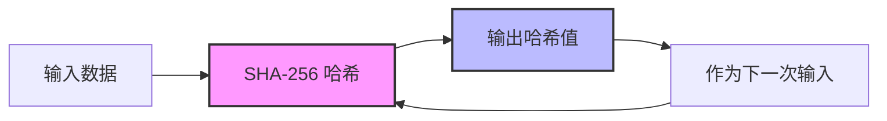
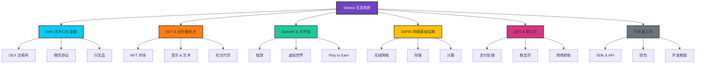
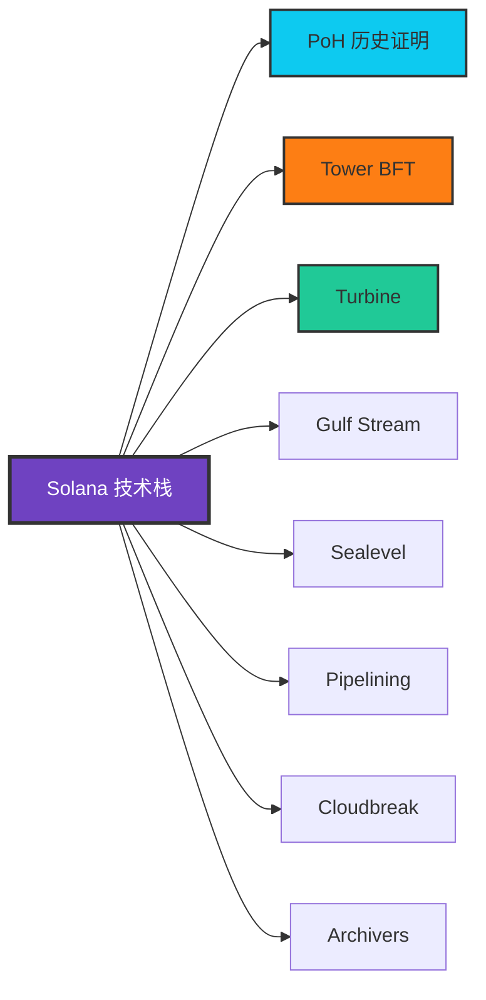

# Solana (SOL) - 起源、历史与生态发展全解析

## 一、起源：打破区块链不可能三角的梦想

### 1.1 创始人背景

**Anatoly Yakovenko（阿纳托利·亚科文科）** 是 Solana 的创始人和首席架构师。

- **职业背景**：
  - 曾在高通（Qualcomm）工作超过 12 年，担任高级工程师
  - 在 Dropbox 担任软件工程师
  - 拥有丰富的分布式系统、压缩算法和操作系统设计经验

- **技术专长**：
  - 专注于操作系统和网络协议优化
  - 深入研究分布式系统的时钟同步问题
  - 对高性能计算有独到见解

### 1.2 创立动机

**时间背景**：2017 年底至 2018 年初

**核心问题**：当时的区块链技术面临"不可能三角"困境：
- **去中心化（Decentralization）**
- **安全性（Security）**
- **可扩展性（Scalability）**

传统观点认为三者不可兼得，但 Anatoly Yakovenko 认为通过创新的时间同步机制可以打破这一限制。

**灵感来源**：
- 受到比特币和以太坊性能瓶颈的启发
- 观察到现有区块链在处理高频交易时的局限性
- 认为通过优化共识机制中的时间同步，可以大幅提升性能

### 1.3 核心创新：历史证明（Proof of History, PoH）

**技术突破点**：

Solana 的核心创新是 **历史证明（PoH）** 机制，这是一种加密时钟，让网络中的节点无需相互通信就能就时间达成一致。

**工作原理**：

**关键特点**：
1. **可验证的时间流逝**：每个哈希运算都需要一定时间，无法并行化
2. **时间戳内置**：交易自带时间证明，无需节点间同步时钟
3. **高吞吐量**：理论上可达 65,000 TPS（每秒交易数）

**对比传统共识机制**：

| 特性 | 传统 PoW/PoS | Solana PoH + PoS |
|------|-------------|------------------|
| 时间同步方式 | 节点间通信 | 加密时钟 |
| 确认速度 | 分钟级 | 亚秒级（~400ms） |
| 吞吐量 | 7-15 TPS (Bitcoin) | 65,000 TPS (理论) |
| 通信开销 | 高 | 低 |

### 1.4 技术白皮书发布

**2017 年 11 月**：Anatoly Yakovenko 发布了 Solana 白皮书，标题为：
> "Solana: A new architecture for a high performance blockchain"

**核心主张**：
- 通过 PoH 实现高性能共识
- 在不牺牲去中心化的前提下实现高吞吐量
- 目标是构建全球范围的去中心化交易所和应用平台

---

## 二、历史发展：从愿景到现实

### 2.1 初创阶段（2018-2019）

#### 团队组建

**2018 年初**：正式成立 Solana Labs
- **联合创始人**：
  - Greg Fitzgerald：前高通同事，首席技术官
  - Stephen Akridge：负责 GPU 优化
  - Raj Gokal：首席运营官，负责商业拓展

**早期团队特点**：
- 多数成员来自高通、苹果、微软等科技巨头
- 强大的系统工程和密码学背景
- 平均拥有 15+ 年的软件开发经验

#### 融资历程

**种子轮（2018 年 6 月）**：
- 融资金额：$300 万美元
- 领投方：Multicoin Capital
- 估值：未公开

**A 轮（2019 年 7 月）**：
- 融资金额：$2000 万美元
- 主要投资方：Multicoin Capital、Distributed Global
- 用途：团队扩张、技术开发

### 2.2 测试网与主网上线（2020）

#### 测试网阶段

**2020 年 3 月**：Beta 测试网上线
- 初步验证 PoH 机制的可行性
- 社区开发者开始构建应用
- 进行大规模压力测试

**测试网表现**：
- 峰值 TPS：50,000+
- 区块时间：~400ms
- 节点数量：200+

#### 主网上线

**2020 年 3 月 16 日**：Solana 主网 Beta 版正式上线
- 初始验证节点：19 个
- 初始代币供应：5 亿 SOL
- 初始价格：~$0.22

**里程碑意义**：
- 标志着 Solana 从概念走向实践
- 开启了高性能公链的新纪元
- 为后续生态爆发奠定基础

### 2.3 快速发展期（2021）

这是 Solana 历史上最辉煌的一年。

#### 价格与市值飙升

**市场表现**：
- 年初价格：$1.84
- 年度最高：$259.96（11 月）
- 涨幅：超过 14,000%
- 市值排名：一度进入前 5

#### 重大融资

**私募轮（2021 年 6 月）**：
- 融资金额：$3.14 亿美元
- 领投方：Andreessen Horowitz (a16z)、Polychain Capital
- 参投方：Alameda Research（FTX 关联基金）

**战略意义**：
- 顶级 VC 背书增强市场信心
- 为生态发展提供充足资金
- 吸引大量开发者和项目方

#### 生态爆发

**DeFi 生态崛起**：
- Serum：去中心化交易所（DEX），由 FTX 和 Alameda 支持
- Raydium：自动做市商（AMM）协议
- Solend：借贷协议

**NFT 热潮**：
- Magic Eden：成为领先的 NFT 交易平台
- Degenerate Ape Academy、Solana Monkey Business 等蓝筹 NFT 项目
- NFT 交易量一度超越以太坊

**用户增长**：
- 日活跃地址：从年初的几千增至数百万
- 总锁仓价值（TVL）：突破 $150 亿美元

### 2.4 挑战与考验（2022-2023）

#### 网络稳定性问题

**多次网络中断**：
- 2021-2022 年期间，Solana 网络经历了多次中断
- 最长一次宕机持续约 17 小时（2022 年 1 月）

**原因分析**：
- 网络拥堵导致共识失败
- 机器人攻击和垃圾交易
- 验证节点内存不足

**应对措施**：
- 升级客户端软件
- 优化费用机制
- 引入 QUIC 协议提升网络传输效率
- 实施更严格的交易过滤

#### FTX 崩盘冲击（2022 年 11 月）

**背景**：FTX 交易所破产，与 Solana 关系密切
- Sam Bankman-Fried（SBF）是 Solana 的早期支持者
- Alameda Research 持有大量 SOL 代币
- FTX 在 Solana 上构建了 Serum 等核心应用

**影响**：
- SOL 价格暴跌：从 $35 跌至 $10（跌幅超过 70%）
- 市场信心重创
- 生态项目面临流动性危机

**复苏表现**：
- 核心开发团队坚持建设
- 社区自发组织救援行动
- 逐步摆脱 FTX 影响，走向独立发展

### 2.5 重振与突破（2024-2025）

#### 技术升级

**Firedancer 客户端**：
- 由 Jump Crypto 开发的全新验证客户端
- 用 C 语言重写，性能大幅提升
- 预期 TPS：100 万+

**状态压缩技术**：
- 降低 NFT 和数据存储成本
- 使大规模应用成为可能

**Token Extensions**：
- 增强代币功能（转账费、利息、机密转账等）
- 为机构采用提供合规工具

#### 生态复兴

**价格回升**：
- 2024 年：从 $20 涨至 $100+
- 2025 年：继续稳步增长

**移动端战略**：
- Solana Saga 手机发布
- Solana Mobile Stack（SMS）推出
- 吸引 Web2 用户进入 Web3

**机构采用**：
- Visa、Shopify 等传统巨头集成 Solana
- PayPal 推出基于 Solana 的稳定币
- DePIN（去中心化物理基础设施）项目涌现

---

## 三、生态发展：构建去中心化未来

### 3.1 生态全景图

### 3.2 DeFi 生态

#### 核心协议

**1. Jupiter（聚合交易）**
- **定位**：Solana 最大的 DEX 聚合器
- **功能**：
  - 聚合所有 Solana DEX 的流动性
  - 提供最优交易路径
  - 限价单功能
  - DCA（定投）策略
- **数据**（2024）：
  - 日交易量：$5-10 亿美元
  - 用户数：超过 100 万

**2. Raydium（AMM）**
- **特点**：结合订单簿和 AMM 的混合模型
- **创新**：与 Serum 订单簿集成，提供更好的价格发现
- **TVL**：$1-2 亿美元

**3. Marinade Finance（流动性质押）**
- **功能**：将质押的 SOL 转换为流动性代币 mSOL
- **优势**：
  - 保持流动性的同时获得质押收益
  - 自动选择最优验证节点
  - 促进网络去中心化
- **质押量**：超过 800 万 SOL

**4. Kamino Finance（收益优化）**
- **定位**：自动化做市和收益策略
- **产品**：
  - 流动性挖矿优化
  - 杠杆流动性提供
  - 收益聚合

#### 借贷协议

**Solend**：
- Solana 上的领先借贷协议
- 支持 SOL、USDC、USDT 等主流资产
- 闪电贷功能

**Marginfi**：
- 新兴借贷协议
- 高效的风险管理
- 优化的清算机制

### 3.3 NFT 与创作者经济

#### NFT 市场

**Magic Eden**：
- **地位**：Solana 最大的 NFT 市场
- **特点**：
  - 低手续费（2%）
  - Launchpad 平台
  - 跨链支持（后期扩展至比特币、以太坊）
- **成就**：
  - 累计交易量：数十亿美元
  - 用户数：数百万

**Tensor**：
- **定位**：专业交易者 NFT 平台
- **创新**：
  - AMM 池驱动的 NFT 交易
  - 高级交易功能（扫货、挂单）
  - 更好的价格发现

#### 蓝筹 NFT 项目

1. **Mad Lads**：
  - xNFT（可执行 NFT）概念
  - 与 Backpack 钱包集成
  - 地板价：多次超过 100 SOL

2. **Tensorians**：
  - Tensor 平台官方 NFT
  - 提供平台治理权限
  - 交易费用分润

3. **SMB (Solana Monkey Business)**：
  - Solana 早期蓝筹项目
  - 强大的社区文化
  - 持续运营和创新

#### 音乐与社交

**Audius**：
- 去中心化音乐流媒体平台
- 艺术家直接获得收益
- 月活用户：数百万

**Dialect**：
- Web3 消息传递协议
- 支持钱包间通信
- Dapp 通知系统

### 3.4 GameFi 与元宇宙

#### 链游项目

**Star Atlas**：
- **愿景**：大型多人在线太空探索游戏
- **技术**：虚幻引擎 5 + Solana
- **特点**：
  - AAA 级画质
  - 真实的游戏内经济
  - 土地、飞船等 NFT 资产

**Genopets**：
- **玩法**：Move to Earn（运动赚钱）
- **机制**：现实活动转化为游戏进度
- **创新**：结合健康和 GameFi

**Step Finance**：
- 投资组合管理
- DeFi 仪表盘
- 游戏化任务系统

#### 虚拟世界

**Portals**：
- 3D 虚拟世界平台
- 社交、游戏、创作一体
- 低门槛创作工具

### 3.5 DePIN（去中心化物理基础设施）

这是 Solana 生态的新兴热点领域。

#### Helium（无线网络）

**2023 年 4 月迁移至 Solana**：
- **原因**：Solana 的高性能和低成本
- **规模**：
  - 全球超过 100 万个热点
  - 覆盖 190+ 个国家
- **产品**：
  - IoT 网络（LoRaWAN）
  - 5G 移动网络
- **代币**：HNT、IOT、MOBILE

#### Render Network（GPU 渲染）

**2023 年迁移至 Solana**：
- **功能**：分布式 GPU 渲染网络
- **用户**：3D 艺术家、动画工作室
- **优势**：
  - 成本降低 90%
  - 渲染速度提升
  - 全球节点网络

#### Hivemapper（去中心化地图）

- **愿景**：社区驱动的世界地图
- **机制**：
  - 用户使用行车记录仪采集数据
  - 获得 HONEY 代币奖励
- **进展**：已绘制数百万公里道路

#### 其他 DePIN 项目

- **Natix Network**：AI 驱动的地图和导航
- **GenesysGo (Shadow)**：去中心化存储
- **Akash Network**：去中心化云计算（跨链）

### 3.6 支付与稳定币

#### Solana Pay

**特点**：
- 即时确认（亚秒级）
- 几乎零手续费
- 二维码支付
- 商家友好

**采用案例**：
- Shopify 插件
- 物理 POS 终端
- 线上电商集成

#### 稳定币生态

**USDC（Circle）**：
- Solana 上最大的稳定币
- 与以太坊版本 1:1 桥接
- 机构级合规

**USDT（Tether）**：
- 2024 年在 Solana 上发行量激增
- 跨境支付首选

**PayPal USD (PYUSD)**：
- PayPal 官方稳定币
- 2023 年在 Solana 上发行
- 面向主流用户

### 3.7 开发者工具与基础设施

#### 开发框架

**Anchor**：
- Solana 智能合约开发框架
- 类似以太坊的 Hardhat
- 简化开发流程
- 内置安全检查

#### 钱包

**Phantom**：
- Solana 生态最流行的钱包
- 用户数：超过 700 万
- 支持多链（以太坊、Polygon、Bitcoin）
- 内置 Swap、NFT 展示

**Backpack**：
- xNFT（可执行 NFT）钱包
- 应用商店模式
- 由 Mad Lads 团队开发

**Solflare**：
- 老牌 Solana 钱包
- 支持硬件钱包
- 质押、DeFi 集成

#### RPC 与数据服务

**Helius**：
- 高性能 RPC 节点
- 增强 API 和 Webhook
- NFT 压缩 API

**Triton（原 RPC Pool）**：
- 企业级 RPC 服务
- 地理分布节点
- 高可用性保障

**QuickNode**：
- 多链 RPC 服务
- Solana 节点全球部署
- 分析和监控工具

#### 浏览器与分析

**Solscan**：
- 最流行的 Solana 区块链浏览器
- 实时交易追踪
- 代币分析

**Solana Beach**：
- 验证节点监控
- 网络健康仪表盘
- 质押数据

**Step Finance**：
- 投资组合追踪
- DeFi 仪表盘
- 收益优化建议

### 3.8 生态基金与支持

#### Solana Foundation

**职责**：
- 网络维护和升级
- 生态项目资助
- 开发者教育
- 全球社区建设

**Grant 计划**：
- 开发者资助
- 黑客松奖金
- 研究资助

#### Solana Ventures

**投资方向**：
- DeFi、NFT、GameFi 项目
- 基础设施建设
- DePIN 领域
- Web3 社交

**投资金额**：超过 $1.5 亿美元

#### Breakpoint（年度开发者大会）

- 每年举办
- 展示最新技术和项目
- 全球开发者齐聚
- 重大公告发布平台

---

## 四、技术架构核心特性

### 4.1 八大核心创新

Solana 通过 8 项关键技术创新实现高性能：

**详细说明**：

1. **Proof of History (PoH)**：加密时钟，为事件排序
2. **Tower BFT**：PoH 优化的 PBFT 共识算法
3. **Turbine**：区块传播协议，类似 BitTorrent
4. **Gulf Stream**：无内存池的转发协议
5. **Sealevel**：并行智能合约运行时
6. **Pipelining**：交易处理流水线
7. **Cloudbreak**：水平扩展的账户数据库
8. **Archivers**：分布式账本存储

### 4.2 性能指标

| 指标 | 数值 |
|------|------|
| 理论 TPS | 65,000+ |
| 实际 TPS（峰值） | 4,000-7,000 |
| 区块时间 | ~400ms |
| 确认时间 | <1 秒 |
| 交易费用 | $0.00025（平均） |
| 验证节点数量 | 2,000+ |
| Nakamoto 系数 | 31（去中心化指标） |

---

## 五、代币经济学

### 5.1 SOL 代币基本信息

- **代币符号**：SOL
- **初始总供应量**：500,000,000 SOL
- **当前流通量**：约 450,000,000 SOL（2024-2025）
- **通货膨胀率**：
  - 初始：8% 年化
  - 目标：长期 1.5%
  - 调整：每年减少 15%

### 5.2 SOL 用途

1. **交易费用**：支付网络 gas 费
2. **质押**：参与 PoS 共识，获得收益（约 6-8% APY）
3. **治理**：网络升级投票（间接通过验证节点）
4. **价值存储**：生态内价值媒介

### 5.3 代币分配

**初始分配**：
- 团队和早期贡献者：12.5%
- 基金会：12.5%
- 种子轮投资者：15.8%
- 创始人销售：2.6%
- 验证节点销售：5.0%
- 战略销售：1.9%
- 公开销售：1.6%
- 社区储备：38.0%
- 做市商：10.1%

**解锁计划**：
- 投资者代币：2-4 年线性解锁
- 团队代币：4 年解锁
- 社区分配：通过生态发展逐步释放

---

## 六、竞争格局与未来展望

### 6.1 竞争对手分析

| 公链 | TPS | 确认时间 | 费用 | 生态规模 | 特点 |
|------|-----|---------|------|---------|------|
| **Solana** | 4,000-7,000 | <1s | $0.00025 | 大 | 高性能、低成本 |
| **Ethereum** | 15-30 | 12s-6min | $1-50 | 最大 | 去中心化、安全 |
| **Polygon** | 7,000 | 2s | $0.01 | 大 | L2 扩容 |
| **Avalanche** | 4,500 | 1-2s | $0.01 | 中 | 子网架构 |
| **Aptos** | 10,000+ | <1s | $0.0001 | 小 | Move 语言 |
| **Sui** | 120,000+ | <1s | $0.0001 | 小 | 并行执行 |

### 6.2 优势

1. **性能**：实际高 TPS 和低延迟
2. **成本**：超低交易费用
3. **开发者体验**：Rust 语言、Anchor 框架
4. **生态成熟度**：完善的 DeFi、NFT、GameFi 生态
5. **创新能力**：DePIN、移动端、AI 等新方向
6. **社区活跃**：全球化、年轻化的社区

### 6.3 挑战

1. **网络稳定性**：历史上的中断事件影响信任
2. **中心化担忧**：
   - 高硬件要求（验证节点需强大服务器）
   - 基金会和大户持币集中
3. **竞争压力**：新公链（Aptos、Sui）技术更先进
4. **监管风险**：与 FTX 的历史关联

### 6.4 未来发展方向

#### 技术路线图

**Firedancer 客户端**（2025）：
- 目标：100 万 TPS
- 多客户端提升网络韧性
- 由 Jump Crypto 开发

**状态压缩 2.0**：
- 进一步降低存储成本
- 支持更大规模应用

**垂直整合硬件**：
- 定制化服务器（Solana Validator Client）
- ASIC 加速器

#### 应用场景拓展

**DePIN 主导地位**：
- 成为 DePIN 项目首选公链
- 物理基础设施代币化
- 与现实世界深度融合

**移动端 Web3**：
- Solana Saga 手机系列
- Mobile Stack 吸引 Web2 用户
- 降低 Web3 准入门槛

**AI + 区块链**：
- 去中心化 AI 训练和推理
- AI 模型的链上验证
- AI Agent 自主交易

**机构采用**：
- 传统金融机构集成
- 稳定币支付主流化
- 合规工具完善（Token Extensions）

**游戏大作**：
- Star Atlas 等 3A 游戏上线
- 游戏引擎集成（Unity、Unreal）
- 游戏工作室 Web3 转型

---

## 七、总结

### 7.1 Solana 的独特价值

Solana 从 2017 年的一个白皮书愿景，发展成为全球第五大公链（按市值），其核心价值在于：

1. **技术创新**：历史证明（PoH）机制打破传统共识瓶颈
2. **性能卓越**：真正实现了高 TPS 和低成本的结合
3. **生态繁荣**：涵盖 DeFi、NFT、GameFi、DePIN 等全领域
4. **持续进化**：从挫折中学习，不断优化和升级
5. **开发者友好**：完善的工具链和活跃的社区

### 7.2 投资与参与建议

**风险提示**：
- 区块链技术仍在早期，存在技术和监管风险
- SOL 价格波动大，投资需谨慎
- 网络稳定性仍在持续改进中

**参与方式**：
- **开发者**：学习 Rust 和 Anchor，构建 dApp
- **投资者**：长期持有 SOL，参与质押获得收益
- **用户**：体验 Solana 生态的各类应用
- **创作者**：在 Solana 上发行 NFT、音乐等作品

### 7.3 展望未来

Solana 的愿景是成为"世界的全局状态机"，让区块链技术真正服务于数十亿用户。随着：

- Firedancer 的上线（性能飞跃）
- DePIN 生态的爆发（连接现实世界）
- 移动端战略的推进（降低门槛）
- 机构的持续进场（主流化）

Solana 有望在 2025-2030 年进入全新的发展阶段，成为 Web3 时代的关键基础设施。

---

## 八、参考资料

### 官方资源

- 官网：https://solana.com
- 开发者文档：https://docs.solana.com
- GitHub：https://github.com/solana-labs
- 基金会：https://solana.org

### 生态资源

- 生态项目汇总：https://solana.com/ecosystem
- DeFi 数据：https://defillama.com/chain/Solana
- NFT 数据：https://howrare.is

### 学习资源

- Solana Bootcamp（官方训练营）
- Buildspace Solana 课程
- Solana Cookbook（开发指南）
- The Solana Podcast（播客）

---

**文档版本**：v1.0
**最后更新**：2025 年 12 月 3 日
**作者**：LemonLog 技术团队

> 免责声明：本文仅供学习和研究使用,不构成任何投资建议。加密货币投资存在风险,请谨慎决策。
