# 短URL系统设计文档

## 1. 产品概述

短URL系统是一个将长URL转换为短URL的在线服务，用户可以通过短URL快速访问原始长URL，同时提供访问统计和管理功能。
- 解决长URL在社交媒体、短信等场景中不便分享的问题，为个人用户、企业营销人员和开发者提供便捷的链接管理服务。
- 目标成为类似bit.ly、tinyurl等主流短链服务的竞争产品，服务百万级用户的链接缩短需求。

## 2. 核心功能

### 2.1 用户角色

| 角色 | 注册方式 | 核心权限 |
|------|----------|----------|
| 游客用户 | 无需注册 | 可创建临时短链，有效期7天，无统计功能 |
| 注册用户 | 邮箱注册 | 可创建永久短链，查看访问统计，管理链接 |
| 高级用户 | 付费升级 | 自定义短链后缀，高级统计分析，批量操作 |

### 2.2 功能模块

我们的短URL系统包含以下主要页面：
1. **首页**：URL输入框、短链生成、功能介绍
2. **链接管理页**：链接列表、编辑删除、批量操作
3. **统计分析页**：访问数据、图表展示、导出功能
4. **用户中心页**：账户信息、套餐管理、API密钥
5. **短链重定向页**：URL解析、访问记录、跳转处理

### 2.3 页面详情

| 页面名称 | 模块名称 | 功能描述 |
|----------|----------|----------|
| 首页 | URL输入模块 | 输入长URL，验证URL格式，生成短链接 |
| 首页 | 短链展示模块 | 显示生成的短链，提供复制功能，显示二维码 |
| 首页 | 功能介绍模块 | 展示产品特性，用户注册引导，价格方案 |
| 链接管理页 | 链接列表模块 | 显示用户创建的所有短链，支持搜索和筛选 |
| 链接管理页 | 链接操作模块 | 编辑链接标题，删除链接，批量管理操作 |
| 链接管理页 | 自定义短链模块 | 设置自定义后缀，检查可用性，保存设置 |
| 统计分析页 | 数据概览模块 | 显示总点击数，今日访问，热门链接排行 |
| 统计分析页 | 图表分析模块 | 访问趋势图，地理分布，设备统计，来源分析 |
| 统计分析页 | 数据导出模块 | 选择时间范围，导出CSV/Excel格式数据 |
| 用户中心页 | 账户信息模块 | 修改个人信息，更改密码，账户安全设置 |
| 用户中心页 | 套餐管理模块 | 查看当前套餐，升级付费版，使用量统计 |
| 用户中心页 | API管理模块 | 生成API密钥，查看API文档，调用次数统计 |
| 短链重定向页 | URL解析模块 | 根据短链查找原始URL，验证链接有效性 |
| 短链重定向页 | 访问记录模块 | 记录访问时间，IP地址，用户代理，来源页面 |
| 短链重定向页 | 跳转处理模块 | 执行302重定向，处理失效链接，显示错误页面 |

## 3. 核心流程

**游客用户流程：**
用户访问首页 → 输入长URL → 系统生成短链 → 用户复制使用短链 → 访问者点击短链 → 系统重定向到原始URL

**注册用户流程：**
用户注册登录 → 创建短链 → 管理链接列表 → 查看访问统计 → 自定义短链后缀 → 导出统计数据

**高级用户流程：**
付费用户登录 → 批量创建短链 → 设置自定义域名 → 查看高级统计 → 使用API接口 → 管理团队权限

```mermaid
graph TD
    A[首页] --> B[链接管理页]
    A --> C[用户中心页]
    B --> D[统计分析页]
    C --> D
    A --> E[短链重定向页]
    B --> E
```



## 4. 用户界面设计

### 4.1 设计风格

- **主色调**：蓝色(#2563EB)作为主色，白色(#FFFFFF)作为背景色
- **辅助色**：灰色(#6B7280)用于次要文本，绿色(#10B981)用于成功状态
- **按钮样式**：圆角矩形按钮，悬停时有阴影效果
- **字体**：中文使用苹方/微软雅黑，英文使用Inter/Roboto，主要字号16px
- **布局风格**：卡片式设计，顶部导航栏，响应式网格布局
- **图标风格**：线性图标风格，统一使用Heroicons图标库

### 4.2 页面设计概览

| 页面名称 | 模块名称 | UI元素 |
|----------|----------|--------|
| 首页 | URL输入模块 | 大尺寸输入框，蓝色渐变背景，居中布局，"生成短链"按钮 |
| 首页 | 短链展示模块 | 卡片容器，短链文本框，复制按钮，二维码图标，分享按钮组 |
| 链接管理页 | 链接列表模块 | 表格布局，分页组件，搜索框，筛选下拉菜单，操作按钮组 |
| 统计分析页 | 图表分析模块 | Chart.js图表，数据卡片，时间选择器，颜色编码图例 |
| 用户中心页 | 账户信息模块 | 表单布局，头像上传，输入验证，保存按钮，安全徽章 |
| 短链重定向页 | 跳转处理模块 | 加载动画，倒计时显示，错误提示页面，重试按钮 |

### 4.3 响应式设计

系统采用移动优先的响应式设计，支持桌面端、平板和手机端访问，针对触屏设备优化按钮大小和交互体验。

## 5. 功能性需求详细分析

### 5.1 URL缩短功能
- **输入验证**：支持HTTP/HTTPS协议，验证URL格式合法性，检测恶意链接
- **短链生成**：使用Base62编码算法，生成6-8位短链标识符
- **重复处理**：相同URL生成相同短链，避免重复存储
- **自定义短链**：高级用户可自定义短链后缀，检查唯一性
- **有效期管理**：支持设置链接过期时间，自动检测和处理过期链接

## 5.3 链接有效期管理系统

### 5.3.1 功能概述

链接有效期管理是短URL系统的重要组成部分，主要包括：
- **过期时间设置**：支持永久、自定义时间、相对时间等多种过期策略
- **实时过期检测**：访问时实时检查链接是否过期
- **定时清理任务**：批量处理过期链接，释放存储空间
- **友好错误页面**：为过期链接提供美观、有用的错误提示页面
- **过期通知机制**：提前通知用户链接即将过期

### 5.3.2 数据库设计扩展

```sql
-- URL映射表添加过期相关字段
ALTER TABLE url_mapping ADD COLUMN (
    expire_time DATETIME NULL COMMENT '过期时间，NULL表示永不过期',
    expire_type ENUM('NEVER', 'ABSOLUTE', 'RELATIVE') DEFAULT 'NEVER' COMMENT '过期类型',
    expire_duration INT NULL COMMENT '相对过期时长（秒）',
    status ENUM('ACTIVE', 'EXPIRED', 'DISABLED') DEFAULT 'ACTIVE' COMMENT '链接状态',
    expire_notification_sent BOOLEAN DEFAULT FALSE COMMENT '是否已发送过期通知',
    last_access_time DATETIME NULL COMMENT '最后访问时间'
);

-- 过期链接历史表
CREATE TABLE expired_url_history (
    id BIGINT PRIMARY KEY AUTO_INCREMENT,
    original_short_code VARCHAR(20) NOT NULL COMMENT '原短链代码',
    original_url TEXT NOT NULL COMMENT '原始URL',
    user_id BIGINT COMMENT '用户ID',
    created_time DATETIME NOT NULL COMMENT '创建时间',
    expired_time DATETIME NOT NULL COMMENT '过期时间',
    total_clicks INT DEFAULT 0 COMMENT '总点击次数',
    archived_time DATETIME DEFAULT CURRENT_TIMESTAMP COMMENT '归档时间',
    INDEX idx_user_expired (user_id, expired_time),
    INDEX idx_expired_time (expired_time)
) COMMENT '过期链接历史表';
```

### 5.3.3 过期策略配置

```java
/**
 * 过期策略配置
 */
@Configuration
@ConfigurationProperties(prefix = "shorturl.expiration")
@Data
public class ExpirationConfig {
    
    /**
     * 默认过期类型
     */
    private ExpireType defaultExpireType = ExpireType.NEVER;
    
    /**
     * 默认过期时长（天）
     */
    private int defaultExpireDays = 365;
    
    /**
     * 最大过期时长（天）
     */
    private int maxExpireDays = 3650;
    
    /**
     * 过期检查间隔（分钟）
     */
    private int checkIntervalMinutes = 60;
    
    /**
     * 批量处理大小
     */
    private int batchSize = 1000;
    
    /**
     * 是否启用过期通知
     */
    private boolean enableNotification = true;
    
    /**
     * 过期前通知天数
     */
    private int notificationDaysBefore = 7;
    
    /**
     * 是否自动清理过期链接
     */
    private boolean autoCleanup = true;
    
    /**
     * 过期后保留天数
     */
    private int retentionDaysAfterExpiry = 30;
    
    /**
     * 错误页面模板路径
     */
    private String errorPageTemplate = "error/expired";
}

/**
 * 过期类型枚举
 */
public enum ExpireType {
    /**
     * 永不过期
     */
    NEVER("永不过期"),
    
    /**
     * 绝对时间过期
     */
    ABSOLUTE("绝对时间"),
    
    /**
     * 相对时间过期（从创建时间开始计算）
     */
    RELATIVE("相对时间");
    
    private final String description;
    
    ExpireType(String description) {
        this.description = description;
    }
    
    public String getDescription() {
        return description;
    }
}
```

### 5.3.4 过期检测服务

```java
/**
 * 链接过期检测服务
 */
@Service
@Slf4j
public class ExpirationService {
    
    @Autowired
    private UrlMappingRepository urlMappingRepository;
    
    @Autowired
    private RedisTemplate<String, Object> redisTemplate;
    
    @Autowired
    private ExpirationConfig expirationConfig;
    
    @Autowired
    private ExpirationNotificationService notificationService;
    
    private static final String EXPIRY_CHECK_CACHE_KEY = "expiry_check:";
    
    /**
     * 检查单个链接是否过期
     */
    public ExpirationResult checkExpiration(String shortCode) {
        try {
            // 1. 从缓存检查
            ExpirationResult cachedResult = getCachedExpirationResult(shortCode);
            if (cachedResult != null) {
                return cachedResult;
            }
            
            // 2. 从数据库查询
            UrlMappingEntity mapping = urlMappingRepository.findByShortCode(shortCode);
            if (mapping == null) {
                return ExpirationResult.notFound();
            }
            
            // 3. 检查过期状态
            ExpirationResult result = determineExpirationStatus(mapping);
            
            // 4. 缓存结果
            cacheExpirationResult(shortCode, result);
            
            // 5. 如果过期，更新数据库状态
            if (result.isExpired() && mapping.getStatus() == UrlStatus.ACTIVE) {
                updateExpiredStatus(mapping);
            }
            
            return result;
            
        } catch (Exception e) {
            log.error("检查链接过期状态失败: shortCode={}", shortCode, e);
            return ExpirationResult.error();
        }
    }
    
    /**
     * 确定过期状态
     */
    private ExpirationResult determineExpirationStatus(UrlMappingEntity mapping) {
        // 1. 检查是否已标记为过期
        if (mapping.getStatus() == UrlStatus.EXPIRED) {
            return ExpirationResult.expired(mapping.getExpireTime());
        }
        
        // 2. 检查过期时间
        LocalDateTime expireTime = mapping.getExpireTime();
        if (expireTime == null) {
            return ExpirationResult.active(); // 永不过期
        }
        
        LocalDateTime now = LocalDateTime.now();
        if (now.isAfter(expireTime)) {
            return ExpirationResult.expired(expireTime);
        }
        
        // 3. 检查是否即将过期
        LocalDateTime notificationTime = expireTime.minusDays(expirationConfig.getNotificationDaysBefore());
        if (now.isAfter(notificationTime)) {
            return ExpirationResult.expiringSoon(expireTime);
        }
        
        return ExpirationResult.active();
    }
    
    /**
     * 更新过期状态
     */
    private void updateExpiredStatus(UrlMappingEntity mapping) {
        try {
            mapping.setStatus(UrlStatus.EXPIRED);
            urlMappingRepository.save(mapping);
            
            // 清除相关缓存
            clearRelatedCache(mapping.getShortCode());
            
            log.info("链接已标记为过期: shortCode={}", mapping.getShortCode());
            
        } catch (Exception e) {
            log.error("更新过期状态失败: shortCode={}", mapping.getShortCode(), e);
        }
    }
    
    /**
     * 缓存过期检查结果
     */
    private void cacheExpirationResult(String shortCode, ExpirationResult result) {
        String cacheKey = EXPIRY_CHECK_CACHE_KEY + shortCode;
        int ttl = result.isExpired() ? 3600 : 300; // 过期的缓存更久
        redisTemplate.opsForValue().set(cacheKey, result, Duration.ofSeconds(ttl));
    }
    
    /**
     * 获取缓存的过期检查结果
     */
    private ExpirationResult getCachedExpirationResult(String shortCode) {
        String cacheKey = EXPIRY_CHECK_CACHE_KEY + shortCode;
        return (ExpirationResult) redisTemplate.opsForValue().get(cacheKey);
    }
    
    /**
     * 清除相关缓存
     */
    private void clearRelatedCache(String shortCode) {
        redisTemplate.delete(EXPIRY_CHECK_CACHE_KEY + shortCode);
        redisTemplate.delete("mapping:" + shortCode);
    }
}

/**
 * 过期检查结果
 */
@Data
@Builder
public class ExpirationResult {
    private boolean expired;
    private boolean expiringSoon;
    private boolean found;
    private LocalDateTime expireTime;
    private String message;
    private ExpirationErrorType errorType;
    
    public static ExpirationResult active() {
        return ExpirationResult.builder()
                .expired(false)
                .expiringSoon(false)
                .found(true)
                .message("链接有效")
                .build();
    }
    
    public static ExpirationResult expired(LocalDateTime expireTime) {
        return ExpirationResult.builder()
                .expired(true)
                .expiringSoon(false)
                .found(true)
                .expireTime(expireTime)
                .message("链接已过期")
                .errorType(ExpirationErrorType.EXPIRED)
                .build();
    }
    
    public static ExpirationResult expiringSoon(LocalDateTime expireTime) {
        return ExpirationResult.builder()
                .expired(false)
                .expiringSoon(true)
                .found(true)
                .expireTime(expireTime)
                .message("链接即将过期")
                .build();
    }
    
    public static ExpirationResult notFound() {
        return ExpirationResult.builder()
                .expired(false)
                .expiringSoon(false)
                .found(false)
                .message("链接不存在")
                .errorType(ExpirationErrorType.NOT_FOUND)
                .build();
    }
    
    public static ExpirationResult error() {
        return ExpirationResult.builder()
                .expired(false)
                .expiringSoon(false)
                .found(false)
                .message("系统错误")
                .errorType(ExpirationErrorType.SYSTEM_ERROR)
                .build();
    }
}

/**
 * 过期错误类型
 */
public enum ExpirationErrorType {
    EXPIRED("链接已过期"),
    NOT_FOUND("链接不存在"),
    SYSTEM_ERROR("系统错误");
    
    private final String description;
    
    ExpirationErrorType(String description) {
        this.description = description;
    }
    
    public String getDescription() {
        return description;
    }
}
```

### 5.3.5 定时清理任务

```java
/**
 * 过期链接定时清理任务
 */
@Component
@Slf4j
public class ExpirationScheduler {
    
    @Autowired
    private UrlMappingRepository urlMappingRepository;
    
    @Autowired
    private ExpiredUrlHistoryRepository expiredUrlHistoryRepository;
    
    @Autowired
    private ExpirationConfig expirationConfig;
    
    @Autowired
    private ExpirationNotificationService notificationService;
    
    /**
     * 定时检查过期链接
     */
    @Scheduled(fixedDelayString = "#{@expirationConfig.checkIntervalMinutes * 60 * 1000}")
    public void checkExpiredUrls() {
        if (!expirationConfig.isAutoCleanup()) {
            return;
        }
        
        log.info("开始执行过期链接检查任务");
        
        try {
            // 1. 查找过期链接
            List<UrlMappingEntity> expiredUrls = findExpiredUrls();
            
            if (expiredUrls.isEmpty()) {
                log.info("没有发现过期链接");
                return;
            }
            
            log.info("发现 {} 个过期链接", expiredUrls.size());
            
            // 2. 批量处理过期链接
            processExpiredUrls(expiredUrls);
            
            // 3. 检查即将过期的链接
            checkExpiringSoonUrls();
            
        } catch (Exception e) {
            log.error("过期链接检查任务执行失败", e);
        }
    }
    
    /**
     * 查找过期链接
     */
    private List<UrlMappingEntity> findExpiredUrls() {
        LocalDateTime now = LocalDateTime.now();
        return urlMappingRepository.findExpiredUrls(now, expirationConfig.getBatchSize());
    }
    
    /**
     * 处理过期链接
     */
    private void processExpiredUrls(List<UrlMappingEntity> expiredUrls) {
        for (UrlMappingEntity url : expiredUrls) {
            try {
                // 1. 归档到历史表
                archiveExpiredUrl(url);
                
                // 2. 更新状态为过期
                url.setStatus(UrlStatus.EXPIRED);
                urlMappingRepository.save(url);
                
                // 3. 清除缓存
                clearUrlCache(url.getShortCode());
                
                log.debug("处理过期链接完成: shortCode={}", url.getShortCode());
                
            } catch (Exception e) {
                log.error("处理过期链接失败: shortCode={}", url.getShortCode(), e);
            }
        }
    }
    
    /**
     * 归档过期链接
     */
    private void archiveExpiredUrl(UrlMappingEntity url) {
        ExpiredUrlHistory history = ExpiredUrlHistory.builder()
                .originalShortCode(url.getShortCode())
                .originalUrl(url.getOriginalUrl())
                .userId(url.getUserId())
                .createdTime(url.getCreatedTime())
                .expiredTime(url.getExpireTime())
                .totalClicks(url.getClickCount())
                .archivedTime(LocalDateTime.now())
                .build();
        
        expiredUrlHistoryRepository.save(history);
    }
    
    /**
     * 检查即将过期的链接
     */
    private void checkExpiringSoonUrls() {
        if (!expirationConfig.isEnableNotification()) {
            return;
        }
        
        LocalDateTime notificationTime = LocalDateTime.now()
                .plusDays(expirationConfig.getNotificationDaysBefore());
        
        List<UrlMappingEntity> expiringSoonUrls = urlMappingRepository
                .findExpiringSoonUrls(notificationTime, expirationConfig.getBatchSize());
        
        for (UrlMappingEntity url : expiringSoonUrls) {
            if (!url.isExpireNotificationSent()) {
                notificationService.sendExpirationNotification(url);
                url.setExpireNotificationSent(true);
                urlMappingRepository.save(url);
            }
        }
    }
    
    /**
     * 清理过期数据
     */
    @Scheduled(cron = "0 0 2 * * ?") // 每天凌晨2点执行
    public void cleanupExpiredData() {
        if (!expirationConfig.isAutoCleanup()) {
            return;
        }
        
        log.info("开始执行过期数据清理任务");
        
        try {
            LocalDateTime cutoffTime = LocalDateTime.now()
                    .minusDays(expirationConfig.getRetentionDaysAfterExpiry());
            
            // 1. 删除过期的URL映射
            int deletedMappings = urlMappingRepository.deleteExpiredUrls(cutoffTime);
            
            // 2. 清理过期的历史记录（可选）
            int deletedHistory = expiredUrlHistoryRepository.deleteOldHistory(
                    cutoffTime.minusDays(365)); // 保留1年历史
            
            log.info("过期数据清理完成: 删除映射={}, 删除历史={}", deletedMappings, deletedHistory);
            
        } catch (Exception e) {
            log.error("过期数据清理任务执行失败", e);
        }
    }
    
    /**
     * 清除URL缓存
     */
    private void clearUrlCache(String shortCode) {
        // 实现缓存清理逻辑
    }
}
```

### 5.3.6 友好错误页面实现

#### 5.3.6.1 错误页面控制器

```java
/**
 * 错误页面控制器
 */
@Controller
@Slf4j
public class ErrorPageController {
    
    @Autowired
    private ExpirationService expirationService;
    
    @Autowired
    private UrlMappingRepository urlMappingRepository;
    
    /**
     * 处理过期链接访问
     */
    @GetMapping("/error/expired/{shortCode}")
    public String expiredPage(@PathVariable String shortCode, 
                             Model model, 
                             HttpServletRequest request) {
        
        try {
            // 1. 获取链接信息
            UrlMappingEntity mapping = urlMappingRepository.findByShortCode(shortCode);
            
            // 2. 构建错误页面数据
            ErrorPageData errorData = buildErrorPageData(shortCode, mapping, request);
            model.addAttribute("errorData", errorData);
            
            // 3. 记录访问日志
            logExpiredAccess(shortCode, request);
            
            return "error/expired";
            
        } catch (Exception e) {
            log.error("处理过期页面失败: shortCode={}", shortCode, e);
            return "error/general";
        }
    }
    
    /**
     * 构建错误页面数据
     */
    private ErrorPageData buildErrorPageData(String shortCode, 
                                           UrlMappingEntity mapping, 
                                           HttpServletRequest request) {
        
        ErrorPageData.ErrorPageDataBuilder builder = ErrorPageData.builder()
                .shortCode(shortCode)
                .timestamp(LocalDateTime.now())
                .userAgent(request.getHeader("User-Agent"))
                .isMobile(isMobileDevice(request));
        
        if (mapping != null) {
            builder.originalUrl(mapping.getOriginalUrl())
                   .expiredTime(mapping.getExpireTime())
                   .createdTime(mapping.getCreatedTime())
                   .domain(extractDomain(mapping.getOriginalUrl()));
        }
        
        return builder.build();
    }
    
    /**
     * 检测是否为移动设备
     */
    private boolean isMobileDevice(HttpServletRequest request) {
        String userAgent = request.getHeader("User-Agent");
        if (userAgent == null) {
            return false;
        }
        
        return userAgent.toLowerCase().contains("mobile") ||
               userAgent.toLowerCase().contains("android") ||
               userAgent.toLowerCase().contains("iphone");
    }
    
    /**
     * 提取域名
     */
    private String extractDomain(String url) {
        try {
            return new URL(url).getHost();
        } catch (Exception e) {
            return "";
        }
    }
    
    /**
     * 记录过期访问日志
     */
    private void logExpiredAccess(String shortCode, HttpServletRequest request) {
        String ip = getClientIp(request);
        String userAgent = request.getHeader("User-Agent");
        
        log.info("过期链接访问: shortCode={}, ip={}, userAgent={}", 
                shortCode, ip, userAgent);
    }
    
    private String getClientIp(HttpServletRequest request) {
        String ip = request.getHeader("X-Forwarded-For");
        if (StringUtils.isBlank(ip) || "unknown".equalsIgnoreCase(ip)) {
            ip = request.getHeader("X-Real-IP");
        }
        if (StringUtils.isBlank(ip) || "unknown".equalsIgnoreCase(ip)) {
            ip = request.getRemoteAddr();
        }
        return ip;
    }
}

/**
 * 错误页面数据模型
 */
@Data
@Builder
public class ErrorPageData {
    private String shortCode;
    private String originalUrl;
    private String domain;
    private LocalDateTime expiredTime;
    private LocalDateTime createdTime;
    private LocalDateTime timestamp;
    private String userAgent;
    private boolean isMobile;
}
```

#### 5.3.6.2 错误页面模板

```html
<!-- templates/error/expired.html -->
<!DOCTYPE html>
<html lang="zh-CN" xmlns:th="http://www.thymeleaf.org">
<head>
    <meta charset="UTF-8">
    <meta name="viewport" content="width=device-width, initial-scale=1.0">
    <title>链接已过期 - 短链服务</title>
    <style>
        * {
            margin: 0;
            padding: 0;
            box-sizing: border-box;
        }
        
        body {
            font-family: -apple-system, BlinkMacSystemFont, 'Segoe UI', Roboto, sans-serif;
            background: linear-gradient(135deg, #667eea 0%, #764ba2 100%);
            min-height: 100vh;
            display: flex;
            align-items: center;
            justify-content: center;
            color: #333;
        }
        
        .error-container {
            background: white;
            border-radius: 20px;
            box-shadow: 0 20px 40px rgba(0,0,0,0.1);
            padding: 40px;
            max-width: 500px;
            width: 90%;
            text-align: center;
            animation: slideUp 0.6s ease-out;
        }
        
        @keyframes slideUp {
            from {
                opacity: 0;
                transform: translateY(30px);
            }
            to {
                opacity: 1;
                transform: translateY(0);
            }
        }
        
        .error-icon {
            width: 80px;
            height: 80px;
            margin: 0 auto 20px;
            background: #ff6b6b;
            border-radius: 50%;
            display: flex;
            align-items: center;
            justify-content: center;
            font-size: 40px;
            color: white;
        }
        
        .error-title {
            font-size: 28px;
            font-weight: 700;
            color: #2c3e50;
            margin-bottom: 10px;
        }
        
        .error-subtitle {
            font-size: 16px;
            color: #7f8c8d;
            margin-bottom: 30px;
        }
        
        .error-details {
            background: #f8f9fa;
            border-radius: 10px;
            padding: 20px;
            margin-bottom: 30px;
            text-align: left;
        }
        
        .detail-item {
            display: flex;
            justify-content: space-between;
            margin-bottom: 10px;
            font-size: 14px;
        }
        
        .detail-label {
            font-weight: 600;
            color: #495057;
        }
        
        .detail-value {
            color: #6c757d;
            word-break: break-all;
        }
        
        .action-buttons {
            display: flex;
            gap: 15px;
            justify-content: center;
            flex-wrap: wrap;
        }
        
        .btn {
            padding: 12px 24px;
            border: none;
            border-radius: 8px;
            font-size: 14px;
            font-weight: 600;
            text-decoration: none;
            cursor: pointer;
            transition: all 0.3s ease;
            display: inline-flex;
            align-items: center;
            gap: 8px;
        }
        
        .btn-primary {
            background: #667eea;
            color: white;
        }
        
        .btn-primary:hover {
            background: #5a6fd8;
            transform: translateY(-2px);
        }
        
        .btn-secondary {
            background: #e9ecef;
            color: #495057;
        }
        
        .btn-secondary:hover {
            background: #dee2e6;
            transform: translateY(-2px);
        }
        
        .footer-text {
            margin-top: 30px;
            font-size: 12px;
            color: #adb5bd;
        }
        
        /* 移动端适配 */
        @media (max-width: 480px) {
            .error-container {
                padding: 30px 20px;
            }
            
            .error-title {
                font-size: 24px;
            }
            
            .action-buttons {
                flex-direction: column;
            }
            
            .btn {
                width: 100%;
                justify-content: center;
            }
        }
    </style>
</head>
<body>
    <div class="error-container">
        <!-- 错误图标 -->
        <div class="error-icon">
            ⏰
        </div>
        
        <!-- 错误标题 -->
        <h1 class="error-title">链接已过期</h1>
        <p class="error-subtitle">抱歉，您访问的短链接已经过期，无法继续使用</p>
        
        <!-- 错误详情 -->
        <div class="error-details" th:if="${errorData.originalUrl}">
            <div class="detail-item">
                <span class="detail-label">短链代码:</span>
                <span class="detail-value" th:text="${errorData.shortCode}"></span>
            </div>
            <div class="detail-item" th:if="${errorData.domain}">
                <span class="detail-label">目标域名:</span>
                <span class="detail-value" th:text="${errorData.domain}"></span>
            </div>
            <div class="detail-item" th:if="${errorData.expiredTime}">
                <span class="detail-label">过期时间:</span>
                <span class="detail-value" th:text="${#temporals.format(errorData.expiredTime, 'yyyy-MM-dd HH:mm')}"></span>
            </div>
            <div class="detail-item" th:if="${errorData.createdTime}">
                <span class="detail-label">创建时间:</span>
                <span class="detail-value" th:text="${#temporals.format(errorData.createdTime, 'yyyy-MM-dd HH:mm')}"></span>
            </div>
        </div>
        
        <!-- 操作按钮 -->
        <div class="action-buttons">
            <a href="/" class="btn btn-primary">
                🏠 返回首页
            </a>
            <a href="/create" class="btn btn-secondary">
                ➕ 创建新链接
            </a>
            <button class="btn btn-secondary" onclick="copyToClipboard()">
                📋 复制短链
            </button>
        </div>
        
        <!-- 页脚文字 -->
        <p class="footer-text">
            如有疑问，请联系客服或重新创建短链接
        </p>
    </div>
    
    <script>
        function copyToClipboard() {
            const shortCode = '[[${errorData.shortCode}]]';
            const fullUrl = window.location.origin + '/' + shortCode;
            
            if (navigator.clipboard) {
                navigator.clipboard.writeText(fullUrl).then(() => {
                    showToast('短链已复制到剪贴板');
                });
            } else {
                // 兼容旧浏览器
                const textArea = document.createElement('textarea');
                textArea.value = fullUrl;
                document.body.appendChild(textArea);
                textArea.select();
                document.execCommand('copy');
                document.body.removeChild(textArea);
                showToast('短链已复制到剪贴板');
            }
        }
        
        function showToast(message) {
            const toast = document.createElement('div');
            toast.textContent = message;
            toast.style.cssText = `
                position: fixed;
                top: 20px;
                right: 20px;
                background: #28a745;
                color: white;
                padding: 12px 20px;
                border-radius: 8px;
                font-size: 14px;
                z-index: 1000;
                animation: slideIn 0.3s ease-out;
            `;
            
            document.body.appendChild(toast);
            
            setTimeout(() => {
                toast.remove();
            }, 3000);
        }
    </script>
</body>
</html>
```

### 5.3.7 过期通知服务

```java
/**
 * 过期通知服务
 */
@Service
@Slf4j
public class ExpirationNotificationService {
    
    @Autowired
    private UserRepository userRepository;
    
    @Autowired
    private EmailService emailService;
    
    @Autowired
    private SmsService smsService;
    
    @Autowired
    private ExpirationConfig expirationConfig;
    
    /**
     * 发送过期通知
     */
    public void sendExpirationNotification(UrlMappingEntity mapping) {
        try {
            if (mapping.getUserId() == null) {
                return; // 匿名用户不发送通知
            }
            
            UserEntity user = userRepository.findById(mapping.getUserId()).orElse(null);
            if (user == null) {
                return;
            }
            
            // 构建通知内容
            NotificationContent content = buildNotificationContent(mapping, user);
            
            // 发送邮件通知
            if (StringUtils.isNotBlank(user.getEmail())) {
                sendEmailNotification(user.getEmail(), content);
            }
            
            // 发送短信通知（可选）
            if (StringUtils.isNotBlank(user.getPhone()) && user.isSmsNotificationEnabled()) {
                sendSmsNotification(user.getPhone(), content);
            }
            
            log.info("过期通知发送成功: userId={}, shortCode={}", 
                    user.getId(), mapping.getShortCode());
            
        } catch (Exception e) {
            log.error("发送过期通知失败: shortCode={}", mapping.getShortCode(), e);
        }
    }
    
    /**
     * 构建通知内容
     */
    private NotificationContent buildNotificationContent(UrlMappingEntity mapping, UserEntity user) {
        return NotificationContent.builder()
                .userName(user.getUsername())
                .shortCode(mapping.getShortCode())
                .originalUrl(mapping.getOriginalUrl())
                .expireTime(mapping.getExpireTime())
                .daysUntilExpiry(calculateDaysUntilExpiry(mapping.getExpireTime()))
                .build();
    }
    
    /**
     * 计算距离过期的天数
     */
    private long calculateDaysUntilExpiry(LocalDateTime expireTime) {
        return ChronoUnit.DAYS.between(LocalDateTime.now(), expireTime);
    }
    
    /**
     * 发送邮件通知
     */
    private void sendEmailNotification(String email, NotificationContent content) {
        // 实现邮件发送逻辑
        emailService.sendExpirationNotification(email, content);
    }
    
    /**
     * 发送短信通知
     */
    private void sendSmsNotification(String phone, NotificationContent content) {
        // 实现短信发送逻辑
        smsService.sendExpirationNotification(phone, content);
    }
}

/**
 * 通知内容
 */
@Data
@Builder
public class NotificationContent {
    private String userName;
    private String shortCode;
    private String originalUrl;
    private LocalDateTime expireTime;
    private long daysUntilExpiry;
}
```

### 5.3.8 配置示例

```yaml
# application.yml
shorturl:
  expiration:
    # 默认过期类型：NEVER, ABSOLUTE, RELATIVE
    default-expire-type: RELATIVE
    # 默认过期时长（天）
    default-expire-days: 365
    # 最大过期时长（天）
    max-expire-days: 3650
    # 过期检查间隔（分钟）
    check-interval-minutes: 60
    # 批量处理大小
    batch-size: 1000
    # 是否启用过期通知
    enable-notification: true
    # 过期前通知天数
    notification-days-before: 7
    # 是否自动清理过期链接
    auto-cleanup: true
    # 过期后保留天数
    retention-days-after-expiry: 30
    # 错误页面模板路径
    error-page-template: "error/expired"
```

### 5.3.9 监控和指标

```java
/**
 * 过期监控服务
 */
@Component
@Slf4j
public class ExpirationMonitor {
    
    private final MeterRegistry meterRegistry;
    private final Counter expirationCheckCounter;
    private final Timer expirationCheckTimer;
    private final Gauge activeUrlsGauge;
    private final Gauge expiredUrlsGauge;
    
    @Autowired
    private UrlMappingRepository urlMappingRepository;
    
    public ExpirationMonitor(MeterRegistry meterRegistry) {
        this.meterRegistry = meterRegistry;
        this.expirationCheckCounter = Counter.builder("expiration.check.count")
                .description("过期检查次数")
                .register(meterRegistry);
        this.expirationCheckTimer = Timer.builder("expiration.check.duration")
                .description("过期检查耗时")
                .register(meterRegistry);
        this.activeUrlsGauge = Gauge.builder("urls.active.count")
                .description("活跃链接数量")
                .register(meterRegistry, this, ExpirationMonitor::getActiveUrlCount);
        this.expiredUrlsGauge = Gauge.builder("urls.expired.count")
                .description("过期链接数量")
                .register(meterRegistry, this, ExpirationMonitor::getExpiredUrlCount);
    }
    
    /**
     * 记录过期检查指标
     */
    public void recordExpirationCheck(boolean found, boolean expired, Duration duration) {
        expirationCheckCounter.increment(
                Tags.of(
                        "found", String.valueOf(found),
                        "expired", String.valueOf(expired)
                )
        );
        expirationCheckTimer.record(duration);
    }
    
    /**
     * 获取活跃链接数量
     */
    private double getActiveUrlCount() {
        return urlMappingRepository.countByStatus(UrlStatus.ACTIVE);
    }
    
    /**
     * 获取过期链接数量
     */
    private double getExpiredUrlCount() {
        return urlMappingRepository.countByStatus(UrlStatus.EXPIRED);
    }
}
```

### 5.3.10 最佳实践总结

#### 5.3.10.1 性能优化
1. **多级缓存**：Redis缓存 + 本地缓存
2. **批量处理**：定时任务批量处理过期链接
3. **异步通知**：过期通知异步发送
4. **索引优化**：过期时间字段建立索引

#### 5.3.10.2 用户体验
1. **友好错误页面**：美观、信息丰富的错误提示
2. **移动端适配**：响应式设计支持各种设备
3. **操作引导**：提供明确的后续操作建议
4. **多语言支持**：支持国际化

#### 5.3.10.3 运维监控
1. **指标监控**：过期检查次数、耗时、链接状态统计
2. **告警机制**：过期处理失败、系统异常告警
3. **日志记录**：详细的操作日志和错误日志
4. **数据备份**：过期数据归档和备份策略

#### 5.1.7 短URL生成算法实现

Base62编码算法

使用62个字符（0-9, a-z, A-Z）进行编码，将长整型ID压缩为短字符串，支持编码/解码和指定长度补零功能，6位Base62可表示约568亿个不同的短链

**Base62编码算法**
```java
@Component
public class Base62Encoder {
    
    private static final String BASE62_CHARS = "0123456789abcdefghijklmnopqrstuvwxyzABCDEFGHIJKLMNOPQRSTUVWXYZ";
    private static final int BASE = 62;
    
    /**
     * 将数字ID编码为Base62字符串
     */
    public String encode(long id) {
        if (id == 0) {
            return "0";
        }
        
        StringBuilder sb = new StringBuilder();
        while (id > 0) {
            sb.append(BASE62_CHARS.charAt((int) (id % BASE)));
            id /= BASE;
        }
        
        return sb.reverse().toString();
    }
    
    /**
     * 将Base62字符串解码为数字ID
     */
    public long decode(String shortUrl) {
        long result = 0;
        long power = 1;
        
        for (int i = shortUrl.length() - 1; i >= 0; i--) {
            char c = shortUrl.charAt(i);
            int index = BASE62_CHARS.indexOf(c);
            if (index == -1) {
                throw new IllegalArgumentException("无效的Base62字符: " + c);
            }
            result += index * power;
            power *= BASE;
        }
        
        return result;
    }
    
    /**
     * 生成指定长度的短链（补零）
     */
    public String encodeWithPadding(long id, int minLength) {
        String encoded = encode(id);
        if (encoded.length() >= minLength) {
            return encoded;
        }
        
        StringBuilder sb = new StringBuilder();
        for (int i = 0; i < minLength - encoded.length(); i++) {
            sb.append('0');
        }
        sb.append(encoded);
        
        return sb.toString();
    }
}
```

**Snowflake分布式ID生成器**

64位ID结构：1位符号位 + 41位时间戳 + 10位机器ID + 12位序列号，支持1024台机器，每毫秒可生成4096个ID

包含时钟回拨检测和处理机制

保证分布式环境下ID的全局唯一性


```java
@Component
public class SnowflakeIdGenerator {
    
    // 起始时间戳 (2024-01-01)
    private static final long START_TIMESTAMP = 1704067200000L;
    
    // 各部分位数
    private static final long SEQUENCE_BITS = 12;
    private static final long MACHINE_BITS = 10;
    private static final long TIMESTAMP_BITS = 41;
    
    // 最大值
    private static final long MAX_SEQUENCE = (1L << SEQUENCE_BITS) - 1;
    private static final long MAX_MACHINE_ID = (1L << MACHINE_BITS) - 1;
    
    // 位移
    private static final long MACHINE_SHIFT = SEQUENCE_BITS;
    private static final long TIMESTAMP_SHIFT = SEQUENCE_BITS + MACHINE_BITS;
    
    private final long machineId;
    private long sequence = 0L;
    private long lastTimestamp = -1L;
    
    public SnowflakeIdGenerator(@Value("${app.machine-id:1}") long machineId) {
        if (machineId > MAX_MACHINE_ID || machineId < 0) {
            throw new IllegalArgumentException("机器ID超出范围: " + machineId);
        }
        this.machineId = machineId;
    }
    
    /**
     * 生成唯一ID
     */
    public synchronized long nextId() {
        long timestamp = getCurrentTimestamp();
        
        // 时钟回拨检查
        if (timestamp < lastTimestamp) {
            throw new RuntimeException("时钟回拨，拒绝生成ID");
        }
        
        // 同一毫秒内序列号递增
        if (timestamp == lastTimestamp) {
            sequence = (sequence + 1) & MAX_SEQUENCE;
            if (sequence == 0) {
                // 序列号溢出，等待下一毫秒
                timestamp = waitNextMillis(lastTimestamp);
            }
        } else {
            sequence = 0L;
        }
        
        lastTimestamp = timestamp;
        
        // 组装ID
        return ((timestamp - START_TIMESTAMP) << TIMESTAMP_SHIFT)
                | (machineId << MACHINE_SHIFT)
                | sequence;
    }
    
    private long getCurrentTimestamp() {
        return System.currentTimeMillis();
    }
    
    private long waitNextMillis(long lastTimestamp) {
        long timestamp = getCurrentTimestamp();
        while (timestamp <= lastTimestamp) {
            timestamp = getCurrentTimestamp();
        }
        return timestamp;
    }
}
```

**短链生成服务**

重复URL处理 ：使用MD5哈希检测重复，相同URL返回相同短链

多层检查机制 ：布隆过滤器 → 缓存 → 数据库

冲突处理 ：支持重试机制，最多重试3次

自定义短链 ：支持用户自定义，包含格式验证和保留字检查

```java
@Service
@Slf4j
public class ShortUrlGeneratorService {
    
    @Autowired
    private Base62Encoder base62Encoder;
    
    @Autowired
    private SnowflakeIdGenerator snowflakeIdGenerator;
    
    @Autowired
    private UrlMappingRepository urlMappingRepository;
    
    @Autowired
    private RedisTemplate<String, Object> redisTemplate;
    
    @Autowired
    private BloomFilter<String> urlBloomFilter;
    
    private static final String URL_HASH_PREFIX = "url_hash:";
    private static final String SHORT_URL_PREFIX = "short_url:";
    private static final int DEFAULT_SHORT_URL_LENGTH = 6;
    private static final int MAX_RETRY_COUNT = 3;
    
    /**
     * 生成短链
     */
    @Transactional
    public ShortUrlResult generateShortUrl(String originalUrl, String customShortUrl, Long userId) {
        try {
            // 1. URL标准化
            String normalizedUrl = normalizeUrl(originalUrl);
            
            // 2. 检查是否已存在
            String urlHash = DigestUtils.md5Hex(normalizedUrl);
            UrlMappingEntity existingMapping = checkExistingUrl(urlHash);
            if (existingMapping != null) {
                return ShortUrlResult.success(existingMapping.getShortUrl(), false);
            }
            
            // 3. 生成短链
            String shortUrl;
            if (StringUtils.isNotBlank(customShortUrl)) {
                // 自定义短链
                shortUrl = generateCustomShortUrl(customShortUrl);
            } else {
                // 系统生成短链
                shortUrl = generateSystemShortUrl();
            }
            
            // 4. 保存映射关系
            UrlMappingEntity mapping = new UrlMappingEntity();
            mapping.setShortUrl(shortUrl);
            mapping.setOriginalUrl(normalizedUrl);
            mapping.setUrlHash(urlHash);
            mapping.setUserId(userId);
            mapping.setCreatedAt(new Date());
            mapping.setExpiresAt(calculateExpiryDate());
            mapping.setClickCount(0L);
            mapping.setStatus(UrlStatus.ACTIVE);
            
            urlMappingRepository.save(mapping);
            
            // 5. 更新缓存和布隆过滤器
            updateCache(shortUrl, normalizedUrl);
            urlBloomFilter.put(normalizedUrl);
            
            log.info("短链生成成功: {} -> {}", normalizedUrl, shortUrl);
            return ShortUrlResult.success(shortUrl, true);
            
        } catch (Exception e) {
            log.error("短链生成失败: {}", e.getMessage(), e);
            return ShortUrlResult.failure("短链生成失败: " + e.getMessage());
        }
    }
    
    /**
     * 检查URL是否已存在
     */
    private UrlMappingEntity checkExistingUrl(String urlHash) {
        // 1. 布隆过滤器快速检查
        if (!urlBloomFilter.mightContain(urlHash)) {
            return null;
        }
        
        // 2. 缓存检查
        String cacheKey = URL_HASH_PREFIX + urlHash;
        String cachedShortUrl = (String) redisTemplate.opsForValue().get(cacheKey);
        if (StringUtils.isNotBlank(cachedShortUrl)) {
            return urlMappingRepository.findByShortUrl(cachedShortUrl);
        }
        
        // 3. 数据库查询
        return urlMappingRepository.findByUrlHash(urlHash);
    }
    
    /**
     * 生成系统短链
     */
    private String generateSystemShortUrl() {
        for (int retry = 0; retry < MAX_RETRY_COUNT; retry++) {
            try {
                // 使用Snowflake生成唯一ID
                long id = snowflakeIdGenerator.nextId();
                
                // Base62编码
                String shortUrl = base62Encoder.encodeWithPadding(id, DEFAULT_SHORT_URL_LENGTH);
                
                // 检查冲突
                if (!urlMappingRepository.existsByShortUrl(shortUrl)) {
                    return shortUrl;
                }
                
                log.warn("短链冲突，重试: {}", shortUrl);
                
            } catch (Exception e) {
                log.error("生成短链异常，重试: {}", e.getMessage());
            }
        }
        
        throw new RuntimeException("短链生成失败，超过最大重试次数");
    }
    
    /**
     * 生成自定义短链
     */
    private String generateCustomShortUrl(String customShortUrl) {
        // 1. 验证自定义短链格式
        if (!isValidCustomShortUrl(customShortUrl)) {
            throw new IllegalArgumentException("自定义短链格式不正确");
        }
        
        // 2. 检查是否已被使用
        if (urlMappingRepository.existsByShortUrl(customShortUrl)) {
            throw new IllegalArgumentException("自定义短链已被使用");
        }
        
        // 3. 检查是否为保留字
        if (isReservedShortUrl(customShortUrl)) {
            throw new IllegalArgumentException("自定义短链为系统保留字");
        }
        
        return customShortUrl;
    }
    
    /**
     * 验证自定义短链格式
     */
    private boolean isValidCustomShortUrl(String shortUrl) {
        if (StringUtils.isBlank(shortUrl)) {
            return false;
        }
        
        // 长度限制
        if (shortUrl.length() < 3 || shortUrl.length() > 20) {
            return false;
        }
        
        // 字符限制：只允许字母、数字、下划线、连字符
        return shortUrl.matches("^[a-zA-Z0-9_-]+$");
    }
    
    /**
     * 检查是否为保留字
     */
    private boolean isReservedShortUrl(String shortUrl) {
        Set<String> reservedWords = Set.of(
            "api", "admin", "www", "app", "mobile", "web",
            "help", "about", "contact", "privacy", "terms",
            "login", "register", "dashboard", "profile"
        );
        
        return reservedWords.contains(shortUrl.toLowerCase());
    }
    
    /**
     * URL标准化
     */
    private String normalizeUrl(String url) {
        try {
            URL urlObj = new URL(url);
            
            // 移除fragment
            String normalizedUrl = urlObj.getProtocol() + "://" + 
                                 urlObj.getHost() + 
                                 (urlObj.getPort() != -1 ? ":" + urlObj.getPort() : "") +
                                 urlObj.getPath() +
                                 (StringUtils.isNotBlank(urlObj.getQuery()) ? "?" + urlObj.getQuery() : "");
            
            // 移除末尾斜杠
            if (normalizedUrl.endsWith("/") && normalizedUrl.length() > 1) {
                normalizedUrl = normalizedUrl.substring(0, normalizedUrl.length() - 1);
            }
            
            return normalizedUrl;
            
        } catch (MalformedURLException e) {
            throw new IllegalArgumentException("URL格式错误: " + url);
        }
    }
    
    /**
     * 计算过期时间
     */
    private Date calculateExpiryDate() {
        // 默认1年过期
        Calendar calendar = Calendar.getInstance();
        calendar.add(Calendar.YEAR, 1);
        return calendar.getTime();
    }
    
    /**
     * 更新缓存
     */
    private void updateCache(String shortUrl, String originalUrl) {
        try {
            // 短链 -> 原始URL
            String shortUrlKey = SHORT_URL_PREFIX + shortUrl;
            redisTemplate.opsForValue().set(shortUrlKey, originalUrl, 24, TimeUnit.HOURS);
            
            // URL哈希 -> 短链
            String urlHash = DigestUtils.md5Hex(originalUrl);
            String urlHashKey = URL_HASH_PREFIX + urlHash;
            redisTemplate.opsForValue().set(urlHashKey, shortUrl, 24, TimeUnit.HOURS);
            
        } catch (Exception e) {
            log.error("缓存更新失败: {}", e.getMessage());
        }
    }
}

/**
 * 短链生成结果
 */
@Data
@AllArgsConstructor
public class ShortUrlResult {
    private boolean success;
    private String shortUrl;
    private boolean isNew;
    private String message;
    
    public static ShortUrlResult success(String shortUrl, boolean isNew) {
        return new ShortUrlResult(true, shortUrl, isNew, "生成成功");
    }
    
    public static ShortUrlResult failure(String message) {
        return new ShortUrlResult(false, null, false, message);
    }
}

/**
 * URL状态枚举
 */
public enum UrlStatus {
    ACTIVE,     // 活跃
    EXPIRED,    // 已过期
    DISABLED,   // 已禁用
    DELETED     // 已删除
}
```

#### 5.1.8 布隆过滤器配置

**布隆过滤器配置**
```java
@Configuration
public class BloomFilterConfig {
    
    @Bean
    public BloomFilter<String> urlBloomFilter() {
        // 预期插入100万个URL，误判率0.01%
        return BloomFilter.create(
            Funnels.stringFunnel(Charset.defaultCharset()),
            1_000_000,
            0.0001
        );
    }
}
```

#### 5.1.9 性能优化策略

**批量短链生成**
```java
@Service
public class BatchShortUrlService {
    
    @Autowired
    private ShortUrlGeneratorService shortUrlGeneratorService;
    
    /**
     * 批量生成短链
     */
    @Async
    public CompletableFuture<List<ShortUrlResult>> batchGenerateShortUrls(
            List<String> urls, Long userId) {
        
        List<ShortUrlResult> results = new ArrayList<>();
        
        // 并行处理
        List<CompletableFuture<ShortUrlResult>> futures = urls.stream()
            .map(url -> CompletableFuture.supplyAsync(() -> 
                shortUrlGeneratorService.generateShortUrl(url, null, userId)))
            .collect(Collectors.toList());
        
        // 等待所有任务完成
        CompletableFuture.allOf(futures.toArray(new CompletableFuture[0]))
            .join();
        
        // 收集结果
        for (CompletableFuture<ShortUrlResult> future : futures) {
            try {
                results.add(future.get());
            } catch (Exception e) {
                results.add(ShortUrlResult.failure("批量处理异常: " + e.getMessage()));
            }
        }
        
        return CompletableFuture.completedFuture(results);
    }
}
```

#### 5.1.10 单元测试

```java
@SpringBootTest
class ShortUrlGeneratorServiceTest {
    
    @Autowired
    private ShortUrlGeneratorService shortUrlGeneratorService;
    
    @Autowired
    private Base62Encoder base62Encoder;
    
    @Test
    void testBase62Encoding() {
        long id = 123456789L;
        String encoded = base62Encoder.encode(id);
        long decoded = base62Encoder.decode(encoded);
        
        assertEquals(id, decoded);
        assertTrue(encoded.length() <= 8);
    }
    
    @Test
    void testShortUrlGeneration() {
        String originalUrl = "https://www.example.com/very/long/path?param=value";
        
        ShortUrlResult result = shortUrlGeneratorService.generateShortUrl(
            originalUrl, null, 1L);
        
        assertTrue(result.isSuccess());
        assertNotNull(result.getShortUrl());
        assertTrue(result.getShortUrl().length() >= 6);
    }
    
    @Test
    void testDuplicateUrlHandling() {
        String originalUrl = "https://www.example.com/test";
        
        // 第一次生成
        ShortUrlResult result1 = shortUrlGeneratorService.generateShortUrl(
            originalUrl, null, 1L);
        
        // 第二次生成相同URL
        ShortUrlResult result2 = shortUrlGeneratorService.generateShortUrl(
            originalUrl, null, 1L);
        
        assertTrue(result1.isSuccess());
        assertTrue(result2.isSuccess());
        assertEquals(result1.getShortUrl(), result2.getShortUrl());
        assertTrue(result1.isNew());
        assertFalse(result2.isNew());
    }
    
    @Test
    void testCustomShortUrl() {
        String originalUrl = "https://www.example.com/custom";
        String customShortUrl = "my-custom-link";
        
        ShortUrlResult result = shortUrlGeneratorService.generateShortUrl(
            originalUrl, customShortUrl, 1L);
        
        assertTrue(result.isSuccess());
        assertEquals(customShortUrl, result.getShortUrl());
    }
}
```

#### 5.1.1 URL格式验证实现

**基础URL验证器**
```java
@Component
public class URLValidator {
    
    private static final String URL_REGEX = 
        "^(https?://)?" +                     // 协议 (可选)
        "([\\w\\-]+\\.)+[\\w\\-]+" +          // 域名
        "(:[0-9]+)?" +                        // 端口 (可选)
        "(/[\\w\\-._~:/?#[\\]@!$&'()*+,;=]*)?" + // 路径 (可选)
        "$";
    
    private static final Pattern URL_PATTERN = Pattern.compile(URL_REGEX);
    
    /**
     * 验证URL格式是否合法
     */
    public ValidationResult validateURL(String url) {
        if (StringUtils.isBlank(url)) {
            return ValidationResult.fail("URL不能为空");
        }
        
        // 1. 基础格式验证
        if (!URL_PATTERN.matcher(url).matches()) {
            return ValidationResult.fail("URL格式不正确");
        }
        
        // 2. 协议验证
        String normalizedUrl = normalizeURL(url);
        if (!normalizedUrl.startsWith("http://") && !normalizedUrl.startsWith("https://")) {
            return ValidationResult.fail("仅支持HTTP/HTTPS协议");
        }
        
        // 3. Java URL类验证
        try {
            URL urlObj = new URL(normalizedUrl);
            
            // 验证主机名
            String host = urlObj.getHost();
            if (StringUtils.isBlank(host)) {
                return ValidationResult.fail("无效的主机名");
            }
            
            // 验证端口
            int port = urlObj.getPort();
            if (port != -1 && (port < 1 || port > 65535)) {
                return ValidationResult.fail("端口号超出有效范围");
            }
            
            // 验证URL长度
            if (normalizedUrl.length() > 2048) {
                return ValidationResult.fail("URL长度超过限制(2048字符)");
            }
            
            return ValidationResult.success(normalizedUrl);
            
        } catch (MalformedURLException e) {
            return ValidationResult.fail("URL格式错误: " + e.getMessage());
        }
    }
    
    /**
     * 标准化URL格式
     */
    private String normalizeURL(String url) {
        if (!url.startsWith("http://") && !url.startsWith("https://")) {
            return "https://" + url;
        }
        return url;
    }
}

/**
 * 验证结果封装类
 */
@Data
@AllArgsConstructor
public class ValidationResult {
    private boolean valid;
    private String message;
    private String normalizedUrl;
    
    public static ValidationResult success(String normalizedUrl) {
        return new ValidationResult(true, "验证通过", normalizedUrl);
    }
    
    public static ValidationResult fail(String message) {
        return new ValidationResult(false, message, null);
    }
}
```

#### 5.1.2 恶意链接检测实现

**恶意链接检测器**
```java
@Service
@Slf4j
public class MaliciousLinkDetector {
    
    @Autowired
    private BlacklistRepository blacklistRepository;
    
    @Autowired
    private RedisTemplate<String, Object> redisTemplate;
    
    @Autowired
    private SafeBrowsingService safeBrowsingService;
    
    private static final String CACHE_PREFIX = "url_security:";
    private static final int CACHE_TTL = 3600; // 1小时
    
    /**
     * 检测URL是否为恶意链接
     */
    public SecurityCheckResult checkMaliciousLink(String url) {
        try {
            // 1. 缓存检查
            SecurityCheckResult cachedResult = getCachedResult(url);
            if (cachedResult != null) {
                return cachedResult;
            }
            
            // 2. 黑名单检查
            SecurityCheckResult blacklistResult = checkBlacklist(url);
            if (!blacklistResult.isSafe()) {
                cacheResult(url, blacklistResult);
                return blacklistResult;
            }
            
            // 3. 域名信誉检查
            SecurityCheckResult reputationResult = checkDomainReputation(url);
            if (!reputationResult.isSafe()) {
                cacheResult(url, reputationResult);
                return reputationResult;
            }
            
            // 4. 第三方API检查 (异步)
            CompletableFuture.runAsync(() -> {
                SecurityCheckResult apiResult = checkWithThirdPartyAPI(url);
                if (!apiResult.isSafe()) {
                    // 更新缓存和数据库
                    cacheResult(url, apiResult);
                    addToBlacklist(url, apiResult.getReason());
                }
            });
            
            SecurityCheckResult safeResult = SecurityCheckResult.safe();
            cacheResult(url, safeResult);
            return safeResult;
            
        } catch (Exception e) {
            log.error("恶意链接检测异常: {}", e.getMessage(), e);
            return SecurityCheckResult.unknown("检测服务异常");
        }
    }
    
    /**
     * 黑名单检查
     */
    private SecurityCheckResult checkBlacklist(String url) {
        try {
            URL urlObj = new URL(url);
            String domain = urlObj.getHost();
            String path = urlObj.getPath();
            
            // 检查域名黑名单
            if (blacklistRepository.existsByDomain(domain)) {
                return SecurityCheckResult.malicious("域名在黑名单中");
            }
            
            // 检查完整URL黑名单
            if (blacklistRepository.existsByFullUrl(url)) {
                return SecurityCheckResult.malicious("URL在黑名单中");
            }
            
            // 检查关键词黑名单
            List<String> keywords = blacklistRepository.findAllKeywords();
            for (String keyword : keywords) {
                if (url.toLowerCase().contains(keyword.toLowerCase())) {
                    return SecurityCheckResult.malicious("包含恶意关键词: " + keyword);
                }
            }
            
            return SecurityCheckResult.safe();
            
        } catch (Exception e) {
            log.error("黑名单检查异常: {}", e.getMessage());
            return SecurityCheckResult.unknown("黑名单检查失败");
        }
    }
    
    /**
     * 域名信誉检查
     */
    private SecurityCheckResult checkDomainReputation(String url) {
        try {
            URL urlObj = new URL(url);
            String domain = urlObj.getHost();
            
            // 检查是否为已知的恶意域名后缀
            String[] maliciousSuffixes = {".tk", ".ml", ".ga", ".cf"};
            for (String suffix : maliciousSuffixes) {
                if (domain.endsWith(suffix)) {
                    return SecurityCheckResult.suspicious("使用可疑域名后缀");
                }
            }
            
            // 检查域名长度和字符
            if (domain.length() > 50) {
                return SecurityCheckResult.suspicious("域名过长");
            }
            
            // 检查是否包含过多数字或特殊字符
            long digitCount = domain.chars().filter(Character::isDigit).count();
            if (digitCount > domain.length() * 0.5) {
                return SecurityCheckResult.suspicious("域名包含过多数字");
            }
            
            return SecurityCheckResult.safe();
            
        } catch (Exception e) {
            log.error("域名信誉检查异常: {}", e.getMessage());
            return SecurityCheckResult.unknown("域名信誉检查失败");
        }
    }
    
    /**
     * 第三方API检查 (Google Safe Browsing)
     */
    private SecurityCheckResult checkWithThirdPartyAPI(String url) {
        try {
            // 调用Google Safe Browsing API
            SafeBrowsingResponse response = safeBrowsingService.checkURL(url);
            
            if (response.isThreat()) {
                return SecurityCheckResult.malicious("第三方API检测为威胁: " + response.getThreatType());
            }
            
            return SecurityCheckResult.safe();
            
        } catch (Exception e) {
            log.error("第三方API检查异常: {}", e.getMessage());
            return SecurityCheckResult.unknown("第三方API检查失败");
        }
    }
    
    /**
     * 缓存检查结果
     */
    private SecurityCheckResult getCachedResult(String url) {
        try {
            String cacheKey = CACHE_PREFIX + DigestUtils.md5Hex(url);
            return (SecurityCheckResult) redisTemplate.opsForValue().get(cacheKey);
        } catch (Exception e) {
            log.error("缓存读取异常: {}", e.getMessage());
            return null;
        }
    }
    
    /**
     * 缓存检查结果
     */
    private void cacheResult(String url, SecurityCheckResult result) {
        try {
            String cacheKey = CACHE_PREFIX + DigestUtils.md5Hex(url);
            redisTemplate.opsForValue().set(cacheKey, result, CACHE_TTL, TimeUnit.SECONDS);
        } catch (Exception e) {
            log.error("缓存写入异常: {}", e.getMessage());
        }
    }
    
    /**
     * 添加到黑名单
     */
    private void addToBlacklist(String url, String reason) {
        try {
            URL urlObj = new URL(url);
            BlacklistEntity blacklist = new BlacklistEntity();
            blacklist.setDomain(urlObj.getHost());
            blacklist.setFullUrl(url);
            blacklist.setReason(reason);
            blacklist.setCreatedAt(new Date());
            blacklistRepository.save(blacklist);
        } catch (Exception e) {
            log.error("添加黑名单异常: {}", e.getMessage());
        }
    }
}

/**
 * 安全检查结果
 */
@Data
@AllArgsConstructor
public class SecurityCheckResult {
    private boolean safe;
    private String status; // SAFE, MALICIOUS, SUSPICIOUS, UNKNOWN
    private String reason;
    
    public static SecurityCheckResult safe() {
        return new SecurityCheckResult(true, "SAFE", "安全");
    }
    
    public static SecurityCheckResult malicious(String reason) {
        return new SecurityCheckResult(false, "MALICIOUS", reason);
    }
    
    public static SecurityCheckResult suspicious(String reason) {
        return new SecurityCheckResult(false, "SUSPICIOUS", reason);
    }
    
    public static SecurityCheckResult unknown(String reason) {
        return new SecurityCheckResult(false, "UNKNOWN", reason);
    }
}
```

#### 5.1.3 URL安全服务整合

**URL安全服务**
```java
@Service
@Slf4j
public class URLSecurityService {
    
    @Autowired
    private URLValidator urlValidator;
    
    @Autowired
    private MaliciousLinkDetector maliciousLinkDetector;
    
    /**
     * 完整的URL安全检查
     */
    public URLSecurityResult validateAndCheck(String url) {
        // 1. URL格式验证
        ValidationResult validationResult = urlValidator.validateURL(url);
        if (!validationResult.isValid()) {
            return URLSecurityResult.invalid(validationResult.getMessage());
        }
        
        String normalizedUrl = validationResult.getNormalizedUrl();
        
        // 2. 恶意链接检测
        SecurityCheckResult securityResult = maliciousLinkDetector.checkMaliciousLink(normalizedUrl);
        if (!securityResult.isSafe()) {
            return URLSecurityResult.unsafe(normalizedUrl, securityResult.getReason());
        }
        
        return URLSecurityResult.safe(normalizedUrl);
    }
}

/**
 * URL安全检查结果
 */
@Data
@AllArgsConstructor
public class URLSecurityResult {
    private boolean valid;
    private boolean safe;
    private String normalizedUrl;
    private String message;
    
    public static URLSecurityResult safe(String normalizedUrl) {
        return new URLSecurityResult(true, true, normalizedUrl, "URL安全");
    }
    
    public static URLSecurityResult unsafe(String normalizedUrl, String reason) {
        return new URLSecurityResult(true, false, normalizedUrl, reason);
    }
    
    public static URLSecurityResult invalid(String message) {
        return new URLSecurityResult(false, false, null, message);
    }
    
    public boolean isValidAndSafe() {
        return valid && safe;
    }
}
```

#### 5.1.4 数据库表结构

**黑名单表**
```sql
CREATE TABLE url_blacklist (
    id BIGINT PRIMARY KEY AUTO_INCREMENT,
    domain VARCHAR(255) NOT NULL COMMENT '域名',
    full_url TEXT COMMENT '完整URL',
    keyword VARCHAR(100) COMMENT '恶意关键词',
    reason VARCHAR(500) NOT NULL COMMENT '加入黑名单原因',
    threat_type ENUM('MALWARE', 'PHISHING', 'SPAM', 'SUSPICIOUS') DEFAULT 'SUSPICIOUS',
    created_at TIMESTAMP DEFAULT CURRENT_TIMESTAMP,
    updated_at TIMESTAMP DEFAULT CURRENT_TIMESTAMP ON UPDATE CURRENT_TIMESTAMP,
    INDEX idx_domain (domain),
    INDEX idx_keyword (keyword),
    INDEX idx_threat_type (threat_type)
);
```

#### 5.1.5 配置和使用示例

**控制器使用示例**
```java
@RestController
@RequestMapping("/api/url")
public class URLController {
    
    @Autowired
    private URLSecurityService urlSecurityService;
    
    @PostMapping("/shorten")
    public ResponseEntity<ApiResponse> shortenURL(@RequestBody ShortenRequest request) {
        try {
            // URL安全检查
            URLSecurityResult securityResult = urlSecurityService.validateAndCheck(request.getUrl());
            
            if (!securityResult.isValidAndSafe()) {
                return ResponseEntity.badRequest()
                    .body(ApiResponse.error(securityResult.getMessage()));
            }
            
            // 继续短链生成逻辑...
            String shortUrl = shortUrlService.createShortUrl(securityResult.getNormalizedUrl());
            
            return ResponseEntity.ok(ApiResponse.success(shortUrl));
            
        } catch (Exception e) {
            log.error("短链生成异常: {}", e.getMessage(), e);
            return ResponseEntity.status(500)
                .body(ApiResponse.error("服务异常，请稍后重试"));
        }
    }
}
```

#### 5.1.6 单元测试示例

```java
@SpringBootTest
class URLValidatorTest {
    
    @Autowired
    private URLValidator urlValidator;
    
    @Test
    void testValidURL() {
        ValidationResult result = urlValidator.validateURL("https://www.example.com");
        assertTrue(result.isValid());
        assertEquals("https://www.example.com", result.getNormalizedUrl());
    }
    
    @Test
    void testInvalidURL() {
        ValidationResult result = urlValidator.validateURL("invalid-url");
        assertFalse(result.isValid());
        assertNotNull(result.getMessage());
    }
    
    @Test
    void testURLNormalization() {
        ValidationResult result = urlValidator.validateURL("example.com");
        assertTrue(result.isValid());
        assertEquals("https://example.com", result.getNormalizedUrl());
    }
}
```

### 5.2 URL重定向功能
- **快速重定向**：通过短链快速查找原始URL，执行重定向（301/302可配置）

## 7. 重定向策略设计：301 vs 302 选择

### 7.1 重定向类型对比分析

| 特性 | 301 Moved Permanently | 302 Found | 推荐场景 |
|------|----------------------|-----------|----------|
| **缓存行为** | 浏览器会缓存重定向 | 浏览器不缓存，每次都请求 | 302适合需要统计的场景 |
| **SEO影响** | 权重转移到目标URL | 权重保留在短URL | 302适合短URL系统 |
| **数据统计** | 无法统计后续访问 | 可以统计所有访问 | 302支持完整数据分析 |
| **性能影响** | 减少服务器请求 | 增加服务器负载 | 301适合高频访问场景 |
| **灵活性** | 无法动态修改目标 | 支持动态修改目标URL | 302支持A/B测试 |

### 7.2 短URL系统重定向策略

#### 推荐策略：
1. **默认使用302**：满足数据统计和灵活性需求
2. **特殊场景使用301**：确定不变且高频访问的链接
3. **支持用户配置**：让用户根据需求选择重定向类型

### 7.3 重定向服务实现

#### 7.3.1 重定向类型枚举

```java
/**
 * 重定向类型枚举
 */
public enum RedirectType {
    /**
     * 302 临时重定向 - 默认选择
     * 优点：支持数据统计、动态修改目标URL、A/B测试
     * 缺点：每次都需要请求服务器
     */
    TEMPORARY(302, "Found"),
    
    /**
     * 301 永久重定向 - 特殊场景
     * 优点：浏览器缓存，减少服务器压力
     * 缺点：无法统计数据、无法修改目标URL
     */
    PERMANENT(301, "Moved Permanently");
    
    private final int code;
    private final String description;
    
    RedirectType(int code, String description) {
        this.code = code;
        this.description = description;
    }
    
    public int getCode() { return code; }
    public String getDescription() { return description; }
}
```

#### 7.3.2 重定向配置

301的场景：高频访问 + 白名单域名 + 用户配置

```java
/**
 * 重定向配置
 */
@Configuration
@ConfigurationProperties(prefix = "shorturl.redirect")
@Data
public class RedirectConfig {
    
    /**
     * 默认重定向类型
     */
    private RedirectType defaultType = RedirectType.TEMPORARY;
    
    /**
     * 是否启用统计
     */
    private boolean enableStatistics = true;
    
    /**
     * 是否启用缓存
     */
    private boolean enableCache = true;
    
    /**
     * 缓存过期时间（秒）
     */
    private int cacheExpireSeconds = 300;
    
    /**
     * 301重定向的域名白名单
     */
    private Set<String> permanentRedirectDomains = new HashSet<>();
    
    /**
     * 高频访问阈值（每小时访问次数）
     */
    private int highFrequencyThreshold = 1000;
}
```

#### 7.3.3 点击统计服务

```java
/**
 * 点击统计服务
 */
@Service
@Slf4j
public class ClickStatisticsService {
    
    @Autowired
    private RedisTemplate<String, Object> redisTemplate;
    
    @Autowired
    private ClickStatsRepository clickStatsRepository;
    
    /**
     * 异步记录点击统计
     */
    @Async("statisticsExecutor")
    public CompletableFuture<Void> recordClickAsync(String shortCode, HttpServletRequest request) {
        try {
            ClickStatistics stats = buildClickStatistics(shortCode, request);
            
            // 1. 实时计数（Redis）
            updateRealTimeStats(shortCode);
            
            // 2. 详细统计（异步入库）
            clickStatsRepository.save(stats);
            
            log.debug("点击统计记录成功: shortCode={}", shortCode);
            
        } catch (Exception e) {
            log.error("记录点击统计失败: shortCode={}", shortCode, e);
        }
        
        return CompletableFuture.completedFuture(null);
    }
    
    /**
     * 构建点击统计对象
     */
    private ClickStatistics buildClickStatistics(String shortCode, HttpServletRequest request) {
        return ClickStatistics.builder()
                .shortCode(shortCode)
                .ip(getClientIp(request))
                .userAgent(request.getHeader("User-Agent"))
                .referer(request.getHeader("Referer"))
                .clickTime(LocalDateTime.now())
                .build();
    }
    
    /**
     * 更新实时统计
     */
    private void updateRealTimeStats(String shortCode) {
        String key = "stats:click:" + shortCode;
        redisTemplate.opsForValue().increment(key);
        redisTemplate.expire(key, Duration.ofDays(7));
    }
    
    /**
     * 获取客户端IP
     */
    private String getClientIp(HttpServletRequest request) {
        String ip = request.getHeader("X-Forwarded-For");
        if (StringUtils.isBlank(ip) || "unknown".equalsIgnoreCase(ip)) {
            ip = request.getHeader("X-Real-IP");
        }
        if (StringUtils.isBlank(ip) || "unknown".equalsIgnoreCase(ip)) {
            ip = request.getRemoteAddr();
        }
        return ip;
    }
}
```

#### 7.3.4 重定向服务核心实现

```java
/**
 * 重定向服务
 */
@Service
@Slf4j
public class RedirectService {
    
    @Autowired
    private UrlMappingRepository urlMappingRepository;
    
    @Autowired
    private RedisTemplate<String, Object> redisTemplate;
    
    @Autowired
    private ClickStatisticsService statisticsService;
    
    @Autowired
    private RedirectConfig redirectConfig;
    
    /**
     * 执行重定向
     */
    public RedirectResult redirect(String shortCode, HttpServletRequest request) {
        try {
            // 1. 查找URL映射
            UrlMappingEntity mapping = findUrlMapping(shortCode);
            if (mapping == null) {
                return RedirectResult.notFound();
            }
            
            // 2. 检查URL状态
            if (!isUrlActive(mapping)) {
                return RedirectResult.expired();
            }
            
            // 3. 确定重定向类型
            RedirectType redirectType = determineRedirectType(mapping);
            
            // 4. 记录统计（异步）
            if (redirectConfig.isEnableStatistics() && redirectType == RedirectType.TEMPORARY) {
                statisticsService.recordClickAsync(shortCode, request);
            }
            
            // 5. 返回重定向结果
            return RedirectResult.success(mapping.getOriginalUrl(), redirectType);
            
        } catch (Exception e) {
            log.error("重定向处理失败: shortCode={}", shortCode, e);
            return RedirectResult.error();
        }
    }
    
    /**
     * 查找URL映射（缓存优先）
     */
    private UrlMappingEntity findUrlMapping(String shortCode) {
        // 1. 尝试从缓存获取
        if (redirectConfig.isEnableCache()) {
            String cacheKey = "mapping:" + shortCode;
            UrlMappingEntity cached = (UrlMappingEntity) redisTemplate.opsForValue().get(cacheKey);
            if (cached != null) {
                return cached;
            }
        }
        
        // 2. 从数据库查询
        UrlMappingEntity mapping = urlMappingRepository.findByShortCode(shortCode);
        
        // 3. 写入缓存
        if (mapping != null && redirectConfig.isEnableCache()) {
            String cacheKey = "mapping:" + shortCode;
            redisTemplate.opsForValue().set(cacheKey, mapping, 
                Duration.ofSeconds(redirectConfig.getCacheExpireSeconds()));
        }
        
        return mapping;
    }
    
    /**
     * 检查URL是否有效
     */
    private boolean isUrlActive(UrlMappingEntity mapping) {
        // 检查是否过期
        if (mapping.getExpireTime() != null && 
            mapping.getExpireTime().isBefore(LocalDateTime.now())) {
            return false;
        }
        
        // 检查是否被禁用
        return mapping.getStatus() == UrlStatus.ACTIVE;
    }
    
    /**
     * 确定重定向类型
     */
    private RedirectType determineRedirectType(UrlMappingEntity mapping) {
        // 1. 用户指定的重定向类型
        if (mapping.getRedirectType() != null) {
            return mapping.getRedirectType();
        }
        
        // 2. 基于访问频率的智能选择
        if (isHighFrequencyUrl(mapping.getShortCode())) {
            // 高频访问且在白名单域名中，使用301
            String domain = extractDomain(mapping.getOriginalUrl());
            if (redirectConfig.getPermanentRedirectDomains().contains(domain)) {
                return RedirectType.PERMANENT;
            }
        }
        
        // 3. 默认使用配置的类型
        return redirectConfig.getDefaultType();
    }
    
    /**
     * 判断是否为高频访问URL
     */
    private boolean isHighFrequencyUrl(String shortCode) {
        String key = "stats:click:" + shortCode;
        Object count = redisTemplate.opsForValue().get(key);
        if (count instanceof Number) {
            return ((Number) count).intValue() > redirectConfig.getHighFrequencyThreshold();
        }
        return false;
    }
    
    /**
     * 提取域名
     */
    private String extractDomain(String url) {
        try {
            return new URL(url).getHost();
        } catch (Exception e) {
            return "";
        }
    }
}
```

#### 7.3.5 重定向结果封装

```java
/**
 * 重定向结果
 */
@Data
@Builder
public class RedirectResult {
    private boolean success;
    private String targetUrl;
    private RedirectType redirectType;
    private String errorMessage;
    
    public static RedirectResult success(String targetUrl, RedirectType redirectType) {
        return RedirectResult.builder()
                .success(true)
                .targetUrl(targetUrl)
                .redirectType(redirectType)
                .build();
    }
    
    public static RedirectResult notFound() {
        return RedirectResult.builder()
                .success(false)
                .errorMessage("短链不存在")
                .build();
    }
    
    public static RedirectResult expired() {
        return RedirectResult.builder()
                .success(false)
                .errorMessage("短链已过期")
                .build();
    }
    
    public static RedirectResult error() {
        return RedirectResult.builder()
                .success(false)
                .errorMessage("系统错误")
                .build();
    }
}
```

#### 7.3.6 重定向控制器

```java
/**
 * 重定向控制器
 */
@RestController
@Slf4j
public class RedirectController {
    
    @Autowired
    private RedirectService redirectService;
    
    /**
     * 短链重定向
     */
    @GetMapping("/{shortCode}")
    public ResponseEntity<Void> redirect(@PathVariable String shortCode, 
                                       HttpServletRequest request) {
        
        // 参数验证
        if (!isValidShortCode(shortCode)) {
            return ResponseEntity.notFound().build();
        }
        
        // 执行重定向
        RedirectResult result = redirectService.redirect(shortCode, request);
        
        if (!result.isSuccess()) {
            log.warn("重定向失败: shortCode={}, error={}", shortCode, result.getErrorMessage());
            return ResponseEntity.notFound().build();
        }
        
        // 构建重定向响应
        HttpHeaders headers = new HttpHeaders();
        headers.setLocation(URI.create(result.getTargetUrl()));
        
        // 根据重定向类型返回不同的状态码
        HttpStatus status = result.getRedirectType() == RedirectType.PERMANENT 
                ? HttpStatus.MOVED_PERMANENTLY 
                : HttpStatus.FOUND;
        
        log.info("重定向成功: {} -> {}, type={}", shortCode, result.getTargetUrl(), 
                result.getRedirectType());
        
        return new ResponseEntity<>(headers, status);
    }
    
    /**
     * 验证短码格式
     */
    private boolean isValidShortCode(String shortCode) {
        return StringUtils.isNotBlank(shortCode) && 
               shortCode.matches("^[a-zA-Z0-9]{4,8}$");
    }
}
```

### 7.4 重定向策略配置示例

```yaml
# application.yml
shorturl:
  redirect:
    # 默认重定向类型：TEMPORARY(302) 或 PERMANENT(301)
    default-type: TEMPORARY
    # 是否启用统计
    enable-statistics: true
    # 是否启用缓存
    enable-cache: true
    # 缓存过期时间（秒）
    cache-expire-seconds: 300
    # 高频访问阈值（每小时）
    high-frequency-threshold: 1000
    # 301重定向白名单域名
    permanent-redirect-domains:
      - "docs.company.com"
      - "help.company.com"
```

### 7.5 性能优化策略

#### 7.5.1 缓存策略
```java
/**
 * 多级缓存配置
 */
@Configuration
public class RedirectCacheConfig {
    
    /**
     * 本地缓存（Caffeine）
     */
    @Bean
    public Cache<String, UrlMappingEntity> localCache() {
        return Caffeine.newBuilder()
                .maximumSize(10000)
                .expireAfterWrite(Duration.ofMinutes(5))
                .recordStats()
                .build();
    }
    
    /**
     * 分布式缓存（Redis）
     */
    @Bean
    public RedisTemplate<String, Object> redisTemplate(RedisConnectionFactory factory) {
        RedisTemplate<String, Object> template = new RedisTemplate<>();
        template.setConnectionFactory(factory);
        template.setKeySerializer(new StringRedisSerializer());
        template.setValueSerializer(new GenericJackson2JsonRedisSerializer());
        return template;
    }
}
```

### 7.6 监控和告警

```java
/**
 * 重定向监控
 */
@Component
@Slf4j
public class RedirectMonitor {
    
    private final MeterRegistry meterRegistry;
    private final Counter redirectCounter;
    private final Timer redirectTimer;
    
    public RedirectMonitor(MeterRegistry meterRegistry) {
        this.meterRegistry = meterRegistry;
        this.redirectCounter = Counter.builder("redirect.count")
                .description("重定向次数统计")
                .register(meterRegistry);
        this.redirectTimer = Timer.builder("redirect.duration")
                .description("重定向耗时统计")
                .register(meterRegistry);
    }
    
    /**
     * 记录重定向指标
     */
    public void recordRedirect(RedirectType type, boolean success, Duration duration) {
        redirectCounter.increment(
                Tags.of(
                        "type", type.name(),
                        "success", String.valueOf(success)
                )
        );
        
        redirectTimer.record(duration);
    }
}
```

### 7.7 最佳实践建议

#### 7.7.1 选择策略
1. **营销活动链接**：使用302，需要详细统计和A/B测试
2. **文档链接**：使用301，减少服务器压力
3. **API重定向**：使用302，支持版本切换
4. **临时活动**：使用302，支持动态修改

#### 7.7.2 性能优化
1. **缓存策略**：本地缓存 + Redis缓存
2. **异步统计**：避免影响重定向性能
3. **连接池**：优化数据库连接
4. **CDN加速**：静态资源使用CDN

#### 7.7.3 监控告警
1. **重定向成功率**：< 99.9% 告警
2. **响应时间**：> 100ms 告警
3. **缓存命中率**：< 90% 告警
4. **错误率**：> 0.1% 告警
- **失效处理**：检测链接有效期，处理过期链接，显示友好错误页面
- **访问统计**：记录每次访问的详细信息（时间、IP、设备、来源等）


### 5.3 统计分析功能
- **实时统计**：点击次数、访问趋势、地理分布、设备统计
- **数据可视化**：图表展示访问数据，支持时间范围筛选
- **数据导出**：支持CSV/Excel格式导出，满足数据分析需求

### 5.4 用户管理功能
- **用户注册**：邮箱注册验证，密码强度检查
- **权限管理**：游客、注册用户、高级用户三级权限体系
- **API接口**：为开发者提供RESTful API，支持批量操作

## 6. 非功能性需求详细分析

### 6.1 性能需求
- **并发处理**：支持10万QPS的高并发访问
- **响应时间**：短链生成<200ms，重定向<100ms
- **吞吐量**：单机处理能力1万QPS，支持水平扩展

### 6.2 可用性需求
- **系统可用性**：99.9%以上的服务可用性
- **故障恢复**：故障自动检测和恢复，RTO<5分钟
- **容灾备份**：多机房部署，数据实时同步

### 6.3 安全性需求
- **数据安全**：HTTPS加密传输，敏感数据加密存储
- **访问控制**：API限流，防止恶意攻击
- **内容安全**：URL黑名单机制，防止恶意链接传播

### 6.4 扩展性需求
- **水平扩展**：支持服务器集群扩展
- **数据扩展**：支持分库分表，处理海量数据
- **功能扩展**：模块化设计，便于新功能开发

## 7. 系统架构设计

### 7.1 整体架构

```
┌─────────────────┐    ┌─────────────────┐    ┌─────────────────┐
│   用户端(Web)    │    │   用户端(Mobile) │    │   第三方API     │
└─────────┬───────┘    └─────────┬───────┘    └─────────┬───────┘
          │                      │                      │
          └──────────────────────┼──────────────────────┘
                                 │
                    ┌─────────────┴─────────────┐
                    │      负载均衡器(Nginx)      │
                    └─────────────┬─────────────┘
                                 │
                    ┌─────────────┴─────────────┐
                    │      API网关层             │
                    │  (认证、限流、路由)         │
                    └─────────────┬─────────────┘
                                 │
        ┌────────────────────────┼────────────────────────┐
        │                       │                        │
┌───────┴───────┐    ┌─────────┴─────────┐    ┌─────────┴─────────┐
│  短链服务      │    │   用户服务         │    │   统计服务         │
│ (URL缩短/重定向)│    │ (注册/登录/权限)    │    │ (数据统计/分析)     │
└───────┬───────┘    └─────────┬─────────┘    └─────────┬─────────┘
        │                      │                        │
        └──────────────────────┼────────────────────────┘
                               │
                    ┌─────────┴─────────┐
                    │    数据访问层      │
                    └─────────┬─────────┘
                              │
        ┌─────────────────────┼─────────────────────┐
        │                     │                     │
┌───────┴───────┐    ┌────────┴────────┐    ┌──────┴──────┐
│  Redis缓存     │    │   MySQL主库     │    │  MySQL从库  │
│ (热点数据缓存)  │    │ (核心数据存储)   │    │ (读取分离)   │
└───────────────┘    └─────────────────┘    └─────────────┘
```

### 7.2 技术栈选择
- **前端**：React + TypeScript + Tailwind CSS
- **后端**：Spring Boot + MyBatis + Redis
- **数据库**：MySQL 8.0 (主从复制)
- **缓存**：Redis Cluster
- **消息队列**：RabbitMQ (异步统计)
- **监控**：Prometheus + Grafana
- **部署**：Docker + Kubernetes

## 8. 数据库设计

### 8.1 核心表结构

**url_mapping表 (短链映射表)**
```sql
CREATE TABLE url_mapping (
    id BIGINT PRIMARY KEY AUTO_INCREMENT,
    short_code VARCHAR(10) NOT NULL UNIQUE COMMENT '短链标识符',
    original_url TEXT NOT NULL COMMENT '原始URL',
    user_id BIGINT DEFAULT NULL COMMENT '用户ID',
    title VARCHAR(255) DEFAULT NULL COMMENT '链接标题',
    created_at TIMESTAMP DEFAULT CURRENT_TIMESTAMP,
    expired_at TIMESTAMP DEFAULT NULL COMMENT '过期时间',
    is_active TINYINT DEFAULT 1 COMMENT '是否有效',
    INDEX idx_short_code (short_code),
    INDEX idx_user_id (user_id),
    INDEX idx_created_at (created_at)
);
```

**user_info表 (用户信息表)**
```sql
CREATE TABLE user_info (
    id BIGINT PRIMARY KEY AUTO_INCREMENT,
    email VARCHAR(255) NOT NULL UNIQUE,
    password_hash VARCHAR(255) NOT NULL,
    username VARCHAR(100) NOT NULL,
    user_type ENUM('guest', 'registered', 'premium') DEFAULT 'registered',
    api_key VARCHAR(64) UNIQUE DEFAULT NULL,
    created_at TIMESTAMP DEFAULT CURRENT_TIMESTAMP,
    updated_at TIMESTAMP DEFAULT CURRENT_TIMESTAMP ON UPDATE CURRENT_TIMESTAMP,
    INDEX idx_email (email),
    INDEX idx_api_key (api_key)
);
```

**click_stats表 (点击统计表)**
```sql
CREATE TABLE click_stats (
    id BIGINT PRIMARY KEY AUTO_INCREMENT,
    short_code VARCHAR(10) NOT NULL,
    ip_address VARCHAR(45) NOT NULL,
    user_agent TEXT,
    referer VARCHAR(500),
    country VARCHAR(50),
    city VARCHAR(100),
    clicked_at TIMESTAMP DEFAULT CURRENT_TIMESTAMP,
    INDEX idx_short_code (short_code),
    INDEX idx_clicked_at (clicked_at)
);
```

### 8.2 分库分表策略
- **分片键**：使用short_code的hash值进行分片
- **分片数量**：初期4个分片，支持动态扩容
- **路由规则**：hash(short_code) % shard_count

## 9. 核心算法设计

### 9.1 短链生成算法

**Base62编码算法**
```
字符集：0-9, a-z, A-Z (共62个字符)
算法流程：
1. 获取自增ID (使用数据库自增或分布式ID生成器)
2. 将ID转换为Base62编码
3. 补充到指定长度 (6-8位)
4. 检查唯一性，如有冲突则重新生成
```

**示例实现逻辑**
```
输入：原始URL + 用户ID
输出：6位短链标识符

步骤：
1. 检查URL是否已存在 -> 返回已有短链
2. 生成唯一ID (雪花算法或数据库自增)
3. Base62编码转换
4. 存储映射关系
5. 返回短链
```

### 9.2 缓存策略设计

**多级缓存架构**
- **L1缓存**：本地缓存 (Caffeine) - 热点数据，1000条，TTL 5分钟
- **L2缓存**：Redis缓存 - 常用数据，TTL 1小时
- **L3缓存**：数据库 - 持久化存储

**缓存更新策略**
- **写入**：Cache Aside模式，先更新数据库，再删除缓存
- **读取**：缓存未命中时从数据库加载，异步更新缓存
- **淘汰**：LRU算法，定期清理过期数据

## 10. 安全性设计

### 10.1 URL安全检查
- **黑名单机制**：维护恶意域名黑名单，定期更新
- **内容检测**：集成第三方安全API，检测钓鱼网站
- **访问限制**：单IP每分钟最多创建10个短链

### 10.2 系统安全防护
- **SQL注入防护**：使用参数化查询，输入验证
- **XSS防护**：输出编码，CSP策略
- **CSRF防护**：Token验证，SameSite Cookie
- **API安全**：JWT认证，接口限流，签名验证

## 11. 性能优化策略

### 11.1 数据库优化
- **读写分离**：主库写入，从库读取，减少主库压力
- **索引优化**：为查询字段建立合适索引，定期分析慢查询
- **连接池**：使用HikariCP连接池，优化连接管理

### 11.2 应用层优化
- **异步处理**：统计数据异步写入，避免影响主流程
- **批量操作**：批量插入统计数据，提高写入效率
- **CDN加速**：静态资源使用CDN分发，减少服务器负载

### 11.3 系统监控
- **性能指标**：QPS、响应时间、错误率、资源使用率
- **业务指标**：短链创建数、访问量、用户活跃度
- **告警机制**：异常自动告警，支持邮件/短信/钉钉通知

## 12. 部署与运维

### 12.1 容器化部署
- **Docker镜像**：应用打包为Docker镜像，标准化部署
- **Kubernetes**：使用K8s进行容器编排，支持自动扩缩容
- **服务发现**：使用Consul或K8s Service进行服务注册发现

### 12.2 CI/CD流程
- **代码管理**：Git版本控制，分支管理策略
- **自动化测试**：单元测试、集成测试、性能测试
- **自动化部署**：Jenkins/GitLab CI实现自动化部署

### 12.3 监控告警
- **日志收集**：ELK Stack收集和分析日志
- **指标监控**：Prometheus + Grafana监控系统指标
- **链路追踪**：Jaeger进行分布式链路追踪